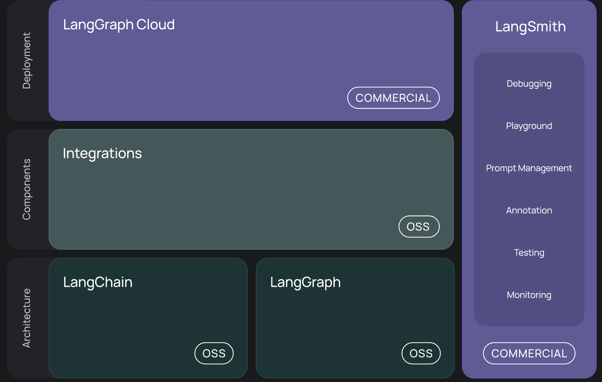
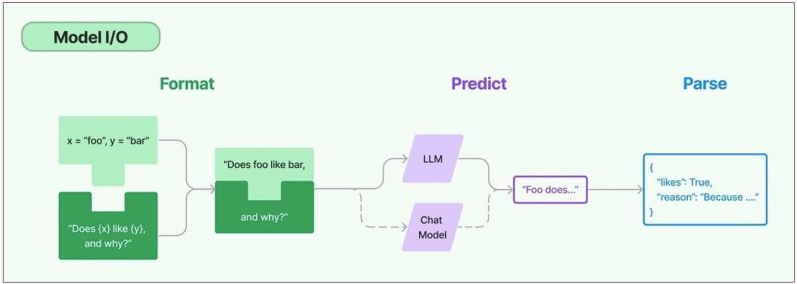
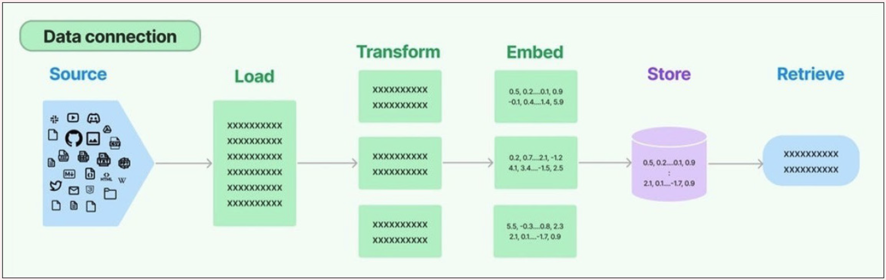
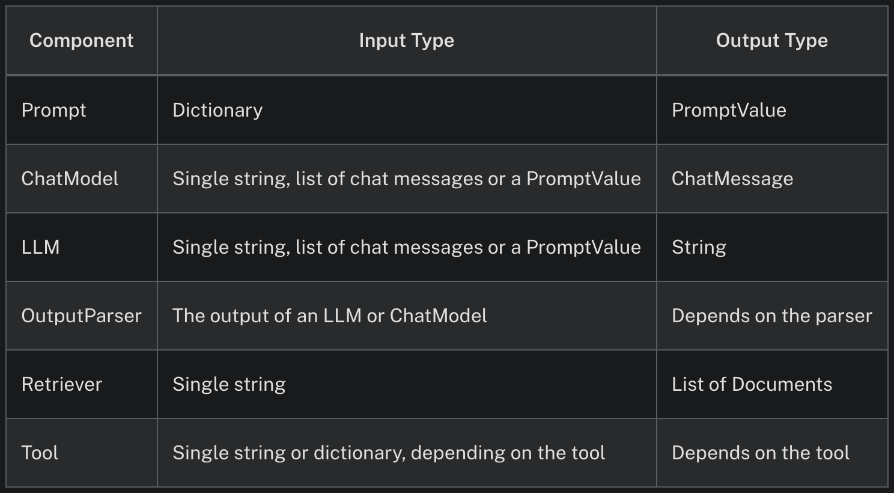

> 💡 현재 포스트는 harmony 팀 크루 [mindy](https://github.com/1013115) 가 작성했습니다.

랭체인은  LLM을  이용한 애플리케이션  개발 프레임워크이다.  LLM을 활용하여 애플리케이션과 파이프라인을 신속하게 구축할 수 있는 플랫폼의 필요성을 느껴 탄생하게 되었다. LangChain을 활용하면 RAG 애플리케이션제작, 챗봇, 자동  문장 요약 도구 등을 만들 수 있다. 
## Architecture
프레임워크는 다음과 같은 오픈 소스 라이브러리로 구성된다.
- langchain-core : 기본 추상화와 langchain 표현 언어
- langchain-community : 타사 통합.
      파트너 패키지(ex. langchain-openai, langchain-anthropic 등)
- `langchain` : 파이썬과 자바스크립트 라이브러리를 포함하며, 다양한 컴포넌트의 인터페이스와 통합, 이 컴포넌트들을 체인과 에이전트로 결합할 수 있는 기본 런타임, 체인과 에이전트의 사용 가능한 구현이 가능
-  `langGraph` : 그래프에서 단계를 에지와 노드로 모델링한다. LLM을 사용한 상태유지가 가능한 다중 액터 애플리케이션을 구축하기 위한 라이브러리이다. LangChain과 원활하게 통합되지만 LangChain 없이도 사용할 수 있다.
- `langServer` : LangChain 체인을 REST API로 배포한다. 
- `langSmith` :  LLM 애플리케이션을 디버깅, 테스트, 평가, 모니터링할 수 있는 개발자 플랫폼이다. 

    
  
랭체인의 작동방식에 대해 알아보면 랭체인에는 6개의 모듈이 존재한다.
- 모델 I/O
    
    언어 모델과의 인터페이스로 프롬프트를 관리하고 공통 인터페이스를 통해 언어 모델을 호출하고 모델 출력에서 정보를 추출할 수 있다. 아래와 같이 세분화 된다. 
    
    - prompt(prompt templates, example selectors), Language Models (LLMs, Chat models), OutputParsers

    
    
- 데이터 연결
    
    애플리케이션별 데이터와의 인터페이스로 데이터를 로드, 변환, 저장 및 쿼리하기 위한 빌딩 블록을 제공한다.
    
    - Document loaders, Document transformers (Text Splitters, Post retrieval), Text embedding models, Vector stores, Retrievers


    
- chain
    
    호출 시퀀스를 구축한다. 복잡한 애플리케이션은 LLM을 상호, 또는 다른 구성요소의 체인으로 연결해야한다. 랭체인에서는 이렇게 ‘체인으로 연결된’ 애플리케이션을 위한 체인 인터페이스를 제공한다.
    
- agent
    
    상위 지시문이 주어지면 체인이 사용할 툴을 선택할수 있도록 하는것이 에이전트이다. 시퀀스를 하드 코딩하는 체인과 달리, 에이전트는 언어모델을 추론 엔진으로 사용해 어떤 작업을 어느 순서에 따라 수행할지를 결정한다. 
    
    - Agent Type. Tools, Toolkits
- 메모리   
  체인 실행 간 애플리케이션 상태를 유지하며, 대화형 시스템은 어느 정도 기간의 과거 메시지에 직접 액세스하기 위해 메모리를 사용한다.
- callback   
  콜백은 체인의 중간 단계를 기록 및 스트리밍하며, LLM 애플리케이션의 다양한 단계에 연결할 수 있게 해준다. 로깅, 모니터링, 스트리망 등의 작업이 유용하다.

---
먼저 langchain 라이브러리를 설치를 진행한다.   
openai 라이브러리도 같이 설치한다. 이는 랭체인이 OpenAI의 API를 호출하기 위해 내부적으로 openai 라이브러리를 사용하기 때문이다. 

```python
!pip install langchain
!pip install openai
# openai 모델이 사용하는 토크나이저
!pip install tiktoken
!pip install langchain-openai
```
코랩에서 openai api key를 세팅하는 코드이다. 
```python
import os
from google.colab import userdata
os.environ['OPENAI_API_KEY'] = userdata.get('OPENAI_API_KEY')
```

---
## LCEL (LangChain Expression Language)
LCEL은 LangChain 구성 요소를 chain하는 선언적 방식이다. 처음부터  프로토타입을 production에 투입할 수 있도록 설계되었으며, 코드 변경 없이 가장 간단한 `prompt + LLM` 체인부터 100단계 이상의 복잡한 체인까지 성공적으로 production에서 실행할 수 있도록 지원한다.

LCEL을 사용해야하는 이유는 아래와 같다.
- first-class streaming 지원 : LCEL로 체인을 구축하면 첫 번째 토큰까지의 시간( 첫 출력이 나올 때까지의 시간)을 최적화할 수 있다. 일부 체인의 경우, LLM에서 나온 토큰을 streaming output parser로 직접 전달해 LLM 공급자가 원시 토큰을 출력하는 속도와 동일한 속도로 구문 분석된 출력 조각을 반환받을 수 있다.
- 비동기 지원 : LCEL로 구축된 모든 체인은 동기 API와 비동기 API를 모두 호출할 수 있다. 이를 통해, 프로토타입과 production에서 동일한 코드를 사용할 수 있으며, 뛰어난 성능과 더불어 동일한 서버에서 많은 동시 요청을 처리할 수 있다.
- 병렬 실행 최적화 : LCEL 체인에서 병렬로 실행할 수 있는 단계가 있을 때, 자동으로 병렬 처리를 수행하여 동기 및 비동기 인터페이스 모두에서 가능한 최소 지연 시간을 제공한다.
- 재시도 및 대체 기능 : LCEL 체인의 모든 부분에서 재시도 및 대체 기능을 구성할 수 있다. 이 기능은 대규모로 체인을 더 신뢰성 있게 만드는 방법이다. 지연 시간 손실 없이 신뢰성을 향상할 수 있다.
- 중간 결과 접근 : 더 복잡한 체인의 경우 최종 출력이 생성되기 전에 중간 단계의 결과에 접근하는 것이 매우 유용하다. 이를 통해 최종 사용자에게 무언가 진행 중임을 알리거나 체인을 디버깅하는 데 사용할 수 있다. 중간 결과를 스트리밍할 수 있으며, LangServe 서버에서 언제든지 사용가능하다.
- 입출력 스키마 : 입출력 스키마는 모든 LCEL 체인에 Pydantic 및 JSONSchema 스키마를 제공한다. 이는 체인의 구조에서 유추되고, 입출력 검증에 사용할 수 있으며, LangServe의 필수적인 부분이다.
- LangSmith 추적 기능 통합 : 체인이 점점 더 복잡해질수록 각 단계에서 정확히 어떤일이 발생하고 있는지 이해하는것이 중요하다. LCEL에서는 모든 단계가 자동으로 LangSmith에 로깅되어 최대한의 관찰 가능성과 디버깅 기능을 제공한다.
### Runnable interface
custom chain을 쉽게 만들 수 있도록 “Runnable” 프로토콜을 사용한다. 개발자는 일관된 인터페이스를 사용하여 다양한 타입의 컴포넌트를 조합하고, 복잡한 데이터 처리 파이프라인을 구성할 수 있다.
<br>   
**<표준 인터페이스>**
- stream : 응답의 chunk를 스트리밍으로 반환. 대용량 데이터 처리나 실시간 데이터 처리에 유용.
- invoke : 입력을 chain에 전달하여 호출. 단일 입력에 대해 동기적으로 작동
- batch : 입력 list를 체인에 전달하여 호출. 여러 입력에 대해 동기적으로 작동하며, 효율적인 배치 처리를 가능하게 함.  
</br>

+비동기 버전
- ainvoke
- abatch
- astream
- astream_log :최종 응답 외에도 중간 단계를 실시간으로 스트리밍하여 변환
- astream_events : 체인에서 발생하는 이벤트를 실시간으로 스트리망하여 반환하는 베타 기능 (langchain-core 0.1.14 버전에서 도입)

```python
import nest_asyncio
import asyncio

nest_asyncio.apply()

# 비동기 메소드 사용 (async/await 구문 필요)
async def run_async():
  result = await chain.ainvoke({"topic":"행성"})
  print("ainvoke 결과:",result[:50])

asyncio.run(run_async())
```
**<입출력 type>**

### LangChain을 사용한 커스텀 체인 생성
필요한 컴포넌트를 정의하고 각각 “Runnable” 인터페이스 구현한다. 컴포넌트들을 조합하여 사용자 정의 체인 생성하고 생성된 체인을 사용하여 데이터처리 작업 수행한다. 이때 주요 메소드를 사용하여 원하는 방식으로 데이터 처리한다.

```python
from langchain.prompts import ChatPromptTemplate # 챗 프롬프르 템플릿 사용
from langchain_openai import ChatOpenAI # chatmodel 사용
from langchain.schema.output_parser import StrOutputParser # 출력파서

prompt = ChatPromptTemplate.from_template("지구과학에서 {topic}에 대해 간단히 설명해주세요.")
model = ChatOpenAI(model="gpt-4o-mini")
output_parser = StrOutputParser()

chain = prompt | model | output_parser

# invoke() 사용
result = chain.invoke({"topic":"행성"})
print(result)

# batch 사용
topics = ["지구 공전", "화산 활동", "대륙 이동"]
results = chain.batch([{"topic": t} for t in topics])
for topic, result in zip(topics, results):
    print(f"{topic} 설명: {result[:50]}...")  # 결과의 처음 50자만 출력
    
# stream 메소드 사용
stream = chain.stream({"topic": "지진"})
print("stream 결과:")
for chunk in stream:
    print(chunk, end="", flush=True)
print()
```
```plaintext
💡참고   
https://wikidocs.net/book/14314   
https://wikidocs.net/book/14473   
https://python.langchain.com/v0.2/docs/introduction/   
🖼️사진 출처
https://www.samsungsds.com/kr/insights/the-concept-of-langchain.html
https://python.langchain.com/v0.2/docs/concepts/#langchain-expression-language-lcel
https://www.samsungsds.com/kr/insights/the-concept-of-langchain.html
https://www.langchain.com/
책 : 챗 GPT와 랭체인을 활용한 LLM 기반 AI 앱 개발
```