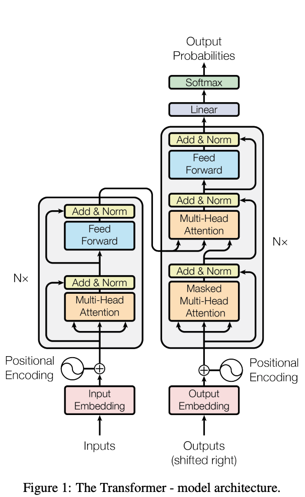
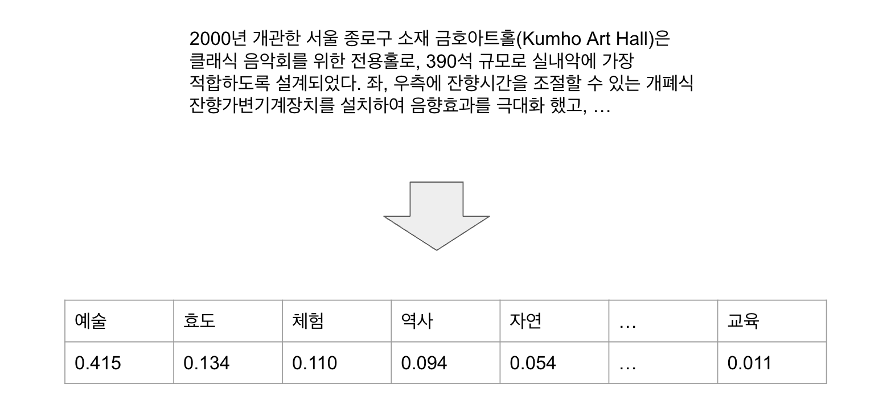

인공지능을 약 4개월 공부하면서 트랜스포머는 항상 함께 등장하는 키워드였다. 따라서 트랜스포머를 학습해보고자 한다. 한국어로 풀어서 소개한 좋은 자료는 이미 많으니 트랜스포머가 등장한 **배경**과 주요 **용어**를 살펴보고, 내용을 **요약**하고자 한다. 빠른 시간 내에 트랜스포머가 무엇인지 파악하고 싶은 사람에게 이 글을 읽는 것을 추천한다.

# 트랜스포머의 등장
트랜스포머 아키텍처는 2017년 구글의 7인이 발표한 <Attention is All you need> 논문에서 처음 등장했다. 이 논문에서는 머신러닝을 통해 언어를 번역하는 기계 번역 성능을 높이기 위한 방법을 연구했는데, 이 방법은 당시 널리 사용되던 RNN에 비해 성능, 모델 학습 속도 면에서 빨랐다. 현재는 자연어 처리 뿐 아니라 컴퓨터 비전, 추천 시스템 등 모든 AI 분야에서 핵심 아키텍처로 사용되고 있다.

# RNN의 한계
기존에 자연어 처리 문제에서 사용하던 RNN은 텍스트를 순차적으로 하나씩 입력하는 형태다. 입력 토큰을 RNN 모델에 입력했을 때의 출력을 다시 모델에 입력으로 사용하기 때문에 학습 속도가 느리다. 또한 입력이 길어지면 먼저 입력한 토큰의 정보가 희석되면서 성능이 떨어진다. 성능을 높이기 위해 레이어를 깊게 쌓으면 기울기 소멸 혹은 폭발이 발생하면서 학습이 불안정했다.

# 개선안: 셀프 어텐션
트랜스포머는 이런 RNN의 문제를 해결하기 위해 입력을 하나씩 순차적으로 처리하는 방식을 버리고 셀프 어텐션(self-attention)이라는 개념을 도입했다. 셀프 어텐션은 입력된 문장 내의 각 단어가 서로 어떤 관련이 있는지 계산해서 표현(representation)을 조정하는 역할을 한다.

RNN에 비해 트랜스포머의 장점은 다음과 같다.

- 확장성: 더 깊은 모델을 만들어도 학습이 잘 된다. 확장이 용이하다.
- 효율성: 학습할 때 병렬 연산이 가능하기 때문에 학습 시간이 단축된다.
- 더 긴 입력 처리: 입력이 길어져도 성능이 거의 떨어지지 않는다.

# 트랜스포머 아키텍처의 구조
트랜스포머는 다음과 같은 구조를 가진다.

## 플로우 개요
여기서부턴 생소한 개념이 등장할 수 있다. 대략적인 플로우를 확인하고, 모르는 용어는 이 글의 마지막에 서술된 용어 정리를 확인하자.

### 1. Inputs와 Outputs
인코더와 디코더의 입력값은 Input과 Output(shifted right)이며, 토크나이저에 의해 나누어진 토큰으로 주어진다(필자는 여기서부터 벌써 혼란스러웠다. 분명 Outputs인데 디코더의 입력값으로 주어진다). 디코더의 입력인 Outputs(shifted right)는 이전 시점에서 생성된 출력 시퀀스다. ‘shifted right’는 시퀀스의 시작을 알리는 토큰을 맨 앞에 추가하고, 전체 시퀀스를 오른쪽으로 한 칸씩 이동시킨 것을 의미한다(예를 들어 "나는 학교에 간다" → "<시작> 나는 학교에 간다"). 이는 디코더가 자기회귀적으로 출력을 생성하기 위해 필요한 처리다. 자기회귀 모형은 출력 변수가 자신의 이전 값과 확률적 항(불완전하게 예측 가능한 항)에 선형적으로 의존함을 지정한다.

### 2. 임베딩
임베딩이란 토큰이 어떤 의미를 담고 있는지 나타내는 벡터로 변환하는 작업이다. 텍스트 데이터의 의미를 파악하기 위해선 이 데이터가 어떤 의미를 담고 있는지 숫자로 변환해주어야 한다.

모행 프로젝트에서 텍스트 임베딩을 진행한 사례를 보자. 먼저 텍스트에서 측정하고 싶은 분야를 지정한다. 그다음 이 텍스트가 예술과 얼마나 관련이 있는지를 분석하여 값을 부여하는 것이 임베딩 작업이다.

### 3. 위치 인코딩
트랜스포머는 모든 입력을 동시에 처리하는데, 그 과정에서 순서 정보가 사라지게 된다.하지만 글의 의미를 파악하는 데 순서는 매우 중요한 정보이다. 위치 인코딩은 토큰의 순서 정보를 주는 과정이다.

### 4. 인코더
인코더는 입력 시퀀스의 문맥적 의미를 포착하여 이를 표현(representation)으로 만든다. 인코더는 멀티 헤드 어텐션, 레이어 정규화, 피드 포워드 레이어가 반복되는 형태다. 즉, 트랜스포머 인코더는 인코더 블록을 반복해서 쌓아서 만든다.

<h4>어텐션</h4>
어텐션의 핵심 역할은 입력 시퀀스 내에서 서로 연관된 단어들 간의 관계를 파악하는 것이다. 구체적으로 말하자면 아래와 같다.

1. 관련성 계산
    - 각 단어가 다른 단어들과 얼마나 연관되어 있는지 수치화
    - 쿼리와 키의 내적을 통해 연관성 점수 계산
2. 문맥 파악
    - 연관성이 높은 단어들에 더 많은 가중치 부여
    - 단어의 원래 의미에 문맥적 의미를 반영
3. 장거리 의존성 해결
    - 문장 내 멀리 떨어진 단어들 간의 관계도 직접적으로 파악 가능
    - RNN의 한계였던 장거리 의존성 문제 해결

어텐션의 핵심 개념으로 쿼리, 키, 값이 있다. 이는 정보 검색 분야에서 차용한 개념이다. 간단하게 말하면 쿼리는 검색어, 키는 문서가 가진 특징, 값은 검색을 통해 찾은 문서다.

임베딩을 직접 값으로 활용할 경우, 두 가지 문제가 발생할 수 있다. 첫 번째로 같은 단어(먹는 ‘배’, 타는 ‘배’의 경우 단어는 같지만 문맥에 따라 의미가 달라진다)끼리는 임베딩이 동일하므로 관련도가 높게 계산되면서 주변 맥락을 충분히 반영하지 못하는 경우가 발생할 수 있다. 두 번째로 토큰의 의미가 유사하거나 반대되는 경우처럼 직접적인 관련성을 띨 때는 잘 작동하지만 문법에 의거해 토큰이 이어지는 경우처럼 간접적인 관련성은 반영되기 어려울 수 있다.

따라서 트랜스포머 아키텍처에서는 이와 같은 문제를 해결하기 위해 토큰 임베딩을 변환하는 가중치를 도입했다.

<h4>셀프 어텐션</h4>
동일한 시퀀스 내에서 단어들 간의 관계를 파악하고 각 단어가 다른 모든 단어들과 얼마나 연관되어 있는지 계산한다.각 단어에 대해 세 가지 벡터(쿼리, 키, 값)를 생성함으로써 작동한다.

<h4>멀티 헤드 어텐션</h4>
멀티 헤드 어텐션은 단어 사이의 관계를 파악하는 역할을 한다. 그런데 한 번에 하나의 어텐션만 수행하는 게 아니라 여러 어텐션 연산을 동시에 적용하면 성능을 높일 수 있다. 이를 멀티 헤드 어텐션이라고 한다. 직관적으로 이해하자면 토큰 사이의 관계를 한 가지 측면에서 이해하는 것보다 여러 측면으로 동시에 고려할 때 언어나 문장에 대한 이해도가 높아질 것이다.

<h4>레이어 정규화</h4>
딥러닝 모델에서 데이터를 입력할 때, 입력 데이터의 분포가 서로 다르면 모델의 학습이 잘되지 않기 때문에, 데이터를 정규화하여 입력하는 것이 중요하다. 분포의 차이가 발생하면 해당 피처의 분포에 따라 과도하게 반영되거나 적게 반영된다. 입력 데이터가 딥러닝 모델의 다양한 레이어를 거치면서 어떤 피처는 좁은 분포를 갖고 어떤 피처는 넓은 분포를 갖게 된다. 특히 레이어가 깊은 모델에서는 분포의 차이가 발생할 가능성이 높아지고, 그렇게 되면 학습이 잘되지 않는다. 따라서 정규화 과정을 거쳐야 한다.

딥러닝에서는 평균과 표준편차를 구할 데이터를 어떻게 묶는지에 따라 크게 배치 정규화와 레이어 정규화로 나뉘는데, 일반적으로 자연어 처리에서는 레이어 정규화를 사용한다.

<h4>피드 포워드 레이어</h4>
피드 포워드 레이어는 데이터 특징을 학습하는 완전 연결 레이어를 말한다. 멀티 헤드 어텐션이 단어 사이의 관계를 파악하는 역할이라면 피드 포워드 레이어는 입력 텍스트 전체를 이해하는 역할을 담당한다. 선형 레이어, 드롭아웃 레이어, 레이어 정규화, 활성 함수로 구성된다.

### 5. 디코더
디코더는 인코더가 생성한 입력 문장의 문맥 정보를 바탕으로, 마스크드 셀프 어텐션을 통해 순차적으로 출력 시퀀스를 생성하는 역할을 한다. 디코더는 인코더와 마찬가지로 디코더 레이어를 여러 번 쌓아 만든다.

인코더와 비교할 때 두 가지 부분에서 차이가 있다. 인코더는 기본적인 멀티 헤드 어텐션을 사용하지만 디코더 블록에서는 마스크 멀티 어텐션을 사용한다는 점과, 디코더는 크로스 어텐션을 사용한다는 점이다.

<h4>마스크 멀티 헤드 어텐션</h4>
실제 텍스트를 생성할 때 디코더는 이전까지 생성한 텍스트만 확인할 수 있다. 그런데 학습할 때는 인코더와 디코더 모두 완성된 텍스트를 입력으로 받는다. 따라서 어텐션을 그대로 활용할 경우 미래 시점에 작성해야 하는 텍스트를 미리 확인하게 되는 문제가 생긴다. 이를 막기 위해 특정 시점에는 그 이전에 생성된 토큰까지만 확인할 수 있도록 마스크를 추가한다.

<h4>크로스 어텐션</h4>
그림을 보면 인코더와 디코더가 연결되는 선이 있는데, 이것이 바로 인코더의 결과를 디코더가 활용하는 크로스 어텐션 연산을 나타낸다. 예를 들어 영어에서 한국어로 번역한다고 했을 때, 인코더가 영어 문장을 입력으로 받아 처리한 결과를 번역한 한국어를 생성하는 디코더가 받아 활용한다. 이때 쿼리는 디코더의 잠재 상태를 활용하고 키와 값은 인코더의 결과를 사용한다.

### 6. 디코더 출력 이후
<h4>선형 레이어</h4>
디코더의 출력을 받아 어휘 크기에 맞게 차원을 변환하고, 각 단어에 대한 점수(logits)를 계산한다.

<h4>Softmax</h4>
Linear 레이어의 출력을 확률 분포로 변환한다. 각 단어가 다음 단어로 나올 확률을 0~1 사이의 값으로 표현한다. 모든 확률의 합은 1이다.

### 7. Output Probabilities
output 확률은 어휘 사전의 각 단어별 확률 값이다. 가장 높은 확률을 가진 단어가 다음 단어로 선택된다. 이 단어는 다시 디코더의 입력으로 들어가 다음 단어 예측에 사용된다.

## 용어 요약
<ul>
<li>
<strong>RNNrecurrent neural network</strong>

  인공 신경망(ANN)의 한 종류로, 유닛간의 연결이 순환적 구조를 갖는 특징을 갖고 있다. 이러한 구조는 시변적 동적 특징을 모델링 할 수 있도록 신경망 내부에 상태를 저장할 수 있게 해주므로, 순방향 신경망과 달리 내부의 메모리를 이용해 시퀀스 형태의 입력을 처리할 수 있다.

  [참고 용어]

  GRU, LSTM

</li>
<li>
<strong>기울기 소멸/증폭 문제vanishing/exploding gradient problem</strong>

  신경망 활성함수의 도함수 값이 계속 곱해지다 보면 가중치에 따른 결과 값의 기울기가 0에 가까워지며, 기울기가 너무 작아져 가중치를 변경할 수 없게 되는 현상이다. 최악의 경우 아예 신경망의 훈련이 멈춰버릴 수 있다. ReLU처럼 활성함수를 개선하는 방법, 레이어를 건너뛴 연결을 하는 ResNet, 배치 정규화(batch normalization) 등의 해법이 나왔다.

</li>
<li>
<strong>토큰token</strong>

  텍스트를 적절한 단위로 나누고 숫자 아이디를 부여하는 것이다. 한글은 작게는 자모 단위부터 크게는 단어나 띄어쓰기 단위로 나눌 수 있다.

</li>
<li>
<strong>토큰화tokenization</strong>

  텍스트를 적절한 단위로 나누고 숫자 아이디를 부여하는 것을 말한다. 토큰화를 할 때는 어떤 토큰이 어떤 숫자 아이디로 연결됐는지 기록해 둔 사전(vocabulary)을 만들어야 한다.

</li>
<li>
<strong>벡터vector</strong>

  하나의 숫자(스칼라)로 표현할 수 없는 값을 가리킨다. NLP 분야에선 토큰에 의미를 담는 수단으로 벡터를 사용한다.

</li>
<li>
<strong>쿼리query</strong>

  검색창에 입력하는 검색어, LLM에 입력하는 프롬프트 등. 어텐션 메커니즘에서 다른 요소들과의 관련성을 계산하기 위한 기준이 되는 벡터이다. 입력 시퀀스의 각 위치마다 생성되며, 키 벡터들과의 내적을 통해 어텐션 스코어를 계산한다.

</li>
<li>
<strong>키key</strong>

  쿼리와 관련이 있는지 계산하기 위해 문서가 가진 특징. 키로는 문서의 제목, 본문, 저자 이름 등이 사용될 수 있다. 어텐션 메커니즘에서 쿼리와의 관련성을 계산하기 위한 특징 벡터입니다. 입력 시퀀스의 각 위치마다 생성되며, 쿼리와의 내적을 통해 어텐션 스코어를 계산하는 데 사용됩니다.

</li>
<li>
<strong>값value</strong>

</li>
</ul>

어텐션 메커니즘에서 실제 정보를 담고 있는 벡터.

출처

<LLM을 활용한 실전 AI 애플리케이션 개발>(책만, 2024)

https://arxiv.org/abs/1706.03762
https://wikidocs.net/159243