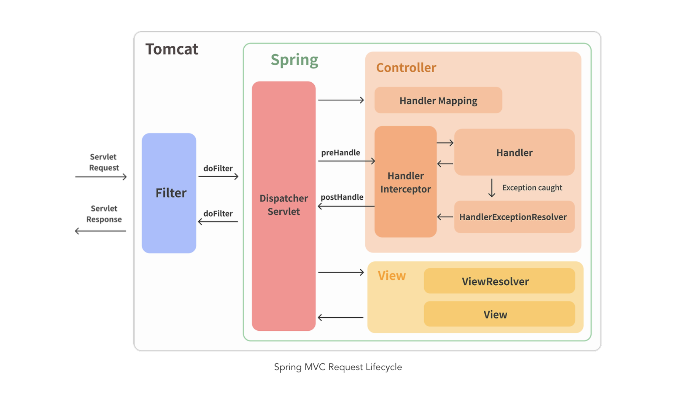

> 💡 현재 포스트는 harmony 팀 크루 [haon](https://github.com/msung99) 이 작성했습니다.

## Argument Resolver 를 사용하지 않는 상황

현재 우리 팀의 프로젝트의 인증/인가 도메인을 맡아 개발하면서 `ArgumentResolver` 에 기반한 커스텀 어노테이션을 개발했다. 이 어노테이션에 대한 구현의 이유(근거), 왜 사용되는지에 대한 생각의 정교화를 위해 글을 작성한다.

백문이불어일타. 직접 코드를 작성해보면서 ArgumentResolver 에 대해 이해해보자.

Argument Resolver 의 활용 유무는 프레젠테이션 계층에서 가장 차이를 보인다. 일반적인 상황이라면, 즉 Argument Resolver 에 기반한 커스텀 어노테이션이 존재하지 않는 경우라면 어떻게 클라이언트의 요청을 처리할까? 당연하게도 컨트롤러에서 `@RequestBody`, `@RequestParam` 등 이미 스프링내에 정의된 편리한 어노테이션으로 가변적인 변수를 바인딩시킬 수 있을 것이다. 예를들어 아래처럼 사용자의 정보를 `LoginMember` 라는 객체로 바인딩한다고 해보자.

```java
@GetMapping("/me")
public ResponseEntity<UserResponse> about(@RequestBody final UserRequest request) {
    // (1)
    String accessToken = JwtTokenProvider(request);
    Long id = Long.parseLong(jwtTokenProvider.getPayload(accessToken));
    LoginMember loginMember = new LoginMember(id);
    // (2)

    // ... (service 로직 수행)

    return ResponseEntity.ok(response);
}
```

그런데 문제점이 하나있다. `(1)` 과 `(2)` 사이에 있는 로직이 여러 컨트롤러에서 중복되는 로직이 라고 생각해보자. 가령 위와 같이 Jwt 의 Payload 에서 유저의 정보를 추출하는 로직은 대부분의 컨트롤러에서 구현해야하는 로직일 것이며, 모든 컨트롤러에서 직접 매번 구현하자니 중복 코드가 발생한다.

### 중복 로직 제거, 데이터 바인딩

우리는 프레젠테이션 계층, 즉 클라이언트의 요청을 처리하는 모든 컨트롤러의 중복 코드를 제거하고 싶다. 정확히는 HTTP Header, 세션, 쿠키 등 직접적이지 않은 방식으로 데이터를 바인딩하고, 중복 로직을 제거하고 싶다. 이때 사용하는 것이 바로 Argument Resolver 이다. **Argument Resolver 를 사용하면 컨트롤러 메소드의 파라미터 중 특정 조건에 맞는 파라미터가 있다면, 요청에 들어온 값을 원하는 객체를 만들어 바인딩해줄 수 있다.**

다시말해, 특정 요청으로 들어온 값을 원하는 객체로 생산해내는 작업을 Argument Resolver 에게 위임할 수 있다. 위의 경우 클라이언트 요청으로 전달받은 Dto 를 LoginMember 라는 객체로 바인딩시키는 것이다. 또한 이 작업의 책임을 제 3자인 Argument Resolver 구현체에게 인가함으로써 많은 컨트롤러의 중복 로직을 제거할 수 있게된다.

---

## Argument Resolver 구헌체

ArgumentResolver 의 혜택을 누리기 위해선 이에 대한 구현체가 핋요하다. 간단하게 앞선 특정 유저의 정보를 조회하는 API 를 가정하고. ArgumentResolver 를 적용해보자. 즉, 우리의 최종적인 목적은 `(1)` 과 `(2)` 사이의 로직을 제 3자인 Argument Resolver 기반 구현체에게 책임을 인기하여, `LoginMember` 객체를 자동 생성하는 것이다.

```java
@GetMapping("/me")
public ResponseEntity<UserResponse> about(@RequestBody final UserRequest request) {
    // (1)
    String accessToken = JwtTokenProvider(request);
    Long id = Long.parseLong(jwtTokenProvider.getPayload(accessToken));
    LoginMember loginMember = new LoginMember(id);
    // (2)

    // ... (service 로직 수행)

    return ResponseEntity.ok(response);
}
```

또한 UserRequest 라는 DTO 는 아래와 같이 정의되었음을 가정해보자.

```java
@Getter
public UserRequest {
    private Long id;
}
```

### HandlerMethodArgumentResolver 구현

Argument Resolver 를 만들기 위해선 스프링 내에서 제공하는 `HandlerMethodArgumentResolver` 인터페이스를 구현해야한다. 이 인터페이스를 구현한 클래스가 바로 Argument Resolver 가 되는 것이다. 인터페이스는 아래 2가지 메소드를 구현하도록 명시하고 있다.

> - supportsParameter() : 요청받은 메소드의 파라미터에 원하는 어노테이션이 붙어있는지 확인하고, 원하는 어노테이션을 포함하고 있다면 true 를 리턴한다.
> - resolveArgument() : supportsParameter() 에서 true 를 리턴받은 경우, 즉 특정 어노테이션이 붙어있는 어느 메소드가 존재하는 경우 파라미터가 원하는 형태로 정보를 바인딩하여 리턴하는 메소드다.

나는 이에 대한 구현체를 아래와 같이 구현했다. `JwtTokenProvider` 는 jwt 토큰을 추출하는 객체이며, `BearerTokenExtractor` 는 토큰에 대한 유효성을 검증하는, 즉 `Bearer` 가 명시되어있는지 검증하는 객체다.

```java
@Component
public class AuthArgumentResolver implements HandlerMethodArgumentResolver {
    private final JwtTokenProvider jwtTokenProvider;
    private final BearerTokenExtractor bearerTokenExtractor;

    public AuthArgumentResolver(final JwtTokenProvider jwtTokenProvider, final BearerTokenExtractor bearerTokenExtractor) {
        this.jwtTokenProvider = jwtTokenProvider;
        this.bearerTokenExtractor = bearerTokenExtractor;
    }

    @Override
    public boolean supportsParameter(final MethodParameter methodParameter) {
        return methodParameter.hasParameterAnnotation(AuthPrincipal.class);
    }

    @Override
    public Object resolveArgument(final MethodParameter methodParameter,
                                  final ModelAndViewContainer modelAndViewContainer,
                                   final NativeWebRequest nativeWebRequest,
                                  final WebDataBinderFactory webDataBinderFactory) {
        HttpServletRequest request = nativeWebRequest.getNativeRequest(HttpServletRequest.class);

        if (request == null) {
            throw new BadRequestException();
        }

        String accessToken = bearerTokenExtractor.extractValidAccessToken(request);
        Long id = Long.parseLong(jwtTokenProvider.getPayload(accessToken));

        return new LoginMember(id);
    }
}
```

#### supportsParameter

`supportsParameter()` 를 보면 파라미터로 `MethodParameter` 를 전달받는다. 우리가 가정한 현 상황에선 컨트롤러의 `about()` 메소드의 파라미터인 `UserRequest` 가 MethodParameter 에 바인딩 될 것이다. 즉, 요청받은 메소드 about 의 파라미터인 UserRequest 에 어노테이션이 붙어있는지 확인한다.

아직은 UserRequest 에 어노테이션을 명시한것이 없기 떄문에 `suppertsParameter()` 는 false 를 리턴하게 될 것이다. 우리는 true 를 리턴하도록 해야 Argument Resolver 가 원활히 동작하도록 만들 수 있다. 따라서 향후 커스텀 어노테이션 개발의 필요성을 인지하고 넘어가자. 또한 나의 경우 `AuthPrincipal` 이라는 커스텀 어노테이션을 만들었다.

#### resolveArgument

supportsParameter 로 부터 true 를 리턴받았다면, 즉 커스텀 어노테이션을 개발 후 컨트롤러 메소드에 파라미터로 명시해줬다면 파라미터가 원하는 형태로 정보를 바인딩하여 리턴할 수 있게된다. 나는 커스텀 어노테이션을 개발 후 about 메소드의 파라미터가 `LoginMember` 로 바인딩되도록 구현했다.

### 커스텀 어노테이션 개발하기

앞선 요구사항에 따라 커스텀 어노테이션을 구현해준다. 이 어노테이션 타입의 객체를 컨트롤러의 요청 파라미터로 명시하면, 이를 명시한 특정 컨트롤러 메소드에서만 객체가 자동으로 Argument Resolver 를 통해 바인딩된다. 이 메소드에선 컨트롤러에서 중복해서 발생하는 JWT payload 추출 로직, 유효성 검증 로직등이 담기게 된다.

```java
@Target(ElementType.PARAMETER)
@Retention(RetentionPolicy.RUNTIME)
public @interface AuthPrincipal {
}
```

### WebMvcConfigurer 에 Argument Resolver 를 등록하기

또한 `WebMvcConfigurer` 를 구현한 클래스를 생성 후, 앞서 만든 Argument Resolver 를 등록해주자.

```java
@Configuration
public class AuthResolverConfig implements WebMvcConfigurer {
    private final AuthArgumentResolver authArgumentResolver;

    public AuthResolverConfig(final AuthArgumentResolver authPrincipalArgumentResolver) {
        this.authArgumentResolver = authPrincipalArgumentResolver;
    }

    @Override
    public void addArgumentResolvers(final List<HandlerMethodArgumentResolver> argumentResolvers) {
        argumentResolvers.add(authArgumentResolver);
    }
}
```

### 컨트롤러에 Argument Resolver 적용하기

마지막으로 컨트롤러에 커스텀 어노테이션 `@AuthPrincipal` 이 명시된 객체를 메소드 파라미터로 명시해주자. 이로써 여러 컨트롤러에서 중복되어 발생하던 인증/인가 중복 로직이 깔끔하게 제거되었다. 이 어노테이션이 파라미터로 명시된 컨트롤러 메소드에서만 자동으로 객체가 Argument Resolver 를 통해 바인딩된다.

```java
@GetMapping("/about")
public ResponseEntity<MemberResponse> about(@AuthPrincipal LoginMember loginMember) {
    MemberResponse memberResponse = memberService.findById(loginMember.getId());
    return ResponseEntity.ok(memberResponse);
}
```

이렇게 함으로써 검증의 책임을 컨트롤러에게 책임지지않고 제 3자에게 위임할 수 있게 되었다. 어노테이션만 붙여주면 유효한 토큰을 사용하는 것이 검증된 사용자가 필요한 정보를 가지고 필요한 객체로 바인딩되니 매우 깔끔하고 편리한 코드로 개선되었다.

---

## 스프링 인터셉터 (Spring Interceptor) 와의 차이점

Argument Resolver 를 학습하고 구현하면서 가장 비교되고 혼동되는 대상이 스프링의 인터셉터였다. 일반적으로 인증에 대한 로직을 Arguement Resolver 와 Interceptor 를 함께 활용하여 구현하는 경우가 많은듯했다. 또는 세부 요구사항에 따라 Interceptor 만을 구현하는 경우도 있는듯하다. 그럼에도 나는 Interceptor 를 추가적으로 활용하지 않고 Argument Resolver 만을 활용하여 인가의 책임을 떠넘기도록 구현했다.

### Interceptor



스프링 인터셉터는 `서블릿 필터(servlet filter)` 와 같이 웹과 관련한 공통 관심 사항을 효과적으로 해결할 수 있는 기술이다. 이 점에서 AOP 와 같이 횡단 관심사를 깔끔하게 처리할 수 있다는 특징을 지닌다.

그럼에도 서블릿 필터와 스프링 인터셉터는 다소 다른 개념이다. `서블릿 필터` 는 서블릿이 제공하는 기술이라면, 스프링 인터셉터는 `스프링 MVC` 가 제공하는 기술이다. **스프링 인터셉터는** `DispatcherServlet` **과 컨트롤러 이 둘 사이에서 컨트롤러 호출 직전에 호출된다는 특징을 지닌다.** 즉, 클라리언트가 스프링부트 서버의 한 API 를 호출한다면 **HTTP 요청 -> WAS -> Filter -> DispatcherServlet -> 스프링 인터셉터 -> 컨트롤러** 순으로 요청이 넘어가게 된다.

### preHandle, postHandle

더 정확히는 바로 위에서 설명한 인터셉터는 컨트롤러 호출 전에 대해서만 다룬 것이다. 사실 엄밀히 말해, 인터셉터는 컨트롤러 호출 전과 호춯 후에 모두 호출될 수 있다. 이는 `Handler Interceptor` 인터페이스의 `preHandle()`, `postHandle()` 을 구현함으로써 가능해진다. 가령 아래와 같이 구현하면 컨트롤러 호출전에 수행할 인증(authentication) 로직을 미리 수행할 수 있다. 미리 수행할 로직은 `preHandle()` 에 구현하면 된다.

```java
public class LoginInterceptor implements HandlerInterceptor {

	@Override
	public boolean preHandle(HttpServletRequest request, HttpServletResponse response, Object handler)
			throws Exception {
		String requestURI = request.getRequestURI();
		System.out.println("[interceptor] requestURI : " + requestURI);
        // ... (Authentication 로직 구현)

		return true;  // false -> 이후에 진행을 하지 않는다.
	}

	@Override
	public void postHandle(HttpServletRequest request, HttpServletResponse response, Object handler,
			ModelAndView modelAndView) throws Exception {
		System.out.println("[interceptor] postHandle");
	}

	@Override
	public void afterCompletion(HttpServletRequest request, HttpServletResponse response, Object handler, Exception ex)
			throws Exception {
		System.out.println("[interceptor] afterCompletion");
	}
```

### 차이점

이러한 인터셉터는 Argument Resolver 와 무슨 차이가 있을까? 이 둘은 `호출되는 시점` 에서 차이를 보인다. Argument Resolver 가 특정 컨트롤러에 요청이 들어왔을 때 동작하는 것이라면, 인터셉터는 컨트롤러가 요청되기 이전 단계에 호출된다.

또한 `특정 객체의 반환 가능 여부` 에서도 차이를 보인다. ArgumentResolver 는 인터셉터 이후에 도작을 하며, 어떠한 요청이 컨트롤러에 들어왔을 때, 요청에 들어온 값으로부터 원하는 객체를 반환하는 역할을 수행한다. 반면 인터셉터는 실제 컨트롤러가 실행되기전에 요청을 가로채며, **특정 객체를 반환할 수 없다.** 또한 오직 boolean 혹은 void 반환 타입만 존재한다.

### 인터셉터를 사용하지 않은 이유

결론적으로 Argument Resolver 구현만으로도 충분히 인증/인가에 대한 효과적인 로직을 충분히 수행할 수 있다는 판단으로 인터셉터를 굳이 도입하지 않았다. (명확한 이유, 근거없는 기술 도입은 되려 의미없는 행위라고 생각하니깐 🙂)

현재 인증이 필요한 로직 대부분에서 유저 id 값을 필요로 하기 때문에 굳이 Argument Resolver 와 Interceptor 두 곳에 나눌 필요가 없다고 판단했다. 다만 추가적으로 interceptor가 필요한 시점에 분리하는 것도 좋을 것 같다는 결론을 내렸다.

---

## 참고

- https://tecoble.techcourse.co.kr/post/2021-05-24-spring-interceptor/
- https://steady-coding.tistory.com/601
- https://hudi.blog/spring-argument-resolver/#WebMvcConfigurer%EC%97%90%EC%84%9C-Argument-Resolver-%EB%93%B1%EB%A1%9D
- https://mangkyu.tistory.com/250
