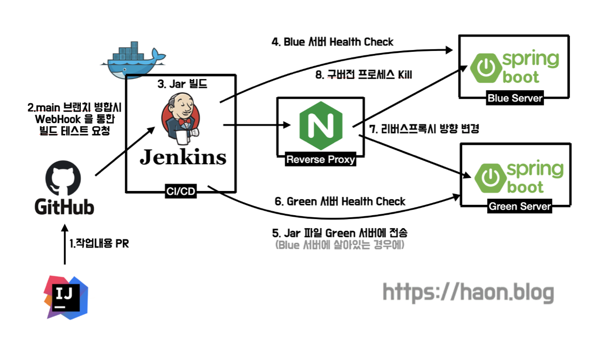

> 현재 포스팅은 카카오테크 하모니 팀 크루 [하온(haon)](https://github.com/msung99) 이 작성했습니다.

## 기존 배포 방식에서 Downtime이 발생하는 문제점

기존의 모행 배포 파이프라인 스크립트는 아래와 같다. 우선 `(1)` 구동중인 애플리케이션을 확인하고 `(2)` 구동중인 애플리케이션이 존재한다면 종료시킨다. `(3)` 그리고 이후 jar 파일을 실행하여, 신버전 스프링부트 애플리케이션이 구동된다.

```sql
if [ -z "$CURRENT_PID" ]; then
        echo "구동중인 애플리케이션이 없으므로 종료하지 않습니다."
else
        echo "구동중인 애플리케이션을 종료합니다."
        kill -15 $CURRENT_PID
fi

sudo -E nohup java -jar /home/ubuntu/myproject/deploy/core-0.0.1-SNAPSHOT.jar &
```

그런데 문제점이 있다. 과정 `(2)` 에서 `(3)` 으로 넘어갈 때, 우리 서비스가 일시적으로 중단되어 이용 불가능한 상태가 된다. 즉, 구버전 프로세스를 종료하고 새로운 프로세스를 실행하는 과정에서 서비스가 중단된다. 실제로 우리 서비스 다운타임을 측정한 결과, 약 7초정도의 다운타임이 발생하는 것을 확인할 수 있었다.

## 무중단 배포 전략은 왜 필요할까?

서비스가 새로운 버전이 배포될 때 마다
일시적으로 사용할 수 없다면 누가 해당 서비스를 마음놓고 사용할까? 무엇보다 우리 팀처럼 애자일하게 자주 배포하는 환경에서는 더욱이 서비스 중단이 자주 발생한다. **간혈적인 서비스 중단은 유저 이탈로 이어지게 될 것이다.**

따라서 24시간 서비스를 중단 없이 사용할 수 있도록 배포 환경을 구축해야한다. 이렇게 일시적으로 서비스를 이용 불가능한 시간을 **다운타임(Downtime)** 이라고 하며, 다운타임이 발생하지 않도록 배포하는 전략을 **무중단 배포(Zero-Downtime Deployment)** 전략이라고 한다. 지금부터 우리 모행 서비스에 어떻게 무중단 배포 전략을 구현했으며, 기존에 발생한 다운타임을 제거했는지 소개해보고자 한다.

## 우리 서비스에 어떤 무중단 배포 전략을 취했을까?

### 롤링(Rolling) 배포

롤링(Rolling) 배포 전략이란, 각 서버에서 구동중인 애플리케이션을 점진적으로 구버전에서 새로운 버전으로 차근차근 하나씩 전환하며 바꾸는 방식을 뜻한다.

롤링 배포 전략의 경우, EC2 인스턴스 개수가 제한된 환경에서 사용하기 좋은 전략이다. 다만, 배포가 진행중인 시점에는 유저의 트래픽이 구버전과 신버전으로 동시에 향하게 되므로 **정합성 이슈**가 발생할 수 있으므로 제외하였다.

### 카나리(Canary) 배포

다음으로 카나리(Canary) 배포 전략이란, 소수 인원에 대해서만 트래픽을 새로운 버전에 옮겨둔 상태에서 서비스를 운영하는 전략이다. 새로운 버전에 이상이 없다고 판단하였을 경우에 신버전에 대해 트래픽 유입율을 점진적으로 올려간다. A/B 테스트를 하기에 적합하다.

**대규모 트래픽이 유입되고, 팀 규모가 큰 서비스들에선 카나리 배포 전략을 취하는 경우가 많다.** 다만, 우리 서비스는 카나리 배포 전략을 도입할 만큼 서비스 규모와 팀의 규모가 아직은 크지 않다. 카나리 배포의 취지는, 신버전에서 발생할 오류를 조기에 감지하고, 문제가 발생하면 빠르게 롤백하는 방식이다. 다만, 우리는 **트래픽을 점진적으로 옮겨가며 배포하며 사전 오류를 감지할 즉시 대응할 정도로 민감하지 않아, 이 또한 제외했다.** 또한 팀의 규모가 크지않다. QA, CS 담담자등이 존재하지 않기에, 사전 테스팅 및 즉각 오류 감지에 대해 관리할 정도로 규모가 있지 않기에, 되려 카나리 배포 도입 근거가 옅어지기에 제외하였다. 다만, 향후 서비스와 팀의 규모가 커진다면 카니리 배포로 전환하는 하는 것이 매우 좋아보인다.

### 블루그린(Blue/Green) 배포

블루그린(Blue/Green) 배포 전략이란, 현재 운영중인 서비스를 종료하지 않고 새로운 운영 환경을 만든 뒤 트래픽을 한 번에 신버전으로 옮기는 방식이다. 마치 빅뱅 배포 방식이라고 보면 된다.

우리 팀은 블루그린 배포 전략을 취했다. 블루그린 배포는 어떠한 장점이 있을까? 우선 `(1)` 블루그린 배포는 롤링 배포와 달리 한번에 트래픽을 모두 새로운 버전으로 옮기기 때문에 **호환성 문제가 발생하지 않는다.** `(2)` 또한, 카나리 배포에 비해 우리 서비스처럼 아직 **서비스 규모가 크지 않은 경우에 구성하기 매우 편리하고 적합**한 배포 전략이다. `(3)` 무엇보다 포트(port) 를 스위칭하는 배포 전략을 취한다면, 서버를 증설하지 않고도 충분히 무중단 배포가 가능하다. 다시말해, 상대적으로 **저렴한 서버 비용**으로 무중단 배포를 충분히 구현할 수 있다.

> 다만, 향후 서비스와 팀의 규모가 확장된다면 카나리 배포 전략을 고려해보는 것도 좋은 선택안 일 것이다.

## Blue/Green 배포 파이프라인 구현

지금부터, 우리 서비스에서 구현한 블루그린 배포 전략 파이프라인 스크립트를 구현해보겠다. 그를 통해 무중단 배포가 어떻게 동작하는지 소개해볼까 한다. 우리 팀은 8080 포트와 8081 포트를 번갈아 스위칭하는 방식으로 무중단 배포 전략을 사용하였으며, 내부 동작 과정을 정리하면 아래와 같다.



- `(1)` 깃허브가 Jenkins에 Webhook 요청을 전송한다.

- `(2)` Jenkins는 새로운 버전 코드를 pull 해오고 jar 파일을 빌드한다.

- `(3)` Jenkins는 구버전 프로세스가 8080 포트로 실행되고 있는지, 또는 8081 포트로 실행되고 있는지 확인한다. 이를 위해, Blue 서버에 Health Check 를 시도한다. Blue 가 살아있다면 신버전을 Green 에 배포하면 되고, 살아있지 않다면 Blue 에 배포한다.

- `(4)` (구버전 프로세스가 8080 포트로 실행되고 있다는 가정하에) Green 서버인 8081 포트로 신버전 프로세스를 배포한다. Green 서버에 맨 처음 빌드해둔 jar 파일을 전송하고, 신버전 애플리케이션을 구동시킨다.

- `(5)` 지속적으로 8081 포트로 헬스체크를 시도하여, 신버전 애플리케이션이 제대로 구동되었다면 `(6)` 으로 넘어간다.

- `(6)` Nginx 의 리버스 프록시 설정을 변경하여 8080 으로 프록싱하던 설정을 8081로 변경하고 Reload 한다. 즉, Nginx 프록시 방향을 Blue 에서 Green 으로 스위칭한다. 이렇게 되면 앞으로 모든 클라이언트의 트래픽이 신버전 애플리케이션으로 향한다.

- `(8)` 곧바로 8080 포트로 구동중이던 구버전 프로세스 (Blue 서버) 를 kill 한다.

## Nginx 리버스 프록시 환경 설정

본격적인 젠킨스 파이프라인 구성에 앞서, Nginx 에 대한 설정이 필요하다. 이를 간략히 살펴보자.

### sites-enabled

```sql
server {
    listen 80;

    include /etc/nginx/conf.d/service-url.inc;

    location / {
        proxy_pass $Service_url;
        proxy_set_header X-Real-IP $remote_addr;
        proxy_set_header X-Forwarded-For $proxy_add_x_forwarded_for;
        proxy_set_header Host $http_host;
    }
}
```

위 설정을 보면 `include` 라는 지시어를 볼 수 있다. 이는 외부에서 설정파일을 불러올 수 있는 Nginx의 기능이다. 또한 `$service_url` 이라는 URL 로 리버스 프록시 요청을 보내는 것을 볼 수 있다. 이 변수에는 service-url.inc 파일로부터 변수 값이 할당된다.

### service-url.inc

```sql
set $service_url https://111.111.111:8080;
```

기본적으로 Blue 인스턴스의 포트번호 기반으로 초기 변수값을 설정해두었으나, Green 서버로 설정해도 상관없을 것이다. 젠킨스가 이 파일을 직접 수정하여 리버스 프록시 방향을 바꿔줄 것이다.

## Jenkins 무중단 배포 스크립트

아래는 새롭게 개선한 젠킨스 무중단 배포 스크립트이다. stage `Github` 와 `Build` 는 깃허브에서 신규 버전의 소스 코드를 가져와 애플리케이션을 빌드하는 과정이다. 핵심은 stage `Deployment` 의 쉘 스크립트 내용이다. 이를 자세히 살펴보자.

```sql
pipeline {
    agent any
    stages {
        stage('Github') {
            steps {
                git branch: 'develop-backend', url: 'https://github.com/kakaotech-25/moheng.git'
            }
        }
        stage('Build') {
            steps {
                sh "./gradlew bootJar"
            }
        }

        stage('Deployment') {
            steps {
                sshagent (credentials: ['key-jenkins']) {
                    sh '''#!/bin/bash
                        if curl -s "http://${BACKEND_PUBLIC_DEV_IP}:${BLUE_PORT}" > /dev/null
                        then
                            deployment_target_port=${GREEN_PORT}
                        else
                            deployment_target_port=${BLUE_PORT}
                        fi

                        scp -o StrictHostKeyChecking=no ./build/libs/core-0.0.1-SNAPSHOT.jar root@${BACKEND_DEV_IP}:/home/ubuntu
                        ssh root@${BACKEND_DEV_IP} "nohup java -jar -Dserver.port=${deployment_target_port} /home/ubuntu/core-0.0.1-SNAPSHOT.jar > /dev/null &" &


                        for retry_count in \$(seq 5)
                        do
                          if curl -s "http://${BACKEND_DEV_IP}:${deployment_target_port}
                          then
                              echo "✅ Health Checking 에 성공했습니다! 포트 번호: ${deployment_target_port}"
                              break
                          fi

                          if [ $retry_count -eq 10 ]
                          then
                            echo "❌ Health checking 에 실패했습니다."
                            exit 1
                          fi

                          echo "🏥 10초후에 다시 Health Checking 이 시도될 예정입니다."
                          sleep 10
                        done

                        ssh root@${nginx_ip} "echo 'set \\\$service_url http://${BACKEND_DEV_IP}:${deployment_target_port};' > /etc/nginx/conf.d/service-url.inc && service nginx reload"
                        echo "Switch the reverse proxy direction of nginx to ${deployment_target_port} 🔄"

                        if [ "${deployment_target_ip}" == "${blue_port}" ]
                        then
                            ssh root@${BACKEND_DEV_IP} "fuser -s -k ${GREEN_PORT}/tcp"
                        else
                            ssh root@${BACKEND_DEV_IP} "fuser -s -k ${BLUE_PORT}/tcp"
                        fi
                        echo " ✅ 구버전 프로세스를 종료하고, 신버전 프로세스로 교체합니다."
                    '''
                }
            }
        }
    }
}
```

### 1. Blue 서버 Health Check 및 배포할 포트번호 설정

```sql
if curl -s "http://${BACKEND_DEV_IP}:${BLUE_PORT}" > /dev/null
then
    deployment_target_port=${GREEN_PORT}
else
    deployment_target_ip=${BLUE_PORT}
fi
```

Blue 서버에서 애플리케이션이 구동중인지 `curl` 로 헬스체킹한다. `-s` 옵션은 slient 옵션으로, 프로그래스 바가 출력되지 않도록 한다. `/dev/null` 은 리눅스에서 null device를 나타내며, 이곳으로 쓰여진 데이터를 마치 블랙홀처럼 공허로 버려진다. 리다이렉션 ">" 을 통해 `curl` 의 표준 출력을 버리기 위해 사용한다.

`curl` 을 통한 헬스체킹 결과에 따라, Blue 가 살아있다면 `deployment_target_port` 를 `${GREEN_PORT}` 로 설정하고, 죽어있다면 `${BLUE_PORT}` 로 설정한다.

### 2. jar 파일 전송 및 새로운 포트 번호로 애플리케이션 실행

```java
scp -o StrictHostKeyChecking=no ./build/libs/core-0.0.1-SNAPSHOT.jar root@${BACKEND_DEV_IP}:/home/ubuntu
ssh root@${BACKEND_DEV_IP} "nohup java -jar -Dserver.port=${deployment_target_port} /home/ubuntu/core-0.0.1-SNAPSHOT.jar > /dev/null &" &
```

`scp` 명령으로 `$BACKEND_DEV_IP` 인스턴스에 jar 파일을 전송하고, `ssh` 명령으로 해당 파일을 실행하여 애플리케이션을 구동한다. 이때, 구동할 애플리케이션 포트 번호로 `${deployment_target_port}` 를 지정한다.

### 3. 주기적인 Health Check 로 새로운 포트에 애플리케이션이 잘 떴는지 확인

```sql
for retry_count int \$(seq 10)
do
  if curl -s "http://${BACKEND_DEV_IP}:${deployment_target_port}" > /dev/null
  then
    echo "✅ Health Checking 에 성공했습니다!"
    break
  fi

  if [ $retry_count -eq 10 ]
  then
    echo "❌ Health checking 에 실패했습니다."
    exit 1
  fi

  echo "🏥 10초후에 다시 Health Checking 이 시도될 예정입니다."
  sleep 10
done
```

최대 10번, 10초 간격으로 `${deployment_target_port}` 포트 번호를 가진 새로운 인스턴스에 `curl` 을 통해 Health Check 를 시도한다. 10번안에 Health Check 에 성공했다면, 다음 과정으로 넘어간다. 반대로 실패했다면 `exit` 로 스크립트 실행을 중단한다.

### 4. Nginx 리버스 프록시 방향 변경

```sql
ssh root@${nginx_ip} "echo 'set \\\$service_url http://${BACKEND_DEV_IP}:${deployment_target_port};' > /etc/nginx/conf.d/service-url.inc && service nginx reload"
echo "Switch the reverse proxy direction of nginx to ${deployment_target_port} 🔄"
```

앞선 헬스체킹에 성공했다면, `$service_url` 에 새로운 포트로 구동된 주소값을 할당하여 Nginx 가 새로운 프로세스를 바라볼 수 있도록 한다. 이후 Nginx 설정을 Reload 하여 설정을 반영한다.

### 5. 구버전 프로세스 Kill

```sql
if [ "${deployment_target_port}" == "${blue_port}" ]
then
    ssh root@${BACKEND_DEV_IP} "fuser -s -k ${GREEN_PORT}/tcp"
else
    ssh root@${BACKEND_DEV_IP} "fuser -s -k ${BLUE_PORT}/tcp"
fi

echo " ✅ 구버전 프로세스를 종료하고, 신버전 프로세스로 교체합니다."
```

배포된 서버가 `$BLUE_PORT` 라면 구버전인 `$GREEN_PORT` 서버의 프로세스를 Kill 한다. (그 반대라면 `$BLUE_PORT` 서버의 프로세스를 죽인다.) `fuser` 를 사용하면 특정 포트를 점유하고 있는 프로세스를 죽일 수 있다. `-k` 옵션을 붙여야 프로세스를 죽일 수 있다.

## 추가 개선점

이렇게 블루그린을 통해 우리 팀의 무중단 배포 전략을 직접 구현해보았다. **기존의 7초 가량의 다운타임이 약 0.03초로 크게 감소**했다.

다만, 이때 0.03초의 다운타임은 왜 발생하는 것인지, 완벽히 제거하는 방법이 없는지와 관련한 궁금증이 생길 것이다. 이는 향후 별도의 포스팅에서 다루어볼까 한다. 이만 포스팅을 마쳐본다 😎

## 참고

- https://www.jenkins.io/doc/book/using/using-credentials/
- https://nginxstore.com/blog/ci-cd/jenkins-%EB%A5%BC-%ED%86%B5%ED%95%9C-nginx-%EA%B5%AC%EC%84%B1-%EB%B3%80%EA%B2%BD-%EB%B0%8F-%EB%B0%B0%ED%8F%AC-%EC%9E%90%EB%8F%99%ED%99%94-%EA%B5%AC%ED%98%84/
- https://royleej9.tistory.com/m/entry/Jenkins-SSH-%EC%82%AC%EC%9A%A9-pipeline-SSH-Agent
- https://velog.io/@sileeee/scp사용하여-원격-서버에-배포하기
- https://m.blog.naver.com/PostView.naver?isHttpsRedirect=true&blogId=eyeballss&logNo=220881562246
- https://investechnews.com/ssh-permission-denied-publickey-%EC%A0%91%EC%86%8D-%EC%98%A4%EB%A5%98-%ED%95%B4%EA%B2%B0%ED%95%98%EA%B8%B0/
- ChatGPT
