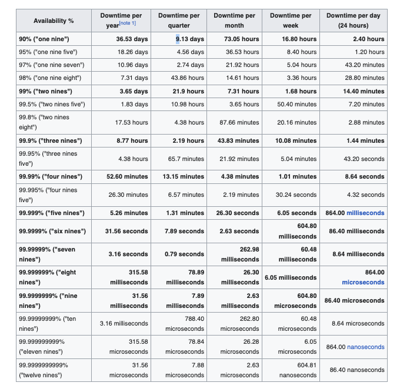
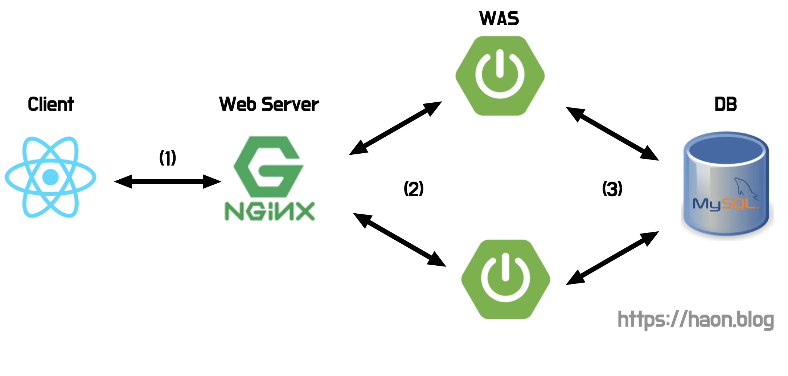
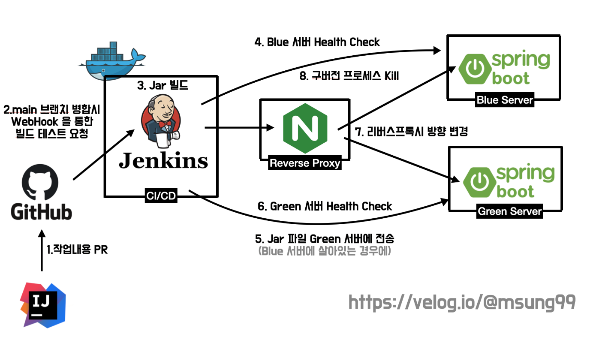
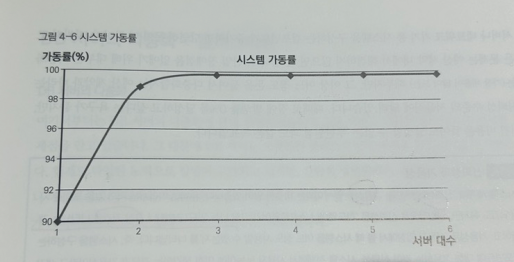
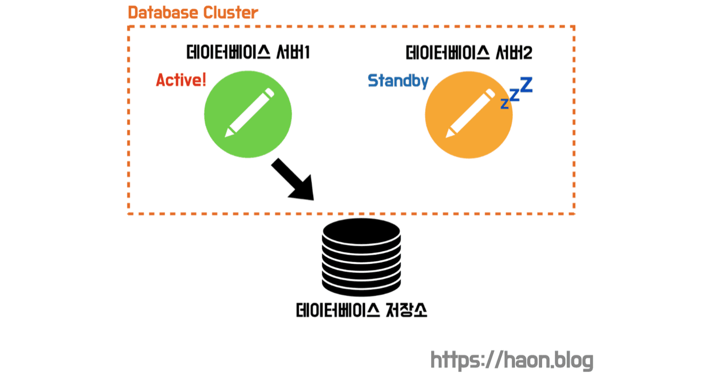
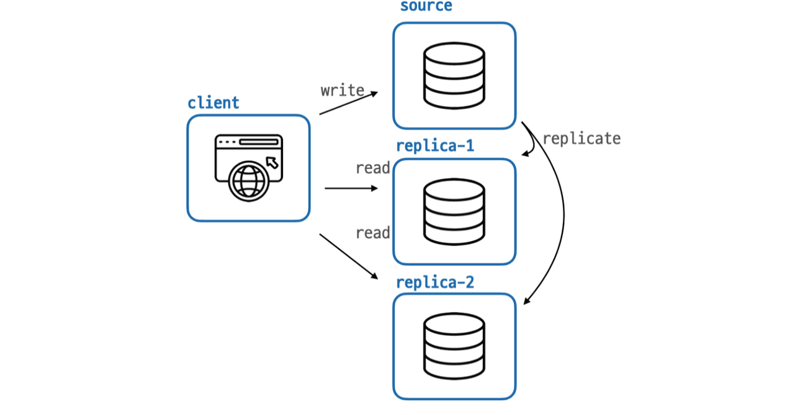

## 학습배경

하모니 팀의 모행 서비스를 개발하며 어떻게 했을 떄 견고하고 좋은 아키텍처인지를 고민하고 있다. 무엇을 기준으로 좋은 시스템을 설계했는지 판단할 명확한 지표가 필요했는데, 아키텍처에서 중요하게 여길 지표가 바로 **가용성(Availability)** 임을 알게 되었다. 사실 가용성이란 용어를 얼핏 듣긴 했지만, 생각이 정교화되지 않아 이번 포스트에서 자세히 다루어보고자 한다. 

## 가용성(Availability)

가용성이란 **서비스를 운영하는 전체 기간 중 서비스가 정상적으로 살아서 동작하는 비율이 얼마나 되는지를 나타내는 지표**다. 이 떄문에 가용성은 시스템의 신뢰도를 평가할 때 자주 사용된다. 
가용성이 높다는 것은 그만큼 서비스가 중단되지 않고 정상 운영되며, 신뢰할만한 시스템이라는 뜻이 된다. 가용성은 아래와 같이 수식으로 표현된다. **업타임(uptime)** 이란 서비스 정상 이용 가능 시간, **다운타임(downtime)** 이란 서비스 불가(중단) 시간을 뜻한다.

> 💡 가용성(availability) = 업타임 / (업타임 + 다운타임)

## 고가용성(HA, High Availability)

고가용성이란 높은 가용성을 확보한 상태를 뜻한다. 가용성은 일반적으로 백분율로 나타내는데, **9-nines** 이라는 표기법을 사용한다. 주로 숫자 9 로 구성된 퍼센트 표기법을 뜻한다. 즉, 가용성을 99.999...9% 와 같은 백분율로 표현한다. 

그런데 궁금한점이 있다. 어느정도의 수치를 가져야 고가용성 시스템이라고 할 수 있을까? 어림잡아 90% 만 달성해도 가용성이 높다고 할 수 있을까? 아래 표를 한 번 살펴보자.

신기하게도 가용성 90% 의 서비스는 하루에 약 2.4시간, 연간으로는 36.53일의 다운타임이 발생한다. 겉보기에 숫자 퍼센트는 매우 높아보이지만, 우리와 생각과 달리 다운타임이 매우 큰 것을 알 수 있다. 

가용성이 99% 정도라면 신뢰할만한 시스템일 것 같다는 생각이 든다. 하지만 시스템 세계에서 가용성 99% 는 1% 의 시간은 이용 불가능한 상태가 된다는 뜻이다. 99% 의 가용성일때의 다운타임은 절대 발생하지 않을 것 같지만, 연간 기준 3.65일의 다운타임이 발생한다. **보통 고품질의 프로덕션을 운영하는 서비스에서 목표로 하는 가용성 수치는 five-nines** 라고 한다. **[(참고)](https://ko.wikipedia.org/wiki/%EA%B3%A0%EA%B0%80%EC%9A%A9%EC%84%B1)** 즉, 연간 5분 가량의 다운타임을 허용하는 의미인 five-nines 를 만족했을 때 고가용성 시스템이라고 표현한다. 우리는 **five nines** 를 만족하는 서비스를 위한 고가용성 아키텍처를 설계할 필요가 있다.

## 고가용성을 확보하기 위한 전략

### 신장전략 중심의 구성 (vs 심장전략) 🔑

가용성을 높이기 위해 취할 수 있는 접근 방법은 크게 **심장전략** 과 **신장전략** 이 있다. 

- `심장전략 (고품질-소수전략)` : 소수의 고사양 인스턴스로만 구성하여 가용성을 높이는 전략 (즉, **Scale Up** 중심의 아키텍처 전략) 
- `신장전략 (저품질-다수전략)` : 시스템을 구성하는 인스턴스들의 사양을 계속해서 높이기보다는 "사물은 언젠가 망가진다" 란 전제하여 저사양의 여러 인스턴스로 구성하는 전략 (즉, **Scale Out** 중심의 아키텍처 전략)

과거에는 위 2가지 전략 중 어느 쪽이 더 효율적인가를 확실히 알지 못했기 떄문에 2가지 방법을 모두 추구했다. 하지만 **현재는 거의 모든 회사에서 신장전략(Scale Out 중심) 전략을 취하고 있다.** 고사양의 인스턴스를 조금만 사용하는 소수정예보단, 다소 저사양이라도 물량작전으로 서비스를 보완한다는 구조를 취하고 있다. 서비스를 구성할 때, 저사양의 인스턴스 어려대로 구성한 **신장전략** 중심의 구조를 고려해보자.

### 단일 장애점 (SPOF) 제거

고가용성 아키텍처를 설계할 때 가장 중요한 점중 하나는 **단일 장애 지점(SPOF, single point of failure)** 를 제거하는 것이다. SPOF 란 시스템을 구성하는 컴포넌트 중에 하나에서 장애가 발생하면 시스템 전체가 이용 불가능한 상태가 되는 지점을 뜻한다.

만약 위와 같이 구성된 아키텍처에서 SPOF 는 어디일까? 아쉽게도, `(1)` 과 `(3)` 이 SPOF 가 된다. 웹 서버에서 장애가 터지면 클라이언트의 요청은 WAS 로 도달할 수 없다. 데이터베이스 서버 또한 장애가 터지면 데이터베이스에 접근이 불가능하다. SPOF 를 제거하여 가용성을 개선해야만 고가용성을 확보할 수 있다. 

> 💡 필자가 가장 중요하게 여기는 고가용성을 보장해야 할 컴포넌트는 데이터베이스이다. 만약 WS, WAS 에서 문제가 터진다면 서버에 다운타임이 일시적으로 발생하는 것에 그치지만, DB 에 문제가 생길경우 서비스내 유저 데이터는 몰론 금융 데이터등 데이터가 유실되는 것 만큼 최악의 경우도 없을 것이다. DB 는 아키텍처를 구성하는 컴포넌트 중 가장 민감한 요소이다.

### 다중화와 로드밸런싱, 무중단 배포 ♻️

SPOF 를 제거하기 위해선, SPOF 지점을 **다중화(redundancy)** 하여 해결할 수 있다. 다중화를 통해 하나의 인스턴스에서 장애가 발생하여도 다른 서버가 요청을 처리하거나 빠르게 장애 복구가 가능하기 떄문에 높은 가용성을 확보할 수 있다. 

특히 로드밸런싱을 통해 부하 분산을 하는 방식을 꾀하여, 서버가 부담해야 할 비용을 낮출 수 있을 것이다. 무엇보다 **로드밸런서와 다중화를 활용하여 무중단 배포를 도입**하면, 새로운 버전의 서비스를 배포할 떄 발생하는 다운타임도 제거하고 더 높은 가용성을 확보할 수 있다. 이와 관련한 내용은 [Jenkins 와 Nginx 를 활용한 Blue/Green 배포 환경 구축하기](https://haon.blog/haon/infra/ci-cd/jenkins-nginx-blue-green/) 에서 다룬적이 있다.

### 예산과 비용을 고려하여 최적의 다중화 구성하기 🎯

신장전략에 기반하여 동일한 기능의 컴포넌트를 병렬화하는 것을 클러스터링이라고 한다. 클러스터링은 [고가용성과 확장성을 위한 데이터베이스 클러스터링(DB Clustering)](https://haon.blog/database/clustering/) 에서 소개한 적이 있다. 클러스터 구성으로 같은 기능을 가진 서버를 늘리면 늘릴수록 시스템 전체에서 장애 발생률이 낮아진다. 예를들어, 어떤 서버의 고장률이 10% 라고 해보자. 동일한 사양의 서버를 계속해서 늘려갈 때 시스템 전체의 장애 발생률은 어떻게 변할까?

- `(1)` 서버 1대 : 10% (0.1)
- `(2)` 서버 2대 : 1% (0.1 x 0.1)
- `(3)` 서버 3대 : 0.1% (0.1 x 0.1 x 0.1)
- `(4)` 서버 4대 : 0.01% (0.1 x 0.1 x 0.1)

신기하게도 서버 1대를 더 추가했을 때 장애률이 무려 9% 나 감소했다. 고작 1대의 서버만 더 추가했을 뿐인데, 현저히 줄어든 모습을 확인할 수 있다. 그렇다면 서버를 계속해서 더 추가한다면 장애률이 어떻게 변하는가? 아래 그래프를 통해 알아낼 수 있는점은 크게 2가지다.

우선 **가용성(가동률) 100% 는 이론적으로 불가능**하다. 인스턴스를 무한정 추가해도 가용성은 절대 100% 가 되지 않는다. 이는 모든 서버나 네트워크 기기가 동시다발로 고장나는 엄청난 우연의 가능성을 완전히 배제할 수 없기 때문이다. 또한 서버 대수를 추가할수록 1대함에 따라 얻을 수 있는 **가용성 향상 폭이 일정하지 않고, 되려 점점 폭이 작아진다**는 점도 알 수 있다. 서버를 1대에서 2대로 추가함에 따라 얻을 수 있는 가용성 향상 혹은 90% 에서 99% 로 9% 이지만, 2대에서 3대로 증가할 때에는 99% 에서 99.99% 가 되어 0.9% 밖에 증가하지 않는다. **즉, 가용성은 인스턴스 갯수에 정비례하여 향상되지 않는다.** 

가용성을 확보하기 위해 **five-nines** 라는 수치에 도달하기란 생각보다 쉽지않다.  **five-nines** 는 사실상 이상적인 수치에 가깝기 떄문에, 만약 주어진 비용과 예산이 한정적이라면 다중화 대수와 장애 발생률을 적절히 고려하여 시스템을 설계해보자. 

### 장애 극복 (FailOver) 기능

[고가용성과 확장성을 위한 데이터베이스 클러스터링(DB Clustering)](https://haon.blog/database/clustering/) 에서 다룬 데이터베이스 클러스터링 기법이 FailOver 를 위한 다중화 기법 중 하나이다. 클러스터링과 같은 기법을 통해, 장애가 발생했을시 곧바로 장애를 탐지하고 장애를 극복하는 자동화 시스템이 필요하다.

또한, 로드밸런서로 **헬스 체킹(health checking)** 하여 FailOver 를 대처할 수 있다. 현재 로드밸런서가 라우팅하고 있는 여러 컴포넌트들에게 장애가 발생하지 않고 정상 작동하는지 헬스 체크하고, 장애가 탐지되면 그 즉시 해당 컴포넌트를 라우팅 대상에서 제외하여 FailOver 할 수 있다. 즉, 유저의 트래픽이 장애가 발생한 컴포넌트로 향하지 않게되어 고가용성을 확보할 수 있다.

### 백업과 지리적 분산 🌍

언제 어디서든 재난문제, 천재지변으로 우리가 운영하는 서비스의 인스턴스가 공격받을 수 있다. 특히 재해로 인해 데이터베이스 서버가 장애가 터져, 모든 데이터가 유실될 잠재적 위험은 항시로 존재한다.  만약 지진이나 태풍으로인해 DB 하드웨어가 설치된 시설이 파괴되었다면 어떻게 될까? 단일 데이터베이스라면 모든 데이터가 유실된 위험은 몰론 서비스 이용이 장기간 불가능하다. 데이터베이스 다중화를 구성했다고 한들, 만약 재해가 발생한 동일한 지역내에 데이터베이스 서버를 모두 구축했다면 위험에 빠질 수 있다. **실제로 2022년 카카오 데이터센터 화재로 인해 서비스 이용에 차질을 입고, 자칫 데이터 유실이 될 뻔한 사례가 존재한다. [기사 : 카카오, 데이터센터 화재로 서비스 중단… 카뱅까지 영향](https://www.hani.co.kr/arti/society/society_general/1062797.html)** 언제 어디서든 닥칠 위험에 대비하여 **지리적 분산** 환경을 구축하자.

또한 재해로부터 데이터를 지키기위한 **백업과 복구 프로세스**를 구축해야한다. 백업과 복구 프로세스가 잘 갖춰져있는 아키텍처에서는 설령 데이터가 유실되었다고 하더라도, 빠르게 복구하여 서비스를 재개할 수 있을 것이다. MySQL 과 같이 다중화에 유리한 DBMS 를 사용한다면 [고가용성과 확장성을 위한 데이터베이스 레플리케이션(DB Replication)](https://haon.blog/database/replication-theory/) 에서 다룬 데이터베이스 레플리케이션을 통해 백업과 복구 프로세스를 구축할 수 있을것이다.

## 참고

- 데이터베이스 첫걸음 - 미크, 기무라 메이지
- https://ko.wikipedia.org/wiki/%EA%B3%A0%EA%B0%80%EC%9A%A9%EC%84%B1
- https://hudi.blog/high-availability-architecture/
- https://yechankk.tistory.com/9
- https://itwiki.kr/w/단일_장애점_문제
- https://www.hani.co.kr/arti/society/society_general/1062797.html

