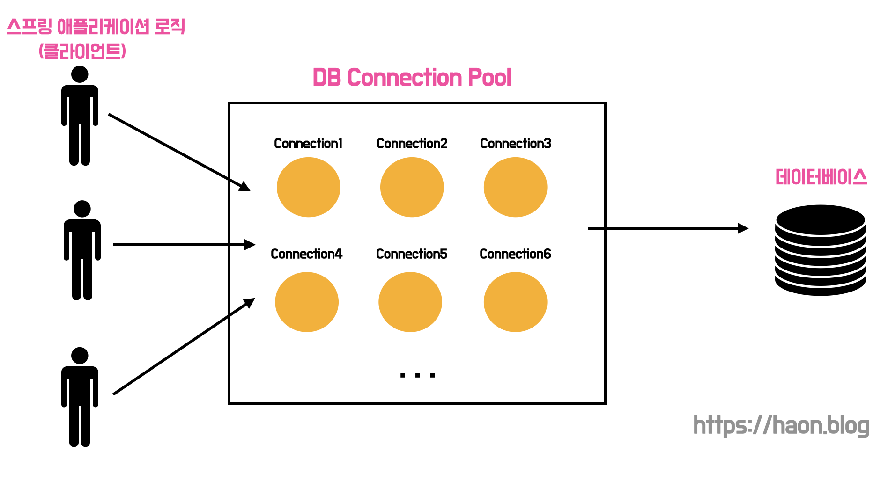
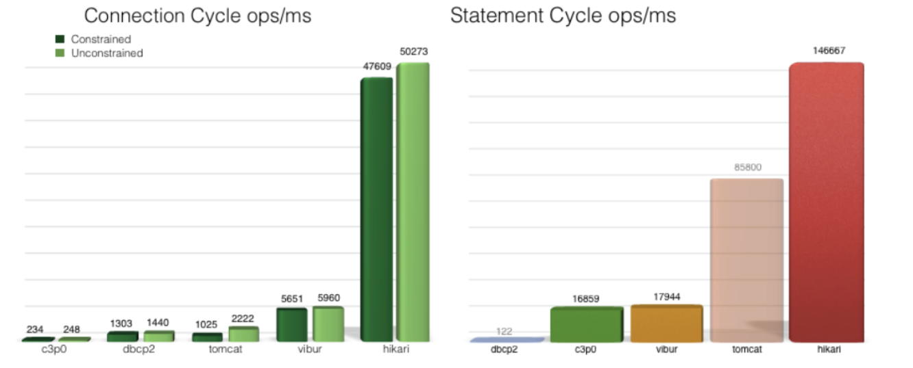
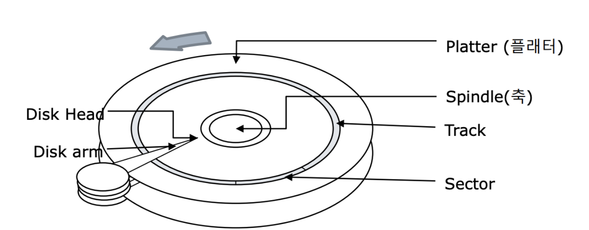

> 💡 이 글을 모두 읽고난 뒤, JDBC 에서 HikariCP 를 어떻게 다루는지에 대한 내용은 필자가 작성한 [JDBC 에서 데이터베이스 커넥션 풀 다루기 (feat. JDBC Driver, DataSource, HikariCP)](https://haon.blog/database/jdbc-connection-pool/) 을 참고하길 바란다.

## 데이터베이스 커넥션 

스프링부트 애플리케이션을 사용하면 데이터베이스와의 통신으로 원하는 연산을 수행해야한다. 그런데 궁금한 점이 있다. 기본적으로 특별한 설정없이도 데이터베이스와 연결을 맺고 데이터를 통신하는데, 이는 내부적으로 어떠한 동작원리로 인해 수행되는 것일까? 이는 바로 데이터베이스와의 TCP 소켓을 통한 커넥션을 통해 가능한 것이었다.

일반적으로 데이터베이스 연결의 생명주기는 아래와 같은 절차로 수행된다.

- `(1)` 클라이언트 요청에 따라, 스프링부트 애플리케이션 로직을 수행하기 시작한다. 
- `(2)` 데이터베이스 드라이버를 사용하여 데이터베이스와 연결을 맺기위한 TCP 커넥션을 생성한다.
- `(3)` 데이터베이스와 연결된 TCP 커넥션으로 데이터를 통신한다. (이 과정에서 Statement 를 생성하고, SQL 문을 전송하고, ResultSet 을 통해 결과를 확인하는 작업이 발생한다.)
- `(4)` 데이터베이스와의 연결을 닫는다.
- `(5)` TCP 커넥션을 닫는다.

그런데 위와 같이 데이터베이스와 연결을 맺고, 해제하는 작업은 비용이 꽤나 많이 들어가는 작업이다. **커넥션 객체를 생성하는 비용 자체도 문제가 될 뿐더러, 매번 SQL 쿼리 자체를 전송하기 위해 객체를 생성하고 해제하는 과정이 매우 비효율적으로 느껴진다.** 또한 커넥션 연결도 `TCP/IP` 연결을 통해 이루어진다. 즉, 3-way 헨드쉐이킹 과정을 통해 통신을 준비하는데, 이 과정이 쿼리를 요청할 떄 마다 반복되면 네트워크 구간에서 병목의 원인이 될 수 있다.

> 커넥션을 생성하는 과정은 전체 과정 중 대략 50%를 차지한다고 한다.

### DBCP (데이터베아스 커넥션 풀)

한번 요청이 들어올때마다 매번 데이터베이스 커넥션을 생성하고 해제하는 비용은 꽤 비효율적이다. 이를 해결하기 위해, **여러개의 데이터베아스 커넥션을 미리 생성해두고 요청이 들어올때마다 꺼내다 쓰는 방안을 고안학게 됐다. 이 방식을 바로 데이터베이스 커넥션 풀(DBCP) 이라고 한다.**

다시 정리하면, **DBCP 는 데이터베이스 커넥션울 알정량 미리 생성해두고 필요할 때 마다 언제든 가져다 쓸 수 있는 일종의 저장소 개념이다.** 데이터베이스 커넥션 풀 내에는 이미 데이터베이스와 연결이 맺어진 일정량의 커넥션들이 존재한다. 매 요청이 들어올 때 마다 새롭게 커넥션을 맺고 닫는 대신에, 맺어놓은 커넥션을 닫지않고 유지한다. 클라이언트 요청이 유입되면 데이터베이스 커넥션을 DBCP 로 부터 꺼내다 쓰고, 사용을 마쳤다면 해당 커넥션을 DBCP 에 다시 반납한다.

## HikariCP

데이터베이스 커넥션 풀 프레입워크의 종류로는 `HikariCP`, `Tomcat Polling DataSource`, `Commons DBCP2`, `Oracle UCP` 등 다양한 DBCP 종류가 존재한다. 그 중 성능이 압도적으로 뛰어나 대부분의 회사에서 사용중인 커넥션 풀인 HickriCP 를 중점적으로 학습해보자.

### DataSource

`DataSource` 란 데이터베이스와 커넥션을 맺는데 필욯란 정보를 제공하는 표준 인터페이스이다. DataSource 는 데이터베이스에 접근하기 위한 Driver, URL, 사용자 이름, 비밀번호등을 포함한다. 개발자는 DataSrouce 를 사용하여 데이터베이스와의 연결을 설정하고, DBCP 에서 커넥션을 가져올 수 있다.

HickriCP 는 DBCP 를 제공하는 JDBC DataSource 의 구현체 중 하나이다.  스프링부트에 별다른 DataSource 설정이 없다면 기본적으로 내장되어 사용하게 되는 JDBC 커넥션 풀링 프레임워크이다.

HikariCP 는 바이트코드 레벨 수준까지 극단적으로 최적화 되어있기에, 다른 DBCP 풀링 프레임워크에 비해 압도적으로 빠른 성능을 보인다. 이 외에도 [HikariCP란?](https://escapefromcoding.tistory.com/712) 의 내용을 빌리자면, 미세한 단위 까지 고려한 세부 최적화, 컬렉션 프레임워크를 직접 구현하여 영리하게 사용하기에 좋은 성능을 낼 수 있다.

## 적절한 DBCP 사이즈를 찾기위해 무엇을 고려해야 할까?

DBCP 사이즈를 구성할 때 사전 이해해야하는 몇가지 원칙과 고려사항이 존재한다.

### CPU 코어

하나의 CPU 코어가 있는 컴퓨터에서도 수십 또는 수백개의 쓰레드를 동시에 지원할 수 있다. 하지만 이는 운영체제의 속임수일 뿐이다. 운영체제에서 컨텍스트 스위칭을 통해 동시에 진행하는 것 처럼 보이게 하는 속임수일뿐, 실제로는 단일 코어는 한 번에 하나의 쓰레드만 지원할 수 있다.

단일 CPU 가 주어지면 여러 쓰레드를 순차적으로 실행하는 것이 시분할을 통해 여러 쓰레드를 동시에 실행하는 것보다 항상 빠르다. **쓰레드 수가 CPU 코어 수를 초과하면 단순히 쓰레드 수가 더 많아질 뿐이지 더 빠른 속도를 보장하는 것은 아니다.** 즉, 단순하게 DBCP 사이즈를 늘린다고해서 더 빠른 속도로 처리하는 것이 아니다.

### 디스크

**데이터베이스의 주요 병목 현상은 CPU 외에도 디스크, 네트워크 이렇게 3가지 요소가 영향을 미친다.** 데이터베이스는 일반적으로 디스크에 저장하는데,  디스크는 전통적인 모터 구동 암에 Read/Write 헤드가 장착된 회전 금속 를레이트로 구성된다. Read/Write 헤드는 한 번에 한 곳에만 읽을 수 있으며, 다른 쿼리에 대한 데이터를 읽기 위해선 새 위치를 검색해야한다. 즉, 플래터(원판) 을 돌려서 읽어야 할 데이터가 저장된 위치까지 디스크 헤더를 이동시킨 다음 데이터에 대한 읽기/쓰기 작업을 수행해야한다. **따라서 탐색 시간 비용과 플래터의 데이터가 다시 돌아오기 까지 디스크를 기다려야 하는 회전 비용이 추가적으로 발생한다.**

디스크에서 위 과정이 발생하는동안 쓰레드는 `Block` 된다. 이 시간동안 다른 쓰레드의 작업을 처리할 수 있는 여유가 생기게된다. 이러한 여유 덕분에 실제로 더 많은 작업을 수행할 수 있게된다. 

### 네트워크

네트워크도 디스크와 유사하다. 이더넷 인터페이스를 통해 유선으로 데이터를 작성하면 송/수신 버퍼가 가득차거나 멈출 때 block이 발생할 수 있다.

## 적절한 DBCP 사이즈 공식

위와 같은 CPU, 디스크, 네트워크 요소의 다양한 상황을 고려했을 때, HikariCP 공식문서에선 아래와 같은 커넥션 풀 사이즈를 권장한다.

> 💡 connections = (core_count * 2) + effective_spindle_count

`core_count` 는 CPU 의 코어수를 의미하고, `effective_spindle_count` 는 데이터베이스 서버가 동시 관리할 수 있는 I/O 개수이다.

- `core_count * 2` : 코어 수에 근접할 수록 좋지만, 디스크 및 네트워크와 CPU 의 속도차이로 인한 여유시간을 활용하기 위해 계수 2를 곱해준다.
- `effective_spindle_count` : 하드디스크는 하나의 spindle 을 가진다. Spindle 은 데이터베이스 서버가 관리할 수 있는 동시 I/O 요청 수를 뜻한다. 디스크가 n개 존재하면 spindle_count 는 n이 될 수 있다.

예를들어 하드디스크가 있는 8-core i7 CPU 를 가진 서버에서는 DBCP 사이즈를 대략 `(8 * 2) + 1 = 17` 으로 설정해야한다. 위 공식은 모든 상황에서 절대적으로 최적화됨을 보장하진 않기에, 맹신하진 말고 DBCP 크기를 선정할 때 대략적인 지표로만 참고하자.

또한 `core_count * 2` 계산 값보다 커넥션이 더 필요한 경우는 거의 없다. 가령 사용자가 1000명일 경우 DBCP 크기를 1000개로 설정한 것은 커넥션을 과도하게 생성하여 낭비한 셈이다. 100개의 커넥션도 많다. 

## 마치며

다음 포스트에선 JDBC Driver 와 HikariCP 를 실제로 스프링부트 애플리케이션에서 적용하는 방법에 대해 다루어보도록 한다. 이와 관련한 내용은 필자가 작성한 [JDBC 에서 데이터베이스 커넥션 풀 다루기 (feat. JDBC Driver, DataSource, HikariCP)](https://haon.blog/database/jdbc-connection-pool/) 을 참고하길 바란다.

## 참고

- 스프링 DB 1편 - 데이터 접근 핵심 원리 (김영한)
- https://hudi.blog/dbcp-and-hikaricp/
- https://escapefromcoding.tistory.com/712
- https://engineerinsight.tistory.com/238