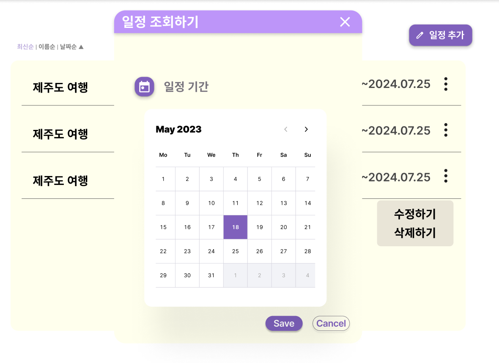
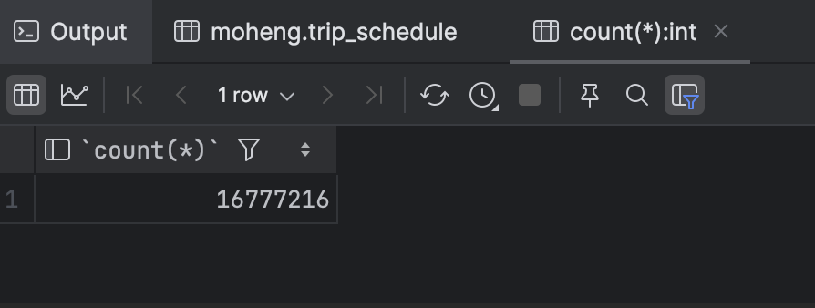
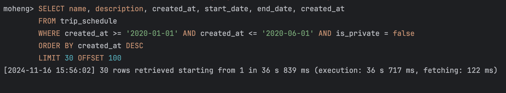
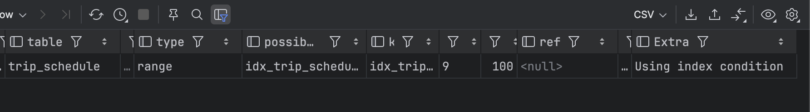

> 💡 2024.11.17 추가 : 이 포스팅에서 진행한 쿼리 성능 개선기는 [스프링 페이지네이션에서 발생한 Latency 의 원인과 커버링 인덱스 생성을 통한 문제 해결기](https://kakaotech-harmony.netlify.app/backend/pagnation-latency-db-covering-index/) 로 이어집니다. 페이지네이션 로직에 대한 커버링 인덱스 적용기를 참고해주세요! 🙂

오랜만의 포스팅이다. 이번 포스팅에선 모행 서비스에서 SLOW QUERY 가 발생한 문제 상황을 어떻게 해결했는지에 대해 다루어보고자 한다. 데이터베이스 인덱스의 개념와 특징에 대해 다시금 곱씹어보며 어떠한 방식으로 인덱스를 적용했는지에 대한 근거를 공유해볼까 한다. 또한 우리 서비스내에 데이터베이스 인덱스를 생성한 사례 중 하나를 중점으로 자세히 다루어보고자 한다. 즉, 우리 서비스내에 생성한 인덱스 종류에는 이번 포스팅에서 다룰 인덱스 단 1가지 종류만 존재하는 것이 아니라는 것을 말하고 싶다 😎

## 문제 상황

우리 하모니 팀은 높은 **가용성(Availability) 확보와 사용자 경험을 향상하기 위해 다양한 성능 개선을 시도**하고 있다. 지금까지 데이터베이스 레플리케이션을 통한 부하 분산, 로컬 캐시를 사용한 API 요청 최적화, 톰캣 서버 튜닝, HikariCP 적절 사이즈 튜닝, N+1해결등 수많은 문제를 해결해왔다. 하지만, 결국 데이터베이스내에 대량의 데이터가 쌓인다면 여러 성능 튜닝을 했음에도 **SLOW QUERY** 가 발생할 수 밖에 없다.

실제로 우리 팀내에도 대량의 더미 데이터를 삽입한 뒤 쿼리 속도를 측정한 결과 **Long Query** 가 발생하고 있다. 이는 시스템내에 성능 저하가 발생 요인이 되며, 한 커넥션을 붙잡고 있는 시간이 길어지므로 시스템 전체에 성능 저하와 병목 현상을 일으킬 수 있다. 이 문제를 해결하기 위해 데이터베이스 인덱스 생성을 통한 쿼리 성능을 개선했다. 이번 포스팅에서 대량의 더미 데이터를 삽입한 상황속에서 인덱스를 생성한 쿼리 적용 과정, 고민 사항에 대해 다루어보고자 한다.

## 플래너 API 특성 파악하기

우리 서비스에서 향후 출시할 플래너 공유 기능을 구현하고 테스트를 진행하고 있다. 이 API 는 향후 커뮤니티 기능으로 출시될 플래너 공유 기능에 활용될 예정이다. 대량의 데이터중 빠르게 원하는 여행 일정(플래너)를 찾을 수 있도록 등록 날짜를 기준으로 검색하는 기능이 존재한다. 아래처럼 검색할 시작날짜와 종료날짜를 기준으로 공개된 (비공개 상태 OFF) 여행 일정을 조회할 수 있도록 지원한다.

 
 그런데 문제는, 대량의 데이터가 삽입된 상황이라면 원하는 데이터를 찾아오는데만 **36.839초 라는 매우 긴 시간이 소요된다는 점이다.** 이 떄문에 실제 API 를 테스트를 해봤을 때 자꾸만 **Connection Timeout** 이 발생한다. [HikariCP 와 데이터베이스 커넥션 풀(DBCP) 최적화 고민하기 - 이론편](https://kakaotech-harmony.netlify.app/backend/hikaricp-theory/) 에서 설명했듯이, 우리 팀의 HikariCP 커넥션 타임아웃 대기 시간 정책은 3초로 정해져있다. 3초이상 사용자를 대기시킨다면 큰 붎편함을 줄 것이라 생각했기 때문이다. 

결국 사용자는 원하는 데이터를 검색해서 찾기위해 대기하는 시간만 길어지고, 데이터를 조회하지 못한 못한 상태로 Timeout 되버린다. 사용자 경험에서 정말 좋지 못하다. 이 뿐만 아니라 시스템내에 Slow Query 로 인한 커넥션 고갈이 발생하여 성능 저하의 주원인이 될 수 있다.

## 실제 Long Query 수행시간 측정해보기

실제로 플래너 조회 API 를 호출시 나가는 쿼리를 확인해보자. 테스트 서버내에 쌓인 데이터 건수는 아래와 같이 **약 1,600만건의 더미데이터가 저장된 상황**임을 가정한다.

또한 쌓인 더미데이터는 다음과 같은 특징을 지닌다.

> - 약 1,600만건의 데이터가 저장된 상황
> - 2020년 ~ 2023년도 사이의 등록된 데이터가 골구로 분포된 상태 (즉, 여행 일정 등록날짜가 특정 년도에만 밀집된 것이 아니라 골구로 분산되어 있다.)
> - 이 외에도 여행 일정의 name, description 필드의 데이터끼리 100만가지 이상으로 서로 다른 값을 가진 상태 (중복되는 데이터 값을 최소화했다.)

### 쿼리 특성 파악하기

아래 쿼리는 `WHERE` 절을 통해 여행 일정 등록날짜 `created_at` 를 기준으로 범위내에 해당하는 여행 일정 리스트를 조회한다. 스프링부트 내에서 부하 분산을 위해 페이지네이션 로직을 적용했기 떄문에 `LIMIT` 과 `OFFSET` 이 함께 나가는 것을 확인할 수 있다. 추가적으로 `WHERE` 절에서 `is_private` 이라는 boolean 필드가 존재하여, 검색에 활용되는 것을 확인할 수 있다.

~~~sql
SELECT name, description, created_at, start_date, end_date, created_at
FROM trip_schedule
WHERE created_at >= '2020-01-01' AND created_at <= '2020-06-01' AND is_private = false
ORDER BY created_at DESC
LIMIT 30 OFFSET 100;
~~~

이떄 페이지네이션 적용을 통한 `LIMIT` 쿼리가 나간다는 점도 중요하게 볼 사항 중 하나이다. 데이터베이스 인덱스는 커버링 인덱스를 타지 않는 이상 리프 페이지의 매핑되는 실제 레코드를 읽어오기 위해 Random I/O 가 발생할 수 밖에 없다. 

[MySQL 에서 B+ Tree 기반 인덱스로 데이터를 스캔하는 방식 (인덱스 레인지 스캔)](https://haon.blog/database/index-scan-type/) 에서 다루었듯이, 랜덤 I/O 는 순차 I/O 에 비해 비용이 꽤 많이 드는 작업이다. 따라서 MySQL 옵티마이저는 실제 데이터 레코드 수가 전체에서 20 ~ 25%를 넘는다면, 테이블의 인덱스를 타지 않고 레코드를 직접 읽어 순차 I/O 가 발생하는 **테이블 풀 스캔(Table Full Scan)** 방식을 수행하도록 쿼리를 유도한다. 따라서 페이지네이션 로직을 적용함으로써 읽어야 할 **데이터 건수가 20~25% 수준을 절대 넘어가지 않고 소량의 데이터만 읽도록** 하여, 항상 인덱스를 타도록 스프링부트 애플리케이션 로직을 개발했다.

위 쿼리에 대한 실제 수행시간을 확인해보면 아래와 같다. **약 1,600만건의 대량 데이터**가 서비스내에 저장된 상황이라면 **약 36.839초** 이라는 매우 긴 시간이 소요된다. 이렇듯 데이터베이스 인덱스를 생성하지 않은 상황아라면 **Slow Query** 가 수행된다는 것을 알 수 있다.

## 데이터베이스 인덱스를 생성한 성능 개선 시도

이러한 문제 상황이 발생하므로, 데이터베이스 인덱스를 통한 Slow Query 를 제거할 필요성을 느낄 수 있다. 하지만 무턱대고 인덱스를 마구잡으로 생성한다면, 자칫 되려 성능 저하와 불필요한 공간 낭비를 일으킬 수 있기 떄문에 효율적인 적용 방안을 마련해야한다. 

### 데이터베이스 인덱스를 생성하여 랜덤 I/O 를 최소화하기

[쿼리 튜닝을 위한 HDD 와 SSD 의 순차 I/O 와 랜덤 I/O](https://haon.blog/database/db-index/storage-and-random-sequantial-io/) 에서 다루었듯이, 데이터베이스 쿼리 튜닝의 핵심은 **Random I/O를 최소화하는 것이다.** HDD 의 경우 랜덤 I/O 가 발생한다면 디스크내에 불연속적으로 위치한 데이터를 읽기위해 헤더를 이동시키는 Seek Time 이 발생한다. 이 Seek Time 횟수가 많아질 수록 성능 저허가 심해지기 떄문에 인덱스를 통한 쿼리 튜닝을 시도해볼 수 있다. SSD 또한 HDD 에 비해 빠르다고 한들, 인덱스를 통한 쿼리 성능 튜닝이 필요하다. SSD 또한 랜덤 I/O 가 순차 I/O 에 비해 성능이, 즉 처리율(throughput)이 꽤 느리다. SSD 는 물리적으로 NAND 플래시 메모리에 저장된 데이터를 직접 쓰고 읽는 것이 아니라, 내부적으로 논리주소를 매핑하는 매핑 테이블을 사용한다. 매핑 테이블을 업데이트하려면 NAND 플래시 메모리의 물리적인 메모리를 찾아갸아 하므로, 랜덤 I/O의 경우 이 과정에 추가적으로 발생하기 때문에 성능이 느리다.

인덱스의 B+ Tree 구조는 항상 정렬된 상태를 유지하기 떄문에 리프 페이지의 탐색 시작점을 빠르게 찾아낼 수 있다. 또한 리프 노드끼리 서로 링크드리스트로 연결되어 있기 떄문에, 인덱스 범위 탐색이 가능하다. (이 또한 B+ Tree 구조에서 리프 노드끼리도 서로 정렬된 상태를 구성하기 떄문에, 빠르게 범위 탐색이 가능하다.)

그렇다면 아래 쿼리에서 어떤 필드를 기준으로 인덱스를 생성해야할까? 우리 팀은 어떻게 인덱스를 적용하기 위한 고민이 있었을까? 그 고민 사항을 하나씩 소개해보곘다.

~~~sql
SELECT name, description, created_at, start_date, end_date, created_at
FROM trip_schedule
WHERE created_at >= '2020-01-01' AND created_at <= '2020-06-01' AND is_private = false
ORDER BY created_at DESC
LIMIT 30 OFFSET 100;
~~~

## 🤔 1. 커버링 인덱스를 통해 성능 개선을 시도해볼까?

> 💡 2024.11.17 추가 : 앞서 언급했듯이, 이 포스팅에서 진행한 쿼리 성능 개선기는 [스프링 페이지네이션에서 발생한 Latency 의 원인과 커버링 인덱스 생성을 통한 문제 해결기](https://kakaotech-harmony.netlify.app/backend/pagnation-latency-db-covering-index/) 로 이어집니다. 페이지네이션 로직에 대한 커버링 인덱스 적용기를 참고해주세요! 🙂

일반적으로 디스크에 접근하는 그 행위 자체를 완전히 제거하고 싶다면 **커버링 인덱스**를 통한 성능 개선을 생각해볼 수 있다. **커버링 인덱스**란 쿼리내에 수행되는 모든 컬럼을 인덱스가 모두 가지고 있는 인덱스를 뜻한다. 이 경우 인덱스가 필요로하는 모든 데이터를 이미 가지고 있기 떄문에, 실제 레코드에 접근하여 데이터를 조회하는 랜덤 I/O 가 절대 발생하지 않는다. 따라서 성능이 매우 빨라진다.

~~~sql
ALTER TABLE trip_schedule
ADD INDEX trip_schedule_covering_idx(created_at, is_private, name, description, start_date, end_date);
~~~

만약 워 쿼리를 위한 커버링 인덱스를 생성한다면, 위와 깉이 인덱스를 생성할 수 있다. `created_at`, `name`, `description`, `start_date`, `end_date` 등 SELECT 쿼리내에 요구되는 모든 필드에 대해 인덱스를 생성했다. 

이렇게 된다면 모든 필드가 인덱스를 타기 떄문에 절대 디스크 랜덤 I/O 가 발생하지 않는다. 따라서 당장엔 성능이 매우 빨라진다. 하지만 [데이터베이스 인덱스 B+ Tree 구조는 왜 조회 쿼리 성능이 빠를까?](https://haon.blog/database/index-basic/) 에서 다루었듯이, 인덱스는 아무곳에나 필요하다고 막 적용하는 것이 아닌, **정말 필요한 최소한의 컬럼에만 인덱스를 적용해야한다.** 인덱스가 생성되는 저장 공간은 데이터베이스 전체 공간에서 최대 10%만을 허용한다. 즉, 인덱스를 생성할 수 있는 저장공간은 한정적이므로 마구잡이로 모든 컬럼에 생성해버리면 불필요한 저장 공간을 낭비할 수 있다. 이러한 이유들로 커버링 인덱스는 우선 적용하지 않고, 더 적합한 인덱스 생성 방법을 찾아보는 것이 바람직하겠다 판단했다.

## 🧐 2. WHERE 절에 포함된 모든 컬럼을 포함한 복합 인덱스를 생성해야할까? 

모든 컬럼에 인덱스를 적용하는 방법이 다소 무모하다면, 랜덤 I/O 가 발생하더라도 **인덱스 레인지 스캔**을 통해 쿼리 성능 개선을 시도해볼 수 있다. **인덱스 레인지 스캔(Index Range Scan)** 이란 리프 페이지에서 범위 탐색의 시작점부터 끝점까지 순차대로 따라가며 원하는 데이터들을 스캔하는 방식이다. 이때 랜덤 I/O 가 발생하므로 커버링 인덱스에 비해선 상대적으로 다소 비효율적일 수 있지만, **B+ Tree 구조 특성상 이 스캔 방식 또한 매우 빠르게 범위 탐색이 가능하다.** 그리고 `WHERE` 절에 담긴 필드를 인덱스가 생성되어야지 인덱스 레인지 스캔이 발생한다. 

앞서 살펴본 쿼리 내역중에 `WHERE` 절을 중점으로 다시 살펴보자. 아래와 같이 `created_at`, `is_private` 을 모두 `WHERE` 절에 포함된 상태이다. 

~~~sql
WHERE created_at >= '2020-01-01' 
AND created_at <= '2020-06-01' AND is_private = false
~~~

만약 인덱스를 생성한다면 아래와 같이 생성해보는 것을 시도해볼 수 있다.

~~~sql
ALTER TABLE trip_schedule
ADD INDEX trip_schedule_complex_index(created_at, is_private);
~~~

하지만, 여기서 위처럼 복합 인덱스로 생성할지, 아니면 `created_at` 에 대해서만 단일 인덱스로 생성할지 고민이 많았다. 복합 인덱스란 위의 `(created_at, is_private)` 과 같이 2개 이상의 여러 컬럼에 대한 인덱스를 생성하는 것을 뜻하며, 단일 인덱스란 `(created_at)` 과 같이 단 1개의 컬럼에 대해서 인덱스를 생성하는 방식이다. 

초기에는 복합 인덱스를 위처럼 `(created_at, is_private)` 으로 생성하고 쿼리 성능 개선을 시도하였다. 그 결과 실제 쿼리 시간은 약 `55ms` 가 측정된 것을 확인할 수 있다. 앞서 인덱스를 적용하지 않았을 때에 비하면 **약 36.839초** 에서 **0.055초** 극명하게 개선되었다.

### 복합 인덱스 vs 단일 인덱스

하지만 문제점이 있다. 이 또한 적합한 인덱스 생성 방식일까라는 의문이 남는다는 점이다. 앞선 커버링 인덱스 고민사항과 달리 `WHERE` 절에 담긴 컬럼만으로 인덱스를 타게 되었지만, `is_private` 컬럼을 포함한 복합  인덱스를 생성하는 것이 바람직할까 라는 점이다.

복합 인덱스를 생성시 중요한 점중 하나는 **카디널리티(Cardinality)** 이다. 애당초 인덱스는 생성된 컬럼들을 기준으로 정렬되는데, 복합 인덱스로 생성시에도 마찬가지로 생성된 컬럼들을 기준으로 B+ Tree 가 정렬된다. 이때 **카디널리티(Cardinality)**가 더 높은(더 유니크하고, 중복이 적은) 컬럼을 중심으로 더 선행 컬럼으로 배치하여 인덱스를 생성해야한다. 선행된 컬럼을 기준으로 인덱스가 우선 정렬되고, 그 다음으로 배치된 컬럼을 후순위로하여 인덱스가 정렬되기 떄문이다.

그런데 문제는, 복합 인덱스로 생성한 `(created_at, is_private)` 에서 `is_private` 의 카디널리티가 과연 높은가이다. `is_private` 컬럼은 true, false 이 둘 중 하나의 값을 가지기 떄문에 카디널리티가 매우 낮은 수치이다. 이를 고려하여 복합 인덱스의 가장 선행되는 1번째 순서가 아닌 2번째 순서로 배치하였지만, created_at 에 비해 매우 낮은 카디널리티 수치를 가지므로 인덱스를 적용하는 것이 사실상 큰 성능 개선이 되지 않는다. `(created_at, is_private)` 와 같이 복합 인덱스를 생성한다면, `created_at` 을 기반으로 선행 정렬될 것이며, is_private 을 후순위로 하여 정렬되겠지만, true / false 를 정렬하는 것은 사실상 무의미한 행위이며, 되려 인덱스 공간을 낭비하는 셈이 될 것이라 생각되었다.

그렇다고 해서 `is_private` 로 인해 랜덤 I/O 가 발생하지 않는 것도 아니다. 랜덤 I/O 가 발생하지 않는 것은 앞선 커버링 인덱스일 때만 가능해진다. 따라서 복합 인덱스 생성은 성능 개선이 미미한 행위가 되며, 불필요한 인덱스 공간 낭비가 된다.

## 🎯 단일 인덱스를 생성한 인덱스 레인지 스캔 유도

~~~sql
ALTER TABLE trip_schedule
ADD INDEX trip_schedule_simple_index(created_at DESC);
~~~

결국 `(created_at, is_private)` 형태의 복합 인덱스 생성은 비효율적인 인덱스 생성 개선 방법이라 판단되어, 위처럼 `created_at` 에 대한 단일 인덱스를 생성하여 성능 개선을 시도하였다.

실제로 쿼리가 인덱스를 타는지 `EXPLAIN` 명령어, 즉 MySQL 싫행게획을 통해 조회해보면 아래와 같이 조회된다. `type=range` 가 뜻하는 바는 인덱스 레인지 스캔이 수행됨을 뜻한다.

실제 쿼리를 실행했을 때의 시간을 측정해보면 아래와 같이 수행시간에 **약 23ms** 라는 시간이 소요됨을 확인할 수 있다. 여기서 신기한점은, 앞선 복합 인덱스 생성방식 보다 되려 수행시간이 비슷하다는 점이다. 미미한 수준이지만, 되려 수행시간이 더 빠르게 측정되기도 했다. 이로보아 is_private 과 같이 카디널리티가 매우 낮은 컬럼에 대해 인덱스에 포함한 복합 인덱스를 생성한다고 해서, 그 효과는 사실상 미미하거나 없다고 보는 것이 맞다. 

무엇보다 기존 **테이블 풀 스캔(Table Full Scan)** 방식이 **약 36.839** 소요시간이 수행된 것에 비해, **인덱스 레인지 스캔(Range Scan)** 을 통해 쿼리가 인덱스를 타니 **약 0.023초** 로 극명하게 개선된 것을 확인할 수 있다 🙂

## 마치며

이렇게 인덱스를 통한 쿼리 성능 개선기에 대해 다루어보았다. 우리 서비스내에 적합한 인덱스를 적용하기 위해 위처럼 하나하나의 많은 고민과 효율적인 해결안을 찾고자 노력하였고, 기존 테이블 풀 스캔 방식일 때 **약 36.839초** 가 걸리던 쿼리를 **0.023초** 로 개선하였다. 만약 커버링 인덱스를 적용한다면 현재 측정된 소요시간인 **0.023초** 에 비해 더 빠른 성능을 이루어낼 수 있었겠지만, 이 쿼리 소요시간 만으로도 충분히 쿼리 성능이 극명하게 최적화되었다고 생각하여 커버링 인덱스 생성을 적극 고려하지 않았던 것도 이유 중 하나이다. 성능 개선이 된다고 한들, 그 수준이 매우 미미한 수준일 것이다.

앞으로도 우리 서비스 사용자들이 더 편리함을 누릴 수 있도록, 사용자 경험을 개선할 수 있도록 많은 고민 시간을 가져볼까 한다. 이만 포스팅을 마쳐본다 😎