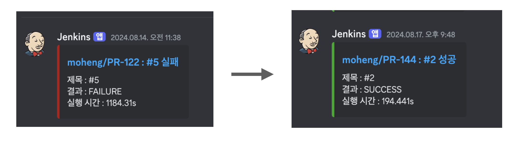
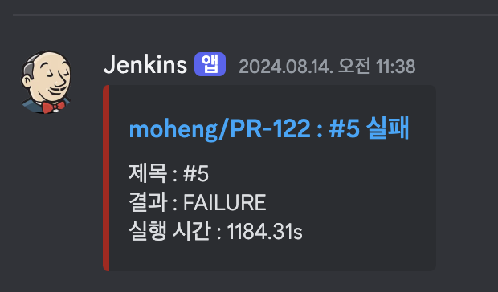

## 문제 상황

**우리 팀은 완벽한 테스트 격리 환경을 구축하는 과정속에서, 초기에 빌드가 약 20분 가까이 걸리는 경우가 발생했다. 심지어 빌드 도중에 간혹 젠킨스 서버가 터져버려서 접속할 수 없게되는 경우도 심심치 않게 목격되었다.** 하모니 팀이 젠킨스를 실행하기 위해 사용하고 있는 EC2 인스턴스 사양은 t4g.micro 로 좋은 사양도 아니였기에, 테스트와 빌드에 있어 더 효과적인 방안이 필요했다.

## 테스트 격리란?

테스트 격리는 **공유 자원을 사용하는 여러 테스트끼리 격리시켜서 서로 영향을 주고 받지 못하게 하는 기법**을 뜻한다. 우리 하모니 팀에서는 견고한 애플리케이션과 과감한 리팩토링을 위해 테스트 전략을 수립하고 있는데, 그 중 테스트 격리를 어떻게 효과적으로 구축할 수 있는지에 대한 많은 고민과 빌드 최적화 여정이 있다. 앞선 문제 상황을 해결하기 위한 우리 팀의 고민과 최적화 여정은 어떠했을까? 🤔

지난 [격리된 테스트(Isolated Test) 구축과 빌드 최적화 - 이론편
](https://haon.blog/test/isolated-theory/) 을 포스팅 한 적이 있다. 이어서, 우리 팀에서 어떤 방식으로 테스트 격리 환경을 구축하고 빌드 속도를 최적화했는지에 대하여 이번 포스트에서 실전편으로 다루고자 한다.

> 💡 테스트 격리(Isolated Test) 에 대한 자세한 이론은 [격리된 테스트(Isolated Test) 구축과 빌드 최적화 - 이론편](https://haon.blog/test/isolated-theory/) 을 참고하자 🙂 

## 완벽한 테스트 격리를 위해

지난 이론편에서 다루었듯이, `비결정적 테스트(Non-Deterministic)` 테스트를 제거하기 위해 완벽히 격리된 테스트 환경을 구축해야 헀다. 우리 팀에서 또한 격리된 테스트 환경을 구축하기 전까지 특정 테스트가 실행 순서와 시점에 따라서 성공할 때도 있고, 실패할 때도 있었다 😅 특히나, 공유 자원을 사용하는 여러 리소스 중에 데이터베이스를 어떻게 격리시킬지가 가장 큰 이슈가 되었다. 아래 코드는 지난 이론편에서 사례로 들었던 예시로, 각 테스트간에 서로 격리되지 못하고 영향을 끼치는 `비결정적 테스트(Non-Deterministic)` 전형적인 사례이다.

~~~java
@SpringBootTest
public class MemberServiceTest {

    @Autowired
    private MemberService memberService;

    @DisplayName("멤버를 저장한다.")
    @Test
    void test1() {
        // given
        String email = "devHaon@kakao.com";

        // when, then
        assertDoesNotThrow(() -> memberService.save(email));
    }
    
    @DisplayName("멤버 정보가 없으면 예외가 발생한다.")
    @Test
    void test2() {
        // given
        String email = "devHaon@kakao.com";

        // when, then
        assertThatThrownBy(() -> memberService.finByEmail(email))
          .isInstanceOf(NoExistMember.class);
    }
}
~~~

이를위해 효과적으로 테스트를 격리시키는 방법에는 크게 `@Transactional`, `@DataJpaTest`, `@JdbcTest`, `@Sql`, `@DirtiesContext` 등의 기법이 존재했다. 하지만 `@Transactional`, `@DataJpaTest`, `@JdbcTest` 의 경우 우리의 기대와 달리, 전 구간 E2E 테스트에서 롤백이 보장되지 않는다는 특징으로 인해 완벽한 테스트 격리가 불가능하다고 설명했었다. E2E, 인수 테스트 등 전 구간 테스트는 `@SpringBootTest` 어노테이션에 port 를 지정하여 서버를 띄우게 되는데, 이때 HTTP 클라이언트와 서버는 각각 다른 쓰레드에서 실행된다. 따라서 `@Transactional` 어노테이션을 명시했다고 한들, 호출되는 쪽은 다른 쓰레드에서 새로운 트랜잭션으로 커밋하기 때문에 롤백 전략이 무의미해진다.

## 1. @DiritesContext 를 사용한 테스트 격리의 성능 문제

`@Transactional` 를 이용한 롤백 전략은 E2E 테스트에서 테스트 격리를 보장해주지 않는다. 따라서 우리 팀은 완벽한 격리를 위해 더 효과적인 방안을 고민하던 끝에 `@DirtiesContext` 에 대해 알게 되었다. 서비스 개발 초기에는 모든 테스트에서 완벽한 격리를 위해 `@DirtiesContext` 를 활용하게 되었다.

아래는 우리 하모니 팀에서 E2E 인수 테스트를 위해 `@DirtiesContext` 를 활용한 코드다.

~~~java
@SpringBootTest(webEnvironment = SpringBootTest.WebEnvironment.RANDOM_PORT, classes = TestConfig.class)
@ActiveProfiles("test")
public abstract class AcceptanceTestConfig {
    @LocalServerPort
    private int port;

    @BeforeEach
    public void setUp() {
        RestAssured.port = port;
    }
}
~~~

이로써 각 슬라이드 테스트를 위한 추상 클래스 상단에 `@DirtiesContext` 를 붙여서 매 테스트가 실행될 떄 마다 새로운 `ApplicationContext` 를 로드하게 된다.

### 왜 @DiritesContext 로 격리시켰는가? 🤔

초기에는 이렇듯 테스트 격리 환경을 위해 `@DiritesContext` 를 사용했다. `@DiritesContext` 를 사용하여 얻는 이점은 자명했기 떄문이다. 

우선 각 테스트마다 "완벽한 격리" 가 가능함을 보장하기 떄문이다. 지난 이론편에서 설명했듯이, 스프링부트 애플리케이션은 기본적으로 특정 하나의 테스트에서 띄운 `ApplicationContext` 을 재활용한다. 즉, `ApplicationContext` 는 한번 로딩되면 각각의 테스트에서 매번 동일한 컨텍스트를 재사용한다. 하지만 문제점은, 동일한 컨텍스트를 캐싱함으로 인하여 데이터베이스와 같은 공유 자원도 캐싱되어 모든 테스트가 동일한 공유 자원을 사용한다는 점이다. 

`@DirtiesContext` 를 사용하면, 각 테스트마다 별도의 새로운 컨텍스트를 띄워서 독립적인 테스트를 할 수 있게된다. 즉, 기존 내용을 캐싱하지 않고 서로 다른 컨텍스트를 띄워서 테스트하기 떄문에 완벽한 격리가 가능해진다. 어노테이션 하나만을 명시하여 완벽한 격리가 보장된다는 점이 매우 매력적으로 다가왔다.

### @DirtiesContext 로 인한 빌드 성능 저하 문제점 

하지만, 아쉽게도 `@DirtiesContext` 가 안겨주는 치명적인 단점이  존재헀다. 이 방식은 매 테스트마다 별도의 컨텍스트를 새로 로드하는 방식일텐데, 컨텍스트를 매번 여러개를 로드하는 작업은 비용이 매우 큰 작업이다. 서비스 개발 초기에는 테스트 갯수가 그리 많지 않았기에 빌드가 오래걸리지 않아 안심하고 있었으나, 시간이 거듭될수록 빌드 속도는 20분이나 걸리게 되며, 젠킨스 서버가 일시적으로 중단되는 모습도 목격되었다 😹

### 2. @Sql 어노테이션과 TRUNCATE 하는 SQL 파일을 활용한 성능 개선

`@DirtiesContext` 를 사용함으로 인해 매번 컨텍스트를 띄우는 일은 매우 비효율적이었다. 이를 위해 `@DirtiesContext` 를 제거하고, 스프링부트 애플리케이션 컨텍스트를 한 번 띄우고 난뒤 매번 동일한 컨텍스트를 재활용하는 방안을 찾게 되었다. 이를 가능케하는 것이 바로 지난 이론편에서 살펴봤던 `@Sql` 어노테이션이었다.

### 하지만, SQL 파일을 관리하기에 번거롭다.

결국 `@DirtiesContext` 의 성능이 좋지 않아, 이후에는 `@Sql` 과 테이블을 `TRUNCATE` 하는 SQL 파일을 작성하여 테스트를 격리하는 방법으로 마이그레이션 하고자 했다. 클래스 테스트가 실행되기 전에 `@Sql` 이 가리키는 경로에 있는 SQL 실행이 먼저 일어나는 방식으로, 따라서 이 파일안에 모든 테이블에 대한 TRUNCATE SQL을 미리 작성해 놓으면, 파일하나와 어노테이션만으로 테스트 격리를 이뤄낼 수 있으니 꽤나 획기적인 방식이라고 생각이 들었다. 실제로 아래와 같이 SQL 파일 내용을 구성할 것을 고려했다.

~~~sql
TRUNCATE TABLE member;
TRUNCATE TABLE keyword;
TRUNCATE TABLE live_information;
// ...
~~~

하지만 DirtiesContext를 사용할 때보다 성능은 개선될테지만, 엔티티가 추가/제거될 때마다 SQL 파일도 변경해줘야 하는 번거로움이 존재했습니다. 유지.보수에 있어 변동사항이 있더라도 개발자가 직접 일일이 수정해줘야하는 번거로움 또한 제거하고 싶었다.

## 3. EntityManager로 직접 TRUNCATE 쿼리를 실행하는 DatabaseCleaner 구현

고민끝에 `@Sql` 과 `TRUNCATE` 쿼리가 작성된 SQL 파일을 이용한 문제점을 해결하기 위해, **테스트가 실행되기 직전 호출되어 데이터베이스를 초기 상태로 만들어주는 DatabaseCleaner를 구현했다.** EntityManager를 통해 존재하는 모든 Entity를 가져오고, 리플렉션을 통해 Entity `@Table` 어노테이션의 테이블 명을 가져오는 방식이다. 가져온 테이블명 목록을 통해 TRUNCATE 쿼리를 실행하여 테이블을 초기화한다.

~~~java
@Component
public class DatabaseCleaner {
    private EntityManager entityManager;
    private List<String> tableNames;

    public DatabaseCleaner(final EntityManager entityManager) {
        this.entityManager = entityManager;
        this.tableNames = entityManager.getMetamodel()
                .getEntities()
                .stream()
                .map(Type::getJavaType)
                .map(javaType -> javaType.getAnnotation(Table.class))
                .map(Table::name)
                .collect(Collectors.toList());
    }

    @Transactional
    public void clear() {
        entityManager.flush();
        entityManager.createNativeQuery("SET foreign_key_checks = 0").executeUpdate();

        for (String tableName : tableNames) {
            entityManager.createNativeQuery("TRUNCATE TABLE " + tableName).executeUpdate();
        }

        entityManager.createNativeQuery("SET foreign_key_checks = 1").executeUpdate();
    }
}
~~~

이 방식은 SQL 파일을 직접 실행시키기보다 JPA에서 쿼리를 직접 만들 수 있는 EntityManager 를 빈으로 주입받고, 모든 테이블 이름을 조사해서 각각의 테스트가 시작할 때, TRUNCATE 쿼리를 실행시키는 방식이다.

이 DatabaseCleaner 를 만들어 놓음으로써, 한번 만들어놓은뒤 엔티티가 얼마나 더 추가되고 삭제되는지와 상관없이 모든 테스트를 효과적으로 격리시킬 수 있게 된다 🙂

## DatabaseCleaner 를 통한 최적화 결과

앞선 고민과 최적화 여정들을 통해, **빌드 성능이 약 20분에서 3분대로 6.1배 가까이 상승했다.** 이로써 완벽한 테스트 격리는 몰론, 빌드 속도 최적화, 젠킨스 서버에 가하졌던 부하를 감축시킬 수 있게 되었다. 코드가 Develop 브랜치에 병합되고나서 20분이라는 오랜 시간이 지나서야 빌드가 완료되었다는 알림을 받았는데, 이제 짧은 시간내로 빌드 완료 알림 또한 받을 수 있게 되었다 😎

많은 삽질이 있었지만, 그 만큼 재밌었던 경험이었다. 이만 글을 마쳐보겠다.