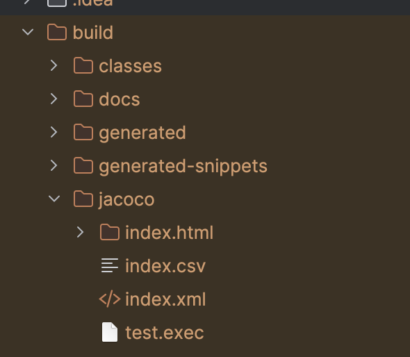
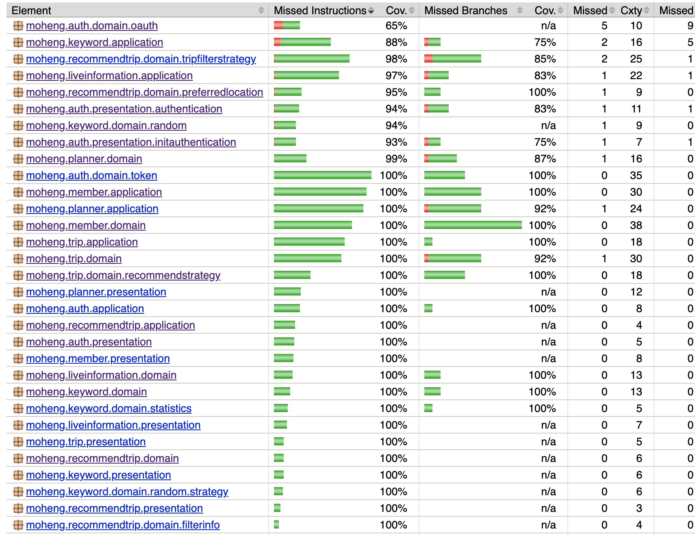

> 💡 현재 포스트는 [하모니 팀 기술 블로그](https://main--kakaotech-moheng.netlify.app/backend/jacoco/) 에 게시된 글 입니다.

## 코드 커버리지(Code Coverage)

> 코드 커버리지에 대한 자세한 이론은 [코드 커버리지(Code Coverage) 에 대하여](https://haon.blog/test/code-coverage/) 를 참고하자.

**코드 커버리지란 현재 작성한 테스트 코드가 실제 프로덕션 코드를 얼마나 커버하는지에 대해 표현한 퍼센트 지표이다.** 즉, 코드 커버리지란 테스트에 의해 실행된 프로덕션 코드의 양을 퍼센트로 표현한 것이라 할 수 있다. 코드 커버러지를 통해 현재 작성된 테스트 갯수가 충분한지, 테스트를 미쳐 놓치고 있는 프로덕션 코드가 존재하는지에 대해 검토할 수 있다.

코드 커버리지 측정 기준에는 크게 **함수 커버리지, 라인(구문) 커버리지, 결정 커버리지, 조건 커버리지가 존재**한다. 또한 높은 코드 커버리지는 **더 과감하게 프로덕션 코드를 리팩토링할 수 있게 해주며, 프로덕션 및 요구사항에 대한 이해도를 높일 수 있게 해준다.** 코드 커버리지에 대한 자세한 이론은 필자가 작성한 [코드 커버리지(Code Coverage) 에 대하여](https://haon.blog/test/code-coverage/) 에 정리해 두었으니, 참고하면 좋을 듯 하다 😎

## Jacoco 도입과 코드 커버리지 분석의 필요성

우리 팀은 견고한 애플리케이션과 과감한 리팩토링을 만들기 위해 테스트 방법론을 도입하고 있다. 모든 테스트 코드는 BDD 스타일로 작성중이며, 다양한 히든 케이스를 테스트하고, 믿음직한 프로덕션 코드를 만들기 위해 노력하고 있다. 하지만, 많은 테스트 코드를 작성함에도 불구하고 휴먼 에러, 숨겨진 버그가 발생하고 있다. 이 문제점를 해결하기 위한 방안 중 하나로 코드 커버리지를 측정하기로 했다. 현재 우리 프로젝트는 어떤 부분에서 테스트를 커버하지 못했는지, 이 코드는 과연 신뢰할 수 있는 코드인지에 대한 객관적인 지표가 존재하지 않는다. 

이 떄문에 우리 하모니 팀은 Jacoco 를 도입하여 커버리지를 측정하기로 했다. Jacoco 란 자바 진영에서 프로젝트의 코드 커버리지를 분석하고, 보고서를 생성해주는 코드 버러리지 프레임워크다.  **하모니 팀은 Jacoco 를 도입하여 코드 커버리지를 분석 및 리포트를 생성하고,** `라인 커버리지(Line Coverage)`**가 일정 수준 이하라면 Gradle 빌드가 실패하도록 설정했다.** 우리 팀의 Jacoco 도입 과정, 왜 이런 테스트 환경을 구축했는지의 근거를 간단한 실습과 함께 글로 공유하고자 한다 🙂

### 왜 커버리지 기준을 라인 커버리지(Line Coverage) 로 설정했는가?

코드 커버리지 측정 기준은 꽤 다양하다. Jacoco 도입과 동시에 어떤 기준으로 커버리지를 측정할지 많은 고민이 있었다. 고민 끝에, 우리 팀은 라인 커버리지 지표를 기반으로 측정하기로 결론내였다. 조건 커버리지와 결정 커버러지의 경우 조건문을 만족한다면 커버리지 만족 대상에 포함되기 때문에, 만약 조건문이 존재하지 않는 코드라면 커버리지 측정 대상에서 아예 제외되기 때문에 테스트를 수행하지 않는다.

반면 라인 커버러지(일명, 구문 커버리지) 의 경우 조건식에 따라 실행되지 않는 코드들도 있기 때문에 모든 시나리오에 대해 테스트한다는 보장은 없지만, 전체 코드에 대한 테스크가 커버되었다고는 할 수가 있다. 이 때문에 라인 커버리지를 선택하게 되었다. (대중적으로도 라인 커버리지를 타깃으로 삼는다고 한다.)

### 왜 커버리지가 일정 수준 이하라면 Gradle 빌드가 실패하도록 설정했는가?

커버리지는 그 자체만으로 테스트가 얼만큼 수행되었는지의 객관적이자 정량적 지표를 뜻한다. 커버리지가 낮다고 해서 무조건적으로 빈약한 애플리케이션이라 단정지을 순 없지만, 그럼에도 **정말 낮은 커버리지는 빈약한 애플리케이션일 가능성이 충분하다는 것은 사실이다.** 특정 프로덕션 코드에 대해 테스트 자체가 단 1번도 실행되지 않았다면 커버리지에서 제외되기 떄문이다. **빈약한 애플리케이션일 가능성이 높은 코드를 함부로 배포하기란 다소 무모한 짓이기에, 일정 수준보다 낮다면 빌드 자체가 실패하여 배포되지 않도록 막아놓았다.** 

현재 우리 팀은 여유있게 커버러지가 70% 이상일 때만 빌드가 성공하도록 했다. 데모데이 기간이 얼마 남지 않았기에, 정해진 기간내에 적당량의 테스트를 작성하는 것이 올바르다고 판단했기 때문이다. 1차 데모데이가 끝난 뒤에는 점차 커버러지 성공 기준을 75% 에서 90% 대로 올리는 것을 계획중이다.

## Jacoco 도입을 위한 환경 구축하기

우리 팀은 어떤 방식으로 Jacoco 를 도입했으며, 어떻게 커버러지가 일정 수준 이상일때만 Gradle 빌드를 성공하도록 구축했을까? 이를 간단한 실습으로 구현해보겠다.

> 실제 하모니 팀 프로젝트는 Jacoco 가 생성한 XML, CSV 파일을 이용하여 소나큐브가 정적 분석 을 시도하도록 설계되었지만, 소나큐브 연동과 관련한 내용은 이번 포스트 주제에서 다소 벗어나는 내용이므로 제외한다. 

### build.gradle 전체 코드

아래는 gradle 에 jacoco 관련 의존성 코드를 추가한 전체 코드다. 하나씩 살펴보도록 하자.

~~~java
plugins {
	id 'jacoco' 
    // ...
}

jacoco {
	toolVersion = "0.8.11" 
}

jacocoTestReport {
	reports {
		xml.required.set(true) 
		csv.required.set(true)
		html.required.set(true)

		xml.destination file(project.layout.buildDirectory.dir("jacoco/index.xml")) as File
		csv.destination file(project.layout.buildDirectory.dir("jacoco/index.csv")) as File
		html.destination file(project.layout.buildDirectory.dir("jacoco/index.html")) as File
	}

	afterEvaluate {
		classDirectories.setFrom(
				files(classDirectories.files.collect {
					fileTree(dir: it, excludes: [
							'**/*Exception*',
							'**/dto/**',
							'**/infrastructure/**'
                            // ...
					])
				})
		)
	}
	finalizedBy(jacocoTestCoverageVerification)
}

jacocoTestCoverageVerification {
	violationRules {
		rule {
			enabled = true

			limit {
				counter = "LINE"
				value = "COVEREDRATIO"
				minimum = 0.70
			}

			excludes = [
					'*.*Exception',
					'*.dto.*',
					'*.infrastructure.*'
                    // ...
			]
		}
	}
}

test {
	finalizedBy 'jacocoTestReport'
    // ...
}
~~~
 
### 1. Jacoco 플러그인 로드

우선 아래와 같이 `build.gradle` 에서 Jacoco 플러그인을 가져온다. 우리 팀의 경우 Jacoco 버전을 `0.8.11` 을 사용한다.

~~~java
plugins {
	id 'jacoco' // (1)
    // ...
}

jacoco {
	toolVersion = "0.8.11" 
}

~~~

### 2. XML, CSV, HTML 파일로 보고서 생성

다음으로 Jacoco 가 커버리지 측정 보고서 파일을 생성할 때, 사람이 읽기 편한 형태인 XML, CSV, HTML 형식으로 생성하도록 설정해야한다. XML과 CSV파일은 소나큐브등과 연동할 때 주로 사용되며, HTML 파일은 사람이 직접 커버리지를 확인할 때 사용된다.

Jacoco 는 기본적으로 코드 커버리지 결과 보고서를 바이너리 형식 (확장자 `.exec`) 으로 생성한다. 하지만 바이너리 파일은 일반적으로 사람이 읽을 수 없는 형태이기 때문에, 바이너리 형태의 보고서를 사람이 읽기 좋은 형태로 출력해주는 기능을 제공한다. 그 기능을 바로 아래와 같이 `jacocoTestReport` 테스크에서 제공해준다.

~~~java
jacocoTestReport {
	reports {
		xml.required.set(true) 
		csv.required.set(true)
		html.required.set(true)

		xml.destination file(project.layout.buildDirectory.dir("jacoco/index.xml")) as File
		csv.destination file(project.layout.buildDirectory.dir("jacoco/index.csv")) as File
		html.destination file(project.layout.buildDirectory.dir("jacoco/index.html")) as File
	}
    // ...
}
~~~

위와 같이 `jacocoTestReport` 테스크를 설정해준다면 위 보고서 파일들을 빌드 디렉토리 경로에 생성해준다. 즉, Jacoco 가 생성한 HTML 보고서의 경우 `/build/jacoco/index.html` 에 생성될 것이다.

실제로 아래와 같이 jacocoTestReport` 테스크를 실행시킨 후 생성된 보고서 파일들을 조회해보자.

~~~java
$ ./gradlew jacocoTestReport
~~~

결과적으로 아래와 같은 빌드 디렉토리에 우리가 원하는 보고서 파일들이 생성된 모습을 확인할 수 있을것이다.

### 3. 테스트 커버리지 측정 대상 일부 제외시키기

**단순히 계층간 데이터를 전송하는 역할을 하는 DTO, Exception 클래스, Mocking 으로 대신한 외부 API 등 테스트가 불필요한 (또는 테스트가 불가능한) 대상들이 존재할 것이다.** 이들까지 모두 커버리지 측정 타깃으로 삼는다면 정작 커버리지 측정 대상에 집중하지 못하게 될 것이며, 불필요한 대상들로 인해 커버리지 결과가 낮게 측정될 것이다. 이들은 아래와 같이 커버리지 측정 대상에서 제외시킬 수 있다.

~~~java
afterEvaluate {
		classDirectories.setFrom(
				files(classDirectories.files.collect {
					fileTree(dir: it, excludes: [
							'**/*Exception*',
							'**/dto/**',
							'**/infrastructure/**'
                            // ...
					])
				})
		)
	}
~~~

`afterEvaluate` 에 현재 프로젝트의 커버리지를 측정(평가) 한 뒤 수행할 행위를 기제할 수 있다. 우리는 `excludes` 에 제외시킬 클래스를 포함했다.

### 4. 커버리지가 70% 이상일 때 빌드가 성공하도록 설정

또한 Jacoco 는 `JacocoTestCoverageVerification` 이라는 태스크를 지원한다. **이 태스크에서 규칙을 설정하여, 프로젝트의 코드 커버리지가 우리가 설정한 규칙을 통과하지 않으면 빌드가 실패하도록 만들 수 있다.** 규칙은 `rule` 이라는 블럭 내부에서 정의해야한다. 우리 하모니 팀은 아래와 같은 설정을 통해 라인 커버리지가 70% 미만일 경우 빌드가 실패하도록 규칙을 만들었다.

~~~java
jacocoTestCoverageVerification {
	violationRules {
		rule {
			enabled = true // 규칙을 활성화한다. (false 일 경우 비활성화)

			limit {
				counter = "LINE" // 라인 커버리지 기준임을 명시
				value = "COVEREDRATIO"
				minimum = 0.70  // 최소 70% 이상을 만족해야 함
			}

			excludes = [
					'*.*Exception',
					'*.dto.*',
					'*.infrastructure.*'
                    // ...
			]
		}

        // ...
	}
}
~~~

우리 팀은 라인 커버리지를 지표로 하여 측정하고 있지만, 만약 다른 커버리지 지표를 사용하고 싶다면 아래와 같은 옵션중에 골라서 사용하면 될 것이다. (옵션 미지정시 기본값은 `INSTRUCTION`)

- `LINE` : 빈 줄을 제외한 실제 코드의 라인 수
- `BRANCH` : 조건문등의 분기 수
- `CLASS` : 클래스 수
- `METHOD` : 메소드 수
- `INSTRUCTION` : 자바 바이트코드 명령 수
- `COMPLEXITY` : 복잡도

### 5. 테스트 실행 후 커버리지 리포트 생성

test 테스크가 끝난 뒤에, 즉 모든 테스트가 실행된 뒤에 곧 바로 `jacocoTestReport` 가 실행되도록 설정할 수 있다. 이 설정을 통해 테스트가 완료되면 항상 Jacoco 분석 리포트가 자동으로 생성된다.

~~~java
test {
	finalizedBy 'jacocoTestReport'
    // ...
}
~~~

## 커버리지 리포트 확인

이렇게까지 Jacoco 환경 구축을 마쳤다면, 매 테스트 실행 결과로 아래와 같은 HTML 형식의 리포트를 확인할 수 있을 것이다.

## 마치며

효율적인 테스트를 작성하고, 버그를 최소화하고, 견고한 애플리케이션을 만들기 위한 여정은 쉽지 않다 😅 앞으로도 코드 커버리지를 통해 우리 하모니 팀의 서비스가 어떻게 더 발전해나갈 수 있을지 고민해봐야곘다.