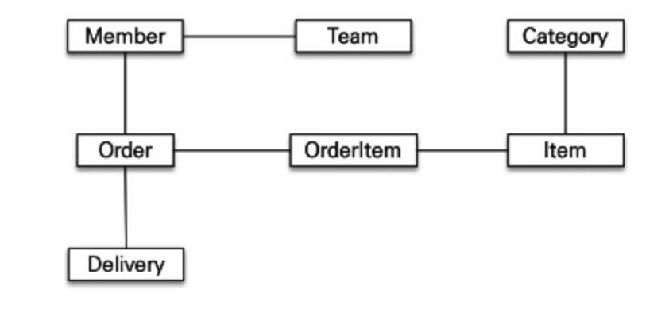

우리 팀은 왜 ORM 을 사용할까? 스프링부트 생태계에서 제공되는 ORM 표준 기술인 JPA 는 어떤 근거로 도입해야지 정말 타당한것일까? **나는 과연 진정한 의미의 객체지향 프로그래밍을 위한 ORM 을 제대로 이해하고 개발해왔을까?** 그간 JPA 는 SQL 중심적인 개발의 문제점, 데이터베이스와의 패러다임 불일치 이슈로 인해 등장했음을 알고 있지만, 아쉽게도 명확하고 구체적인 이유를 자세히 풀어 설명하지 못하고 있는 상태다.

JPA 는 이미 우리 팀에서 적극 활용되고 있는 ORM 이다. 하지만, ORM 을 왜 써야하는지에 대한 자세한 근거, 명확하게 설명을 풀어 설명하기까지에는 다소 무리인 상태이다. 이 때문에 이번 포스트에서 JPA 을 왜 사용해야하는지에 대한 높은 이해도를 확보하고, ORM 내에 담겨있는 숨겨진 의미를 깊게 이해하고자 한다. 

## JPA 의 등장배경

1990년대 인터넷이 보급됨과 동시에 온라인 비즈니스가 활성화되었다. 자연스레, 온**라인 비즈니스에서 데이터베이스에 데이터를 저장하고 가져올 때 사용할** `Connection Connector` **에 대한 필요성이 높아졌다.** 이 때문에 각 프로그래밍 언어에서 DB Connection 을 지원하는 API 기술들이 등장했다. 스프링 생태계 또한 DB Connection 을 더 쉽개 관리할 수 있는 API 인 `Spring JDBC API` 를 만들고 지원했다. (이 외에도 쿼리문을 XML 파일을 통해 관리하게끔 도와주는 MyBatis 도 등장했다.)

하지만, 여전히 쿼리문을 개발자가 직접 작성해야하는 등 다양한 문제점을 가지고 있었다. 따라서 스프링 생태계에선 개발자가 쿼리문을 직접 작성하지 않아도 프레임워크 내부에서 자동으로 쿼리문을 작성해주는 `ORM(Object Relational Model)` 기술인 JPA 가 등장했다. 

## SQL 중심적인 개발의 문제점

그렇다면 JPA 가 등장하기 이전까지 SQL 중심적인 개발의 문제점은 무엇이 있을까? 개발자가 쿼리문을 직접 작성하고 관리함으로 인해 어떤 불편함을 야기했을까? Spring JDBC API 를 활용하던 시절의 단점은 무엇이 있을지 학습해보도록 한다.

### 반복적인 객체-테이블 매핑 노동 작업

JDBC API 는 쿼리문을 개발자들이 직접 작성해야한다. 이 떄문에 개발자들은 쿼리문을 작성하는 지루한 작업을 무한 반복해야했다. 쿼리문을 직접 작성해야했던 이유는, **객체지향, 관게형 데이터베이스 패러다임 불일치 문제로 부터 발생했다. 객체를 관계형 데이터베이스에 저장하고 가져오는 작업은 곧 객체를 테이블로, 테이블을 객체로 매핑하는 작업과 같다.** 객체라함은 객체지향 프로그래밍을 준수하며 작성된 자바 코드 객체를 뜻한다.

이런 매핑 작업을 개발자가 일일이 수행함으로써 얻는 이점은 있지도 않고, 시간만 잡아먹으며 노동 작업이다. 또한 테이블 구조가 조금이라도 변경된다면, 코드의 SQL 문을 변경된 테이블 구조에 알맞게 수정해야한다. 결국 개발자는 비즈니스 로직, 테스트, 객체지향에 집중하기 보다 SQL 매핑 작업에 더 몰두할 수 있게된다. 효율적인 로직 고민이 아닌, 일명 SQL 매핑 노가다 개발자가 될 수 있다.

### 각 데이터베이스의 방언을 지원하지 않는다

비슷한 이유로, 객체를 데이터베이스에 저장하기 위해 각 DB 별로 알맞게 종속적인 SQL 쿼리문을 작성해야한다. 만약 MySQL 을 사용하는 팀에서 Oracle DB 로 마이그레이션 해야한다면? 빠른 기간내에 NoSQL 로 마이그레이션 해야한다면? 

아쉽게도 JPA 가 없는 환경에선 쿼리문을 Dao 에 일일이 작성해야 하므로, 각 데이터베이스에 알맞은 쿼리문을 Dao 내에 일일이 새롭게 작성해줘야한다. 데이터베이스에 의존적인 문제로 인해 모든 쿼리문을 일일이 작성해야하고, 이는 유지보수를 어렵게 만든다. 

**데이터베이스를 언제든 쉽게 갈아끠울 수 있는 하는 것을 "방언" 이라고 한다. 하지만 각 DB 에 알맞은 전용 Dao 과 SQL 을 작성함으로 인해 방언을 지원받지 못한다.**

### 객체 그래프 탐색의 어려움 (객체와 관계형 DB의 패러다임 차이)

**객체지향에서 객체간의 연관관계는 "참조"를 통해 맺어지고, 관계형 데이터베이스에서 테이블간의 연관관계는 "외래키(FK)" 를 통해 맺어진다.** SQL 중심적인 코드를 작성하면, 객체의 구조를 테이블에 알맞게 변형시켜서 저장해줘야 한다. SQL 중심적인 개발이 된다면, 위에서 Member 가 Order 를 참조하는 형태가 아니라, Order 의 PK 를 보유하고 있는 형태로 설계해야한다.

그런데 아직도 궁금증이 남는다. 왜 객체지향적인 연관계를 가진 객체들을 데이터베이스에 저장할 떄, 데이터베이스의 연관관계로 변경하는 것이 왜 문제가 될까? 더 높은 이해도를 위해, 예시를 들어보겠다. 

~~~java
public class Order {
    private Long id;
    private String name;
    private LocalDate date;
    private Member member;
}

public class Member {
    private Long id;
    private String name;
}
~~~

만약 위와같이 모델링된 Member 와 Order 를 데이터베이스에서 저장하기 위해선 앞서 설명한 **반복적인 객체-테이블 매핑 작업** 이 필요하다. 매핑, 즉 객체를 DB 내의 테이블로 변환하기 위해 어떤 과정이 필요할까? 데이터베이스에 접근하고자 하는 DAO 객체에 Order 객체를 분해하고 각자 Order 테이블과 Member 테이블에 대한 쿼리를 작성해야할 것이다. 끔찍하게도, 단순히 Order 의 객체 정보를 DB 에 저장하는데만 3가지 과정을 거쳐야한다.

이런 복잡하고 매핑 과정을 피하기 위해, 아래처럼 Member 와 Order 를 DB 테이블 구조에 맞추어 설계할 수 있다. **즉, 객체를 데이터베이스에 저장하기 편하도록 객체간의 참조 관계를 외래키(FK) 로 변환해야한다. 하지만, 이는 객체 모델링을 할 떄 객체가 서로 참조하는 객체지향적인 개발이 아니라 데이터베이스 테이블 구조에 맞추어 개발하는 SQL 중심적인 개발을 하게 된다는 문제점을 가진다.**

~~~java
public class Order {
    private Long id;
    private String name;
    private LocalDate date;
    private Long member_id;
}

public class Member {
    private Long id;
    private String name;
}
~~~

### 모든 객체를 미리 로딩할 수 없다

맨 위의 그림에서 Member 객체를 데이터베이스로부터 가져오기 위해선 Team, Order 를 비롯한 여러 객체관계의 복잡한 참조관계를 데이터베이스에 쿼리로 삽입해야한다. 하지만, 객체 타입이 많아짐에따라 연관관계가 복잡해질수록 Dao 의 쿼리문 또한 복잡해지고, 갯수 또한 매우 많아지기에 유지.보수가 어려워질 것이다. 

필요한 데이터만 조회하는 기능을 만들때도 유지.보수가 어려운 것은 매한가지다. 필요한 데이터만을 조회하는 쿼리를 작성하더라도 쿼리가 다소 복잡한 것은 몰론, 필요한 데이터만을 조회하는 메소드를 만들기에도 유지보수성이 좋지 못하다. 아래와 같이 DAO 에다 Member 에 연관된 이들을 조회하기 위한 Getter 메소드를 개발하자니, 메소드 가독성은 몰론 내부 쿼리문도 매우 복잡할 것이다.

~~~java
memberDao.getOrder();
memberDao.getOrderWithItem();
memberDao.getItemWithOrderAndCategory();
// ...
~~~

## ORM 의 표준인 JPA 의 등장

객체와 관계형 데이터베이스의 패러다임 불일치(차이) 로 인해, 우리는 객체지향 프로그래밍을 하지 못하고 데이터베이스에 종속적인 SQL 매퍼 개발자가 되버린다. 이러한 데이터베이스 및 SQL 중심적인 개발 문제점을 해결하기위해 ORM 이 등장했다.

ORM 인 JPA 를 통해 개발자는 더 이상 쿼리문을 반복적으로 작성하거나 유지보수하는데에 신경쓰지 않아도 된다. JPA 가 자동으로 쿼리문을 작성해주며, 심지어 설정 하나만 바꾸면 얼마든지 DB 에 알맞은 전용 SQL 를 생성해주는 방언까지 지원해준다.

향후 JPA 에 대해서 꾸준히 포스트를 다루어볼까 한다.

