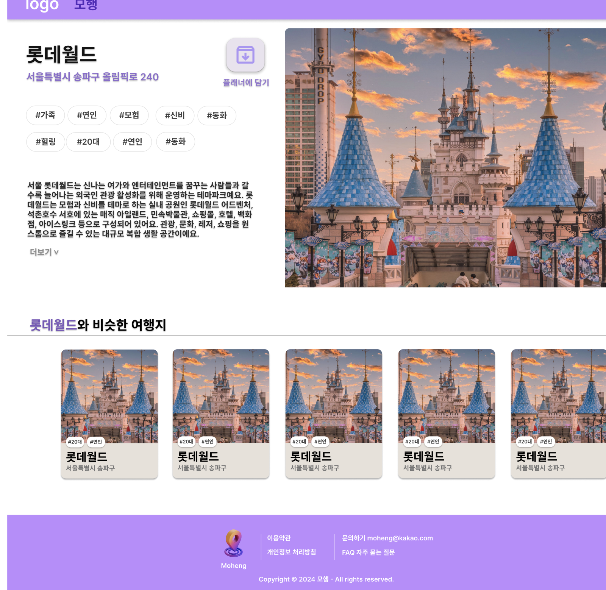
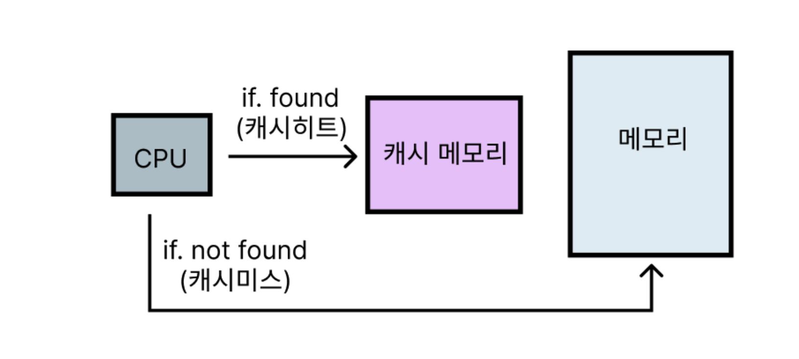
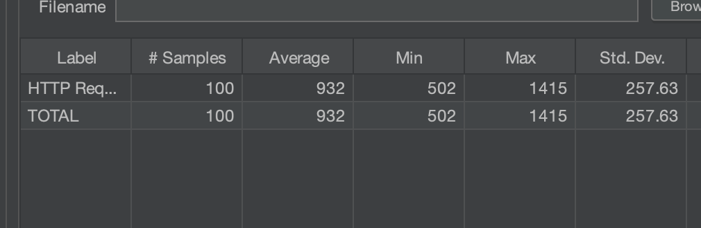
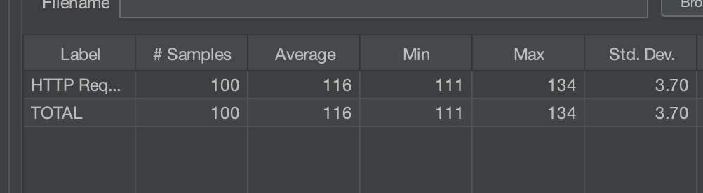
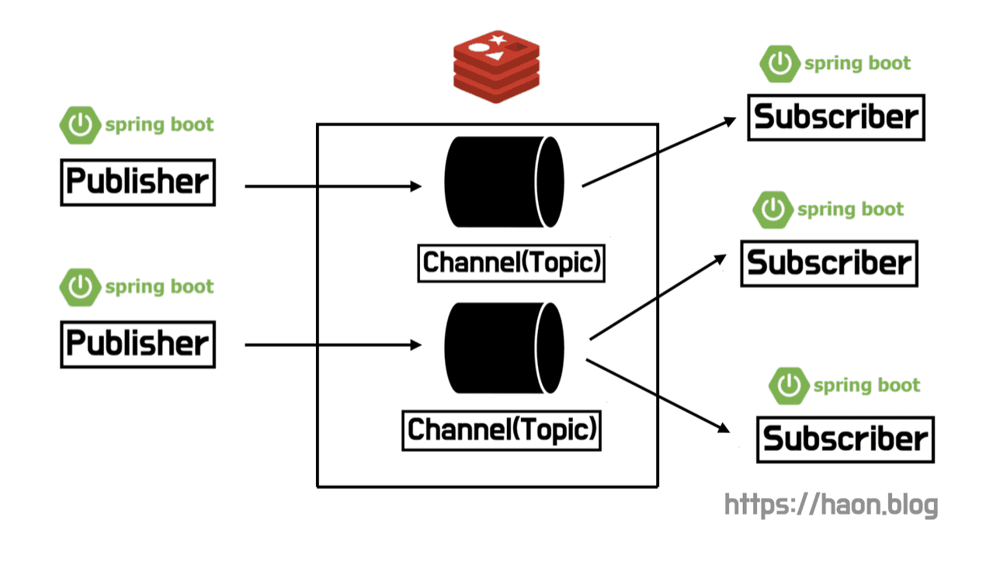

## 외부 API 요청이 매우 느린 문제상황

우리 하모니 팀이 개발중인 모행 서비스는 여행지 하나를 클릭했을 때 그와 성향이 비슷한 여행지 리스트 10개를 함께 천하고 있다. 비슷한 성향의 여행지를 추천받기 위해 AI 모델을 서빙할 FastAPI 서버에게 요청을 전송하고, 그와 비슷한 여행지를 응답받고 있다. 그리고 스프링부트 서버에선 응답받은 여행지 리스트를 현재 여행지와 동일한 생활정보를 보유한 여행지들로만 필터링하고 있다. **쉽게말해, AI 서버로부터 응답받은 결과를 계속 필터링하여 여행지 10개가 채워질 때 까지 요청을 계속 전송하는 구조**이다. 이런 플로우를 통해 사용자가 여행하기에 좋을 최적의 여행지들을 추천하는 시스템을 구축하고 있다.



정말 좋은 기능이지만, 말만 들어도 성능상의 이슈가 발생할 것 같다. 로컬에서 테스트한 결과, 트래픽이 급증하는 상황에서 AI 모델 서빙 서버에 한번 API 요청을 보내고 응답 받기까지 **약 900ms 가 넘는 시간이 소요**된다. 이는 사용자 경험 측면에서 좋지 않는 상황이다.

이러한 외부 API 요청으로 인해 성능 이슈를 어떻게 개선할지 고민이 많았다. 외부 API 요청은 데이터베이스처럼 인덱싱을 통해 성능 개선이 가능한 요소도 아니다. 고민 끝에 우리 팀은 캐싱을 도입하기로 결정했다. **외부 API 요청 내역을 스프링 로컬 캐시로 캐싱하고, 캐싱된 비슷한 성향의 여행지 데이터를 빠르게 조회하는 방식으로 성능 개선을 고안했다.**

## 캐싱된 이전 버전의 데이터만 읽어오는 문제

스프링은 자주 사용되면서 호출이 빈번한 데이터를 메모리에 쉽게 캐싱할 수 있도록 AOP 를 통해 `@Cacheable` 을 제공한다. AOP 를 사용하므로 내부 구현이 영향을 주지 않고, 특정 캐시 구현체(기술) 에 종속되지 않도록 구현할 수 있다.

스프링은 별다른 설정이 없다면 기본 캐시 구현체로 `ConcurrentMapCache` 를 택하고 있다. 이 캐시 구현체는 내부적으로 `ConcurrentHashMap` 을 사용하고 있는 간단한 구현체이다. 우리 팀의 경우도 초기엔 특별한 캐시 구현체를 도입해야 할 이유가 없었기 때문에, 아래처럼 간단히 `@Cacheable` 을 명시하고 기본 캐시 구현체인 `ConcurrentMapCache` 를 사용하도록 하고 있었다.

```java
@Cacheable(value = "SIMILAR_TRIP_CACHE", key = "#contentId+#page")
@Override
public FindSimilarTripWithContentIdResponses findSimilarTrips(final long contentId, final long page) {
    return requestSimilarTrips(new SimilarTripRequests(contentId, page));
}
```

### ConcurrentMapCache 은 TTL 을 지원하지 않는다

하지만 문제가 있었다. AI 서버로부터 응답받는 비슷한 성향의 여행지는 항상 거의 동일한 데이터를 응답받는다. 그런데, ConcurrentMapCache 는 `TTL(Time-To-Live)` 기능을 지원하지 않기 떄문에 유저가 항상 캐싱해놓은 여행지 추천 결과만을 계속 조회하게 되는 문제가 발생하였다. 이 떄문에 유저가 다양한 여행지를 추천받는 것이 아닌, 항상 최초로 캐싱된 데이터들만 조회하게 되는 단점이 존재한다. 이 문제를 해결하기 위해 **캐싱된 데이터는 캐시에서 영구 저장되지 않고 일정 시간이 지났을 때 만료되어 제거되는 기능이 필요했다.**

`ConcurrentMapCache` 는 **TTL(Time-To-Live) 를 지원하지 않는다고 했다.** 따라서 캐싱된 데이터의 만료 기한을 설정할 수 없고, 한번 캐싱된 데이터를 지우기 위해 스케쥴링을 돌려서 모든 데이터를 일괄 삭제해야한다. 그런데 우리가 캐시하려고 하는 데이터는 현재 여행지와 비슷한 성향의 여행지 리스트이다.



만약 캐시 메모리내의 모든 데이터를 일괄 삭제해버린다면, 캐시 메모리에 올려놓고 자주 사용되는 데이터가 불필요하게 캐시 메모리에서 제거되는 문제가 발생한다. **자주 사용되는 데이터는 캐시에서 제거되지 않고 Hit 되어야한다. 그래야 Cache Hit 비율이 높아지고, 성능이 좋아질 것이다.** 다시말해, 자주 사용되는 데이터가 불필요하게 캐시에서 제거되면 Miss Rate 이 높아지므로 성능 저하 이슈가 발생한다.

게다가 일괄적으로 캐시 메모리내 모든 데이터를 지워버린다면, 방금전에 막 캐싱된 데이터들도 제거대상이 된다. 이러한 이유들로 **캐싱된 데이터들은 일괄 제거방식이 아니라, 각 데이터가 개별적인 만료 기간을 가져야한다.**

각 데이터에 대한 개별적인 TTL 기능을 지원하기 위해 `EnCache`, `CaffinCache`, `Redis` 와 같은 캐시 구현체를 사용할 수도 있겠지만, 서드파티에 대한 종속성이 높아지고 자칫 불필요한 비용(돈) 이 발생할 수 있다는 문제점이 있다. 외부 서드파티 구현체를 서비스에 도입하고 틱틱 붙여대면 기능 구현도 빠르게 끝나고 편리할 것이다. 하지만 이 방법은 좋지 않은 개발자 역량이자 잘못된 개선 방향이라 생각한다. 게다가 TTL 기능 하나를 구현하기 위해 외부 의존성을 추가하는 것보다, 현재 주어진 자원으로 문제를 해결하는 방법을 계속 고민하는 것이 바람직하다는 생각이 들었다.

사실 위의 이유보다 우리 서비스의 인프라 아키텍처 확장 가능성을 고려해서 외부 캐시 라이브러리를 도입하지 않은 근본적인 중요한 이유가 있는데, 이는 향후 별도로 기회가 된다면 자세히 다루어보겠다.

> 💡 필자가 가장 중요하게 여기는 개발자 역량 중 하나는, 불필요한 비용을 없애고(비용 절약) 외부 서드파티 구현체에 대한 종속성을 최소화하기 위해 주어진 상황과 한정적인 자원으로 최대한 문제를 해결하는 것이 개발자의 중요한 역량이라고 생각한다.

## ConcurrentMapCache 을 상속한 캐시 구현체 구현

이 문제를 해결하기 위해 `ConcurrentMapCache` 을 상속한 구현체 `ExternalSimilarTripCache` 를 직접 만들어내어 TTL 을 구현하도록 했다. `ExternalSimilarTripCache` 는 `put()` 을 통해 데이터를 캐시에 등록하고, `lookup()` 을 통해 캐시에 담겨있는 데이터를 꺼내온다. 더 자세히 살펴보자.

```java
public class ExternalSimilarTripCache extends ConcurrentMapCache {
    private final Map<Object, LocalDateTime> tripCache = new ConcurrentHashMap<>();
    private final long expiresDatePoint;

    public ExternalSimilarTripCache(final String name, final long expiresDatePoint) {
        super(name);
        this.expiresDatePoint = expiresDatePoint;
    }

    @Override
    protected Object lookup(final Object key) {
        final LocalDateTime expiredDate = tripCache.get(key);
        if(Objects.isNull(expiredDate) || isCacheValid(expiredDate)) {
            return super.lookup(key);
        }

        tripCache.remove(key);
        super.evict(key);
        return null;
    }

    @Override
    public void put(final Object key, final Object value) {
        final LocalDateTime expiredDate = LocalDateTime.now().plusSeconds(expiresDatePoint);
        tripCache.put(key, expiredDate);

        super.put(key, value);
    }

    private boolean isCacheValid(final LocalDateTime expiredDate) {
        return LocalDateTime.now().isBefore(expiredDate);
    }
}
```

우선 `put()` 을 오버라이드 했다. `put()` 은 캐시에 데이터를 저장하는 시점에 `@Cacheable` 을 통해 지정된 key 값을 key 로 하고, value 를 현재시간(= LocalDateTime.now( )) 에 지정된 만료시간만큼을 더한 날짜로 하여 저장한다. 우리 팀의 경우 현재시간으로부터 2시간 이후를 만료 날짜로 하는 정책에 기반하여 `expiredDatePoint` 변수에 값을 주입하도록 했다.

```java
@Override
public void put(final Object key, final Object value) {
    final LocalDateTime expiredDate = LocalDateTime.now().plusSeconds(expiresDatePoint);
    tripCache.put(key, expiredDate);

    super.put(key, value);
}
```

`lookup()` 은 캐시 메모리내에 담긴 데이터 중 원하는 데이터를 key 값을 찾아내는 기능을 가지고 있다. 원하는 데이터가 캐시내에 존재한다면, 즉 **캐시 히트(Cache Hit)** 라면 캐싱된 해당 데이터를 리턴한다. 반대로 **캐시 미스(Cache Miss)** 라면 `null` 을 리턴한다.

이러한 기능을 가진 `lookup()` 을 오버라이드하여, 요청한 데이터가 만료되었다면 `null` 을 리턴하고 해당 데이터를 캐시에서 제거한다.

```java
@Override
protected Object lookup(final Object key) {
    final LocalDateTime expiredDate = tripCache.get(key);
    if(Objects.isNull(expiredDate) || isCacheValid(expiredDate)) {
        return super.lookup(key);
    }

    tripCache.remove(key);
    super.evict(key);
    return null;
}
```

## 캐시 구현체 등록

이렇게 구현한 `ExternalSimilarTripCache` 캐시 구현체를 서비스에서 사용하도록 등록해주도록 한다. `@EnableCaching` 을 명시하고, `SimpleCacheManager` 을 통해 만든 케시를 등록해주자.

`SimpleCacheManager` 는 사용할 캐시를 직접 등록해줄 때 사용하는 캐시 매니저이다. 보통 캐시 클래스를 직접 만드는 경우 사용하기에 적당하다. 또한 `LIFE_CYCLE` 을 통해 앞선 만료시간을 지정해줬는데, 설명했듯이 우리 팀의 경우 2시간을 만료기간으로 지정했다.

```java
@Configuration
@EnableCaching
public class CacheConfig {
    public static final String EXTERNAL_SIMILAR_TRIP_CACHE = "SIMILAR_TRIP_CACHE";
    private static final long LIFE_CYCLE = 60 * 60 * 2;

    @Bean
    public CacheManager cacheManager() {
        SimpleCacheManager simpleCacheManager = new SimpleCacheManager();
        simpleCacheManager.setCaches(List.of(new ExternalSimilarTripCache(EXTERNAL_SIMILAR_TRIP_CACHE, LIFE_CYCLE)));
        return simpleCacheManager;
    }

    // ...
}
```

## 캐시 만료시간을 어느정도로 해야할까?

정말 많은 고민이 있었던 요소이다. 캐싱된 데이터의 만료기간을 어느정도로 해야 적당할까? 결론적으로 우리 팀은 앞서 계속 설명했듯이 2시간으로 설정했다. 우선 AI 서빙 서버는 데이터베이스와 같이 완벽히 제어할 수 있는 요소가 아니다. 따라서 비슷한 여행지 응답 결과가 올바른지에 대해 알 수 없다.

따라서 캐시 만료기간을 너무 길게 설정하면 유저가 자칫 잘못된 성향의 비슷한 여행지를 볼 수도 있다. 그렇다고 만료기간을 너무 짧게 잡자니 캐시 미스가 자주 발생해서 성능이 저하될 수 있다. 너무 길지도 않고, 너무 짧지도 않은 적당한 만료 기간이 필요하다.

기본적으로 AI 알고리즘을 수행했을 때, 매우 높은 확률로 정확하게 비슷한 성향의 알고리즘을 추천해준다. 또한 잘 설계된 알고리즘 덕분에, 현재 여행지와 비슷한 여행지를 추천받은 결과는 항상 같은 데이터셋을 제공받는다. 거의 변하지 않는 특성 때문에 캐싱을 도입한 것이기도 하다. 이런 점을 고려했을 떄 캐시 만료 기간을 너무 짧게 설정하면 캐시 미스가 자주 발생하고 성능이 저하될 것이다. 따라서 임의로 2시간 정도의 만료 기간이 적합하다고 판단했다. 다만, 우리 서비스를 실제로 테스트 및 운영하면서 이 만료 정책이 최선일지는 더 보강해야할 점이라고 생각한다.

## 매일 자정 스케쥴링을 통해 만료된 데이터 캐시에서 제거

그런데 문제점이 아직 남아있다. 캐싱된 데이터 중에 만료기간이 지났음에도 해당 데이터를 사용하기 대한 재요청이 발생하지 않는다면 영원에 캐시 메모리에 남아있다는 점이다. 따라서 해당 데이터는 캐시 메모리에서 영원히 불필요히게 공간을 점유하고 있게된다. 이를 위해 스프링에서 제공하는 `@Scheduled` 로 스케쥴링하여, 매일 자정 만료된 캐시를 지우도록 구현했다.

`evictAllTrips()` 을 수행하여 유효하지 않은 캐시 데이터, 즉 만료된 데이터를 제거하도록 한다.

```java
public class ExternalSimilarTripCache extends ConcurrentMapCache {
    private final Map<Object, LocalDateTime> tripCache = new ConcurrentHashMap<>();
    private final long expiresDatePoint;

    public ExternalSimilarTripCache(final String name, final long expiresDatePoint) {
        super(name);
        this.expiresDatePoint = expiresDatePoint;
    }

    // ...

    public void evictAllTrips() {
        ConcurrentMap<Object, Object> currentCache = getNativeCache();

        currentCache.keySet()
                .stream()
                .filter(key -> !isCacheValid(tripCache.get(key)))
                .forEach(super::evict);
    }
}
```

`@Scheduled` 로 매일 자정마다 `evictAllTrips()` 을 실행하여 만료된 모든 캐시를 제거하도록 한다.

```java
@Configuration
@EnableCaching
@EnableScheduling
public class CacheConfig {
    public static final String EXTERNAL_SIMILAR_TRIP_CACHE = "SIMILAR_TRIP_CACHE";
    private static final long LIFE_CYCLE = 60 * 60 * 2;

    // ...

    @Scheduled(cron = "0 0 0 * * *")
    private void evict() {
        ExternalSimilarTripCache externalSimilarTripCache = (ExternalSimilarTripCache)  cacheManager().getCache(EXTERNAL_SIMILAR_TRIP_CACHE);
        externalSimilarTripCache.evictAllTrips();
    }
}
```

## 성능 개선 확인

Jmeter 를 사용하여 직접 성능 테스트를 진행하였다. 캐시를 사용했을 떄의 성능은 어떻게 달라졌을까? 1초의 간격을 두고 100개의 요청을 보내 평균 응답 시간을 측정하였다.

### 캐시 미사용시 성능

캐시를 사용하지 않았을 때는 앞서 설명했듯이 `900ms` 의 응답 시간이 측정되었다. 정확히는 보듯이 `932ms` 가량의 응답시간이 측정되었다. 꽤나 느린 상태로, 사용자에게 큰 불편함을 줄 것이다.



### 캐시 적용 후 성능



반면 캐시를 적용했을 때는 평균 응답시간이 `116ms` 가 측정되었다. 참고로 맨 처음에는 당연하게도 캐시내에 데이터가 없으므로 캐시 미스가 발생할텐데, 이 캐시 미스가 발생하는 경우를 제외하고 그 이후에 이미 데이터가 캐시된 상태에서 평균 응답시간을 측정하였다. 이로써 캐시 적용 후 성능이 약 8.1배 개선되었다.

## 분산 환경에서 로컬 캐시 동기화



이렇게 구현한 현재 캐시 서버의 향후 확장 가능성까지 고려해보자. 만약 분산 환경이라면 캐시 서버에는 문제가 없을까? 예상하듯이, Scale-Out 된 분산 환경이라면 각 애플리케이션 서버가 서로 다른 캐시 데이터를 갖는 **데이터 일관성 문제가 발생할 수 있다.** 이와 관련하여 로컬 캐시 동기화 이슈를 해결할 수 있는 방법이 여럿 존재할텐데, 그 중 해결안 하나를 [Redis Pub/Sub 을 사용한 분산 환경에서 로컬 캐시 동기화](https://kakaotech-harmony.netlify.app/backend/redis-pub-sub-local-cache-synchornization/) 에서 다룬적이 있다.

분산 환경에서 데이터 일관성 문제를 해결하기 위해선, Redis 와 Memcached 와 같은 글로벌 캐싱을 도입하여 한곳에서 중앙회된 캐시 데이터를 공유하는 방식으로 해결해 볼 수 있다. 캐시 서버만 간단히 추가하면 되니 편하고, 좋아보인다.

그렇다면, 글로벌 캐싱을 도입했을 때는 문제점이 없을까? 글로벌 캐시 또한 문제점이 정말 많다. 우선, 글로벌 캐시는 Redis 와 Memcached 와 같이 외부 캐시 저장소를 사용하기 때문에 **네트워크 I/O 비용**이 발생한다. 또한 캐시에 데이터를 저장하고 꺼내올 때 **직렬화와 역직렬화 비용**도 발생한다. 반면 로컬 캐시는 RAM Access 비용만 발생하기 떄문에 글로벌 캐싱에 비해 매우 빠르다. 당연하게도, 직렬화와 역직렬화도 발생하지 않는다. 또한, 중앙화된 글로벌 캐싱을 사용한다면 캐시 서버가 **SPOF(Single Point Of Failure)** 가 되므로 **HA(High Availability)** 를 보장하지 못한다.

다시 처음으로 돌아가보자. 로컬 캐시의 성능은 매우 빠르기에 도입하고 싶지만, 분산 환경에서 각 캐시 서버간의 동기화 문제를 피할 수 없다. 이를 해결하기 위해선 어떻게 해야할까? 이를 해결하기 위한 방법 중 하나로, 위 포스팅에서 **Redis Pub/Sub** 에 대해 간단히 다룬적이 있다. 만약 모행 서비스가 Scale-Out 되어야 할 상황이라면, 이 Pub/Sub 과 같은 해결안들을 적극 고려해보도록 한다.

## 마치며

이렇게 외부 API 요청에 대한 응답을 캐싱하는 기법은 많은 이점이 존재한다. 특히 Redis, EnCache 와 같은 외부 캐시 구현체를 사용하지 않음으로써 외부 써드파티에 대한 의존성을 제거하였다. 또한 외부 캐시 구현체를 사용한다면 일부 캐시 구현체는 요금을 지불해야 할 수도 있기 떄문에, 비용 절약에도 큰 도움이 될 것이다.

다만 이렇게 로컬 캐시를 사용한다면 향후 스캐일 아웃 하는 상황에선 Redis 와 같은 글로벌 캐시 구현체와 달리 서버간 캐시내의 데이터 정합성 이슈가 발생할 수 있다. 이를위해, 만약 스캐일 아웃하는 상황이 다가온다면 Redis 와 Mecached 와 같은 외부 도구를 사용하거나, 또는 여러 서버간의 로컬 캐시를 동기화할 수 있는 방법으로 대응해야할 것이다.

## 참고

- https://docs.oracle.com/javase/7/docs/api/java/util/concurrent/ConcurrentHashMap.html
- https://docs.spring.io/spring-framework/docs/current/javadoc-api/org/springframework/cache/concurrent/ConcurrentMapCache.html
- https://jiwondev.tistory.com/282
- https://hudi.blog/optimizing-external-calendar-api-calling-with-spring-local-cache/
- https://loosie.tistory.com/806
- https://bcp0109.tistory.com/385
- https://velog.io/@yyong3519/스프링부트-Cache-사용-4
- https://parkmuhyeun.github.io/woowacourse/2023-09-09-Concurrent-Hashmap/
