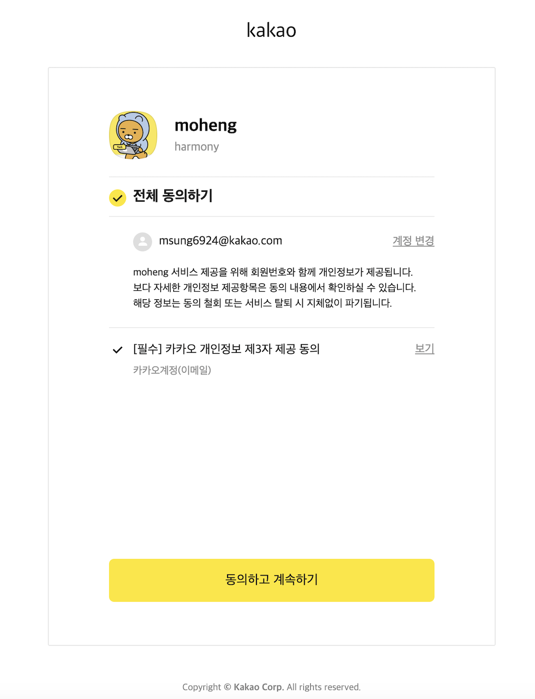
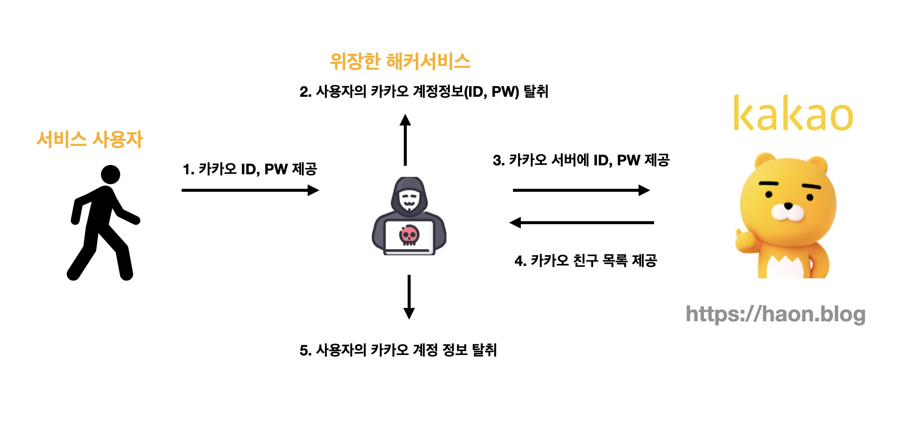
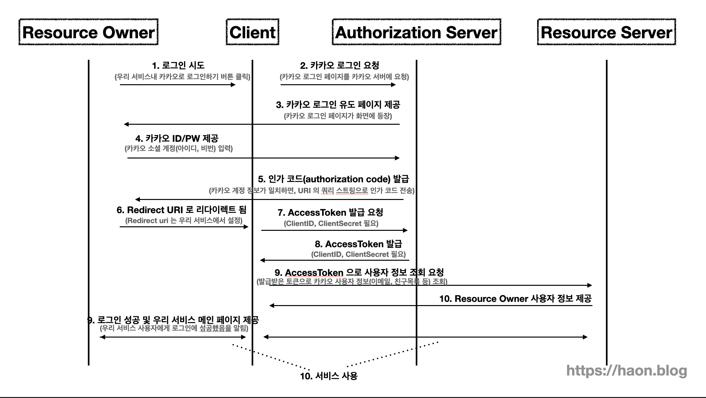

> 💡 현재 포스트는 harmony 팀 크루 [하온](https://github.com/msung99)이 작성했습니다.

## OAuth 와 소셜 로그인

웹 서핑을 하다보면 구글, 페이스북, 카카오, 트위터등의 외부 소셜 계정을 기반으로 간편한 회원가입 및 로그인할 수 있는 서비스를 찾아볼 수 있다. 클릭 한번으로 간편히 로그인할 수 있고, 연동되는 외부 소셜 서비스(카카오, 페이스북 등)에서 제공하는 기능을 간편하게 연동하고 사용할 수 있다는 장점이 있다. 예를들어, 카카오 게임즈내 게임 서비스를 사용하고 싶다면, 간편히 카카오 소셜 로그인하여 연동된 카카오 계정의 친구 목록, 프로필 정보를 가져와 사용할 수 있다.

이러한 소셜 로그인에 사용되는 프로토콜이 바로 OAuth 다. OAuth 는 아래와 같이 정의하고 있다.

> OAuth 는 인터넷 사용자들이 비밀번호를 제공하지 않고 다른 웹 사이트 상의 자신들의 정보에 대해 웹 사이트나 애플리케이션의 접근 권한을 부여할 수 있는 공통적인 수단으로써 사용되는, 접근 위임을 위한 개방형 표준이다. - 위키백과 -

우리 하모니 팀이 개발중인 moheng 서버스를 기반으로 비유해보겠다. 외부 애플리케이션(moheng) 은 사용자 인증을 위해 카카오등의 사용자 인증 방식을 사용한다. 이때, OAuth 를 바탕으로 제 3자 서비스(카카오) 의 특정 자원(친구 목록, 생년월일 등) 을 접근 및 사용할 수 있는 권한을 인가받게 된다.

## OAuth 의 등장배경

그런데 소셜 로그인을 사용하면서도 항상 신기한점이 하나 있다. 일반 회원가입을 할 때와 달리, 소셜 로그인은 서비스 이용자로부터 아이디, 비밀번호를 요구하지 않는다. 단순히 버튼 클릭만으로 로그인에 성공하고, 회원 정보를 불러온다. 이런 방식에서 어떻게 쉽게 로그인하여 권한을 인증받고, 사용자 정보를 불러올 수 있을까? 이를 이해하려면 OAuth 의 등장배경을 이해해야한다. 또한 이 등장배경을 이해하면, 지금까지 우리는 어떻게 OAuth 프로토콜을 통해 안전한 인증 방법으로 서비스를 사용했는지 이해할 수 있다.

### OAuth 1.0 의 등장

앞서 서술했듯이, OAuth 등장 이전 소셜 로그인의 필요성은 자명했다. 구글, 카카오, 페이스북등 다양한 소셜 서비스에서 제공하는 서비스와 연동하여 사용할 수 있는 외부 서비스들이 등장하기 시작했고, 이 떄문에 소셜 제공처가 보유한 자원을 사용할 수 있는 인가(Authorziation) 를 받는 과정이 필요해졌다. 

### 제 3자에게 민감한 정보를 내주기란 쉽지 않다

이를 위해 가장 쉬운 방법은, 우리의 서비스에서 사용자로부터 소셜 계정(카카오 등) 아이디, 비밀번호를 입력받고, 카카오 서버에 이 카카오 계정 정보를 넘겨서 소셜 자원(카카오 친구 목록 등) 을 넘겨받는 것이다. 

하지만, 이런 방법은 과연 안전할까? 사용자들은 처음보는 우리 서비스를 믿고 카카오 아이디, 비밀번호를 넘겨주는 것이 바람직한가? 우리가 개발한 사이트가 보안에 취약하다면 어떻게 하는가? 또한 만든 서비스가 일반 개발자가 아닌, 해커가 만든 서비스일 수도 있다. 

이는 소셜 로그인 제공처(카카오, 구글 등) 에게도 큰 부담이다. 어떤 서비스인지 모르는 출처에게 사용자의 민감한 정보를 내주기란 큰 부담이 될 것이다. 즉, 소셜 제공처는 사용자의 민감한 정보를 제 3자인 우리 서비스에게 함부로 제공해주기란 난처하다.

이 떄문에 OAuth 프로토콜이 등장했다. 더 정확히는 OAuth 1.0 이 표준화되기 이전의 각 회사에서 개발한 프로토콜이 등장했다. 구글에서는 AuthSub 라는 프로토콜을 개발하기도 했다. 하지만 이 방식은 표준화되지 않은 방식이므로, 소셜 제공처와 연동하는 제 3자 서비스들에게 불편함을 주었다. 구글과 연동하는 서비스를 위해선 AuthSub 프토로콜을, 카카오와 연동하는 서비스를 위해선 또 다른 프로토콜을 사용해야했다. 이는 유지보수 비용이 높아지는 문제를 야기했다.

이를 위해 OAuth 1.0 프로토콜이 등장했다. OAuth 1.0 프로토콜은 각 소셜 제공처에서 각기 다르게 제공하는 프토토콜을 하나의 표준으로 통합한 표준 프토토콜이다. 1.0 이후 1.0a 버전이 등장했으나 모바일 앱에서 보안에 취약한 문제점이 있었다. 이를 또 보완하고, 기존 버전보다 더 단순화시켜 등장한 버전이 바로 현재 우리가 사용중인 OAuth 2.0 프로토콜이다.

## OAuth 2.0 참여자

OAuth 프로토콜 사이에서 사용하는 협력하는 참여자들을 일반화시킨 용어가 존재한다. 예를들어 앞선 카카오, 페이스북 등의 소셜 제공처를 일반화된 용어로는 Authorization Server 라고 부르는데, 이에 대해 학습해보도록 한다.

### Resource Owner

말그대로 리소스(자원) 보유한 사용자다. 예를들어, 카카오톡을 사용한다면 카카오톡 대화 내용(리소스) 를 보유한 일반 사용자들이 이에 해당한다. 즉, 우리의 서비스와 연동할 외부 소셜 제공처(카카오) 등의 플랫폼에서 데이터(자원)를 보유하고 있는 소유자를 뜻한다.

### Client 

우리가 개발하고 있는 서비스를 뜻한다. 클라이언트라는 용어가 등장하니 Resource Owner 와 햇갈릴 수 있다. 다시 설명하자면, Resource Owner 는 우리가 개발한 서비스의 사용자이며, Client 는 우리가 개발한 서비스 자체를 뜻한다.

### Resource Server (Authorization Server)

Resource Server 란 카카오, 구글 등 소셜 로그인 제공처가 해당된다. 즉, Resource Owner 가 사용하고 있는 해당 서비스의 서버를 뜻한다. Resource Server 는 Resource Owner 를 인증하고, 우리 서비스에게 엑세스 토큰을 발급해준다.

Resource Server 는 Authorization Server 라고도 불린다. 사실 둘은 공식 정의상에 따르면 별개로 구분짓기 하나, 보통의 경우는 같은 맥락이자 동일한 객체로 취급해도 된다. 

엄밀한 정의로는 Authorization Server 는 Client(우리 서비스) 에게 엑세스 토큰을 발급해주는 서버이며, Resource Sever 는 카카오, 구글과 같이 리소스를 가지고 있는 서비스를 뜻한다.

## OAuth 2.0 동작 플로우

서술한 객체들간에 어떻게 협력하여, OAuth 2.0 프로토콜 기능을 원활히 제공하는지 동작을 알아보자. 또한 우리 하모니 팀의 경우 카카오 로그인에 기반하여 OAuth 프로토콜을 사용했으며, Resource Server 를 카카오로 비유하면 이해하기 쉬울 것 같아 카카오를 기준으로 설명해보겠다.

### 1~3. 로그인 시도 및 요청

우리 서비스 사용자인 Resource Owner 가 "카카오 로그인하기" 등의 버튼을 클릭하여 로그인을 시도한다. Client(우리 서비스) 는 해당 요청을 처리하기 위해, 사용자의 브라우저를 카카오 로그인 서버  페이지로 렌더링시킨다. 즉, 사용자 브라우저를 Authorization Server 로 보낸다. 

당연하지만, Authorization Server 의 URI 는 각 Resource Server 마다 정해져있다. 이 URI 를 Authorization Server 의 URI 라고 하여, `Authorization URI` 라고 부른다. 카카오의 경우는 `kauth.kakao.com` 이다. 이 URI 로 Resource Owner 가 이동하도록 유도해야하며, 이 URI 에는 다음과 같은 추가 정보를 쿼리 스트링으로 함께 포함시켜서 이동해야한다.

- `client_id` : 애플리케이션을 생성했을 때 발급받은 Client ID. 카카오의 경우 Kakao Devlopers 에서 생성 및 발급 가능하다.
- `redirect_uri` : 카카오 로그인 성공 후 사용자를 리다이렉션 시킬 URI. Kakao Developers 에 `Redirect URI` 사전 등록 해줘야 한다.
- `response_type` : 항상 `code` 라는 값으로 고정시킨다. 이는 카카오 로그인 시도 후 응답받는 데이터 타입이 `인가 코드(Authorization Code)` 임을 표현하는 것이다.
- `scope` : Client(우리 서비스)가 부여받은 리소스 접근 권한으로, 카카오 서버내에 등록된 사용자의 추가 정보(생년월일, 친구목록 등) 이 리소스에 해당한다. 참고로 수집 가능한 리소스는 사용자(Resource Owner) 가 카카오 로그인시 정보 수집에 동의한 항목만 가능하다.

아래는 Authorization URI 예시이다.

~~~java
https://kauth.kakao.com/auth?response_type=code
&client_id=29352735982374239857
&redirect_uri=https://example-app.com/callback
&scope=~(생략)
~~~

### 4. 카카오 ID, PW 입력

앞선 과정을 통해 Client(우리 서비스) 가 사용자를 Authorization URI (+ 추가 쿼리 스트링) 로 이동시켰다. 이 단계에선 Resource Owner(사용자) 에게 카카오 로그인 화면이 보일것이니, 사용자는 카카오 계정 아이디, 비밀번호를 입력하여 로그인을 시도한다.

### 5~6. 인가 코드 발급 및 우리 서비스 내 Redirect URI 로 리다이렉트

카카오 계정 ID, PW 를 입력하여 로그인에 성공했다면, Authorization Server 는 우리가 등록해둔 Redirect URI 로 사용자를 리다이렉션 시킨다. 

> 💡 Redirect URI 를 Authorization Server 가 알고 있어야지 해당 URI 로 사용자를 리다이렉션 시켜주므로, 이 URI 또한 Kakao Developers 에 미리 등록되어 있어야 한다.

이때, Redirect URI 에 그냥 리다이렉션 시키는 것이 아니라, Redrirect URI 에 쿼리 스트링으로 `인가 코드(Authorization Code)` 를 포함하여 사용자를 리다이렉션 시킨다. 인가 코드란 Client(우리 서비스) 가 Authorization Server 로 부터 AccessToken 을 획득하기 위해 사용하는 임시 코드다. 수명이 보통 1~10분 정도로 매우 짧다는 것이 특징이다.

### 7~8. 발급받은 인가 코드와 AccessToken 을 교환

Client(우리 서비스) 는 Authorization Server 에게 인가 코드를 전송하고, 응답으로 AccessToken 를 전달받는다. Client 는 이 발급받은 AccessToken 으로 Resource Server 내의 사용자 정보를 조회할 권한을 얻는다. 즉, 발급받은 AccessToken 을 카카오 Resource Server 에 전송하여 카카오 사용자 정보(이메일, 생년월일, 친구 목록 등) 를 가져올 수 있게된다.

### 9~10. AccessToken 과 사용자 정보를 교환

Client 는 발급받은 AccessToken 을 Resource Owner 에 요청하여, 사용자 정보를 조회할 수 있다. 이렇게 조회한 사용자 정보를 우리 서비스내 데이터베이스에 저장하면 될 것이다. 또한 데이터베이스에 저장했다면, 우리 서비스내 JWT 토큰(엑세스, 리프레시) 토큰 또한 자체적으로 발급 및 저장하여 인증/인가 시스템을 구축하면 된다. 

> 💡 엑세스 토큰, 리프레시 토큰에 대한 이론은 [RefeshToken 은 AccessToken 의 문제점을 해결하기위해 등장했다](https://haon.blog/spring/access-refresh-token/) 을 참고하자. 

### 11. 로그인 성공 및 메인 페이지로 이동

모든 과정을 성공적으로 마쳤다면 사용자의 브라우저를 우리 서비스내 메인 페이지로 이동시켜주자. 이렇게 OAuth 2.0 프로토콜 기반 플로우는 끝이난다.

## Authorization Code 는 왜 필요할까?

앞선 플로우에서 봤듯이, Rediect URI 의 쿼리 스트링으로 인가 코드를 전달받고, 이 인가 코드로 엑세스 토큰을 발급받아야 한다. 인가 코드는 왜 필요할까? 인가 코드 발급 과정을 생략하고, 곧 바로 엑세스 토큰을 발급받아서 카카오 회원 정보를 불러오면 안될까?

이 과정이 생략되면, Authorization Server 가 엑세스 토큰을 Client(우리 서비스) 에게 전달하기 위해서 URI 의 쿼리 스트링에 엑세스 토큰 값을 실어서 전달해야 한다. **브라우저의 URI 에 중요한 정보인 엑세스 토큰이 노출되는 것은 보안상 매우 위험하다.** (이때, Redirect URI 를 통해 데이터를 전달할 방법은 아쉽게도 URI 자체에 쿼리 스트링으로 담아서 전송하는 방법밖에 존재하지 않는다.) 이런 보안 위험 떄문에 인가 코드를 사용한다.

## Authorization URI 는 누가 생성하는가?

추가적으로 프론트엔드와 백엔드의 역할을 정리해보겠다. 우선 앞선 1~3 과정에 학습했듯이, Authorization URI 에는 추가 정보를 실어서 새로운 Authorizaion URI 를 생성해야한다. 이 URI 는 어디서 생성해도 괜찮다. 우리 하모니 팀의 경우, 한쪽에서 처리하는게 편리하다고 판단 했기 떄문에 백엔드에서 처리하도록 구현했다.

## Redirect URI 는 어디로 설정하는가?

다음은 Redirect URI 이다. 사용자는 로그인을 마치면 Redirect URI 로 리다이렉션 될텐데, 이 리다이렉션 될 URI 는 백엔드가 아닌 프론트엔드로 설정한다. 이후 프론트엔드는 백엔드에게 인가 코드를 전송한다. 백엔드는 전달받은 인가 코드로 엑세스 토큰을 발급받고, 이어서 Resource Server 로 부터 소셜 계정 정보(이메일, 생년월일, 친구목록 등) 을 제공받는다.

## 참고

- https://www.youtube.com/watch?v=BotXDfBPvDA
- https://tecoble.techcourse.co.kr/post/2021-07-10-understanding-oauth/
- https://haesummy.tistory.com/entry/OAuth-20%EC%9D%B4%EB%9E%80-%EB%8F%99%EC%9E%91-%EB%B0%A9%EC%8B%9D%EC%9D%80