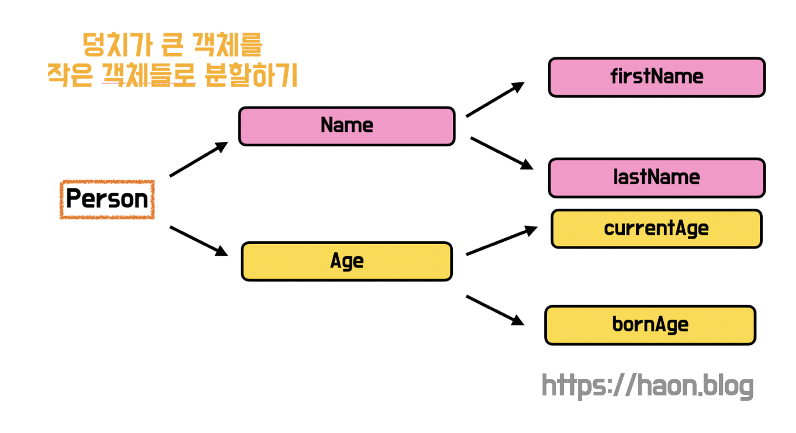

> 💡 현재 포스트는 harmony 팀 크루 [하온](https://github.com/msung99)이 작성했습니다.

우리 팀이 가장 중요하게 생각하는 것 중 하나가 `테스트` 와 `객체지향` 이다. 테스트와 객체지향은 견고한 애플리케이션을 만들기 위한 진정한 설계원칙이다. **객체지향 프로그래밍을 통해 각 컴포넌트간 역할과 책임을 명확히 수립하고, 그 역할과 책임을 완벽히 수행하는지에 대해 테스트로 검증해야한다.** 이 떄문에 우리 하모니 팀 또한 객체지향적인 코드를 만들기위해 많은 고민을 쏟아붓는다.

그런데, 과연 우리 팀의 코드는 정말 객체지향 프로그래밍이 수행되는 것일까? 유지.보수가 손쉬운 프로덕션 코드를 개발하고 있을까? 이 의구심이 잠시 들때 객체지향 생활체조 원칙을 잘 준수하고 있는지에 대해 회고할 필요가 있음을 느꼈다.

객체지향 생활체조 원칙은 이미 우리 팀에서 자주 언급된 원칙이다. 이 원칙에서 지침하는 프로그래밍 원칙을 준수하고, 안티패턴을 지양하고자 한다. **객체지향 생활체조 원칙에서 권장하는 훈련 지침은 무엇이 있는가? 또한 각 원칙 사항이 어떠한 문제 상황을 제거하기 위해 만들어진 지침일까?** 우리 팀은 생활체조 원칙을 왜 지켜야하는지에 대한 당위성을 확보하고, 원칙에 담겨있는 숨겨진 의미를 이해하고자 한다. 높은 이해도와 함께 객체지향 생활체조 원칙을 준수하기 위해, 그리고 팀원들에게 지식을 공유하고자 이번 포스트를 작성해본다 🙂

## 원칙1. 한 메서드에 오직 한 단계의 들여쓰기만 한다.

> "함수는 한 가지 일을 수행해야한다. 그 한가지만을 잘 해야한다. - Clean Code

~~~java
public String getLines() {
  StringBuilder stringBuilder = new StringBuilder();
  for(int i=0; i<10; i++) {
    for(int j=0; j<5; j++) {
      stringBuilder.append("one");
    }
      stringBuilder.append("two");
  }
  return stringBuilder.toString();
}
~~~

한 메소드에 들여쓰기가 여럿 존재한다면, 해당 메소드는 여러가지 일을 수행한다고 봐도 무방하다. 메소드는 본인이 맡은 역할이 적을수록(잘개 쪼갤수록) 재사용성이 높고 디버깅도 유용하다. **즉, 코드의 들여쓰기와 중첩 구조가 깊어질수록 가독성이 저하되므로, 들여쓰기는 최소화하는 것이 좋다.**

### 메소드 추출 기법(Extract Method)

위와 같은 함수의 구조는 아래와 같이 개선할 수 있다. 소트웍스 앤솔로지 책에서 소개한 "메소드 추출" 기법을 활용하면 가독성이 개섢된다. 메소드 추출은 코드의 일부분을 메소드로 분리하여, 코드의 복잡도를 낮추는 기법이다.

~~~java
public String getLines(){
  StringBuilder stringBuilder = new StringBuilder();
  repeatPrint(stringBuilder);
  return stringBuilder.toString();
}

private void repeatRows(StringBuilder stringBuilder){
  for(int i=0; i<10; i++){
    repeatRow(stringBuilder);
    stringBuilder.append("two");
  }
}

private void repeatRow(StringBuilder stringBuilder){
  for(int i=0; i<5; i++){
    stringBuilder.append("one");
  }
~~~

### 원칙2. else 키워드를 사용하지 않는다. (Early Pattern 을 지향할 것)

필자도 객체지향 프로그래밍을 중요성을 깨닫지 못했던 시절, else 문을 정말 많이 사용해왔다. else 문이 있어야지 완벽한 로직 처리가 완성될 것이라 생각했지만, 이는 큰 오산이었다. 우리는 else 키워드를 사용하지 않고도 분기처리 코드를 충분히 작성할 수 있다.

이 원칙은 앞선 **원칙1. 한 메소드에 오직 한 단계의 들여쓰기만 한다** 내용과도 일맥상통한다. **else 문을 남용하면 중첩된 여러 조건문이 작성되고, 이로인해 인텐트(들여쓰기) 의 깊이가 늘어날 수 있다. 즉, Arrow Anti Pattern 을 유발하는 사례까 된다.**

~~~java
public int printPriceStatus(int price){
  if(price < 1000){
    return 0;
  } else {
    if(price < 5000) {
      return 1;
    } else {
      if(price < 10000) {
            return 2;
      } else {
          return 3;
      }
    }
  }
}
~~~

위 코드는 파악하기 쉬운가? 중복되는 코드, 인텐트 깊이가 최소 4는 훌쩍 넘어보인다. 동작을 한 눈에 파악하기 힘들다. else 문을 남발함으로 인해 Arrow 안티패턴이 발생하여, 또 다시 중첩된 코드를 생선하여 인텐드가 더 깊어질 구조로 만들어질 것 같은 구조가 되었다. 중첩 구조가 깊어지니, 특정 if 절에 대한 else 문을 찾기 힘들어지기도 하다.

### Early Pattern

else 문을 남발하여 깊어진 인텐트 구조는 `Early Pattern` 을 적용하여 해겷 ㅏㄹ 수 있다. `Early Pattern` 이란 조건문내의 조건이 일치하면 그 즉시 리턴하는 디자인패턴이다.

~~~java
public int printPriceStatus(int price){
  if(price < 1000){
    return 0;
  }

  else if(price < 5000){
    return 1;
  }

  else if(price < 10000){
    return 2;
  }

  return 3; // 보호절(Guard Clause)
}
~~~

그런데 의문점이 하나 생긴다. else 문을 사용했을 땐 일반 케이스를 벗어난 부분에 대해 처리할 수 있었는데, else 문을 사용하지 않을 경우 이 부분을 어떻게 해결할까? 이는 `보호 구문(Guard Clause)` 을 생성하여 해결 가능하다. `보호 구문(Guard Clause)`, **즉 보호 절이란 if 문에서 일반적인 케이스로 처리가 되지 못하고 유효하지 않은 기타 예외처리 상황에 대해 처리해주는 구문을 뜻한다.**

### 다형성(Polymorphism) 기반의 디자인패턴

위처럼 간단한 경우는 `보호 절` 을 사용하면 충분하나, 객체지향 프로그래밍의 다형성을 활용하는 방법도 존재한다. 다형성을 활용하는 예로 [전략 패턴(Strategy Pattern)](https://haon.blog/java/strategy-pattern/) 이나 널 객체 패턴(Null Obect Pattern) 활용을 해볼 수 있다.

## 원칙3. 모든 원시값과 문자열을 포장(Wrap)한다. (VO 로 변환할 것)

원시타입 데이터는 그 자체만으로 아무런 의미를 가지고 있지 않다. 원시값에 대한 의미를 변수명으로 추론하는 것도 한계가 존재하기 떄문에, 실수를 범할 가능성이 크다. 

~~~java
public class Order {
  private int money;
  private int distance;

  public Order(final int money, final int distance) {
    this.money = money;
    this.distance = distance;
  }

  // ...
}
~~~

그리고 아래처럼 주문정보 오브젝트가 생성된다고 해보자. 주문 가격을 30만원이고, 배달거리는 1km 를 뜻하는 주문정보가 될 것이다.

~~~java
Order order = new Order(300000, 1);
~~~

반면 실수로 개발자가 로직을 잘못 서례하여 파라미터의 순서를 잘못 고려하여 값을 주입했다고 해보자. 아래 주문정보는 가격이 1원이며, 배달거리느 무려 300,000km 를 뜻하게 된다. 맙소사. 값 주입 로직을 잘못했더니 괴상한 주문 정보가 생성되었다. 이를 어찌할까?

~~~java
Order order = new Order(1, 3000000);
~~~

### 원시타입에 대한 집착

위와 같은 실수를 범하게되는 주 원인은 무엇일까? 우선 money 와 distance 필드는 모두 int 라는 동일한 원시타입으로 선안되었다. 따라서 이 필드들을 구분할 수 있는것은 오로지 변수명에만 의존하게 된다. 비슷한 이유로, 생성자의 파라미터 순서에만 의존하여 필드주입을 시도한다. 이렇게 **도메인 오브젝트를 표현시 원시타입만을 사용하여 표현하는 것을 원시타입에 대한 집착(Primitive Obession) 안티패턴** 이라고 한다.

### 원시타입을 VO(Value Object) 로 감싸기 (Wrapping)

이 때문에 원시타입을 감싸야한다. 위 코드는 아래와 같이 개선할 수 있다. **윈시 값을 도메인 클래스로 감싸서** `VO(Value Object)` **로 재표현할 수 있으며, 이로써 원시 값에 대해 명확한 의미가 부여되고, 올바른 예외처리 및 비즈니스 검증이 가능해진다.** 기존의 돈, 거리 값과 관련한 비즈니스 검증 및 로직을 모두 Order 클래스 내에서 도맡에 수행했지만, 각 역할과 책임을 세분화하고 Money, Distance 에게 적절히 인가했다.

~~~java
public class Order {
  private Money money;
  private Distance distance;

  public Order(final Money money, final Distance distance) {
    this.money = money;
    this.distance = distance;
  }
   // ...
}

public class Money {
  private int money;

  public Money(int money) {
    validateInput(money);
    this.money = money;
  }
  // ...
}

public class Distance {
  private int distance;

  public Distance(int distance) {
    validateInput(distance);
    this.distance = distance;
  }
  // ...
}
~~~

이 원칙은 추후 설명할 **원칙8. 일급 컬렉션을 사용한다** 와도 매우 유사한 원리이자 규칙입니다.

## 원칙4. 한 줄에 점을 하나만 찍는다. (디미터 법칙)

앞선 주문 정보 Order 클래스에 대한 금액인 Money 를 조회하고 싶다면 아래와 같이 조회할 수 있을 것이다.

~~~java
if(order.getMoney().getValue() > 1000000){
  throw new IllegalArgumentException("백만원 이상의 주문가격은 허용되지 않습니다.");
}
~~~

하지만 위 코드는 문제점을 무엇일까? 바로 **한 줄에 점이 2개이상 찍히면서 결함도가 높아졌다는 점이다.** 위 코드는 Order 뿐만 아니라 Money 에 대한 의존성도 동시에 갖게 되었다. 만약 Order 와 Money 중에 변동사항이 생길 경우, 그 파급력은 객체 모두에게 끼칠 수 있다.

### 디미터 법칙

> 디미터 법칙(Demeter Law) : 낯선 이와 대화하지 말고, 친구하고만 대화하라

이번 4번째 원칙은 디미터 법칙을 풀어쓴 것이라고 볼 수 있다. **즉, 본인이 소유한 객체, 본인이 생성한 객체, 그리고 누군가 준(파라미터로) 객체에만 메세지를 전송해야함을 뜻한다.** 그렇지 않을겨웅, 다른 객체에 너무 깊숙하게 관여하게 되는 것이며 (과한 결합도가 생긴다), 이는 객체지향 프로그래밍의 캡슐화를 위반하는 것이다.

위는 아래와 같이 디미터 법칙을 적용하여 해결할 수 있다.

~~~java
if(order.isOverFlowMoney()) {
  throw new IllegalArgumentException("백만원 이상의 주문가격은 허용되지 않습니다.");
}

class Order {
  private Money money;
  // ...
  public boolean isOverFlowMoney(){
     return money.getValue() > 1000000;
  }
}
~~~

점을 하나만 사용하여 코드를 개선했다. Order 의 Money 의 메소드를 호출하는 것이 아니라, Order 에게 직접 질문을 던지는 방식으로 개선했다. 이로써 Order 는 자신이 가지고 있는 객체를 적절히 활용하여 더 능동적으로 행위를 수행하게 되었다.

### 디미터 법칙을 적용하지 않아도 괜찮은 사례

디미터 법칙을 위반해도 괜찮은 예외적인 케이스가 일부 존재하는데, `스트림(stream)` **처럼 메소드 체이닝(chaining) 하는 경우는 점을 여러번 사용해도 이미 디미터 법칙을 위반하지 않는다.** 또한 `DTO` 의 경우도 내부 구조를 외부에 유출하는 것을 목적으로 설계되기 떄문에 디미터 법칙을 특별히 적용하지 않는다.

## 원칙5. 줄여쓰지 않는다

메소드, 클래스에 대한 이름을 과도하게 줄인다면 코드의 가독성을 저하시킨다. 짧다고 좋은 것이 아니다. 

축약하고 싶은 욕구가 생기는 이유는 이름이 길기 때문이다. **이름이 긴 이유는 해당 클래스, 메소드가 혼자 너무 많은 일을 수행하기 때문입니다.** 만약 그게 클래스라면 `SRP(단일 책임 원칙)` 을 위반하고 있을 가능성이 크다.

## 원칙6. 모든 엔티티를 작게 유지한다.

**50줄이 넘어가는 클래스 또는 10개 이상의 패키지는 없어야한다는 원칙**이다. 50줄 이상이라면 보통 클래스가 1가지 일만 하지 않기 떄문에, 코드의 가독성은 저하된다. 이는 SRP 원칙을 위반하는 사례로 번질 수 있다.

## 원칙7. 2개를 초과하는 인스턴스 변수를 가진 클래스를 쓰지 않는다.

**인스턴스 변수가 많아질수록 클래스의 응집도가 낮아지는 것을 뜻한다.** 여기서 말하는 인스턴스 변수란 기본 원시타입 또는 컬렉션등을 뜻하지 않을까 싶다. 

다시 풀어쓰자면, **한 클래스에 최대 2개 이하의 인스턴스 변수만 배치해야한다는 원칙이다.** 이를 준수했다면 최대한 클래스를 세분화 및 분리함으로써 각 인스턴스에 대한 높은 응집도를 만들 수 있다는 것이다. 덩치가 큰 객체를 작은 크기의 여러 객체로 분해하면, 자연스레 인스턴스 변수들을 적절히 배치할 수 있을 것이다.

## 원칙8. 일급 컬렉션을 쓴다.

이 원칙은 **원칙3. 모든 원시값과 문자열을 감싼다(Wrap)** 와도 일맥상통하는 원칙이다. 컬렉션도 클래스로 래핑하지 않는다면 의미없는 단순 컬렉션이 될 수 있다. 또한 일급 컬렉션을 사용하면 이곳저곳에 흩어진 비즈니스 로직이 하나의 일급컬렉션 내부에 응집되고, 중복 코드가 최소화된다.

만약 로또 생성기를 통해 로또를 당첨할 경우, 당첨된 로또의 숫자(아이템) 갯수는 최대 7개까지 허용될 것이다. 

~~~java
List<Lotto> lottoItems = new ArrayList();
if(lottoItems.size() >= 8) {
  throw new RunTimeException("당첨 로또의 갯수는 8개 이상일 수 없습니다.");
}
~~~

하지만 위 비즈니스 검증 로직을 서비스 레이어에 배치하자니 여기저기에 비즈니스 검증 로직이 흩어지도, 중복 코드로 여럿 발생할 수 있을 것이다.

### 일급 컬렉션으로 감싸기

단순한 컬렉션을 일급 컬렉션으로 감싸보자.

~~~java
public class LottoItems {
  private final List<Lotto> items;

  public LottoItems(List<Lotto> items) {
    validateSize(items);
    this.items = items;
  }

  private void validateSize(List<Lotto> items) {
    if(items.size() >= 8) {
      throw new RunTimeException("당첨 로또의 갯수는 8개 이상일 수 없습니다.");
    }
  }
  // ...
}
~~~

이곳저곳으로 흩어진 비즈니스 로직을 일급컬렉션이라는 객체 하나에 응집시켰다. 이로인해 관심사가 한 곳으로 응집되고, 중복 코드가 최소화될 것이다.

## 원칙9. Getter, Setter 를 사용하지 않는다. (Tell. Don't Ask)

객체를 더 객체지향으로, 객체답게 활용하려면 **객체가 충분히 혼자서 할 수 있는 작업은 최대한 객체에게 믿고 맡겨야한다는 원칙**이다. 이러한 원칙을 **Tell, Don't Ask (뭍지 말고, 시켜라)** 원칙이라고 한다.

예를들어 아래처럼 Person 이 있고, 그 안에 원시타입의 money 가 있다고해보자. (더 좋은 설계를 위해선 money 를 원시타입이 아닌 Money 라는 클래스로 감싸줘야겠지만, 편의상 원시타입으로 정의했다.)

~~~java
public class Person {
  private final int money;
  // ...

  public int getMoney(){
    return money;
  }
}
~~~

비즈니스 로직상 이 세상엔 0원 이하의 금액을 보유한 사람은 없다고 해보자. 그러면 money 값을 추출해내서 체킹하기 위해선 아래처럼 getter 를 사용하여 값을 가져올 것 이다.

~~~java
int money = person.getMoney();
if(money < 0){
  // ...
}
~~~

**위는 바람직한 코드인가? 그렇지 않다. 위와 같은 코드는 객체의 역할과 책임, 자율성을 무시한 코드다.** 위 코드는 아래처럼 충분히 Person 도메인 객체 내부에서 역할을 수행할 수 있다.

~~~java
public class Person {
  // ...
  public boolean isInvaliBalance(){
    return money < 0;
  }
}

// ...

if(person.isInvalidBalance()){
  // ...
}
~~~

잔고를 체크하는데 Getter 와 Setter 가 필요한가? **객체 상태에 기반한 모든 결정과 행동은 외부가 아닌 객체 내부에서 이루어져야한다. 그것이 진정한 의미의 객체지향 프로그래밍이다.** 

**Getter 와 Setter  남발하면, 불필요한 객체 내부 구현의 노출로 이어지며 이는 곧 응집도 하락과, 캡슐화의 위반으로 이어진다.** 객체의 자율성을 보장하고 능동적으로 행동할 수 있도록 설계하도록 훈련해보자.

## 우리 팀은 객체지향 생활체조 원칙을 준수하고 있는가?

우리 팀은 그래서 객체지향 생활체조 원칙을 준수하고 있을까? 진정한 의미의 객체지향 프로그래밍을 위한 충분한 코드를 작성했는가? 필자는 우리 팀이 잘 준수한점과, 아직 개선해야 할점은 아래와 같다고 생각이 든다.

### 잘한점

- `(1)` 객체지향 프로그래밍의 근본이자 핵심인 "역할과 책임" 을 명확히 구분지어 살아 숨쉬는 코드를 만들고자  꾸준히 리팩토링중에 있다.
- `(2)` 전략패턴, 싱글톤 디자인패턴을 원활히 활용하여 더 유지.보수에 용이한 코드를 개발하고 있다.
- `(3)` 9가지 원칙 중 대부분의 원칙을 준수하며 비즈니스 로직을 작성했다. (else 미사용,  줄여쓰지 않기, ... 등)

### 아직 아쉬운 점

- `(1)` 생각보다 지켜지지 않는 생활체조 원칙들이 있다. 
- `(2)` 원시타입을 VO 로 Wrapping 하지 않은 코드들이 일부 존재하며, 디미터 법칙을 위반한 사례가 간혹 존재한다. 
- `(3)` 특히 Getter 와 Setter 사용을 최대한 지양하고자 했으나, Getter 의 경우 사용을 피할 수 없었다. POJO 프로그래밍을 지향하고 Getter 사용을 최대한 피하기 위해 Lombok 어노테이션을 사용하지 않았으나, 그럼에도 Getter 의 사용을 피하지 못한 코드들이 존재한다.

최대한 객체지향 생활체조 원칙을 준수한 코드를 개발하고 있기에 만족스러운 프로덕션 코드를 생산하고 있지만, 아쉬운 점이 넘치고도 넘친다. 머리 밖으로 산발된 생각들을 이번 포스트에서 생각을 정교화했는데, 이번 회고를 계기로 더 객체지향적인 프로그래밍을 이어나가도록 해야겠다. 특히 객체의 자율성을 보장하고 능동적으로 행동할 수 있도록 설계하도록 훈련해보자.