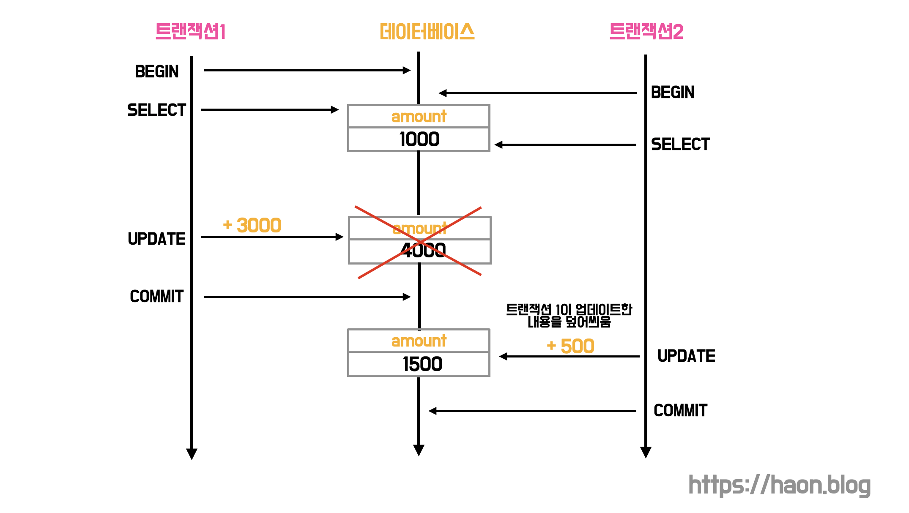

## JPA 낙관적 락, 비관적 락

자바 스프링 기반의 웹 애플리케이션은 기본적으로 멀티 쓰레드 환경에서 구동된다. 따라서 여러 쓰레드가 함께 접근할 수 있는 **공유자원에 대한 경쟁상태(race condintion)** 가 발생하지 않도록 별도의 제어가 필요하다.

자바는 `synchornized` 라는 키워드를 제공해, **모니터 기반으로 상호 배제(mutual exclusion)**	기능을 제공한다. 하지만, 이는 데이터베이스에서 제공하는 락의 종류가 아니다. 일반적으로 웹 애플리케이션에서 공유 자원으로 데이터베이스를 가장 많이 사용하다보니, 데이터베이스에 대한 동시성 문제를 상호 배제를 구현하여 해결한 사례가 많을 뿐이다. 상호배제를 구현한 동시성 제어 방식은 공유 자원 그 자체를 사용하는 특정 `임계 영역(Critial Section)` 에 대해 동시성을 제어하는 것이다.

이와 달리 JPA 낙관적 락과 비관적 락은 데이터베이스에 락을 거는 기법이다. 정확히는, **데이터베이스내의 특정 행(엔티티)에 대한 락을 걸어 무결성을 유지할 수 있게 해주는 동시성 제어 메커니즘을 뜻한다.** 

### 트랜잭션 격리수줁

트랜잭션의 ACID 성질 중 격리성(Isolation)을 더 완벽히 보장하기 위해선 성능상 더 많은 손해를 보게된다. DBMS 에서 각 [트랜잭션 격리수준](https://haon.blog/database/transaction-isolation-level/)을 얼만큼 격상할지에 따라 4단계로 구분하고 있다. 이때 병행성과 격리성은 서로 반비례한다. 병행성이 높은 격리수준에 가까워질수록 격리성이 낮아지기 떄문에, 성능은 매우 빨라지지만 동시성 이슈에 대해 취약해진다. 반대로 병행성이 낮을수록 격리성이 높아지므로 성능은 저하되지만, 격리성이 보장된다.

겉보기엔 트랜잭션 격리수준을 가장 높은 수준으로 올렸을 떄 모든 동시성 이슈가 해결될 것 같아보인다. 성능을 버리고, 동시성에 안전해지고 싶어서 일 것이다. 하지만 이런 트랜잭션 격리수준으로도 해결하지 못하는 경우가 다수 존재한다. 해결되지 않는 대표적인 패턴이 바로 `두 번의 갱실 분실 문제(Second Lost Updates Problem)` 인데, 이와 관련한 내용은 아래에서 학습해보도록 한다.

혼동하지 말아야할점은, 트랜잭션 격리수준은 동시 접근을 제어하기 위해 등장한 개념이 아니라는 점이다. **트랜잭션 격리수준은 한 트랜잭션이 시작된 뒤 끝날 떄 까지 항상 일관된 데이터 값을 읽어오기 위해 적용**하는 것이다. 즉, 격리수준이 높을수록 트랜잭션 수행동안 연산을 처리하는 데이터가 변하지 않음을 보장할 수 있다. 반대로 격리수준이 낮다면 연산 처리중인 데이터가 도중에 변할 가능성이 크다. 격리수준이 낮다면 그 만큼 다른 트랜잭션이 개입하여 데이터의 일관성을 해칠 위험이 커진다. 정의 그대로 트랜잭션간의 고립성 수준을 설정하는 것이다.

반면 **JPA 락 메커니즘은 특정 엔티티에 대한 동시 접근을 제어하기 위해 사용한다.** 트랜잭션 격리수준이 모든 트랜잭션간의 고립성 수준을 제어하는 것이라면, JPA 락 메커니즘은 특정 엔티티에 접근하는 소수의 트랜잭션에 대해서만 격리하고, 동시 접근을 막는 것이다. 

## Second Lost Updates Problem (두 번의 갱신 분실 문제)

왜 트랜잭션 격리수준만으로는 동시성 이슈를 해결할 수 없을까? 격리수준을 높이면 결국 트랜잭션간의 고립성을 높일 수 있으므로, 절대적인 동시성 제어가 가능하지 않을까? 하지만 격리수준은 앞서 설명했듯이 동시성 제어를 위한 것이 아니다. 동시성 이슈에 민감한 송금 관련 트랜잭션을 예시로 들어보겠다.

통장에 잔고가 1000원 있는 상황이다. 트랜잭션1이 트랜잭션2 보다 먼저 시작되었다. 트랜잭션1은 잔액 1000원을 읽어오고, 근소한 차이로 다음에 트랜잭션2 도 잔액 1000원을 읽어온다. 이어서 트랜잭션1이 잔고에 3000원을 입금하여 총 잔액을 4000원으로 업데이트하고 커밋한다. 또 이어서 트랜잭션2가 잔고에 500원을 입금할여 잔액을 입금한다. 우리의 기대라면 잔액이 1000 + 3000 + 500 = 4500원이 되어야한다. 하지만, 트랜잭션1의 입금 내역은 분실된다. 

만약 이 문제를 트랜잭션 격리수준으로 해결하고 싶다면 어떻게 해야할까? 우선 MySQL 에서 기본적으로 제공하는 `REPREATABLE READ` 로는 해결될까? 이 격리수준은 트랜잭션이 완료될 떄 까지 SELECT 쿼리가 사용되는 모든 데이터에 `s-lock(공유 락)` 을 거는 수준이다. 즉, 조회한 데이터가 트랜잭션을 실행하는 동안 일관된 값을 읽어오는 정도의 수준을 제공한다. 하지만 이 격리수준에선 위 문제를 여전히 해결할 수 없다. 

이 이상의 격리수준으로 `SERIALIZABLE` 을 설정하면 해결될까? `SERIALIZABLE` 은 한 트랜잭션에서 사용되고 있는 데이터에 다른 트랜잭션에서 절대적으로 접근 할 수 없는 격리수준이다. 즉, 트랜잭션이 사용중인 테이블의 모든 행을 다른 트랜잭션이 접근할 수 없도록 잠그는 `x-lock(베타 락)` 이 수행된다. 또한 MySQL 기준으로 `SERIALIZABLE` 은 읽기 작업을 하는 데이터에 대해서도 `s-lock` 을 건다. 

위 상황의 경우 두 트랜잭션이 같은 데이터에 대해 `s-lock`을 걸고 그 직후 서로 `x-lock`을 거는 상황이 연출되는데, 이 경우 데드락이 발생한다. `s-lock`과 `x-lock`은 양립할 수 없기 때문이다. 두 트랜잭션은 `x-lock`을 걸기 위해 서로가 `s-lock`을 해제하는 시점을 무한히 대기하며 타임아웃 될 것이다. 결국 데드락으로 인해 동시성 이슈 해결은 불가능하다.

또한 `SERIALIZABLE` 격리수준은 락을 획득하지 않아도 되는, 락 획득과 전혀 관련없는 `SELECT` 절을 포함한 다른 트랜잭션들 모두가 락을 획득하기 위해 대기하는 문제가 발생한다. 이 떄문에 락을 걸어 동시성 제어가 필요한 기능들 외의 다른 모든 기능들에 성능 저하가 발생한다.

위와 같이 2개의 트랜잭션에서 동일한 데이터를 변경할 경우 마지막으로 커밋된 내용만이 인정되고, 먼저 커밋된 내용이 분실되는 문제를 **두번의 갱신 분실 문제 (second lost updates problem)** 라고 부른다. 이와 같이 두번의 갱신 분실 문제와 같은 경우 트랜잭션으로 처리할 수 있는 범위를 넘어선다. 따라서 별도의 방법이 필요하다.

## 낙관적 락 (Optimistic Lock)

앞서 설명했듯이 **JPA 락 메커니즘은 특정 엔티티에 대한 동시 접근을 제어하기 위해 사용한다.** 이 JPA 메커니즘에는 낙관적 락과 비관적 락이 존재한다. 그 중 낙관적 락은 **대부분의 트랜잭션이 충돌(동시성) 이 발생하지 않을 것이라고 낙관적으로 가정하는 방법이다.** 따라서 데이터베이스가 제공하는 락 기능을 사용하지 않고, 엔티티의 버전 값을 관리하며 동시성을 제어한다. (앞서 이해를 돕기위해 JPA 락 메커니즘은 데이터베이스 특정 행에 락을 거는 것이라 설명했지만, 사실 낙관적 락은 그렇지 않다.)

### @Version

엔티티의 버전을 관리하기 위해 특정 필드에 `@Version` 을 적용한다. 적용 가능한 타입은 숫자 타입, 즉 `Long`, `Integer`, `Short`, `Timestamp` 등이 존재한다. 

~~~java
@Entity
public class Amount {
  @Id
  @GeneratedValue(strategy = GenerationType.IDENTITY)
  private Long id;

  private Long remain;

  @Version
  private Integer version; // 버전 관리 필드
}
~~~

Board 엔티티에 변경 사항이 발생할 때 마다 버전 필드의 값이 1씩 증가한다. 

### 변경 감지를 어떻게 할까?

엔티티에 변경사항을 반영하기 위해 트랜잭션을 커밋할 떄, 영속성 컨텍스트를 Flush 하면서 아래와 같이 version 값을 포함한 `UPDATE` 쿼리를 날린다.

~~~java
UPDATE AMOUNT 
SET
  remain = ?,
  version = ? # 기존 버전값 에서 1증가 시킴
WHERE
  id = ?,
  and version = ? # 기존 버전 값으로 엔티티를 찾음
~~~

위처럼 엔티티의 버전 값을 1 증가시키고, `WHERE` 절에서 엔티티 조회 시점의 버전으로 데이터를 찾는다. 만약 엔티티가 그 사이에 다른 트랜잭션에 의해 수정되었다면, 그 다른 트랜잭션이 이미 기존 버전 값을 1증가시켰을 것이므로 `WHERE` 문을 통해 엔티티를 찾을 수 없다. 이로 인해 예외가 발생한다.

### 최초 커밋만 인정하기

위와 같이 엔티티의 변경감지를 `version` 필드를 통해 알아낸다. 다른 트랜잭션에 의해 버전 값이 증가했다면 `WHERE` 문으로 찾을 수 없다. 즉, 버전의 불일치가 발생하여 예외가 발생한다. 이는 다시말해, 먼저 커밋된 (버전 값을 먼저 증가시킨) 트랜잭션만을 성공시킨다. 낙관적 락을 사용하면 **최초 커밋만 인정하기** 정책을 구현할 수 있다.

### 낙관적 락의 LockModeType

엔티티의 특정 필드에 version 어노테이션을 명시해줬다면, 아래처럼 추가적인 락 옵션을 통해 다양한 락을 적용시킬 수 있다. 아래와 같이 `@Lock` 어노테이션으로 LockModeType 를 지정할 수 있다.

~~~Java
@Lock(LockModeType.OPTIMISTIC)
Optional<Amount> findById(Long amountId);
~~~

- `NONE` : 별도 락 옵션 지정없이도 엔티티에 `@Version` 을 적용했을 때 수행되는 락 옵션이다. 조회한 엔티티를 수정하는 시점에 다른 트랜잭션에 의해 변경되지 않음을 보장한다. 엔티티를 수정하는 시점에 버전 값을 증가시켜는데, 이때 엔티티 버전이 조회 시점과 다르다면 예외가 발생한다.

- `OPTIMISTIC` : `NONE` 의 경우 엔티티를 수정하는 시점에 버전을 체크하지만, 이 옵션은 엔티티를 조회만 해도 버전을 체크한다. 이로써 엔티티의 조회 시점부터 트랜잭션이 끝날 때 까지 다른 트랜잭션에 의해 변경되지 않음을 보장한다.

- `OPTIMISTIC_FORCE_INCREMENT` : 낙관적 락을 사용하면서 버전 정보를 강제로 증가한다. 엔티티가 물리적으로 변경되지 않았지만, 논리적으로는 변경되었을 경우 버전을 증가하고 싶을 때 사용한다.

## 비관적 락 (Pessimistic Lock)

앞선 낙관적 락은 충돌이 발생하지 않을 것이라고 낙관적으로 가정했다면, **비관적 락은 충돌이 잦을 것이라 발생하고 락을 거는 기법이다.** 낙관적 락은 단순히 Version 필드 값을 체크하는 방식이기에, DB 락을 사용하지 않는다. 반면 비관적 락을 **실제로 데이터베이스 베타 락을 사용하여 엔티티에 대한 동시성을 제어**한다. 마찬가치로 `@Lock` 어노테이션을 사용하여 락을 획득할 수 있다.

~~~java
@Lock(LockModeType.PESSIMISTIC)
Optional<Amount> findByIdForUpdate(Long amountId);
~~~

### 베타 락

[MySQL 8.0 공유 락(Shared Lock) 과 배타 락(Exclusive Lock)](https://haon.blog/database/shared-exclusive-lock/) 에 설명했듯이, 베타 락은 `FOR UPDATE` 를 사용하여 락을 건다. 락을 획득한 현재 트랜잭션만이 읽기와 쓰기 연산이 가능하며, 다른 트랜잭션은 읽기 쓰기 모두 불가능하다. 

~~~sql
SELECT * from amount FOR UPDATE;
~~~

### 데드락에 대한 대처

비관적 락은 베타 락을 사용하기 떄문에 데드락에 빠질 가능성이 높아진다. 만약 두 쓰레드가 서로가 공유 자원을 붙잡고 있고, 상대방이 붙잡고 있는 자원을 획득하길 원하는 경우 데드락에 빠질 위험이 있으니 유의해야한다. 이를 위해 락을 획득하고 있는 최대 시간을 `@QueryHints` 로 저장할 수 있다. 지정한 시간을 초과하면 타임아웃이 발생하고, `PessimisticLockException` 예외를 터뜨린다.

~~~java
    @Lock(LockModeType.PESSIMISTIC_WRITE)
    @QueryHints( {@QueryHint(name = "javax.persistence.lock.timeout", value = "3000")})
    @Query("SELECT a FROM amount a WHERE a.id IN :amountId")
    Optional<Amount> findByIdForUpdate(final Long amountId);
~~~

### 비관적 락의 LockModeType

- `PESSIMISTIC_WRITE` : 비관적 락이라 함은 일반적으로 이 옵션을 뜻한다. `FOR UPDATE` 를 추가하여 베타 락을 건다.
- `PESSIMISTIC_READ` : 데이터를 반복 읽기만 하고 수정하지 않을 떄 사용하며, 잘 사용하지 않는 방법이다. `FOR SHARE` 을 추가하여 락을 건다.
- `PESSIMISTIC_FORCE_INCREMENT` : 비관적 락이지만 유일하게 버전 정보를 사용하며, 버전 정보를 강제로 증가시킨다. `FOR UPDTE NOWAIT` 또는 `FOR UPDATE` 를 추가한다고 한다.

## 참고

- 자바 ORM 표준 JPA 프로그래밍, 김영한
- https://hudi.blog/jpa-concurrency-control-optimistic-lock-and-pessimistic-lock/
- https://expitly.tistory.com/56
- https://mangkyu.tistory.com/299