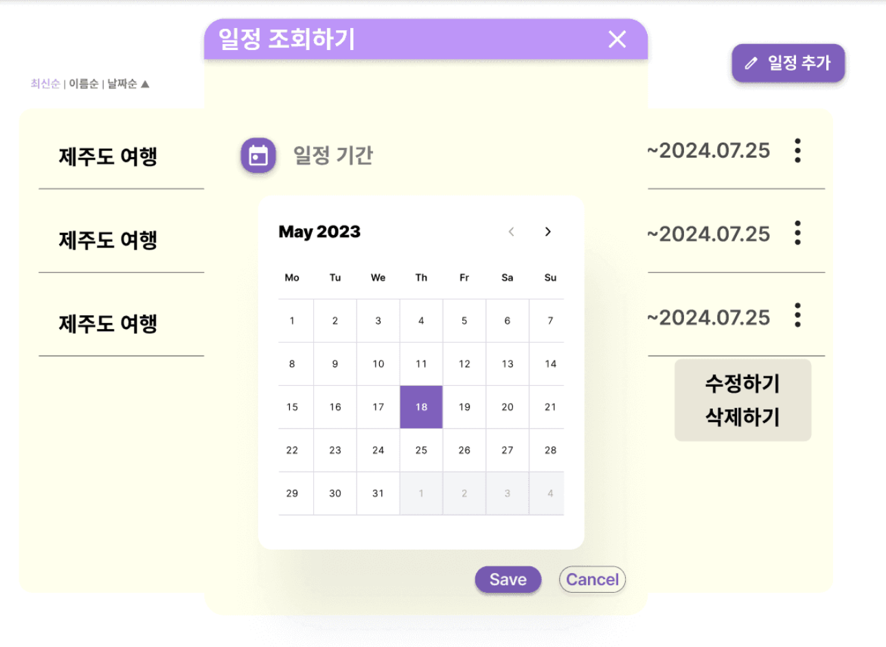
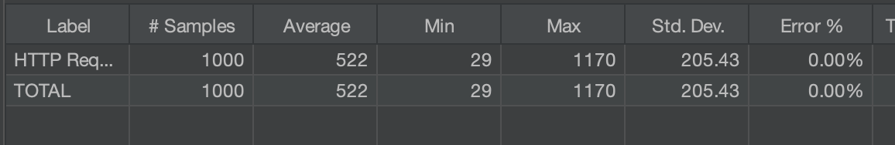
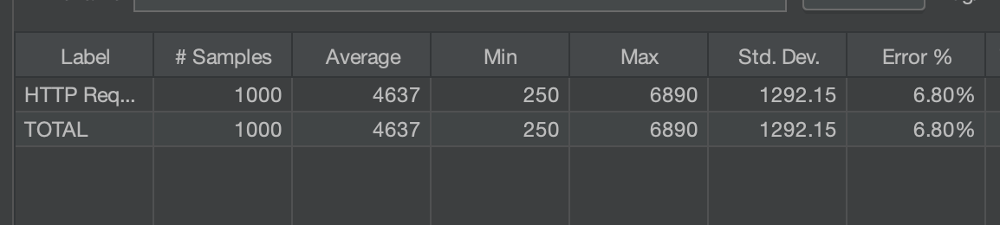
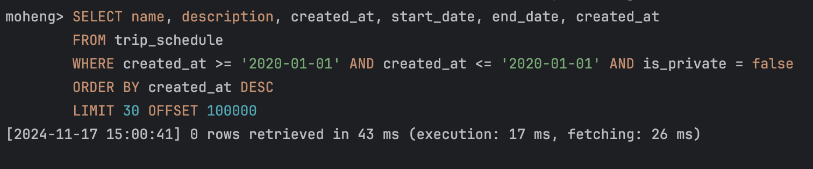

이번 트러블슈팅 해결기는 지난 [MySQL 인덱스 레인지 스캔을 통한 쿼리 성능 개선기](https://kakaotech-harmony.netlify.app/backend/index-range-scan-improvement/) 에 이어지는 내용입니다. 지난 인덱스 적용을 통한 쿼리 성능 개선시 발생한 문제점을 어떻게 또 다시 해결했는지를 다루는 것이므로, 지난 포스팅을 읽고오신다면 이해에 큰 도움이 될 것입니다! 😎

## 문제 상황



지난 [MySQL 인덱스 레인지 스캔을 통한 쿼리 성능 개선기](https://kakaotech-harmony.netlify.app/backend/index-range-scan-improvement/) 에서 향후 출시될 플래너 API 를 위해 인덱스를 생성한 쿼리 튜닝을 시도했습니다. 실제로 그 결과 **약 36.839초**가 걸리던 쿼리를 **약 0.023초**로 크게 감축시키는 성능 개선을 성공적으로 이루어냈죠. 하지만 막상 API 를 테스트해보니, 기대와 달리 쿼리 소요시간이 간혹 길게 측정되는 문제가 발생했습니다.

### 실제 API 호출 응답시간



Jmeter를 사용하여 성능 테스트를 수행한 결과, 저희의 기대처럼 쿼리 튜닝이 적용된 경우에는 실제 API를 요청시 Best Case 에서 29ms 가 측정되었습니다. 또한 100명이 동시 요청시에는 평균 응답속도가 552ms 가 측정되었습니다. 이로보아, 처음에는 스프링 애플리케이션 로직이 인덱스를 제대로 타는 것으로 판단하게 되었습니다.



하지만, 문제는 상황에 따라 위처럼 소요시간이 천차만별이라는 점입니다. Best Case 에서 29ms 라는 매우 빠른 소요시간을 보이던 성능이 간혹 위치럼 긴 Latency 가 발생하고 있습니다. 이 문제는 무엇이 문제였을까요? 이와 관련한 트러블슈팅 해결과 쿼리 성능 개선기를 공유해보고자 합니다 🙂

## 💡 실마리 발견

```sql
SELECT name, description, created_at, start_date, end_date, created_at
FROM trip_schedule
WHERE created_at >= '2020-01-01' AND created_at <= '2020-06-01' AND is_private = false
ORDER BY created_at DESC
LIMIT 30 OFFSET 5000;
```

문제가 발생하는 원인을 찾기위해 이것저것을 여러 방식으로 시도해봤습니다. 단일 인덱스가 아닌 복합 인덱스를 통해 쿼리 성능 개선을 다시 시도해보기도 했고, `BETWEEN` 절에 들어가는 범위의 시작값과 끝값을 늘리고 줄여보면서 원인을 찾아보려고 시도했습니다.

### 🤔 복합 인덱스를 생성하지 않았기 떄문인가...?

처음에는 복합 인덱스를 생성하지 않았기 떄문에 쿼리가 경우에 따라 소요시간이 천차만별인 줄 알았습니다. 지난 쿼리 성능 개선기 포스팅에서 다루었듯이, 저희는 아래처럼 WHERE 절에서 사용하는 `created_at` 에 대해서만 인덱스를 생성했습니다. 복합 인덱스로 생성하지 않았던 이유는 지난번에 자세히 다루었으므로 여기서는 생략합니다.

```sql
SELECT name, description, created_at, start_date, end_date, created_at
FROM trip_schedule
WHERE created_at >= '2020-01-01' AND created_at <= '2020-06-01' AND is_private = false
ORDER BY created_at DESC
LIMIT 30 OFFSET 5000;
```

이번에는 WHERE 절에 사용되는 `is_private` 컬럼에 대해서도 함께 포함시킨 복합 인덱스를 생성하여 쿼리 성능 문제를 해결해보고자 했습니다. `is_private` 컬럼은 카디널리티 수치가 낮기 떄문에 인덱스에 포함시키지 않았던 것인데, 경우에 에따라 인덱스를 운이 좋게 잘 탄다면 성능 개선에 도움되지 않을까라는 기대를 해보았죠.

하지만 이 방법 또한 문제의 원인이 아니였습니다. WHERE 절에 걸린 모든 인덱스에 대한 복합 인덱스를 생성하더라도 성능 개선은 매우 미미한 상태였죠. 대체 무엇이 문제였을까요?

### 🎯 OFFSET 값이 클 때만 발생하는 문제

이렇게 여러 방법을 시도해보던 중 재밌는 점을 하나 발견했습니다. 신기하게도 맨 마지막에 `OFFSET` 에 들어가는 값을 늘렸다가 줄여보니, `OFFSET` 값에 따라서 쿼리 소요시간이 매우 다양하게 측정된다는 점입니다.

만약 `OFFSET` 값이 매우 작다면 앞선 테스트와 같이 50ms 의 소요시간이 측정되기도 했습니다. 반면 `OFFSET` 값이 매우 크다면, MySQL 실행계획을 통해 조회한 결과 지난번과 동일하게 36초가 넘는 소요시간이 비슷하게 측정되기도 하였습니다. 이로보아, 이번 쿼리 성능 저하의 주범은 OFFSET 과 관련이 있겠다는 강한 확신이 들었습니다. OFFSET 값에 따라서, 상황에 따라 테이블 풀 스캔과 비슷하게 쿼리가 인덱스를 잘 타지 않고 수행되고 있다는 강한 느낌이 들었습니다.

### 페이지네이션을 사용하는 플래너 API

`OFFSET` 은 어디서 사용되는 절일까요? 바로 페이지네이션 로직에서 사용되는 쿼리 절이랍니다. 저희 서비스에서 제공하는 플래너 API 는 페이지네이션을 사용합니다. JPA 에서 제공하는 `Pageable` 을 사용하여 URL 쿼리 스트링으로 전달받은 값을 기반으로 `OFFSET` 을 설정하게 되었습니다. 추가적으로 `PageableDefault` 를 사용하여 LIMIT=30 이 쿼리에 나가도록 지정해주었습니다.

```java
@GetMapping("/search/date")
public ResponseEntity<FindPlannerPublicForCreatedAtRangeResponses> findPublicSchedulesForCreatedAtRange(
                                    @Authentication final Accessor accessor,
                                    @RequestBody final FindPublicSchedulesForRangeRequest findPlannerOrderByDateBetweenRequest,
                                    @PageableDefault(size = 30) final Pageable pageable) {
    return ResponseEntity.ok(plannerService.findPublicSchedulesForCreatedAtRange(findPlannerOrderByDateBetweenRequest, pageable));
}
```

위 코드를 보시다시피 플래너 API 는 페이지네이션을 사용하며, 이 페이지네이션 로직은 `OFFSET` 쿼리절을 사용합니다. 실제로 아래와 같이 page 옵션을 뒤에 붙여서 쿼리가 나가도록 동작합니다. 이로써 결국 이번 쿼리 성능 발생 저하의 주범은 페이지네이션을 가능성이 반확정할 수 있었습니다. 왜 대체 페이지네이션이 문제였을까요?

```java
https://ip_address/api/planner/search/date?page=100
```

## 🧵 원인은 페이지네이션 안에 담긴 OFFSET

우리가 보통 **페이지네이션(Pagnation)** 처리를 위해 흔히 사용하는 LIMIT, OFFSET 방식은 어떻게 동작할까요? 페이지네이션은 맨 앞에서부터 순차대로 OFFSET 값 만큼의 모든 ROW 를 읽은 후, LIMIT 값 만큼의 ROW 를 가져오는 방식으로 동작합니다. 따라서 단순한 서비스에서는 성능상 큰 문제가 되지 않습니다. 하지만, 많은 ROW 가 저장되어 있는 상태에서 **OFFSET 값을 매우 크게 설정하면 심각한 성능 저하** 문제가 발생하게 됩니다. 아래 예시를 살펴봅시다.

```sql
SELECT * FROM PERSON WHERE id BETWEEN 1 and 100000 LIMIT 3 OFFSET 10; // (1)
SELECT * FROM PERSON WHERE id BETWEEN 1 and 100000 LIMIT 3 OFFSET 10000; // (2)
```

위 2개의 쿼리는 모두 WHERE 절에서 클러스터링 인덱스가 자동 생성된 PK 값을 통해 범위 탐색을 시도하고 있습니다. 또한 LIMIT, OFFSET 절을 통한 페이지네이션 처리를 시도하고 있죠. 둘의 가장 큰 차이점은 OFFSET 값이 다르다는 점입니다. `(1)` 의 경우 10번째 페이지부터 3개의 데이터를 읽어오기 위해 맨 앞에서부터 10개의 행을 거쳐서 이동해야합니다. 반면 `(2)` 의 경우 맨 앞에서부터 10,000개의 행을 거쳐서 이동해야합니다. 당연하게도, `(1)` 에 비해 `(2)` 가 읽어들이며 이동해야 하는 범위가 매우 크기 떄문에 성능이 더 나쁩니다. 앞서 설명했듯이, 페이징은 맨 앞에서부터 순차대로 모든 행을 읽고난 뒤에, 그제서야 LIMIT 만큼의 행을 가져오는 방식으로 동작하기 떄문이죠.

### Random I/O 가 발생하는 페이지네이션

이전 포스팅에서 다루었듯이, 저희는 `created_at` 에 대해서만 단일 인덱스를 생성하였습니다. 하지만 이렇게 인덱스를 생성할 경우의 문제점은, 커버링 인덱스가 아니기 때문에 **Random I/O** 가 발생한다는 점입니다.

```sql
SELECT name, description, created_at, start_date, end_date, created_at
FROM trip_schedule
WHERE created_at >= '2020-01-01' AND created_at <= '2020-06-01' AND is_private = false
ORDER BY created_at DESC
LIMIT 30 OFFSET 5000;
```

MySQL 의 LIMIT 절의 특성은, LIMIT 절에서 필요한 레코드 건수만 준비되며 즉시 쿼리를 종료한다는 것입니다. 하지만, 커버링 인덱스를 생성하지 않는 일반적인 모든 조회 쿼리는 LIMIT - OFFSET 을 수행할 때 실제 레코드에 접근하는 Random I/O 가 발생합니다. 즉, 커버링 인덱스로 처리할 수 없는 조회 쿼리는 테이블의 실제 레코드를 맨 처음부터 OFFSET 값 만큼의 모든 레코드를 읽어야합니다. 위 쿼리의 경우 5,000건의 실제 레코드를 읽는 Random I/O 가 발생합니다. 그렇게 읽은 5,000건의 데이터는 모두 버리고 마지막 30건만 사용자에게 결과값을 반환하게 됩니다. 즉, **OFFSET의 수치가 커질수록 Random I/O 의 발생횟수는 비례해서 증가**하고, 이 떄문에 상당히 오랜 시간이 걸리게 되는 것입니다.

## 커버링 인덱스 vs 커서 기반 페이징

이를 해결하기 위한 대표적인 2가지 방법이 존재합니다. 하나는 `(1)` 커버링 인덱스를 생성하여 Random I/O 를 제거하는 방식이고, 다른 하나는 `(2)` 커서 기반 페이징 기법을 적용하는 것입니다. 일반적으로 권장하는 방법은 `(2)` 방식읕 커버 기반 페이징 방식입니다. 이 커버 기반 페이징 방식이란 무엇일까요?

### 커버 기반 페이징 (Cursor Based Paging)

커버 기반 페이징 방식이란 `OFFSET` 키워드를 사용하지 않는 것으로, 커서 값을 클라이언트에서 매번 일일이 저장해두었다가 다음 페이지는 가져오는 방식입니다. 아래 코드는 저희의 OFFSET 기반 쿼리문을 커서 기반 페이징으로 변환한 쿼리문입니다.

```sql
SELECT name, description, created_at, start_date, end_date
FROM trip_schedule
WHERE created_at < {커서값}
  AND created_at >= '2020-01-01'
  AND created_at <= '2020-06-01'
  AND is_private = false
ORDER BY created_at DESC
LIMIT 30;
```

가장 변화된 지점은 바로 WHERE 절에 ID 값이 추가되었으며, OFFSET 이 없어졌다는 점입니다. 이렇듯 커서 기반 페이징은 OFFSET 을 제거한 방식입니다. 그 대신에 단점은, 클라이언트에서 매번 일일이 어떤 지점에서부터 또 다시 다음 페이지 데이터들을 읽어들어야 할지 항상 기억하고 있어야한다는 점입니다. 이때 **커서(Cursor)** 란 위처럼 ID 값이 될 것입니다. 커서란 말 그대로 포인터와 같은 것으로, 한번 데이터를 LIMIT 만큼 읽어들인 뒤 또 다시 데이터를 조회하기 위해 그 위치 값을 클라이언트에서 저장하는 방식입니다.

### 😤 커서 기반 페이징을 도입하지 않은 이유

커서 기반 페이징은 정말 좋은 방식입니다. OFFSET 을 사용하지 않기 떄문에 쿼리 성능이 매우 빨라진다는 점이 존재하죠. OFFSET 방식에서는 원하는 소량의 데이터를 읽기 위해 OFFSET 가 커질수록 불필요하게 Random I/O 가 많이 발생한다는 치명적인 문제점이 존재했습니다. 반면, 커서 기반 페이징은 LIMIT 만큼에 대해서만 Random I/O 가 발생하므로, 성능 저하를 우려할 필요가 없죠.

하지만 문제는, 커서 기반 페이징방식은 이전 페이지(커서) 값을 기준으로 다음에 읽어들일 데이터를 페이징하기 떄문에, **특정 페이지로 건너 뛰어서 넘어갈 수 없다는 한계점**이 존재합니다. 즉, 커서 기반 페이징은 **곧 바로 다음 페이지로만 이동 가능하다는 문제점**이 존재합니다. 따라서 무한 스크롤이나 More 버튼이 있는 형태로만 페이징 기능을 사용 가능합니다.

무엇보다 저희 플래너 API 에 사용되는 쿼리에 **커서로 활용될 컬럼으로 어떤 컬럼을 지정할지 모호하다** 는 문제점이 존재합니다. 커서 기반 페이징은 다음에 어떤 페이지를 읽어들일지 알 수 있도록 커서 값을 클라이언트가 저장한다고 했었죠. 그런데, 만약 커서 값이 유니크(Unique) 하지 않고 중복되는 값이 존재한다면 어떤 문제가 발생할까요? 아래 쿼리를 다시 살펴봅시다.

```sql
SELECT name, description, created_at, start_date, end_date
FROM trip_schedule
WHERE created_at < {커서값}
  AND created_at >= '2020-01-01'
  AND created_at <= '2020-06-01'
  AND is_private = false
ORDER BY created_at DESC
LIMIT 30;
```

보듯이 `created_at` 이 커서로 활용되고 있습니다. 하지만, `created_at` 은 플래너 여행 일정 등록날짜로, 유니크(Unique) 하다는 보장이 없습니다. 만약에 현재 커서값에 활용되는 created_at 에 2020-03-10 이 할당된 상태이고, 이 2020-03-10 이라는 중복된 값을 가지는 데이터 건수가 10개가 넘는다면 어떻게 될까요? 어쩔 수 없이 MySQL 쿼리는 그 10건의 데이터 중에 정확히 어떤 레코드부터 시작하여 LIMIT 값 만큼 읽어와야할지 알 수 없기 떄문에, 그 10건중 임의로 한 데이터를 읽어올 수 밖에 없습니다. 즉, 커서 기반 페이징에서 **커서 값은 반드시 유니크(Unique) 해야 하지만, 쿼리 특성상 created_at 은 유니크하지 않으므로 문제가 발생합니다.**

그렇다면 커서 값을 중복되지 않은 유니크한 컬럼을 선택하면 문제가 해결될 것입니다. 이를위해 PK 컬럼에 대해 커서로 지정해볼 수 있겠죠. 하지만, BETWEEN 절로 정렬되는 결과물의 여행 일정 리스트는 PK 를 기반으로 정렬되지 않고, created_at 을 기반으로 정렬됩니다. 즉, 위 쿼리에서 **ORDER BY** 절을 통해 created_at 로 정렬된 결과 리스트에서 PK 의 크기는 서로 뒤죽박죽 이라는 점입니다. 따라서 PK 는 커서로 활용할 수 없습니다. 정리하자면, 커서 기반 페이징은 특정 컬럼에 의존하여 데이터를 정렬하기 때문에, **고유하지 않은 필드로 정렬할 경우, 커서 값이 중복**될 가능성이 있어 데이터가 누락되거나 중복될 수 있다는 문제점이 발생합니다. (사실 커서로 `created_at` 외에도 `PK` 컬럼을 동시에 2개를 사용하면 문제가 없긴합니다. 다만, 그만큼 관리의 복잡성이 높아지긴 하죠.)

이러한 이유로, 저희 서비스의 **요구사항 특성상 커서 기반 페이징을 도입하기엔 어렵다는** 결론을 내리게 되었습니다. 비슷한 이유로, 역방향 페이징도 어렵고, 클러이언트와 서버 양측 모두 커서 관리의 부담이 커지며, 커서를 자유롭게 이동하면서 여행 일정을 편하게 조회할 수 없다는 문제점이 존재하므로 도입하지 않았습니다.

## 🎯 커버링 인덱스를 생성한 쿼리 성능 최적화

앞서 설명했듯이, 커서 기반 페이징 또는 커버링 인덱스를 생성하여 이번 문제를 해결할 수 있다고 했습니다. 저희는 결론적으로 커서 기반 페이징 방식이 아닌 커버링 인덱스를 생성하여 쿼리 성능 문제를 해결했습니다.

커버링 인덱스는 [MySQL 인덱스 레인지 스캔을 통한 쿼리 성능 개선기](https://kakaotech-harmony.netlify.app/backend/index-range-scan-improvement/) 에서도 다루었듯이, **Random I/O 자체를 완전히 제거**해버릴 수 있는 방식입니다. 커버링 인덱스란 쿼리내에 수행되는 모든 컬럼을 복합 인덱스가 모두 포함하고 있는 인덱스를 뜻한다고 했었죠. 이 경우 인덱스 이 경우 인덱스가 필요로하는 모든 데이터를 이미 가지고 있기 떄문에, 실제 레코드에 접근하여 데이터를 조회하는 랜덤 I/O 가 절대 발생하지 않습니다. 따라서 성능이 매우 빨라집니다.

쿼리 성능 문제가 발생했던 쿼리를 아래처럼 다시 살펴봅시다. 이전에는 `created_at` 에 대해서만 단일 인덱스를 생성해주었다면, 커버링 인덱스를 위해 이번엔 `created_at` 은 몰론 SELECT 절에서 사용되는 모든 컬럼을 복합 인덱스에 포함시켜 주도록 해야합니다.

```sql
SELECT name, description, created_at, start_date, end_date, created_at
FROM trip_schedule
WHERE created_at >= '2020-01-01' AND created_at <= '2020-06-01' AND is_private = false
ORDER BY created_at DESC
LIMIT 30 OFFSET 5000;
```

실제로 저희 팀은 아래와 같이 커버링 인덱스를 생성함으로써, OFFSET 으로 인해 발생하는 쿼리 성능 문제를 해결하였습니다. 이로써 OFFSET 으로 인해 Random I/O 가 발생하는 일을 최소할 수 있겠죠?

```sql
ALTER TABLE trip_schedule
ADD INDEX trip_schedule_covering_idx(created_at, is_private, name, description, start_date, end_date);
```

### 성능 개선 확인

성능 개선 정도를 확인하기 위해, Jmeter 를 사용하여 실제 API 의 평균 응답시간을 분석했습니다. 1초 간격으로 100번의 요청을 보내 평균 응답 시간을 냈습니다. 또한 MySQL 의 실행계획을 측정하여 순수하게 쿼리 성능이 어느정도로 개선되었는지 또한 측정하였습니다. Page 값은 임의로 약 10만을 부여하였습니다.

### 성능 개선 전

우선 플래너 API 호출 평균 응답시간은 `4,637ms` 가 측정되었네요. 심지어 간혹 Conneciton Timeout 으로 인해 애러율이 약 6.8%라는 수치가 도출되기도 했습니다. 상황에 따라 타임아웃이 발생하고, 평균 4.6초 이상이나 기다려야하는 응답시간을 받는 사용자 입장에선 큰 불편함을 느낄 수 밖에 없을 것입니다.


### 성능 개선 후

성능 개선 후에는 놀라운 변화가 일어났습니다. 기존 4.6초의 평균 응답식나이 522ms, 즉 0.52초라는 평균 응답시간으로 크게 개선되었습니다. 이로써 Random I/O 발생 유무 차이가 얼마나 성능에 큰 영향을 끼치는지 알 수 있죠. 페이지네이션 로직에서 커버링 인덱스를 적용한 쿼리 튜닝 방법은 API 호출에 **약 8.8배 개선되었습니다.**


MySQL 실제 쿼리 응답속도 또한 직접 확인한 결과, 쿼리 튜닝 후 응답속도가 17ms 가 측정되었네요. 기존 성능 개선전에 **약 36.838초가 소요된것에 비해 0.017초로 극명하게 개선**된 것을 확인할 수 있었습니다.



## 마치며

이렇게 페이지네이션에서 발생하는 OFFSET 으로 인한 쿼리 성능 이슈를 해결할 수 있었습니다. 저희 서비스 요구사항에 알맞게 커서 기반 페이징 방식과 커버링 인덱스를 통한 2가지 방식을 비교헀으며, 결국 커버링 인덱스를 통한 성능 개선을 이루어낼 수 있었습니다. 무엇보다 Random I/O 가 발생함으로 인해 발생하는 성능 저하가 생각보다 크다는 것을 이번 기회에 직접 체감할 수 있었습니다.

다만, 지금의 개선 구조는 완벽한 구조가 아니라는 점입니다. 커서 기반 페이징 방식에서도 문제점이 존재하듯이, 커버링 인덱스를 통해 쿼리 튜닝 방식 몰론 문제점이 존재하죠. 지난 포스팅에서 커버링 인덱스가 아닌 단일 인덱스를 도입했던 이유처럼, **커버링 인덱스는 무턱대고 도입하는 것이 좋은 것이 아닙니다.** 결국 쿼리의 모든 항목이 포함되기 떄문에 인덱스 크키가 커질 수 있고, 아무리 커버링 인덱스가 빠르다고 한들 커버 기반 페이징 방식과 달리 소요시간이 O(n) 으로 선형적으로 증가하는 문제는 여전이 존재하긴 합니다. 다만, 그럼에도 커버 기반 페이징 방식에 비해 더 좋은 이점들도 존재하기 떄문에 커버링 인덱스를 생성하여 문제를 해결해습니다. 게다가 소요시간이 선형적으로 증가하겠지만, 큰 값을 가지는 OFFSET 이 등장한다고 한들 대부분 커버링 인덱스로 최적화되어 빠른 성능이 도출됩니다.

지금보다 더 좋은 방법이 또 있을지, 커서 기반 페이징 방식외에도 다른 방식도 존재하는지를 계속 고민해보는 시간을 가져볼까 합니다. 그럼 이만 포스팅을 마쳐보겠습니다 😎

## 참고

- https://jojoldu.tistory.com/529?category=637935
- https://jojoldu.tistory.com/528
- https://jojoldu.tistory.com/476
- https://oneny.tistory.com/110
- https://taegyunwoo.github.io/tech/Tech_DBPagination
- https://velog.io/@ppinkypeach/커버링-인덱스를-활용한-Offset-기반-페이지네이션-성능-개선
- https://chem-coder.tistory.com/186
