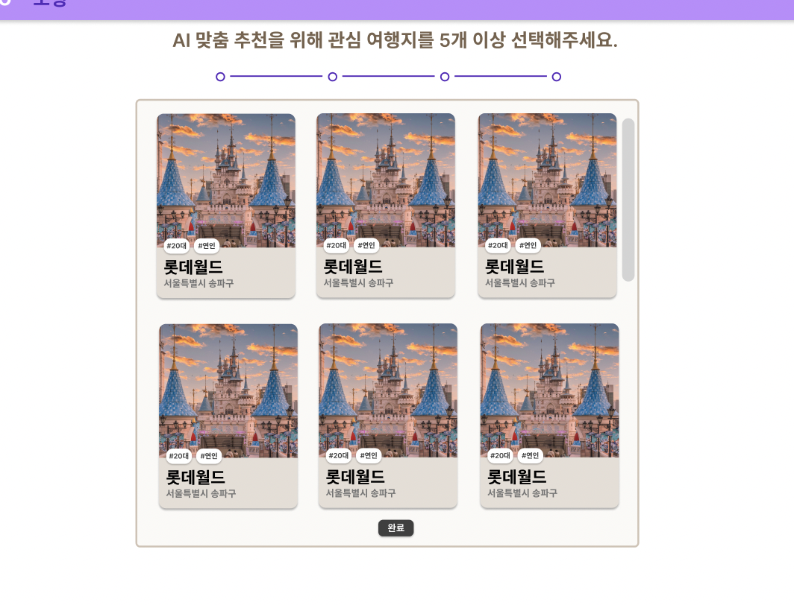
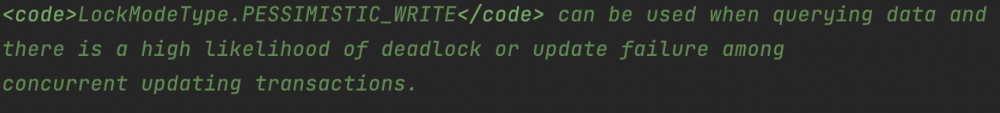

우리 하모니 팀의 모행 프로젝트에서 발생한 동시성 이슈가 발생하고 있었다. 이를 JPA 의 비관적 락을 사용하여 해결한 경험에 대해 팀원들에게 공유하고자 한다 😎

## JPA 낙관적 락, 비관적 락

> 💡 JPA 낙관적 락, 비관적에 대한 자세한 이론은 [JPA 낙관적 락과 비관적 락으로 엔티티에 대한 동시성 이슈 해결하기](https://haon.blog/database/optimistic-pessimistic-lock/) 을 참고하자.

지난 [JPA 낙관적 락과 비관적 락으로 엔티티에 대한 동시성 이슈 해결하기](https://haon.blog/database/optimistic-pessimistic-lock/) 에서 다루었듯이, JPA 의 락 메커니즘은 특정 엔티티에 락을 거는 기법이다. 모든 트랜잭션은 ACID 성질에 따라 **원자성(Atomic) 과 격리성(Isolation)** 하게 동작해야한다. 이를위해 트랜잭션 격리수준을 최고 수준으로 설정하여 동시성 이슈를 해결할 수 있지 않을까 생각해볼 수 있지만, 애당초 격리수준은 동시성 이슈를 해결하기 위해 등장한 개념이 아니다. 격리수준을 최고 단계인 `SERIALIZABLE` 로 올리면 락을 획득할 필요가 없는 기능들의 모든 트랜잭션에 `s-lock` 이 걸린다. 이 떄문에 서비스내의 모든 기능에 성능 저하는 몰론 데드락에 빠질 위험도 훨씬 커진다. 무엇보다, **트랜잭션 격리수준으로는 두 번의 갱실 분실 문제(Second Lost Updates Problem) 를 해결하지 못한다.**

우리 팀은 왜 동시성 이슈를 제어하기 위해 JPA 비관적 락을 사용했는가? 

## 여행지 방문 수 기록

우리 하모니 팀의 모행 서비스에는 각 여행지에 대한 총 방문 수를 기록하고 있다. 이 방문 수를 기준으로 상위 30개의 여행지를 사용자에게 추천하고 있다. 랜딩 페이지에서 비회원에게 우리 서비스 사용을 권장하기 위해, 어떤 서비스인지를 표현할 수 있도록 아래와 같이 랜덤 키워드 기반 여행지를 추천할 떄, 상위 30개의 여행지를 방문 수 기준 오름차순으로 보여주고 있다.

또한 최초 회원가입시 관심 여행지를 선택하도록 유도하고 있다. 입력한 관심 여행지를 기반으로 AI 맞춤 추천 여행지를 추천하기 떄문이다. 이때, 사용자가 선택할 관심 여행지 리스트를 보여주기 위해 마찬가지로 상위 30개의 여행지를 오름차순으로 보여주고 있다.

### Trip 엔티티

실제로 우리 팀의 Trip 엔티티 설계 코드이다. `visitedCount` 라는 컬럼으로 모든 유저가 현재 여행지에 방문한 총 방문 수를 기록하고있다. 또한 `increaseVisitedCount()` 를 사용하여 여행지 조회시 방문 수를 1증가시키도록 비즈니스 로직을 설계했다.

~~~java
@Table(name = "trip")
@Entity
public class Trip extends BaseEntity {
    private static final long MAX_NAME_LENGTH = 100;
    private static final long MIN_NAME_LENGTH = 2;

    @Id
    @GeneratedValue(strategy = GenerationType.IDENTITY)
    @Column(name = "id")
    private Long id;

    @Column(name = "visited_count", nullable = false)
    private Long visitedCount;

    // ...

    public void incrementVisitedCount() {
        this.visitedCount++;
    }

    // ...
}
~~~

## 문제 상황

그런데 문제가 있다. 이상하게도 실제 유저들이 방문한 횟수와 달리 올바르게 방문 수가 증가하지 않고, 이로인해 상위 30개의 여행지가 비정상적으로 조회되고 있다. 즉, 방문 수 카운팅 로직에 동시성 이슈가 발생하고 있었다. 100명의 유저가 같은 여행지를 동시에 방문했을 떄 방문 수가 100이 증가하지 않고, 이에 훨씬 못미치는 수준으로 증가하고 있었다.

이는 [경쟁 상태의 2가지 패턴 - Read-Modify-Write, Check-Then-Act](https://haon.blog/database/race-condition-pattern/) 에서 다루었던 경쟁상태의 대표적인 형태 중 **Read-Modity-Write** 패턴이다. **즉, visitedCount 공유 자원에 대해 이전 상태를 기준으로 객체의 현재 상태를 변경하면서 문제가 발생한 것이다.** 쓰레드1 이 데이터를 읽어오고(Ready) 변경(Modify) 을 시도하고 반영(Write) 하기 이전에, 다른 쓰레드2 가 아직 반영(Write) 되지 않은 옛날 값을 읽어옴으로써 데이터 정합성 문제가 발생한 것이다.

이 동시성 문제를 어떻게 해결할 수 있을까? 우리 팀은 크게 트랜잭션 격리수준, 자바에서 제공하는 키워드인 `synchornized`, JPA 낙관적 락, 그리고 비관적 락 중 어떤 방법으로 선택할지 많은 고민이 있었다. 결론적으로는, JPA 락 메커니즘에서 제공하는 비관적 락을 사용하여 동시성 이슈를 해결했는데, 이 고민 과정을 설명해보고자 한다.

### 트랜잭션 격리 수준으로는 해결되지 않는다

지난 이론 설명 포스팅과 앞서 설명했듯이, **트랜잭션 격리수준으로는 두 번의 갱실 분실 문제(Second Lost Updates Problem) 를 해결할 수 없다.** 무엇보다, 가장 높은 격리성을 보장하는 `SERIALIZABLE` 은 현재 락을 획득할 필요가 없는 모든 트랜잭션이 최소한 `s-lock(공유 락)` 을 획득하게 된다. 위 문제상황에선 여행지 조회시 `visitedCount` 컬럼에 대한 기능에 대해서만 락을 걸면 될텐데, 만약 `SERIALIZABLE` 로 격리수준을 올려버린다면 이 기능과 연관없는 서비스내의 전체 기능에 대해서 락을 걸어버리게 된다. 즉, 시스템내에 생성되는 모든 트랜잭션은 불필요하게 락을 획득하기 위해 대기하게 되고, 자칫 데드락에 빠질 수 있다. `x-lock` 과 `s-lock` 은 서로 양립할 수 없기 떄문에, 데드락에 빠질 가능성이 더 커진다.

### 자바에서 제공하는 synchornized 로도 해결하기엔 비효율적이다.

~~~java
@Transactional
public synchronized FindTripWithSimilarTripsResponse findWithSimilarOtherTrips(final long tripId, final long memberId) {
    final Trip trip = tripRepository.findById(tripId);
    // ...
    trip.incrementVisitedCount();
    // ...
}
~~~

자바 차원에서 제공하는 `synchorized` 로 해결하자니, 이 또한 성능한 손해를 많이 본다. 자바에선 `synchronized`  라는 키워드를 제공해, **모니터 기반으로 상호 배제(Mutual Exclusion) 기능을 제공한다.** 상호배제를 구현한 동시성 제어 방식은 공유 자원 그 자체를 사용하는 특정 `임계 영역(Critial Section)` 에 대해 동시성을 제어할 수 있다.

 **즉, 한 임계영역에 대해 쓰레드를 하나씩 진입시켜 작업을 수행시키는 방법으로, 베타적으로 실행된다. 하지만 이 특성 떄문에 서비스에 트래픽이 발생할 경우 심각한 성능 저하가 발생할 수 있다.**  JPA 락 메커니즘과 달리 한 엔티티에 대한 접근을 제어하는 것과 달리, synchorized 는 여행지 조회라는 로직 그 자체를 실행하는 모든 쓰레드에 대해 접근을 제어하는 것이므로, 성능상 더 손해를 입게된다.

### JPA 낙관적 락으로도 해결할 수 없다

낙관적 락은 애플리케이션 레벨에서 동시성 이슈를 해결할 수 있는 방법이다. JPA 비관적 락 메커니즘과 달리, 대부분의 트랜잭션이 충돌이 발생하지 않을 것이라 낙관적인 상황을 가정하는 방법이다. `@Verison` 을 활용하여 버전 필드를 사용하고, 아래처럼 엔티티 버전 값을 기반으로 찾는 방식이라고 이전 포스팅에서 설명했었다.

낙관적 락을 사용하면 엔티티의 변경감지를 version 필드를 통해 알아낸다. 다른 트랜잭션에 의해 버전 값이 증가했다면 WHERE 문으로 찾을 수 없다. 즉, 버전의 불일치가 발생하여 예외가 발생한다. 이는 다시말해, 먼저 커밋된 (버전 값을 먼저 증가시킨) 트랜잭션만을 성공시킨다. **다시 말해, 충돌이 발생한 트랜잭션에 대해선 모두 롤백시킨다.**

낙관적 락은 애당초 충돌이 거의 발생하지 않는 상황에서만 사용하는 것이 바람직하다. **충돌이 빈번한 로직에서 엔티티에 충돌이 발생하면, 모든 트랜잭션을 롤백했을 때의 비용이 매우 크기 떄문이다.** 만약 100개의 쓰레드가 충돌이 발생했다면 맨 처음으로 커밋된 1개의 트랜잭션만이 인정되고, 나머지 99개의 트랜잭션을 모두 롤백시켜줘야한다. 스프링 차원에서 `@Retryable` 어노테이션을 지원하여 해당 메소드에 대한 재시도 기능을 제공하지만, 얼만큼 재시도 할지에 대한 기준을 세우기 명확하지 않다. **재시도 비용 또한 오버헤드가 크게 발생하며, 재시도를 했을 떄도 최초 커밋에 실패한 트랜잭션들 모두에 대해 또 다시 롤백시켜줘야한다.**

## JPA 비관적 락을 사용한 동시성 이슈 해결

우리 팀은 결국 JPA 에서 제공하는 비관적 락을 사용하기로 결정했다. 낙관적 락과 반대로 충돌이 자주 발생할 것이라 비관적으로 가정하고 우선적으로 락을 걸고보는 방법이다. 낙관적 락은 데이터베이스에 락을 걸지 않는 반면, **비관적 락은 데이터베이스의 실제로 특정 행(엔티티)에 대해 락을 거는 방식이다.** 이 떄문에 충돌이 거의 발생하지 않는 상황에선 낙관적 락을 사용하는 것이 오버헤드가 적다.

하지만, 여행지 조회 기능 특성상 충돌이 자주 발생할 수 밖에 없다. 서비스 목적 상 여행지를 조회하는 것은 서비;스내의 대부분의 기능에서 노출되어있다. 앞서 낙관적 락을 사용했을 떄 `@Retryable` 로 재시도할 수 있다고 설명했지만, 커밋에 실패한 모든 트랜잭션에 대해 처리해줘야하는 롤백 비용, 그리고 재시도 비용으로 인한 오버헤드가 매우 클 것으로 생각했다.

### 엔티티에 비관적 락 적용

우리 팀은 아래와 같이 Repository 레이어의 여행지 조회 메소드에 비관적 락을 적용했다. 비관적 락은 LockModeType 을 `PESSIMISTIC_WRITE` 으로 지정하여 적용할 수 있다.

~~~java
@Lock(LockModeType.PESSIMISTIC_WRITE)
@QueryHints( {@QueryHint(name = "javax.persistence.lock.timeout", value = "3000")})
@Query("SELECT t FROM Trip t WHERE t.id IN :tripId")
Optional<Trip> findByIdForUpdate(final Long tripId);
~~~

`PESSIMISTIC_WRITE` 옵션은 아래와 같이 `FOR UPDATE` 를 추가하여 베타 락을 건다. 베타 락을 사용하여 다른 트랜잭션에 의해 읽기와 쓰기 연산이 모두 수행되지 않음을 보장한다. 

~~~sql
SELECT * from trip WHERE id = ? FOR UPDATE 
~~~

### 성능상 손해을 많이 볼까?

JPA 비관적 락을 사용할 경우 `x-lock` 을 사용하기 때문에 다른 트랙잭션들은 락을 얻기위해 대기상태에 빠진다. 이 대기시간이 길어질수록 성능상 손해를 볼 수 밖에 없다. 그렇다고 낙관적 락을 걸자니 충돌이 자주 발생할 기능이라 적합하지 않다고 판단했다. 재시도 비용이 더 클 것으로 예상됐기 떄문이다.

무엇보다 MySQL 기준 `REPEATABLE_READ` 격리수준에선 잠금 없는 읽기 기능이 지원된다. 락을 획득할 필요가 없는 위 기능을 제외한 나머지 기능들은 모두 성능에 손해를 입지 않는다. 또한 테이블 단위가 아닌, 엔티티 단위에 대해 락을 거는 것이다. 충돌이 발생할 특정 엔티티 외의 다른 엔티티에 대해서는 락을 걸지 않아 성능을 엄청나게 떨어뜨리는 수준은 아닐것이다.

### 데드락에 대한 대처

앞서 Spring Data JPA 를 통해서 정의한 `findByIdForUpdate()` 을 보면 @Lock(LockModeType.PESSIMISTIC_WIRTE) 로 건 것을 확인할 수 있다. 우리는 동시성 제어한 필요한 곳에서 스터디를 조회할 때 해당 메소드를 활용해주고 있는데, @Lock(LockModeType.PESSIMISTIC_WIRTE) 의 설명을 살펴보면 "동시 업데이트 트랜잭션 중 데드락 또는 실패 가능성이 높다." 라고 데드락 발생 가능성에 대해서 경고하고 있는 것을 확인할 수 있다.

예를 들면 다음과 같은 상황이 될 수 있겠다.

~~~
쓰레드 1 : A 정보를 구하고 잠금
쓰레드 2 : B 정보를 구하고 잠금
쓰레드 1 : B 정보를 구하려고 하지만 잠겨있음
쓰레드 2 : A 정보를 구하려고 하지만 잠겨있
~~~

이런 교착 상태를 해결하기 위한 방법으로는 락을 잡고 있는 최대 시간을 지정하기 위해, (잠금 시간 초과 설정, Setting Lock Timeout) `@QueryHints` 와 `@QueryHint` 어노테이션을 통해서 최대 시간을 3초로 지정했다.

## 마치며

이렇게 해서 동시성 문제에 대해서 해결을 해줄 수 있게 되었다. 또한 비관적 락을 사용함으로써 발생하는 데드락 문제와 같은 것에 대해서도 대비를 해줄 수 있었다.

