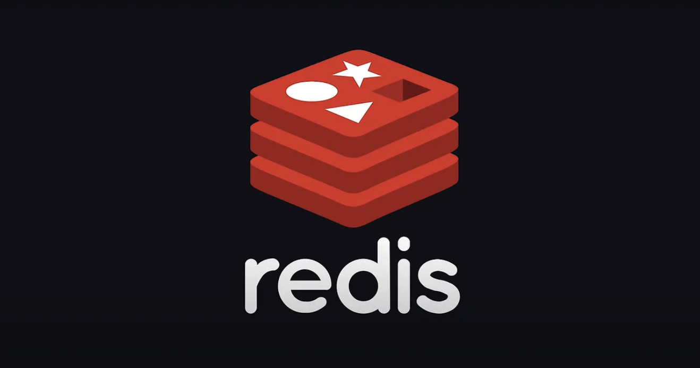

## 분산 락(Distribution Lock)

스프링 웹 애플리케이션은 기본적으로 멀티 쓰레드 환경에서 구동된다. 이를 위해 여러 쓰레드가 함께 접근할 수 있는 공유 자원에 대한 **경쟁 상태(Race Condition)** 가 발생할 수 있고, **임계영역(Critical Section)** 에 대한 동시성 제어 메커니즘을 사용할 수 있다.

특히나, 자바 진영에서는 **모니터 기반의 상호 배제(mutual exclusion)** 기법을 제공하는 `synchornized` 키워드를 제공한다. 하지만, 이 키워드를 사용하면 임계영역에 대한 동시 접근을 제어할 수 있지만, 문제는 단일 서버에서만 상호 배제를 보장한다는 점이다. 우리는 이를 통해, 다중화된 분산 환경에서 여러 서버의 동시성 문제를 다루기 위한 락 메커니즘이 필요함을 느낄 수 있다.

분산 락(Distribution Lock) 은 다중화된 분산 환경에서 **상호 배제(mutual exclusion)** 기반의 락 메커니즘을 제공한다. 즉, 분산된 여러 서버들은 모두 동일한 락 제공처로부터 **락을 획득하고(acquire), 해제(release)할 수 있다.** 이떄 분산 환경에서 제공되는 락 타입을 분산 락이라고 하며, 락 제공처는 가장 많이 사용되는 것이 Redis, Zookeeper 등이 있다. 다시 정리하자며느 분산 환경에서 여러대의 서버들은 락을 획득하기 위해 Redis 와 같은 락 제공처를 바라보며, 임계영역에 접근할 수 있는지 확인하고, 대기하고, 수행한다. 

이번 포스팅에서는 Redis 를 사용하여 간단히 분산 락을 구현해보도록 한다. RedLock 알고리즘에 대해서도 다루어볼까 하는데, 이는 다음 포스팅에서 천천히 다루어볼까 한다.

### 동시성 이슈 발생 상황 가정

동시성이 터질만한 애플리케이션 요구사항을 하나 만들어 볼 것이다. 우리는 대학교 수강신청 사이트에서 동시성 이슈가 터지는 상황을 하나 가정해보고, 이를 Redis 를 활용한 2가지 방법의 분산 락으로 해결해볼 것이다. 그리고 인프라 아키텍처는 간딘히 아래와 같이 구성했다.

- 스프링부트 애플리케이션 인스턴스 2대를 띄웠다.
- MySQL 서버에 수업에 대한 더미 데이터를 미리 띄웠다.

### Course 

수업에 대한 엔티티이다. 수업명, 수강신청 제한 수, 현재까지의 수강신청 인원 수로 구성했다.

~~~java
@Entity
@Getter
public class Course {
    @Id
    @GeneratedValue(starategy = GenerationType.IDENTITY)
    private int id;
    private String courseName;
    private int countLimit;
    private int currentCount;

    public boolean isOverFlow() {
        return currentCount > countLimit;
    }
}
~~~

### CourseController

컨트롤러는 아래와 같이 간단히 구성했다. 

~~~java
@RestController
@RequestMapping("/course")
public class CourseController {
    private final CourseService courseService;

    public CourseController(final CourseService courseService){
        this.courseService = courseService;
    }

    @ResponseBody
    @PostMapping("/registration/{courseIdx}")
    public ResponseEntity<RegisterRes> registerCourse(@PathVariable("courseIdx") final int courseIdx) throws InterruptedException{
        RegisterRes registerRes = courseService.registerCourse(courseIdx);
        return ResponseEntity.created(URI.create("/course/registration/"))
                .body(registerRes);
    }
}
~~~

### CourseRepository

레포지토리는 아래와 같이 구성했다. 

~~~java
@EnableJpaRepositories
public interface CourseRespository extends JpaRepository<CourseEntity, Integer> {
    CourseEntity findById(final int id);
}
~~~

### CourseService

수강 신청의 핵심 로직을 담당하는 서비스 레이어이다. `isOverFlow()` 를 통해 수강신청 인원이 초과했는지를 검증하도록 간단히 구현했다. 

~~~java
@Service
public class CourseService {
    private final CourseRespository courseRespository;
    private final RedisLockRepository redisLockRepository;

    @Autowired
    public CourseService(CourseRespository  courseRespository, RedisLockRepository redisLockRepository){
        this.courseRespository = courseRespository;
        this.redisLockRepository = redisLockRepository;
    }

    @Transactional
    public RegisterRes registerCourse(int courseIdx) {
        CourseEntity courseEntity = courseRespository.findCourseEntityByCourseIdx(courseIdx);

        courseEntity.setCurrentCount(courseEntity.getCurrentCount() + 1);

        if(courseEntity.isOverFlow()){
            throw new RuntimeException("마감 되었습니다");
        }

        return new RegisterRes(courseEntity.getCurrentCount());
    }
}
~~~

Jmeter 를 사용하여 동시간대에 100개의 요청을 보내도록 한다. 그러면 분명히 100개의 쓰레드가 요청했음에도 불구하고, currentCount 값이 100이 아닌 19밖에 증가히지 않았다. 즉, 동시성 이슈가 발생했다. 앞서 설명했듯이, 우리의 환경은 단일 서버가 아닌 분산 환경이므로 `synchornized` 으로도 이를 해결할 수 없다. (사실 JPA 락 메커니즘을 사용하는 것을 고려해볼 수 있지만, 현재 포스팅에선 고려 대상에서 일단 제외한다.) 

이를 Redis 에서 제공하는 분산 락으로 해결해보자. 분산 락 구현방식에는 크게 2가지가 존재한다.

## Redis SETNX 를 뢀용

> 💡 Redis 2.6.12 버전 이전에는 `SETNX` 명령어가 제공되었지만, 2.6.12 버전부터는 deprecated 되었다고 한다. SET 명령어에 NX 옵션을 전달하는 방향으로 수정하였다. 우선, `SETNX` 명령을 기준으로 설명한다. 이후 포스팅에서 2.6.12 이후 버전의 RedLock 알고리즘에 대해 다루어보고자 한다.

Redis 에는 `SETNX` 라는 명령어가 존재한다. "**SET** if **N**ot e**X**ists" 의 줄임말이다. 말 그대로 특정 key 에 value 가 존재하지 않을때만 값을 설정할 수 있다는 뜻이다.

~~~sql
127.0.0.1:6379> setnx 1 lock
(integer) 1
127.0.0.1:6379> setnx 1 lock
(integer) 0
127.0.0.1:6379> del 1
(integer) 1
127.0.0.1:6379> setnx 1 lock
(integer) 1
~~~

위는 `SETNX` 명령어를 사용한 모습이다. Key 1 에 lock 이라는 value 를 설정하는 장면이다. 최초에는 key 에 아무값도 설정되어 있지 않기 때문에 1을 반환하며 성공한다. 그런데, 이후 동일한 명령어를 또 실행하는데, 이미 해당 key 에 대한 value 가 존재하기 때문에 0을 반환하며 실패하였다. 이후 `DEL` 명령어를 통해 key 1의 데이터를 가져오고, 동일하게 `SETNX` 명령어를 실행하니 다시 1을 반환하며 성공한다.

`SETNX` 명령을 활용하면 `스핀 락(Spin Lock)` 을 구현하여 동시성을 해결할 수 있다. 즉, Redis 서버에 지속적으로 `SETNX` 명령어를 보내서 임계 영역 진입 여부를 확인한다. 이를 위해 아래와 같이 의존성을 추가하고, 스핀 락을 구현해보자.

~~~
implementation 'org.springframework.boot:spring-boot-starter-cache'
~~~

### RedisRepository

Redis 분산 락을 얻고 해제하는 레포지토리 컴포넌트를 간단히 생성해주었다.

~~~java
@Component
public class RedisLockRepository {
    private RedisTemplate<String, String> redisTemplate;

    public RedisLockRepository(final RedisTemplate<String, String> redisTemplate){
        this.redisTemplate = redisTemplate;
    }

    public Boolean lock(final int key){
        return redisTemplate.opsForValue()
                .setIfAbsent(String.valueOf(key), "lock", Duration.ofMillis(3_000));
    }

    public Boolean unlock(final int key) {
        return redisTemplate.delete(String.valueOf(key));
    }
}
~~~

`RedisTemplate` 을 주입받아서 락을 관리하는 `RedisLockRepository` 를 구현한다. `lock()` 메소드는 이름 그대로 락을 획득하는 것으로, `setIfAbsent()` 를 사용하여 `SETNX` 명령어를 실행시킬 수 있다. 이때, key 는 Course 엔티티에 대한 PK 값으로, value 는 `lock` 으로 설정한다. 3번째 파라미터는 타임아웃 설정이다. 즉, 락을 3초 이상 획득하지 못한 쓰레드는 타임아웃된다.

`unlock()` 메소드는 key 에 대해 `DEL` 명령어를 실행한다. 이를 통해 락을 해제할 수 있다.

### CourseService 

~~~java
@Service
public class CourseService {
    private final CourseRespository courseRespository;
    private final RedisLockRepository redisLockRepository;

    public CourseService(CourseRespository  courseRespository, RedisLockRepository redisLockRepository){
        this.courseRespository = courseRespository;
        this.redisLockRepository = redisLockRepository;
    }

    public RegisterRes registerCourse(int courseIdx) throws InterruptedException {
        while (!redisLockRepository.lock(courseIdx)) {
            Thread.sleep(100);
        }

        try {
            CourseEntity courseEntity = courseRespository.findCourseEntityByCourseIdx(courseIdx);
            courseEntity.setCurrentCount(courseEntity.getCurrentCount() + 1);

            if (courseEntity.isOverFlow()) {
                throw new RuntimeException("마감 되었습니다");
            }

            return new RegisterRes(courseEntity.getCurrentCount());
        } finally {
            redisLockRepository.unlock(courseIdx);
        }
    }
}
~~~

`registerCourse()` 에 스핀 락을 적용하였다. while 문을 활용해서 락을 획득할 때 까지 무한 반복과 대기를 한다. Redis 서버에 부하를 덜기위해 100ms 를 쉬어주고, 임계영역에 진입후 수강신청에 대한 로직을 처리후 finally 블럭으로 락을 해제해준다. 이때 락을 해제해주지 않으면 다른 쓰레드에서 임계영역에 진입하므로 주의하자.

위와같은 스핀 락 방식 과연 적합한 구현 방식일까? 몰론 기본적으로 제공되는 Redis Client 인 Lettuce 만으로도 금방 락 메커니즘을 구현할 수 있기 때문에, 구현 난이도가 낮을 것이다. 하지만, 스핀 락 방식으로 동작하므로 Redis 서버와 스프링 애플리케이션 서버 모두에 심한 부하가 생길 것이다.

### Redis 의 Pub/Sub 기반 메시지브로커 활용 (Redisson 클라이언트)

스핀 락으로 인해 발생하는 심한 부하는 사실상 서비스에 도입하기란 무모하다. 이번에는 스핀락처럼 부하가 발생하는 기능이 아닌, 더 효율적인 방법으로 구현해보자. Redis 가 제공하는 Pub/Sub 메시지브로커를 사용하여 분산 락을 구현해보자. Pub/Sub 과 관련한 내용은 [Redis Pub/Sub 을 사용한 분산 환경에서 로컬 캐시 동기화](https://haon.blog/spring/redis-pub-sub-local-cache-synchornization/) 에서도 다룬적이 있다.

Redis 의 Pub/Sub 의 활용하면, 락을 해제할 주체자(Publisher) 가 다른 클라이언트(Subscriber) 에게 락 획득 가능 메시지를 브로드케스트 한다. 즉, 락이 해제될 때 마다 Subscriber 들에게 락 획득을 이제 시도해도 된다라는 메시지를 발행한다. 이를 통해, 앞선 `SETNX` 명령어 기반 스핀 락 방식과 달리 락 획득 여부를 체크하지 않아도 된다. 

`Redisson` 이라는 라이브러리는 Redis 의 Pub/Sub 을 활용하여 분산 락 메커니즘을 구현했다. 이 라이브러리는 타임아웃 기능 또한 제공하여, 일정 시간동안 락을 획득하지 못하면 타임아웃 되도록 처리할 수 있도록 한다. `Redisson` 을 사용하기 위해 아래와 같이 의존성을 추가해주자.

~~~java
implementation 'org.redisson:redisson-spring-boot-starter:3.17.7'
~~~

### CourseService

`RedissonClient` 을 아래와 같이 주입받자.

~~~java
 public CourseService(final CourseRespository courseRespository, RedissonClient redissonClient){
    this.courseRespository = courseRespository;
    this.redissonClient = redissonClient;
}
~~~

그리고 아래처럼 `redissonClient.getLock()` 을 통해 락을 획득하고, `tryLock()` 을 통해 락 획득을 시도한다. 락 획득에 성공하면 임계영역에 진입하여 비즈니스 로직을 수행하고, finally 블럭에서 `unlock()` 한다. **락 획득을 실패하였으면, 끊임없이 레디스 서버에 재확인하는것이 아니라 대기 상태로 들어가 메시지가 발행되기를 기다린다.**

~~~java
public RegisterRes registerCourse(Long courseIdx){
    RLock lock = redissonClient.getLock(String.valueOf(courseIdx));
    
    try{
        boolean available = lock.tryLock(100 ,2, TimeUnit.SECONDS);
        int newCourseIdx = Math.toIntExact(courseIdx);

        if(!available){
            throw new RuntimeException("Lock 획득 실패!");
        }

        // 비즈니스 로직 (임계영역)
        CourseEntity courseEntity = courseRespository.findCourseEntityByCourseIdx(newCourseIdx);
        courseEntity.setCurrentCount(courseEntity.getCurrentCount() + 1);

        if (courseEntity.isOverFlow()) {
            throw new RuntimeException("마감 되었습니다");
        }

        return new RegisterRes(courseEntity.getCurrentCount());
    } catch (InterruptedException e) {
        throw new RuntimeException(e);
    } finally {
        lock.unlock();
    }
}
~~~

## JPA 락 메커니즘 vs 분산 락

JPA 에서 제공하는 낙관적 락, 비관적 락의 주 관심사는 특정 엔티티에 대한 동시성 제어이다. 즉, 동시성을 제어히기 위한 엔티티가 존재해야한다. 반면, 분산 락은 `synchornized` 와 같이 임계영역에 대한 접근 제어이다. 엔티티 접근 제어가 아닌, 여러 엔티티에 대한 생성, 수정, 삽입, 삭제 그 모든 행위에 대해 접근을 제어할 수 있다. 

### 우리 서비스에서 비관적 락을 사용하는데, 문제가 되진 않을까? 

가장 고민이 많았던 요소 중 하나는, 우리 모행 서비스에는 어떠한 동시성 제어 락 메커니즘을 취하는가이다. [MySQL 8.0 레플리케이션과 스프링부트 DataSource 라우팅을 통한 부하 분산](https://haon.blog/database/replication-mysql-springboot/) 에서도 다루었듯이, 해당 포스팅에서 다룬 내용과 거의 유사한 구조로 데이터베이스 레플리케이션 구조를 취하고 있다. 이러한 상황에서 우리 서비스는 JPA 비관적 락을 사용하는데, 다중화된 데이터베이스 환경에서 ROW 단위의 락을 걸어도 괜찮은가이다.

하지만, 이는 다행히 문제가 되지 않는다. JPA 비관적 락은 `PESSIMISTIC_WRITE` 옵션 기준으로 쓰기 락, 베타 락을 설정한다. `PESSIMISTIC_WRITE` **데이터에 변경 가능성이 있는 연산이므로, 쓰기 트랜잭션으로 간주된다는 것이다.** 따라서 이 `FOR UPDATE` 절을 사용하는 쿼리는 Master 서버로 전송된다. 우리는 `AbstractRoutingDataSource` 를 통해 쓰기 연산에 대해선 Master 서버로 라우팅하도록 되어있는데, 현재 Master 서버는 단 1대밖에 존재하지 않으며, Slave 서버로 전송되지 않는다. 따라서 쓰기 연산에 대한 데이터 정합성에 문제가 되지 않는다. 

만약 우리 서비스가 더 거대해져서 Master 서버가 2대 이상으로 커진다면, Master 서버간에 락을 공유할 방법이 없다. 즉, 각 Master 서버는 중앙화된 락 제공처를 사용하지 않으므로, 락이 각기  별개로 관리된다. 이 문제는 현재 포스팅에서 다룬 Redis 분산 락을 통해 동시성 문제를 해결해볼 수 있을 것이다. 2대 이상의 다중화된 데이터베이스 환경이라면 ROW 단위의 락 설정에 대해 잘 고려해야한다.

### MySQL 네임드 락 vs Redis 분산 락

MySQL 의 네임드 락의 경우 `GET_LOCK(문자열, Timeout)` 을 통해 락을 획득하고, `RELEASE_LOCK(문자열)` 을 통해 락읗 해제하는 방식으로 구현할 수 있다. 또한 `GET_LOCK` 을 얻을 때 타임아웃 시간을 지정하게 되는데, 타임아웃 시간 내에서 동시 요청에 의한 작업들은 누락되지 않고, 정상적으로 처리되는 부분이 있다.

네임드 락의 장점으로는 추가적인 리소스가 필요하지 않는다. 다른 소프트웨어를 사용하지 않고도 기존의 DB 인 MySQL 로 분산락을 구현할 수 있는 장점이 있다. 하지만 단점으로는 락에 대한 정보가 테이블에 따로 저장되어 무거워질 수 있고, 실제 DB 에 락으로 인한 커넥션 대기가 발생하기때문에 성능상 단점이 있다.

그에 비해 Redis 메세지 브로커를 이용한 분산락은 락에 대한 정보는 휘발성이 있고, 메모리에서 락을 획득하고 해제하기때문에 가볍다는 장점이 있다.

## 마치며

만약 우리 모행 서비스가 분산된 환경이라면, 상황에 따라 Redis 분산 락을 적극 고려해볼 것이다. 하지만, 지금 모행 서비스는 단일 서버인 점을 감안한다면 Redis 분산 락을 도입할 이유가 없다. 또한, JPA 의 비관적 락 만으로도 엔티티에 대한 충분히 동시성을 해결할 수 있다. ROW 단위에 대해서만 락을 거는 것에 비해 상호 배제 기반의 분산 락을 도입하여 불필요하게 성능 저하를 일으킬 이유는 없다.

다음 포스팅에선 Redis 의 RedLock 알고리즘에 대해 간단히 학습하도록 한다.

## 참고

- https://dkswnkk.tistory.com/681
- https://hyos-dev-log.tistory.com/34
- https://hyperconnect.github.io/2019/11/15/redis-distributed-lock-1.html
- https://techblog.woowahan.com/2631/