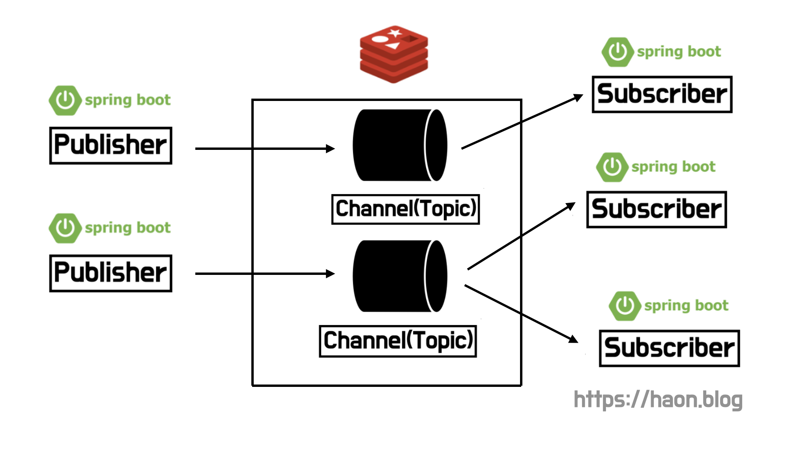

## 분산 환경에서 로컬 캐시 동기화 문제

지난 [스프링 로컬 캐시와 TTL 을 구현한 외부 서빙 API 요청 최적화](https://kakaotech-harmony.netlify.app/backend/local-cache-custom/) 에서 다루었듯이, 우리 모행 서비스에는 로컬 캐시를 사용하여 외부 서드파티 API 호출에 대한 응답을 캐싱해두고 재사용한다. 지금까지는 단일 서버로 동작하기 떄문에 캐싱에 별 문제가 없어보인다. 그런데 만약, 우리 서비스가 향후 Scale-Out된 분산 환경이라면 로컬 캐시에 어떤 문제가 발생할까?

일반적으로 로컬 캐시는 구현이 간편하다. 스프링에서 제공해주는 `@Cacheable` 어노테이션만 간단히 명시하고, 기본 캐시 매니저인 `ConcurrentMapCacheManager` 를 제공받을 수 있다. 하지만, 만약 **Scale-Out 된 분산 환경**이라면 각 애플리케이션 서버가 서로 다른 캐시 데이터를 갖는 **데이터 일관성 문제**가 발생할 수 있다. 이를위해, 결국 Redis 와 Memcached 와 같은 글로벌 캐싱을 도입하여 한곳에서 중앙회된 캐시 데이터를 공유하는 방식으로 해결할 수 있다.

그렇다면 글로벌 캐싱을 도입했을 때는 문제점이 없을까? 글로벌 캐시 또한 문제점이 정말 많다. 우선, 글로벌 캐시는 Redis 와 Memcached 와 같이 외부 캐시 저장소를 사용하기 때문에 **네트워크 I/O 비용**이 발생한다. 또한 캐시에 데이터를 저장하고 꺼내올 때 **직렬화와 역직렬화 비용**도 발생한다. 반면 로컬 캐시는 **RAM Access 비용만 발생**하기 떄문에 글로벌 캐싱에 비해 매우 빠르다. 당연하게도, 직렬화와 역직렬화도 발생하지 않는다. 또한, 중앙화된 글로벌 캐싱을 사용한다면 캐시 서버가 **SPOF(Single Point Of Failure)** 가 되므로 **HA(High Availability)** 를 보장하지 못한다.

다시 처음으로 돌아가보자. 로컬 캐시의 성능은 매우 빠르기에 도입하고 싶지만, 분산 환경에서 각 캐시 서버간의 동기화 문제를 피할 수 없다. 이를 해결하기 위해선 어떻게 해야할까? 이를 해결하기 위한 방법 중 하나로, 이번 포스팅에선 **Redis Pub/Sub** 에 대해 간단히 학습해보도록 한다. 만약 모행 서비스가 Scale-Out 되어야 할 상황이라면, 이 **Pub/Sub** 구조를 적극 고려해보도록 한다.

## Redis Pub/Sub

Redis 는 위치럼 Pub/Sub 기능을 제공한다. Publisher 가 특정 채널은 구독하는 Subscriber 들에게 브로드캐스킹하는 방식이다. 이를 이용하면 여러 서버간의 로컬 캐시를 동기화할 수 있을 것이다. 특정 애플리케이션 서버의 캐시가 최신화되었을 때, 그 이벤트, 즉 메시지를 다른 모든 애플리케이션 서버에 브로드캐스트 하는 방식으로 동기화시킬 수 있다. 

이 Pub/Sub 구조에서는 모든 애플리케이션 서버가 Publisher 이자 Subscriber 로 동작한다. 즉, 캐시 갱신 이벤트가 발생한 애플리케이션 서버로 동작할 때는 Publisher 가 되며, 떄로는 캐시 갱신 메시지를 전달받는 입장도 되기 떄문에 Subscriber 가 되기도 한다. 그리고 **한 서버의 로컬 캐시가 갱신되면 그 즉시 다른 서버에게 갱신 이벤트를 브로트캐스트 하는 방식**으로 동작한다. 브로드캐스트 할 때 갱신된 캐시의 키를 메시지로 전달한다.

추가적인 상식으로만 알아두면 좋을 내용을 학습했다. Pub/Sub 에서 Redis 내부 각 채널은 이벤트를 저장하지 않는 비휘발성의 특징을 가진다는 점이다. 만약 채널에 메시지가 도착했다면, 해당 채널의 Subscriber 가 존재하지 않거나 또는 해당 Subscriber 서버에 장애가 터졌다면, 그 메시지는 휘발된다. 또한 Subscriber 는 동시에 여러 채널을 구독할 수 있다.

### Redis Pub/Sub 과 Message Queue

더 찾아보니, Redis 의 메시지 브로트캐스트 방법에는 Pub/Sub 외에도 다양한 메시징 기법을 제공함을 알게 되었다. 여러 방법중 보편적으로 사용되는 메시징 기법에는 크게 **Pub/Sub** 와 **메시지 큐(Message Queue)** 이 있다. **Message Queue**은 **Point-To-Point Channel** 방식으로도 불린다. 오로지 한 Consumer 만 메시지를 수신받는 방식이다. 송신자와 수신자가 1:1로 대응되어서 데이터를 수신받는 구조이다. 또한 메시지는 큐에 저장한다. 앞서 설명했듯이 Pub/Sub 은 별다른 저장소 없이 메시지를 즉시 브로트캐스트 하지만, 메시지 큐는 큐 형태의 저장소에 메시지를 저장하므로, 메시지가 손실되지 않는다. 이러한 메시지 큐를 구현하기 위한 방식에는 Redis Lists, Redis Streams 등이 존재하는 듯 하다.

반면 Pub/Sub 은 메시지를 발생하는 Publisher 와 Subscriber 가 **1:n 의 구조** 를 취한다. 즉, Pub/Sub 와 Message Queue 의 차이점은 수신자가 1명인가, 또는 n명인가에 따라 다르며, 휘발성/비휘발성에도 차이점이 있다. 

정리하자면, Redis Pub/Sub 은 실시간 메시징 방식이며, 모든 Subscribe 에게 브로트캐스트 해야하는 상황에 적합하다. 반면 Message Queue 는 실시간이 보장되지 않더라도 높은 신뢰성을 보장하며, 1:1 관계로 특정 Consumer 에게만 브로트캐스트 하는 방식에 적합하다. 다만, 로컬 캐시는 다른 하나의 애플리케이션 서버만이 아닌, 채널을 구독하는 모든 로컬 캐시가 동기화되어야 한다. 따라서 Redis Message Queue 방식은 도입하기에 부적합하다.

### Pub/Sub 과 Producer/Consumer 의 차이점

또한 Pub/Sub 과 Producer/Consumer 는 서로 거의 비슷한 개념인 것 처럼 보이지만, 엄연히 다른 개념이다. Pub/Sub 모델은 특정 채널에 Publisher 가 메시지를 발행하면 그 채널을 구독하고 있는 모든 Subscriber 에게 메시지를 브로드캐스트한다. 즉, 모든 Subscribe 가 메시지를 수신한다.

반면, Producer/Consumer 모델은 Producer 가 한번 발행한 메시지를 가정 먼저 Consume 한 Consumer 만 해당 메시지를 읽을 수 있다. 즉, 작업이 한번만 실행되도록 하고 싶을 떄 사용한다. 이는 앞서 말한 Message Queue 방식이 이 Producer/Consumer 로 동작한다.

## 분산환경 로컬 캐시 동기화 구현

백문이불여일타. 지금부터 스프링 애플리케이션에서 Redis Pub/Sub 을 사용하여 로컬 캐시를 동기화하는 간단한 실습을 진행해보자. 이론적으로만 학습한 Redis Pub/Sub 을 스프링 애플리케이션에서 어떻게 사용하는지 간단히 파악하는 것이 목적으므로, 깊이 파고들지는 않도록 한다. Redis 와 Spring Data Redis 의 깊이있는 학습은 시간이 될 때 해보도록 한다. 실습 환경은 아래와 같이 구성했다.

- Redis 서버 1대를 띄웠다.
- 스프링부트 애플리케이션 서버 4대를 띄웠다.
- 캐시 매니저로 스프링 기본 캐시 매니저인 `ConcurrentMapCacheManager` 를 사용한다.

~~~java
@Entity
@Getter
@NoArgsContructor
public class Book {
    @Id
    @GeneratedValue(strategy = GenerationType.IDENTITY)
    private Long id;

    private String name;
}
~~~

캐시를 위한 캐시 매니저를 아래와 같이 등록해준다.

~~~java
@EnableCaching
@Configuration
public class LocalCacheConfig {
    @Bean
    public CacheManager cacheManager() {
        return new ConccurrentMapCacheManager();
    }
}
~~~

### RedisConfig

Redis 를 위한 설정을 진행했다. `(1)` Lettuce 를 사용하기 위해 `LettuceConnectionFactory` 팩토리 메소드를 생성했다. 이렇게 주입된 스프링 빈 오브젝트는 Redis 와 연결을 한다. `(2)` 그리고 `RedisMessageListenerContainer` 는 Subscriber 가 특정 채널을 구독하도록 만들며, 이따 살펴볼 Subscriber 클래스의 `MessageListener` 인터페이스를 구현한 클래스인 RedisSubscriber 를 메시지 리스너(메시지를 구독하는 자)로 등록하고 관리한다. 이들에 대한 더 자세한 이론은 추가적인 학습이 필요하다.

~~~java
@Configuration
public class RedisConfig {
    @Value("${spring.data.redis.host}")
    private String redisHost;

    @Value("${spring.data.redis.port}")
    private int redisPort;

    @Bean // (1)
    public LettuceConnectionFactory connectionFactory() {
        return new LettuceConnectionFactory(redisHost, redisPort);
    }

    @Bean // (2)
    public RedisMessageListenerContainer redisMessageListener(LettuceConnectionFactory lettuceConnectionFactory) {
        RedisMessageListenerContainer conatiner = new RedisMessageListenerConatiner();
        container.setConnectionFactory(lettuceConnectionFactory);
        return container;
    }

    @Bean // (3)
    public RedisTemplate<String, Object> redistTemplate() {
        RedisTemplate<String, Object> redisTemplate = new RedisTemplate();
        redisTemplate.setConnectionFactory(connectioFactory());
        redisTemplate.setKeySerializer(new StringRedisSerializer());
        redisTemplate.setValueSerializer(new Jackson2JsonRedisSerializer<>(Book.class));
        return redisTemplate;
    }
}
~~~

## Publisher, Subscriber 정의

아직 Publisher, Subscriber 에 대한 정의가 없다. 앞서 Redis 에 메시지를 발행하기 위한 기본 커넥션을 설정을 진행했으니, 이젠 Pub, Sub 에 대한 행위(Action) 에 대해 정의 해보자.

### RedisPublisher

메시지를 발행하는 주체, 즉 Publisher 에 대해 정의를 해준다. `publish()` 를 보면 외부로부터 전달받은 채널에 Book 타입의 메시지를 발행한다. 이때 채널명은 애플리케이션 Service Layer 로 부터 전달받도록 한다. 그리고 RedisTemplate 에서 제공하는 `convertAndSend()` 를 사용하여 Book 타입의 메시지를 채널에 발행하도록 동작한다.

~~~java
@Service
public class RedisPublisher {
    private final RedisTemplate<String, Object> redisTemplate;

    public RedisPublisher(final RedisTemplate<String, Object> redisTemplate) {
        this.redisTemplate = redisTemplate;
    }

    public void publish(ChannelTopic topic, Book message) {
        redisTemplate.convertAndSend(topic.getTopic(), message);
    }
}
~~~

실제로 아래 Service Layer 코드를 살펴보자. Book 을 업데이트하는 이벤트가 발생하면, 그 이벤트를 book-channel 이라는 Redis 채널에 발행한다.

~~~java
@Transactional
public void updateBook(Book book) {
    // ... (Book 엔티티에 대한 업데이트 로직)
    redisPublisher.publish(ChannelTopic.of("book-channel"), book);
}
~~~

### RedisSubscriber

Subscriber 에 대한 동작을 정의해준다. 앞서 Publisher 가 book-channel 이라는 Redis 채널에 메시지를 발행했다면, 그 메시지를 Subscriber 가 어떻게 처리할 것인지 행위를 정의한다.

~~~java
@Service
public class RedisSubScriber implements MessageListener {
    private final RedisTemplate<String, Object> redisTemplate;
    private final CacheManager cacheManager;

    public RedisSubscriber(final Redistemplate<String, Object> redisTemplate.
                           final CacheManager cacheManager,
                           final RedisMessageListenerContainer redisMessageListener) {
        this.redisTemplate = redisTemplate;
        this.cacheManager = cacheManager;

        ChannelTopic bookUpdateChannel = new ChannelTopic("book-channel");
        redisMessageListener.addMessageListener(this, bookUpdateChannel);
    }
}
~~~

`MessageListener` 인터테이스를 구현한 이 Subscriber 는 메시지 리스너(메시지를 전달받는 자) 로 등록되고, 관리된다. 앞서 `RedisConfig` 를 설명할 때, `RedisMessageListenerContainer` 를 스프링 빈으로 등록시 `MessageListner` 에 대한 구현체인 `RedisSubscriber` 를 메시지 리스너로 등록해서 사용할 수 있게 한다고 설명했었다. 이 구현체가 바로 위와 같이 정의되었다. 이 Subscriber 는 메시지가 채널에 발행될 떄 마다 `onMessage()` 에 정의한 대로 동작한다.

## onMessage

`OnMessage()` 는 메시지가 발행되었을 때 항상 자동으로 호출되는 메소드이다. 즉, **발행된 메시지에 대한 행위(Action) 을 정의**한다. 필자는 위처럼 CacheManager 를 사용하여, 캐시에서 변경이 발생한 **특정 캐시 데이터를 무효화(invalidte)** 하는 행위를 정의했다. 즉, 모든 Subscriber 서버의 로컬 캐시의 특정 캐시 데이터는 **삭제(evict)** 된다.

### RedisMessageListenerContainer

`RedisMessageListenerContainer` 는 특정 채널을 구독하는 역할을 수행하도록 돕는다. MessageListner 구현체인 Subscriber 가 새로운 채널을 등록하고 메시지를 수신하도록 돕는다. 실제로 위처럼 book-channel 이라는 채널을 Subscriber 가 구독하도록 돕고있다.

### 스프링 애플리케이션 

~~~java
@Service
public class BookService {
    private final BookRepository bookRepository;
    private final RedisPublisher redisPublisher;

    @Autowired
    public BookService(final BookRepository bookRepository, final RedisPublisher redisPublisher) {
        this.bookRepository = bookRepository;
        this.redisPublisher = redisPublisher;
    }

    @Cacheable(value = "book")
    @Transactional(readOnly = true) 
    public Book findBookInfo(String name) {
        return bookRepository.findByName(name);
    }

    @Transactional
    public void updateBook(String name) {
        // ... (Book 엔티티 업데이트 로직)
        Book book = bookRepository.findByName(name);
        book.updateName(name);

        redisPublisher.publish(ChannelTopic.of("book-channel"), book);
    }
}
~~~

`findBookInfo()` 는 특정 Book 을 가져오는 메소드이다. `@Cacheable` 을 통해 캐싱한다.

`updateBook()` 메소드는 Book 엔티티를 업데이트 하면서, `redisPublisher` 를 사용하여 book-channel 채널에 메세지를 발행한다. 발행한 메시지는 앞서 정의한 RedisSubscriber 가 수신하고, 캐시를 Evict 한다.

## 마치며

향후 모행 서비스의 규모가 더 커지고, **SPOF(Single Point Of Failure)**, **FA(Fault Tolerance)** 와 같은 문제가 발생할 것이 예상된다면 Redis Pub/Sub 을 사용한 로컬 캐시 동기화 구조를 적극 고려하고 있다. 글로벌 캐싱에 비해 여러 로컬 캐시를 통한 **HA(High Availability)** 를 보장하는 방식이 더 적합하다고 생각하기에, 분산 환경에서도 로컬 캐시를 웆;하면서 동기화 문제를 해결할 예정이다.

## 더 학습해야 할 키워드

- Redis
- Kafka
- Spring Data Redis
- 직렬화/역직렬화
- Producer/Consumer

## 참고

- https://hudi.blog/local-cache-synchronization-with-redis-pub-sub/
- https://velog.io/@kyoungsu0717/Spring-과-Redis-그리고-Message-Queue
- https://www.baeldung.com/pub-sub-vs-message-queues
- https://medium.com/frientrip/pub-sub-잘-알고-쓰자-de9dc1b9f739
- https://zkdlu.github.io/2020-12-29/redis04-spring-boot에서-pub,sub-모델-사용하기/