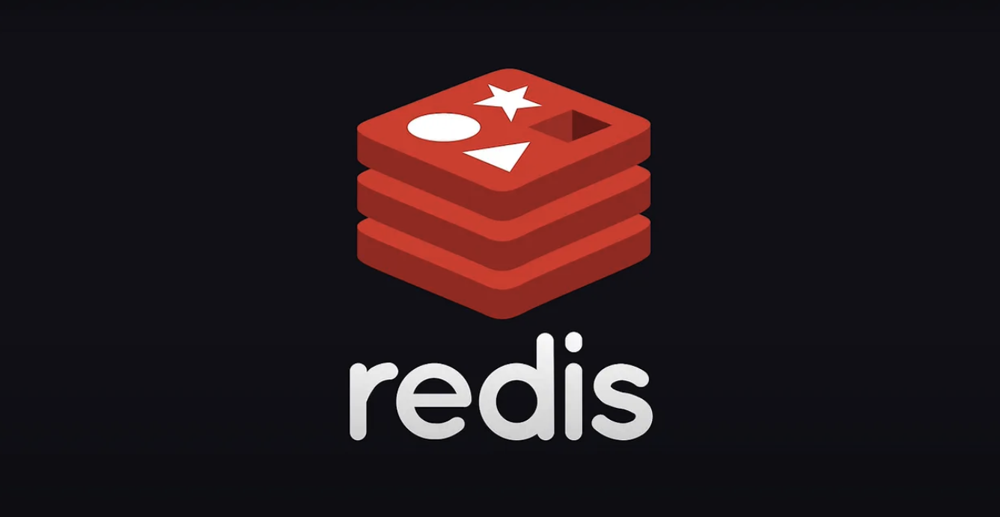
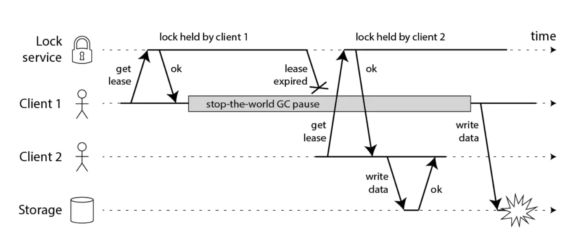

지난 [Redis 분산 락(Distribution Lock)을 구현하여 동시성 해결하기](https://haon.blog/database/redis-distribution-lock/) 에서 다루었듯이, Redis 는 **모니터(monitor) 기반의 상호 배제(mutual exclusion) 기법인 분산 락(Distribution Lock) 을** 제공한다. 이 분산 락은 `RedLock` 알고리즘에 기반하여 구현되어있다. 이 RedLock 알고리즘은 어떠한 방식으로 동작할까? 이를 간단히 학습해보도록 한다.

## Redis SET NX

`RedLock` 은 분산 환경에서 Redis 가 권장하는 락을 제공하는 방법이다. Redis `SET`
 명령어에 `NX 옵션`을 통한 락을 제공하는 방법과 한계, RedLock 의 특징과 한계에 대해 알아보자.

 ~~~
 SET key value NX PX 30000
 // key, value 를 저장하는데 Not Exists 일 경우에만 저장하고, 30초(30,000ms) 동안 유지해줘
 ~~~

Redis 2.6.12 버전 이전에는 `SETNX` 명령어가 제공되었지만, 2.6.12 버전 이후 부터는 SETNX 명령어는 deprecated 되었고, **SET 명령어에 NX 옵션을 전달하는 방향으로 수정했다. NX 옵션을 전달하면 SET 하려는 key 가 없는 경우에만 SET 이 성공한다.** Redis 는 싱글 쓰레드로 동작하기 때문에 여러 프로세스가 공유 자원에 접근할 때 발생하는 동시성 문제를 이 명령어로 해결할 수 있다.

**즉, 먼저 접근한 쓰레드가 NX 옵션을 전달한 SET 에 성공한다면 다른 쓰레드들은 대기한다.** 여기서 다른 쓰레드들이 대기하도록 while 과 같은 루프와 sleep 같은 함수는 개발자가 직접 제공해야 한다. 그리고 락을 획득해 먼저 자원을 선점한 쓰레드는 작업을 끝낸 후 key 를 제거한다. 

~~~
DEL key
~~~

여기서 단순히 `DEL` 명령어로 key 를 삭제하면, 락을 획득하지 않은 다른 클라이언트들도 삭제가 가능하다. 따라서 key 가 존재하고 값이 일치할 때만 삭제할 수 있도록 아래처럼 Lua 스크립트를 통해 삭제할 것을 권장한다.

~~~javascript
if redis.call("get",KEYS[1]) == ARGV[1] then
    return redis.call("del",KEYS[1])
else
    return 0
end
~~~

여기서 문제점은, Redis 가 단일 서버 1대로 동작하면 SPOF 가 된다는 점이다. 이를 위해 Master-Slave 레플리케이션 구조를 도입할 경우, 복제구조가 비동기 방식이기 때문에 Lock 데이터에 대한 정합성 문제(경쟁 상태)가 발생할 수 있다.

## RedLock

**RedLock 은 N대의 Redis 서버가 있다고 가정할 때, 과반 수 이상의 노드에서 락을 획득했다만 락을 획득한 것으로 간주한다.** RedLock 알고리즘 동작은 간단히 설명하면, 아래처럼 동작한다.

- `(1)` 클라이언트가 락을 획득하기 위해 모든 Redis 서버에게 락을 요청한다. 과반 수 이상의 Redis 서버에게 락을 획득하면 락을 획득하게 된다.

- `(2)` 과반수 이상의 락 획득에 실패했다면, 모든 Redis 서버에게 락 해제를 요청하고 일정 시간 후에 락을 획득하기 위해 재시도한다.

### RedLock 은 완벽하지 않다.

RedLock 알고리즘 또한 문제가 발생할 수 있다. 아래 코드는 락을 획득 후 파일에 데이터를 저장하는 코드이다. 

~~~javascript
// THIS CODE IS BROKEN
function writeData(filename, data) {
  var lock = lockService.acquireLock(filename);
  if (!lock) {
    throw 'Failed to acquire lock';
  }

  try {
    var file = storage.readFile(filename);
    var updated = updateContents(file, data);
    storage.writeFile(filename, updated);
  } finally {
    lock.release();
  }
}
~~~

위 코드에서 어떻게 문제가 발생할 수 있을까?

- 클라이언트 A 가 마스터 서버에서 락을 획득한다.
- 클라이언트 A 에서 `Stop-The-World GC` 로 인해 애플리케이션 코드 중지가 발생하고, 그 사이에 락이 만료된다.
- 클라이언트 B 가 분산 락을 획득하고 파일에 데이터를 쓴다.
- 클라이언트 A 가 GC 가 끝난 후 파일에 데이터를 쓰면서 동시성 문제가 발생한다.

글로벌 트랜잭션에 대한 이론은 [글로벌 트랜잭션 (feat. GTID)](https://haon.blog/database/global-transaction/) 에서 다룬적이 있으니, 참고하자. 일반적으로 글로벌 트랜잭션은 매우 빠르게 수행되지만, Stop-the-World 글로벌 트랜잭션은 드물게 락이 만료될 정도로 지속될 수 있다. GC 말고도 네트워크 지연이나 Timing 이슈에 따라 RedLock 이 깨질 수 있음을 유의하자.

RedLock은 Redis가 공식적으로 권장하고 있는 분산 락 알고리즘이다. 이 방법을 사용해 공유 자원에 대한 동시성 문제를 해결할 수 있다. 다만 발생할 확률이 낮기는 하지만 RedLock도 완벽하지 않다는 것은 이해하고 있어야 한다.

## 참고

- https://redis.io/docs/manual/patterns/distributed-locks/
- https://mangkyu.tistory.com/311
