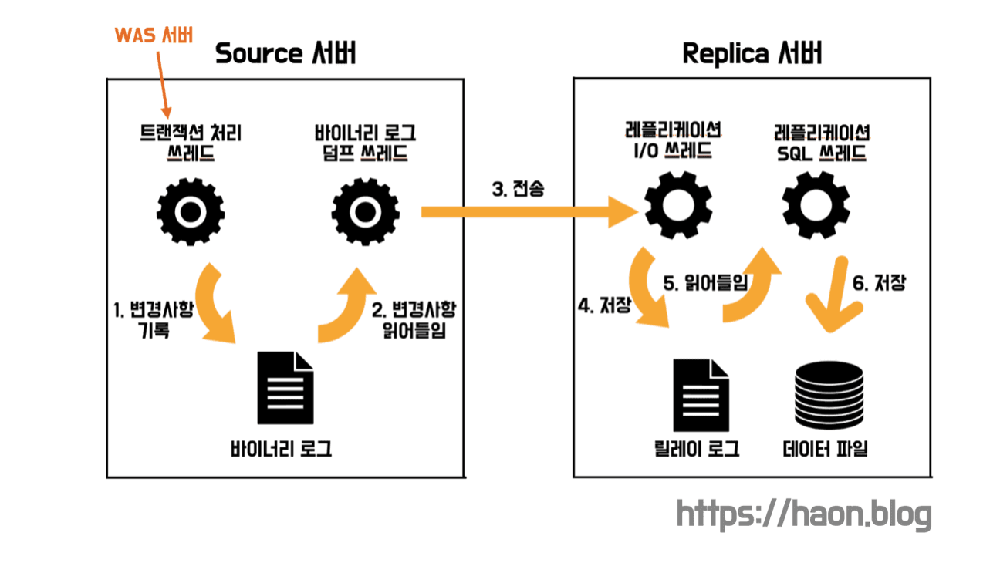
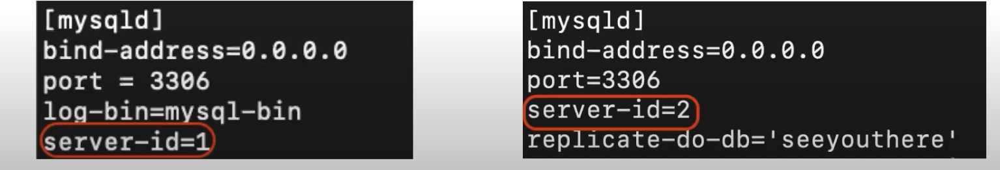
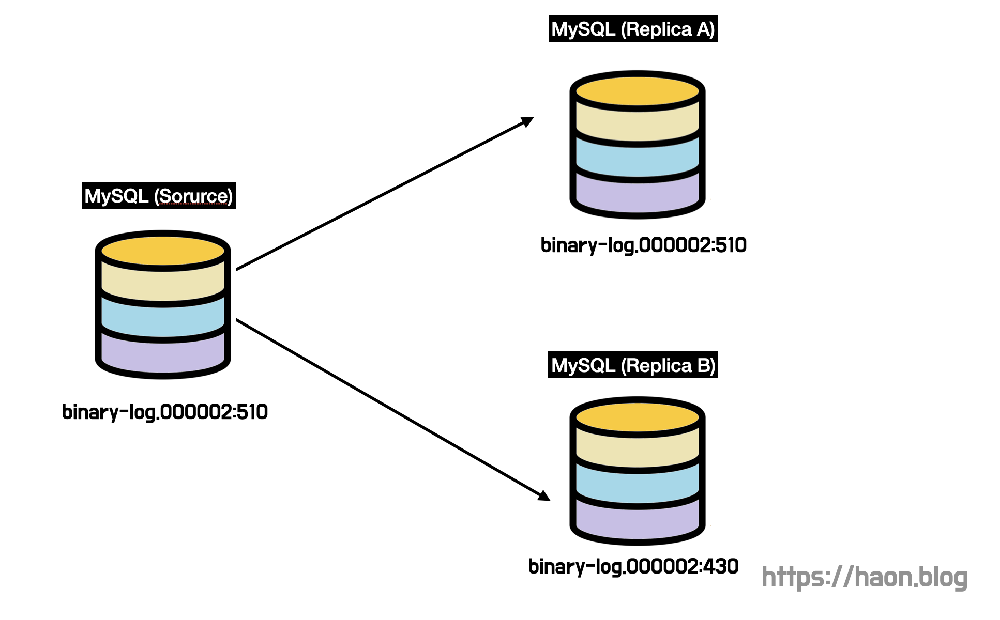
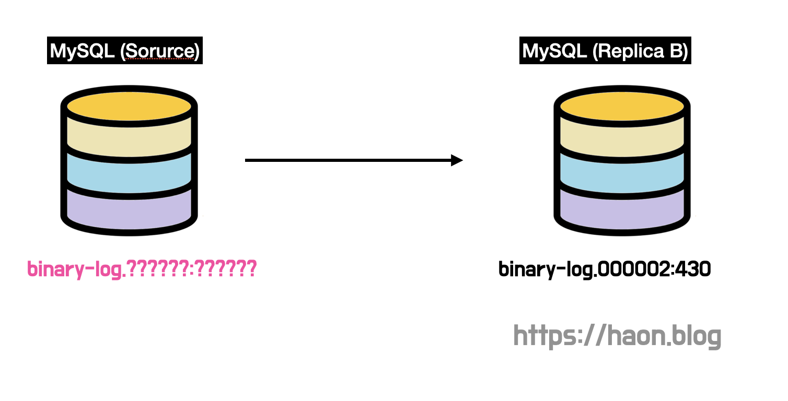

[고가용성과 확장성을 위한 데이터베이스 레플리케이션(DB Replication)](https://haon.blog/database/replication-theory/) 에서 데이터베이스 레플리케이션의 필요성, 그리고 MySQL 기준 레플리케이션 동작 방식에 대해 간단히 다루어보았다. 이번에는 MySQL 레플리케이션의 동작 방식에 대해 더 깊게 학습해보고자 한다.

## MySQL 레플리케이션 아키텍처

지난 포스팅에서 다루었듯이, 데이터베이스 레플리케이션 과정에 크게 3가지 종류의 쓰레드가 참여한다. 이 과정을 다시 요약해보자. 

우선 소스 서버에서 이벤트가 발생했다면 해당 이벤트는 소스 서버내의 바이너리 로그 파일에 기록된다. 기록된 이벤트를 조회하기 위해 레플리카 서버의 **레플리케이션 I/O 쓰레드**가 로그 정보를 요청하고, 요청을 받은 소스 서버의 **바이너리 로그 덤프 쓰레드**는 이벤트를 레플리카 서버에 전송한다. 이후 **레플리케이션 I/O 쓰레드**는 해당 이벤트는 디스크 내의 릴레이 로그 파일에 저장한다. 아직까지는 이벤트가 레플리카 서버에는 반영되지 않는 상태인데, 이를 레플리카 서버에서도 반영하기 위해 **레플리케이션 SQL 쓰레드**가 변경내용을 데이터 파일에 저장한다.

### 레플리케이션 동작 과정

이러한 레플리케이션 동작 과정을 더 상세히 풀어쓰자면 아래와 같다.

- `(1)` **레플리케이션 시작** : 레플리카 서버에서 `START REPLICA` 명령을 실행하면, 레플리카 서버에서 레플리케이션 I/O 쓰레드를 생성한다. (이 쓰레드는 `STOP REPLICA` 명령어를 실행하면 종료된다.)

- `(2)` **바이너리 로그 읽기 및 전송** : 소스 서버에서 발생한 이벤트는 **바이너리 로그(Binary Log)**라는 로그 파일에 기록된다. 앞서 레플리카 서버에 생성된 레플리케이션 I/O 쓰레드는 이벤트가 발생할 때 마다 소스 서버의 바이너리 로그 덤프 쓰레드에게 바이너리 로그(이벤트) 정보를 요청한다. 이떄 소스 서버와 레플리카 서버를 연결할 떄 사용하는 정보는 후술할 **커넥션 메타데이터(Connection Meta Data)** 에 저장되어있다.

요청을 받은 바이너리 로그 덤프 쓰레드는 바이너리 로그 파일에서 이벤트를 읽어오는데, 이때 바이너리 로그 파일을 일시적으로 잠근다. 그리고 이벤트를 모두 읽고 난 뒤 잠금을 해제한다.

- `(3)` **릴레이 로그 생성 및 바이너리 로그 기록하기** : 레플리케이션 I/O 쓰레드는 읽어온 바이너리 로그(이벤트) 정보를 레플리카 서버내에 릴레이 로그 파일에다 쓴다. 그리고 레플리케이션 SQL 쓰레드는 레플리케이션 I/O 쓰레드가 생성한 릴레이 로그에 기록된 이벤트를 읽고 실행한다. 

이때, **레플리카 서버의 I/O 쓰레드와 SQL 쓰레드는 서로 독립적으로 동작**한다. 레플리케이션 SQL 쓰레드의 연산이 지연되어 데이터틀 느리게 반영한다고 해서, 레플리케이션 I/O 쓰레드가 소스 서버로부터 데이터를 읽어오는데는 영향을 주지 않는다. 

또한 **레플리카 서버가 소스 서버의 변경 내역을 반영하는 것은 소스 서버와 독립적으로 동작**한다. 따라서 레플리카 서버에 문제가 발생하더라도 소스 서버는 영향을 받지 않는다. 다만, 소스 서버에 문제가 생기면 그 즉시 레플리카 서버에 애러가 발생하고 레플리케이션이 중단된다. 그런데 이때도 복제 과정만이 중단된 것이기 떄문에 레플리카 서버에서 쿼리는 정상적으로 발생한다. 

하지만 **복제가 중단되는 그 시점부터 소스 서버와 서로 다른 쿼리가 실행되어 다른 데이터를 가지고 있을 수 있기 떄문에 데이터 정합성 문제가 발생**할 수 있다는 점을 유의해야한다. (요약하자면, 레플리카 서버는 고장나도 소스 서버에 영향을 끼치지 않지만, 반대로 소스 서버가 고장나면 레플리카 서버에게 영향을 끼쳐서 레플리케이션이 중단된다.)

### 레플리카 서버의 레플리케이션 관련 메타 데이터

복제 과정이 정상 동작하기 위해, 레플리카 서버는 **릴레이 로그, 커넥션 메타데이터, 어플라이어 메타데이터** 이 3가지 데이터를 관리한다. 

- **릴레이 로그(Relay Log)** : 소스 서버의 바이너리 로그로부터 읽어온 이벤트(트랜잭션) 정보가 저장된다.

- **커넥션 메타데이터 (Connection)** : 레플리카 서버의 I/O 쓰레드가 소스 서버에 연결할 때 사용하는 **데이터베이스 계정 정보**(username, user_password, port 등) 와 **현재 읽고 있는 소스 서버의 바이너리 파일명(File)과 파일 내 위치값(Position)** 등의 데이터가 저장된다. 이 정보는 MySQL 의 `slave_master_info` 테이블에 저장된다.

- **어플라이어 메타데이터 (Applier)** :  레플리카 서버의 SQL 쓰레드는 어플라이어라는 역할을 수행한다. **어플라이어는 릴레이 로그의 이벤트를 레플리카에 실제로 반영하는 역할**을 수행한다. 그리고 어플라이어 메타 데이터는 어플라이어가 최근에 적용한 이벤트에 대해, 해당 이벤트가 저장되어 있는 릴레이 로그 파일명과 파일 내 위치 등의 정보를 담고 있다. SQL 쓰레드는 이 정보들을 바탕으로 레플리카 서버에 나머지 이후 이벤트들을 적용한다. 이 데이터는 `slave_relay_log_info` 에 저장되어 있다. 

## 레플리케이션 복제 타입

레플리카 서버는 바이너리 로그에 기록된 이벤트 중 어떤 이벤트를 실제로 반영해야할지 어떻게 판단할까? 바이너리 로그에 기록된 이벤트를 식별하는 방식에 따라 크게 `(1)` 바이너리 로그 파일 위치 기반 복제 방식 과 `(2)` 글로벌 트랜잭션 ID(GTID) 기반 복제 방식으로 나뉜다. 후술하겠지만, 요즘에는 GTID 기반 복제 방식을 택하고 있다.

### 바이너리 로그 파일 위치 기반 복제

바이너리 로그 파일 위치 기반 복제 방식은 레플리케이션 기법이 MySQL 에 처음 도입되었을 떄 초기 시점부터 제공된 방식이다. 이 방식은 **바이너리 로그 파일명과 파일 내에서의 위치(offset 또는 position)를 통해 이벤트를 식별**한다. 위치 값이란 실제 파일의 바이트 수를 뜻한다. 참고로 복제를 하려면 바이너리 로그가 활성화되어 있어야 한다.

레플리카는 자신이 어떤 바이너리 로그 파일의 어떤 위치(Position) 까지 복제했는지 정보를 관리한다. 그 덕분에 **레플리카는 레플리케이션을 일시 중단하고 다시 재개할 수 있다.** 복제를 중단한 로그 파일의 특정 위치에서부터 복제를 재개하면 된다.

바이너리 로그 파일 위치 기반 복제에서 또 중요한 점은 `server_id` 값이다. 바이너리 로그에는 각 이벤트별로 이벤트가 발생한 서버를 식별하기 위해 `server_id` 값을 저장한다. 디폴트 값은 1인데, 만약 여러 서버가 중복된 `server_id` 값을 가지게 되면 문제가 발생한다. 즉, 레플리케이션 과정에 참여하는 모든 서버는 중복되지 않는 유일한 `server_id` 값을 가져야하는데, 왜 그럴까?

레플리카 서버의 I/O 쓰레드는 소스 서버의 바이너리 로그 덤프 쓰레드로부터 바이너리 로그를 읽어오는 방식으로 동작한다. 만약 소스 서버와 레플리카 서버가 별도의 설정이 없다면 모두 `server_id` 값이 1일 것이다. 그런데, 이벤트를 읽어보니 `server_id` 값이 1이다. 이렇게 된다면 레플리카는 현재 읽어들인 이벤트를 자기 자신으로부터 발생한 이벤트라고 간주하고 반영하지 않는다.

**바이너리 로그에는 항상 소스 서버의 모든 이벤트가 반드시 기록되는 것이 보장되지 않는다.** 바이너리 로그가 비활성화 된 기간이 있을 수도 있고, 용량 확보를 위해 일정 기간이 지난 바이너리 로그를 제거했을 수도 있다. 따라서 레플리카 서버를 구성하기 전에 **mysqldump 와 같은 툴을 이용해서 소스 서버의 데이터를 우선 레플리카 서버에 적재한뒤에 레플리케이션을 구성해야한다.**

### GTID (글로벌 트랜잭션 ID) 기반 복제 

MySQL 5.5 버전까지는 바이너리 로그 파일 위치 기반 복제만 가능했다. 하지만 이후 현재까지 MySQL 버전에선 GTID 방식을 지원하고 있다. 바이너리 로그 파일 위치 기반 복제 방식은 읽어들일 이벤트 식별 과정이 소스 서버에서만 유효하다는 단점이 존재한다. 

이 떄문에 만약 소스 서버에 문제가 생겨서 다른 레플리카 서버게 소스 서버로 승격된 경우, 복제 과정에 참여하는 다른 서버들 모두가 복제를 시작할 위치를 다시 찾아야해서 **FailOver(장애 복구)에 시간이 오래 걸린다. (복제 토폴로지 변경이 어려워진다.)** 즉, 소스 서버에서 발생한 이벤트에 대해 동일한 이벤트가 레플리카 서버에서 동일한 파일명과 위치값으로 항상 저장된다는 보장이 없다. 같은 이벤트임에도 불구하고 다른 바이너리 로그 파일명과 위치값을 가질 수 있다. 절대적으로 특정 이벤트를 식별할 수 있는 식별자가 없다. 

만약 위와 같이 Source 서버 1대, Replica 서버 2대를 배치한 상황을 가정해보자. 현재까지 소스 서버의 바이너리 로그 위치는 `binary-log.000002:510` 이고, 레플리카 서버 A는 실시간으로 이벤트를 잘 동기화하였다. 하지만 레플리카 서버 B가 네트워크 지연 문제로 인해 `binary-log.000002:430` 까지만 동기화된 상태이다. 

이 상황에서 하필 소스 서버에 장애가 발생했다고 해보자. 신속하게 FailOver 를 위해 레플리카 서버 A 를 소스 서버로 승격시킨다. 그런데 바이너리 로그 파일 위치 기반 복제 방식에서는 같은 이벤트라고 한들, 서로 식별 값이 다르다고 했다. 레플리카 서버 B는 `binary-log.0000002:430` 까지만 동기화 되어있다는 정보를 가지고 있지만, 이는 새로운 소스 서버에는 유효하지 않다. 따라서 이 레플리카는 어디서 부터 바이너리 로그를 읽어와야 할지 알 수 없어서, 즉각 동기화가 불가능한 상태가 된다. 이러한 점에서 바이너리 로그 위치 기반 복제 방식은 FailOver 기능이 취약하다. 이로보아, **우리는 어떤 서버에 있던 상관없이 동일한 이벤트를 동일한 식별자로 식별하는 방법이 필요함을 느낄 수 있다.**

이 문제를 해결하기 위해 GTID(Global Transaction Identifier) 기반 복제 방식이 등장했다. **레플리케이션에 참여하는 모든 서버에서 동일한 고유 식별 ID 값을 가지는 방식이다.** 모든 서버의 ID 값은 모두 동일하기 떄문에, 동일한 이벤트에 대해서 동일한 글로벌 트랜잭션 ID 값만 읽어오면 된다. 즉, 각 서버간에 바이너리 로그 파일명 및 위치 값은 각기 다를지라도 GTID 값이 동일하여 같은 이벤트를 식별 가능한 방식이다. GTID 기반 복제 방식은 GTID 값을 통해 이벤트를 식별할 수 있다. 따라서 새로운 소스 서버로부터 레플리카 서버가 즉시 동기화를 시작할 수 있다.

## 복제 토폴로지 방식

소스 서버와 레플리카 서버를 어떻게 구성할 수 있을지 아키텍처 관점에서도 생각해보자.

- **싱글 레플리카(Single Replica)** : 단순하게 소스 서버 1대와 레플리카 서버 1대를 배치하는 싱글 레플리카 구성 방식이 있다. 레플리카 서버는 예비 서버 및 데이터 백업용으로 활용한다.

- **멀티 레플리카(Multi Replica)** : 레플리카 서버를 여러대 배치한 방식인 멀티 레플리카 방식도 존재한다. 즉, 소스 서버 1대와 레플리카 여러대로 배치한다. 만약 레플리카를 2대로 구성한다면 구성하기 나름이지만, 한 서버는 부하 분산을 위한 용도로 사용하고, 다른 서버는 백업용을 위한 서버로 사용할 수 있다.

- **체인 복제(Chain Replication)** : 소스서버에 연결된 레플리카 서버가 많은 경우, 소스 서버에 복제로 인한 부하가 커질 수 있다. 이런 경우 다른 레플리카 서버를 소스 서버로 활용하여 부하를 분산시키도록 구성할 수도 있다. 이 방식은 MySQL 서버를 버전업하거나 중간 장비들을 교채하는 시기에도 유용하게 사용될 수 있을 것이다.

- **듀얼 소스 복제(Dual Source Replication)** : 레플리케이션에 참여하는 두 서버 모두 읽기, 쓰기 연산이 가능한 형태이다. 두 서버 모두 동일한 형태의 데이터를 가지고있고, 트랜잭션 충돌이 일어날 경우 롤백된다. 롤백될 경우 레플리케이션이 중단되기 떄문에 잘 사용되지 않는 구성 방식이다.

- **멀티 소스 복제(Multi Source Replication)** : 레플리카 서버 1대에 소스 서버 여러대가 연결된 형태이다. 소스 서버에 흩어져있는 데이터들은 한 곳에 보아서 데이터를 분석할 때 사용할 수 있다.

### 모행 팀은 어떠한 복제 아키텍처를 구성하였는가?

우리 모행 팀은 레플리케이션 아키텍처 방식 중 **멀티 레플리카(Multi Replica)** 방식을 택했다. 우리가 레플리케이션을 도입한 가장 큰 이유는 부하 분산을 통한 쿼리 성능 개선이다. 데이터베이스를 단일 서버로 배치하면 병목 현상이 발생하여 시스템 전체 성능 저하가 발생할 수 있다는 문제점이 존재하기에, 데이터베이스를 다중화하여 부하 분산을 하는 것이다. 다중화를 통해 사용자 경험 개선을 기대해볼 수 있다.

이 떄문에 멀티 레플리카 방식이 가장 적합하다고 판단했다. 레플리카 서버를 2대를 배치하여, 읽기 쿼리에 대한 성능 개선을 기대하는 방식을 생각했다. 우리 서비스는 몰론, 대부분의 웹 서비스는 쓰기 연산에 비해 조회 연산이 매우 높게 발생한다. 따라서 조회 연산을 담당하는 레플리카 서버를 2대로 다중화하여 부하를 분산하여 성능을 개선하는 방식을 택하였다.

싱글 레플리카 방식으로 구성하는 것을 생각해보았지만, 싱글 레플리카는 우리 목적과 다소 다르다고 생각했다. 싱글 레플리카는 레플리카 서버를 FailOver 와 백업용으로 사용하는 구상 방식이다. 하지만 우리는 부하 분산을 통해 (특히) 조회 쿼리 연산의 성능을 개선하는 것이 주 목적이었기 떄문에, 멀티 레플리카 방식이 더 적합하다고 판단했다.

게다가 레플리카 서버가 여러대라면, 레플리카 서버가 1대 있는 방식에 비해 FailOver 에 유연하게 대응할 수 있을 것이다. 싱글 레플리카 방식일 때, 읽기 쿼리를 부하 분산을 위해 레플리카 서버에 요청한다면, 레플리카 서버가 문제가 발생했을 때에 대한 대비책이 없다. 반면 여러대의 Replica 서버(최소 2개 이상)를 구성하게 되면 한 대의 Replica 서버가 장애가 나면 다른 Replica 서버를 사용하면 된다. 따라서 싱글 레플리카 복제 구성일 때는 대비가 없다는 것이다. (몰론, 이러한 논리로 따지자면 소스 서버 또한 다중화해야할 수 있다고 생각한다. 하지만 아직 소스 서버 1대만으로도 충분히 부하를 견딜 수 있기에 장애가 발생할 가능성이 낮을 것으로 판단했다. 쓰기 연산 특성상 읽기 연산에 비해 요청 비율이 매우 낮기 떄문에, 아직까지는 소스 서버가 1대로 충분히 견딜 수 있는 상황이다.)

## 마치며

아직 레플리케이션을 완전히 내것으로 체화한 느낌이 들지는 않는다. 깊게 공부하고 이해하려고 해도 너무 어려운 것 같다 🥲 이번 포스팅에서는 지나치게 욕심내어 완벽하게 모든 내용을 이해하려는데 힘쓰지 않았다. 다음 포스트에서 차근차근 데이터베이스 레플리케이션에 대해 점진적으로 자세히 다루어볼 생각이다.

## 더 학습해야 할 키워드

- 복제 데이터 포맷 (바이너리 로그 포맷)
- 복제 동기화 방식
- 글로벌 트랜잭션
- 트랜잭션 동기화와 추상화
- JPA 영속성 컨텍스트 Life Cycle

## 참고

- Real MySQL 8.0 - 백은빈, 이성욱
- https://www.youtube.com/watch?v=NPVJQz_YF2A&t=211s
- https://hudi.blog/mysql-8.0-replication-architecture-and-replication-type/
- https://www.youtube.com/watch?v=95bnLnIxyWI