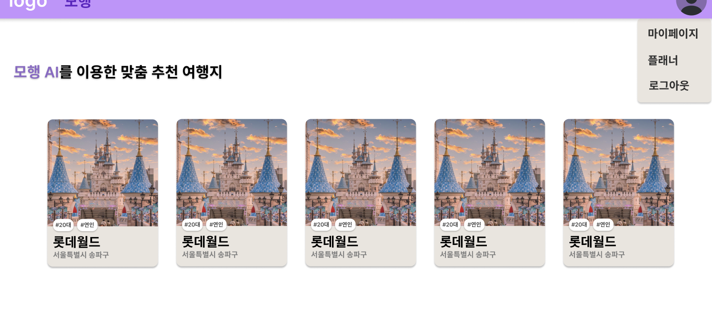
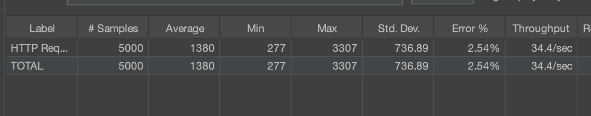
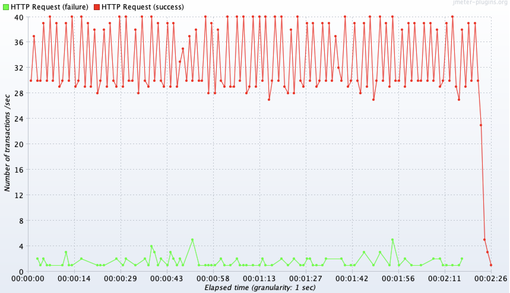
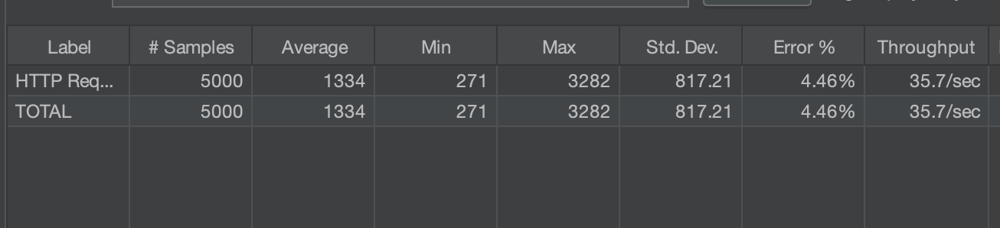
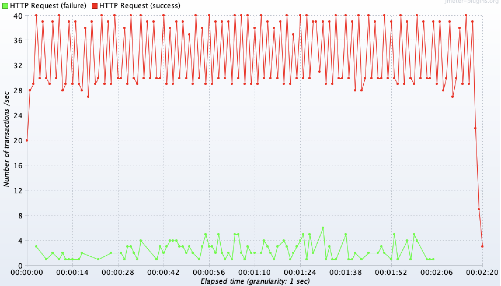
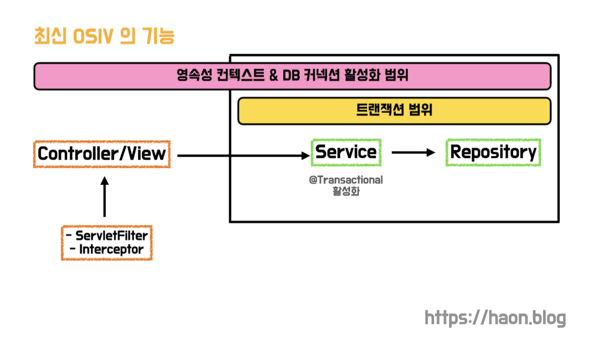
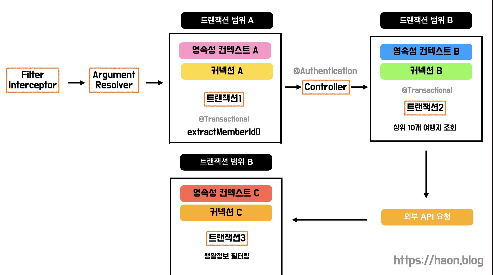
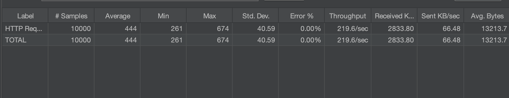
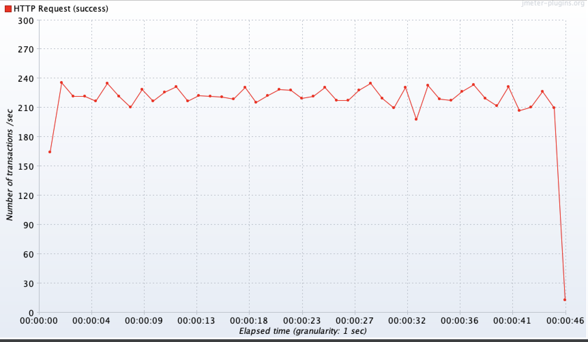

## 외부 API 요청이 DB 커넥션을 점유하여 요청이 지연되는 문제상황

성능 개선에 대한 고민이 많은 우리 팀은, 지난 [HikariCP 와 데이터베이스 커넥션 풀(DBCP) 최적화 고민하기](https://kakaotech-harmony.netlify.app/backend/hikaricp-theory/) 에서 최적의 HikariCP 커넥션 풀링 환경을 고민했다. 하지만 이런 노력에도 불구하고, 메인 페이지에서 가장 많은 조회 요청이 발생하는 AI 맞춤 여행지 추천 API 을 위한 성능 개선이 이루어지지 않아 API 응답 속도가 지연되는 문제가 발생하고 있다.

로컬에서 테스트한 결과, 트래픽이 몰리는 상황에서 AI 모델 서빙 서버에 한번 API 요청을 보내고 응답 받기까지 무려 **1,300ms 가 넘는 시간이 소요**된다. 이는 사용자 경험 측면에서 좋지 않은 상황이다. 

특히, 이 API 를 구성하는 비즈니스 로직에는 외부 서빙 API 를 호출하는 로직뿐 아니라, 데이터베이스내에 저장된 유저 정보를 조회하는 로직까지 함께 포함되어 있다. 따라서 **외부 API 요청을 호출하는 로직 또한 트랜잭션내에서 처리되므로, 외부 API 요청 로직이 불필요하게 데이터베이스 커넥션을 점유하는 문제가 발생하고 있다.** 

또한 메인 페이지에서 가장 많은 조회 요청이 발생한다는 점도 주목해야한다. 이 떄문에 다수의 유저가 동시간대에 API 를 호출할 경우 응답 속도가 더 지연되는 **병목 현상이 발생**한다. 애당초 유저 트래픽이 급증하는 상황에선 데이터베이스내에 병목 현상이 발생할 수 있는 가능성은 충분하기에, 어떤 상황에서 개발하던 간에 병목현상에 대한 대응과 성능 개선이 필요하다. 

이러한 API 요청 로직으로 인해 성능을 어떻게 개선할지 고민이 많았다. 며칠간 고민한 끝에, 우리 팀은 **외부 API 요청시 불필요하게 데이터베이스 커넥션을 점유하는 일이 발생하지 않도록, 외부 API 요청 로직을 트랜잭션에서 분리하여 성능을 개선하는 방법을 고안했다.** 이 내용을 이번 포스트에서 공유해보고자 한다 😎

## AI 맞춤 추천 여행지 조회 API 특성 파악하기

앞서 설명했듯이, 우리 서비스 메인 페이지에선 사용자 정보를 기반으로 AI 맞춤 추천 여행지를 조회할 수 있도록 기능을 제공한다. 이 API 의 특성에 대해 더 자세히 알아보자. AI 맞춤 추천 여행지 조회 API 는 크게 아래와 같은 비즈니스 로직을 거쳐서 요청을 수행한다.

> - `(1)` 데이터베이스에서 가장 최근에 유저가 방문한 상위 10개의 여행지를 가져온다.
> - `(2)` 방문한 상위 10개 여행지 정보를 외부 AI 서빙 모델에 전송하고, 유저에게 알맞은 여행지 리스트를 추천받는다.
> - `(3)` 유저가 선호하는 생활정보 카테고리를 데이터베이스에서 조회한다. 그를 기반으로, 앞서 추천받은 여행지들중에 동일한 생활정보 카테고리를 갖는 여행지들로만 필터링하고 클라이언트에게 응답한다.

처음 AI 맞춤 여행지 조회 기능을 개발했을 떄는, AI 맞춤 결과를 실제 우리 데이터베이스에 저장한 뒤 변경점에 대해 관리할지, 혹은 매 요청마다 AI 모델 서빙 서버 측에서 여행지 정보를 받아올지 고민이 많았다. 즉, 전자의 방식은 외부 API 요청으로부터 추천받은 데이터를 데이터베이스에 저장하고, 기존에 DB 에 저장된 데이터들 중에 달라진 추천 데이터 일부만 변경하는 방식이다. 

하지만, 이 방식은 DB 에 저장한 정보에 대해 매번 지속적으로 싱크를 맞춰줘야하는 번거로움이 존재했다. 게다가 유저가 최근에 방문한 상위 10개 여행지 정보는 자주 변경되어 그에 대한 추천 결과도 매번 자주 달라질 것으로 에상되어, 캐싱이나 인덱스를 적용한 방식으로도 성능 개선이 불가능했다. 캐싱이나 인덱스 적용은 변경이 적고 조회가 많이 발생하는 상황에 적용하기에 적합하므로, 이 개선 방식은 부적합했다. 따라서 우리 팀은 후자의 방식으로 API 개발을 진행했다.

### 데이터베이스 커넥션이 불필요한 부분

다시 본론으로 돌아가, 위 3가지 비즈니스 로직 단계중 DB 커넥션이 필요하지 않은 부분은 어디일까? 바로 `(2)` 번이다. `(1)` 과 `(3)` 과 달리 외부 API 를 요청하는 `(2)` 단계의 경우 추가적인 네트워크 비용만이 발생할 뿐, 데이터베이스를 접근할 필요가 없다. 실제로 작성된 코드 일부를 표현하자면 다음과 같다.

~~~java

@Transactional(readOnly = true)
@Service
public class RecommendTripService {
    // ...

    public FindTripsResponse findRecommendTripsByModel(final long memberId) {
        final TripFilterStrategy tripFilterStrategy = tripFilterStrategyProvider.findTripsByFilterStrategy(PREFERRED_LOCATIONS_STRATEGY);
        final List<Trip> filteredTrips = tripFilterStrategy.execute(new PreferredLocationsFilterInfo(memberId));
        return new FindTripsResponse(tripKeywordRepository.findByTrips(filteredTrips));
    }
~~~

위와 같이 서비스 계층에서 `tripFilterStrategy.execute()` 를 호출하고 있다. `execute()` 를 호출함으로써 앞선 AI 맞춤 여행지 조회 로직이 수행된다. 여기서 가장 중요한점은, 여행지 조회 로직이 `@Transactional(readOnly=true)` 에 묶여서 트랜잭션으로 수행된다는 점이다.

~~~java

@Component
public class TripPreferredLocationsFilterStrategy implements TripFilterStrategy {
    private final PreferredLocationsByFilterFinder preferredLocationsProvider;
    private final ExternalRecommendModelClient externalRecommendModelClient;    

    // ...

    @Override
    public List<Trip> execute(final FilterStandardInfo filterStandardInfo) {
        // ...
    }

    private List<Trip> findRecommendTripsByModelClient(final Map<Long, Long> preferredLocations, final long memberId) {
        // (1) DB 를 조회하여 상위 10개의 여행지 조회
        final List<RecommendTripsByVisitedLogsRequest.LocationPreference> locationPreferences = preferredLocations.entrySet().stream()
                .map(preferredLocation -> new RecommendTripsByVisitedLogsRequest.LocationPreference(preferredLocation.getKey(), preferredLocation.getValue()))
                .collect(Collectors.toList());

        // (2) 외부 API 호출
        final RecommendTripsByVisitedLogsResponse response = externalRecommendModelClient.recommendTripsByVisitedLogs(
                new RecommendTripsByVisitedLogsRequest(locationPreferences)
        );

        // (3) DB 를 조회하여 생활정보 필터링
        return filterTripsByLiveinformation(response, memberId);
    }
}
~~~

그리고 AI 맞춤 여행지 조회 구현체 일부 코드를 살펴보면 위와 같다. 코드에 집중하기보다 해당 코드가 어떤 역할을 수행하는지에만 집중해보자. 주석을 살펴보면 `(2)` 번에서 데이터베이스 커넥션을 필요한 로직이 앞선 `@Transactional(readOnly=true)` 로 인해 트랜잭션 내에서 수행되고, 불필요하게 커넥션을 점유한다는 것을 알 수 있다.

### 외부 리소스 조회 API 의 문제점

이러한 외부 리소스 조회는 추가적인 네트워크 비용이 발생한다. 특히 그 네트워크 지연 속도가 길어질수록 다른 요청에도 영향을 끼칠 수 밖에 없다. **외부 API 요청시 불필요한 커넥션을 잡고있는데, 이로인해 다른 쓰레드에서 데이터베이스 연산을 수횅하기 위해 커넥션을 얻고자 대기하는 시간이 길어지게 된다.** 결국 트래픽이 몰리면 외부 요청이 트랜잭션내에서 수행됨으로 인해 예상치못하게 데이터베이스내에 커넥션이 모자른 현상이 발생할 수 밖에 없다. HikariCP 와 같은 커넥션 풀에서 제공하는 커넥션 갯수는 한정적이기 떄문이다.

## 트랜잭션 분리를 통한 성능 개선 시도

이러한 이유로 외부 요청을 트랜잭션 외부로 분리하여 불필요하게 커넥션을 잡고있는 시간을 제거할 필요성을 느낄 수 있다. 위 코드는 아래와 같이 로직을 개선할 수 있었다. 기존에 컨트롤러에서 서비스 계층을 호출했다면, 이젠 `TripPreferredLocationsFilterStrategy` 를 직접 호출한다. 

서비스 계층은 `@Transactional(readOnly=true)` 를 잡고 있기에 모든 비즈니스 로직을 트랜잭션으로 묶어서 수행시킨다. 반면, `TripPreferredLocationsFilterStrategy` 는 트랜잭션 어노테이션 없이 수행되기 때문에, 필요한 일부 비즈니스 로직에 대해서만 트랜잭션을 걸어 연산을 수행시킬 수 있다. 이렇듯 트랜잭션이 필요한, 즉 데이터베이스 연산이 필요한 로직에 대해서만 `@Transactional` 어노테이션을 사용하여 커넥션을 얻을 수 있도록 개선하였다.

~~~java
@RequestMapping("/api/recommend")
@RestController
public class RecommendTripController {
    private final RecommendTripService recommendTripService;
    private final TripFilterStrategyProvider tripFilterStrategyProvider;
    // TripFilterStrategyProvider 는 TripPreferredLocationsFilterStrategy 를 호출하는 컴포넌트
    
    // ...

    @GetMapping
    public ResponseEntity<FindTripsResponse> findRecommendTripsByModel(@Authentication final Accessor accessor) {
        final TripFilterStrategy tripFilterStrategy = tripFilterStrategyProvider.findTripsByFilterStrategy(PREFERRED_LOCATIONS_STRATEGY);
        return ResponseEntity.ok(
            new FindTripsRespones(tripFilterStrategy.execute(new PreferredLocationsFilterInfo(accessor.getId())));
        );
    }
}
~~~

## TPS 를 측정하여 성능 테스트

[서버 성능 최적화를 위한 성능 테스트(Performance Test) 환경 구축](https://kakaotech-harmony.netlify.app/backend/performance-test/) 에서 다루었듯이, 우리 팀은 성능 개선의 객관적인 지표를 확인할 수 있도록 `TPS(Transaction Per Seconds)` 를 측정하고 있다. 참고로 HikariCP 설정은 개발용 서버 기준으로 지난 포스트에서 다룬 내용을 아래와 같이 그대로 적용하였다. 각 환경과 상황에따라 커넥션 풀 사이즈를 적절하게 조정하면 될 것이다.

~~~yml
spring:
  datasource:
    hikari:
      maximum-pool-size: 5
      connection-timeout: 3000
~~~

### 트랜잭션에서 외부 API 요청을 분리하지 않은 경우

Jmeter 툴을 사용하여 TPS 측정 결과를 실제로 확인하였는데, 우선 트랜잭션 밖으로 외부 API 요청을 분리하지 않았을 떄의 결과는 아래와 같이 약 `34.8/sec` 가 측정되었다. 평균 응답속도를 확인해보니 약 `1380ms` 로 느린 속도를 보이고 있다. 이는 사용자에게 큰 불편함을 안겨줄 것이다. 또한 요청 수에 비해 담당할 수 있는 쓰레드 개수와 커넥션 개수가 한정적이다보니, 일부 요청을 처리하지 못하여 약 2.54% 의 애러율도 측정되었다. 

우리는 트랜잭션에서 외부 API 요청을 분리했을 떄를 더 개선된 TPS 처리율을 기대해보았다.

### 트랜잭션에서 외부 API 요청을 분리한 경우

하지만 기대와 달리, 트랜잭션을 분리했을 떄와 하지 않았을 떄의 TPS 측정 결과가 거의 동일하게 `35.7/sec` 로 도출된 결과를 확인할 수 있다. 평균 응답속도 또한 `1334ms` 로 별반 차이가 없다. 왜 이렇게 동일한 결과가 도출된 것일까? 🤔

## 😤 대체 왜 성능 개선이 안되는거야!?

외부 API 요청을 트랜잭션에서 분리했을 떄와 분리하지 않았을 때 차이가 없다는 뜻은, **결국 데이터베이스 커넥션의 생명 주기를 비슷하게 가져가고 있다는 뜻으로 해석할 수 있다.** 우리 팀이 이렇게 로직 구성을 변경한 이유는, 데이터베이스 커넥션 생명 주기를 짧게 가져가기 위함이다. 커넥션을 잡고있는 짧아야지만 또 다른 쓰레드가 커넥션을 대기시간 없이 획득하고, 빠른 연산 처리후 커넥션을 반납하는 구조로 돌아갈 수 있기 떄문이다. 하지만 이 기대와 달리 스프링 애플리케이션이 구동되지 않고 있었다.

## 원인은 JPA OSIV (Open Session In View)

왜 커넥션 생명주기가 거의 동일하게 측정되는 것일까? 원인은 생각보다 가까운 곳에 있었다. 바로 JPA 에서 제공하는 `OSIV` 가 활성화되어 있어서 커넥션 생명주기에 문제가 있었던 것이었다. 정말 다행히도, 지난 레플리케이션 DataSource 라우팅 환경을 구축하면서 JPA OSIV 이슈에 관한 트러블슈팅을 만난적이 있었기 떄문에 원인을 생각보다 빨리 찾아낼 수 있었다. 

> 💡 JPA OSIV 와 관련한 자세한 이론과 DB 레플리케이션 트러블슈팅은 [DB 레플리케이션 환경에서 DataSource 라우팅이 안되는 이슈 해결기 😤 (feat. JPA OSIV)](https://kakaotech-harmony.netlify.app/backend/replication-osiv-issue/) 을 참고하자.

지난 포스팅에서 설명했듯이, 스프링은 기본적으로 OSIV 를 활성화시킨다. OSIV 가 제공하는 이점이 많았기 떄문이다. 현재 OSIV 방식은 프레젠테이션 계층에서 **지연 로딩(Lazy Loading)** 을 사용할 수 있게 해주며, 엔티티를 프레젠테이션에서 변경할 수 없게 한다. 여러가지 이점들로 인해 현재 OSIV 방식은 프레젠테이션 계층부터 레포지토리 계층에 거친 모든 계층에서 영속성 컨텍스트가 계속 유지된다.

또한 **영속성 컨텍스트는 데이터베이스 연결을 위해 커넥션 풀에서 커넥션을 획득하는데, 획득환 커넥션은 영속성 컨텍스트가 유지되는 시간동안 반납되지 않는다.** 그런데 OSIV 활성화 상태에선 영속성 컨텍스트가 전 계층에서 살아있다고 했기 때문에, `@Transactional` 어노테이션을 최초로 마주했을 떄 얻은 커넥션을 절대 반납하지 않고 끝까지 유지한다.

### Argument Resolver 를 사용하는 상황

지난번에 설명했듯이, 우리 팀은 `ArgumentResolver` 를 사용하여 로그인 처리를 하고있다. `AuthService` 내의 `extractMemberId()` 를 호출하게 되어, 서비스 계층내의 `@Transactional` 을 일찌감치 마주하게 되므로 커넥션을 재빨리 획득하고, 한번 잡은 커넥션을 절대 놓지 않는다. 또 다른 비즈니스 로직을 수행하면서 `@Transactional` 을 또 다시 마주해도 동일한 하나의 커넥션으로 요청이 수행되는 것이다.

~~~java
@Component
public class AuthenticationArgumentResolver implements HandlerMethodArgumentResolver {
    private final AuthService authService;
    private final AuthenticationBearerExtractor authenticationBearerExtractor;

    // ...

    @Override
    public Accessor resolveArgument(
            final MethodParameter methodParameter,
            final ModelAndViewContainer modelAndViewContainer,
            final NativeWebRequest nativeWebRequest,
            final WebDataBinderFactory webDataBinderFactory) {
        final HttpServletRequest request = nativeWebRequest.getNativeRequest(HttpServletRequest.class);

        if (request == null) {
            throw new BadRequestException("잘못된 HTTP 요청입니다.");
        }

        final String accessToken = authenticationBearerExtractor.extract(request);
        final Long id = authService.extractMemberId(accessToken);
        return new Accessor(id);
    }
}
~~~

이로 인해 Argument Resolver 에서 얻은 커넥션이 모든 요청을 수행하고 종료되기 전까지 그대로 유지되는 현상이 발생한 것이다.

### OSIV 비활성화 하기

원인을 찾았으니, `application.yml` 에서 OSIV 를 비활성하였다. OSIV 를 비홠성화 했으므로 앞선 로직은 아래와 같이 트랜잭션 별로 커넥션 생명주기를 가지게 될 것이다.

~~~yml
spring:
  jpa:
    open-in-view: false
~~~

참고로 현재 개발용 서버에는 OSIV 가 비활성화되어 있으나, 로컬 프로파일에는 OSIV 에 관한 비활성화 설정이 따로 없었다. 애당초 개발용 서버에는 레플리케이션시 정상적으로 DataSource 를 라우팅하기 위해 OSIV 를 비활성화 했었으나, 로컬에선 레플리케이션 환경을 구축하지 않았기 떄문에 OSIV 를 굳이 비활성화 할 필요가 없어서 설정을 따로 진행하지 않았다. 

만약 로컬에서 성능 개선을 직접 확인하지 않고 바로 개발용 서버에 코드를 반영한 뒤 TPS 측정했다면, 운이 좋게도 개발 서버는 이미 OSIV 가 비활성화 되어 있으므로 정상적으로 TPS 측정량이 개선되고 성능 개선이 되었을 것이다. 우리 팀의 경우 로컬에서 성능 개선 확인없이 개발용 서버에 코드를 반영하여 성능 테스트를 진행하는 것도 다소 무모한 짓이라 생각했기에, 로컬에서 성능 개선을 확인한 후 개발용 서버에 코드를 반영하고 더 정확한 성능 측정을 수행했다. 혹여나 개발용 서버에서만 TPS 성능을 측정하고 로컬에선 진행하지 않았더라면, 이번 트러블슈팅을 만나지 못하고 OSIV 를 비활성화하여 성능 개선이 가능했음을 전혀 깨닫지 못했을 것이다 🙂

## OSIV 비활성화 후 실제 성능 개선 확인

동일한 성능 테스트 환경에서 외부 API 요청을 트랜잭션에서 분리했을 떄와 안했을 떄의 TPS 처리량을 확인했다. 그 결과, 보듯이 TPS 측정 결과값이 `219.6/sec` 가 도출되었다. 결과적으로 성능 개선 시도전 `34.8/sec` 에서 `219.6/sec` 로 약 6.1배 극명하게 개선된 것을 확인할 수 있다. 또한 평균 응답속도을 확인했을 때 `1,380ms` 에서 `444ms` 로 약 3.1배 개선되었다 😎

## 마치며

OSIV 설정은 스프링에서 기본적으로 활성화시키기 떄문에 이에 대해 인지하지 못할 수 있다. 만약 로컬에서 성능 개선 확인없이 무모하게 개발용 서버에 코드를 반영해버렸다면, OSIV 개념의 중요성에 대해 다시금 학습하지 못했을 수도 있다. 

만약 커넥션 반납을 빠르게 해야 한다면 오랜시간 커넥션을 유지하는 OSIV 설정은 바람직하지 않을 수 있다. 이 또한 서비스가 어떤 시점에 커넥션을 필요로 하는지 더 고민해봐야 겠다.