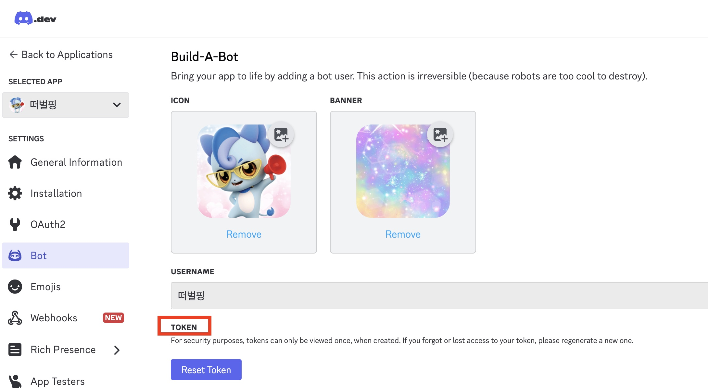
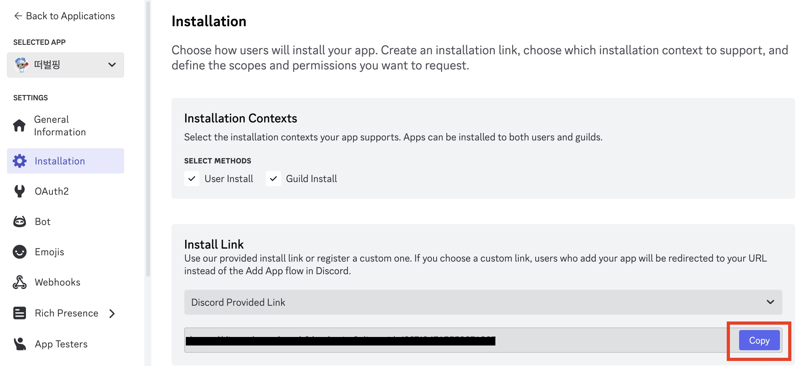
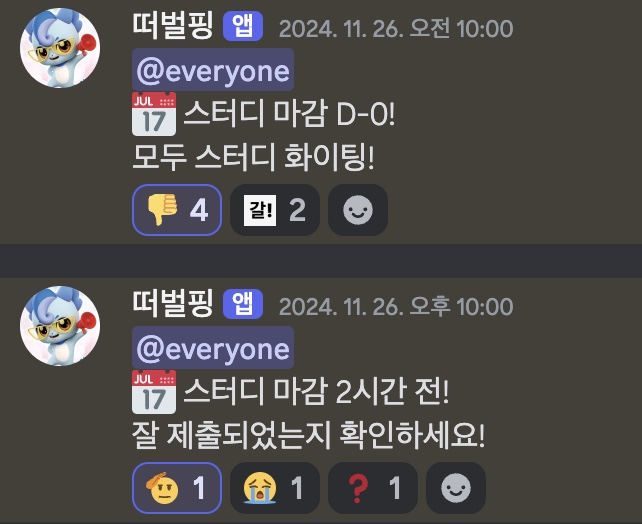

하모니 팀에서는 코딩 테스트 스터디를 매주 수요일에 마감합니다. 이를 효율적으로 관리하기 위해 팀 디스코드 채널에서 스터디 마감일을 자동으로 알려주는 디스코드 봇을 만들었습니다.
초기에는 단순히 알림 기능을 제공하는 봇을 생성해 사용했으나, 현재는 데일리 스크럼 기능도 추가하여 다양하게 활용하고 있습니다.

이번 글에서는 위와 같이 원하는 기능을 추가하여 디스코드에서 다양하게 활용할 수 있는 디스코드 봇을 어떻게 만들 수 있는지 정리해보았습니다.

---

## 디스코드 봇 생성 방법

디스코드 봇을 만드는 방법은 크게 두 가지로 나뉩니다.

- GitHub Actions(CI/CD)와 Discord 웹훅을 사용하는 방법
- AWS EC2와 같은 서버에서 백그라운드로 실행하는 방법   

첫 번째 방법은 설정이 간단하고 빠르게 구현할 수 있지만, 웹훅을 사용하는 특성상 일정한 딜레이가 발생할 수 있습니다.
두 번째 방법인 AWS EC2와 같은 서버에서 실행하는 방식은 초기 설정이 다소 복잡하고 추가 비용이 발생할 수 있지만, 정확성과 실시간성을 요구하는 경우 더 적합합니다.

따라서 특정 시간에 알림을 정확히 전송해야 하는 스터디 알림 봇의 특성을 고려했을 때, AWS EC2 방식이 더 적합하다고 판단하여 이 방법을 선택했습니다.

## 초기 설정 단계

**1. [Discord Developer Portal](https://discord.com/developers/applications)에서 봇 생성**

디스코드 봇을 만들기 위해서는 Discord Developer Portal에서 봇 생성 및 설정 후 추후 필요한 봇 Token과 채널 ID를 저장해야합니다.

Discord Developer Portal에서 봇을 생성한 다음 해당 봇 Token을 저장합니다. 

Installation에서 Install Link에 있는 url로 들어가면 디스코드에서 앱을 원하는 서버에 추가할 수 있습니다. 원하는 서버에 디스코드 봇 추가 후 메시지를 보낼 채널을 설정하고 해당 채널의 ID를 복사합니다.

**2. 디스코드 알림봇 개발 및 봇 토큰과 알림을 보낼 디스코드 채널 ID 설정**

먼저 .env 파일에 봇 토큰과 채널 ID를 추가하고 원하는 기능을 개발합니다.
스터디 알림 메시지와 데일리 스크럼 메시지를 보내는 함수를 작성한 후 각 알림마다 시간을 설정합니다. 이후 봇을 실행시켜 미리 설정한 시간에 설정한 채널에서 메시지 알림이 오는 코드를 작성합니다.
```python
@bot.event
async def on_ready():
    print(f'{bot.user}로 로그인되었습니다.')

    # 스터디 알림 스케줄 추가
    scheduler.add_job(lambda: asyncio.create_task(study_alarm("mon")), CronTrigger(day_of_week="mon", hour=10, minute=0))
    scheduler.add_job(lambda: asyncio.create_task(study_alarm("tue_am")), CronTrigger(day_of_week="tue", hour=10, minute=0))
    scheduler.add_job(lambda: asyncio.create_task(study_alarm("tue_pm")), CronTrigger(day_of_week="tue", hour=22, minute=0))

    # 데일리 스크럼 스케줄 추가
    scheduler.add_job(lambda: asyncio.create_task(todo_mes()), CronTrigger(hour=9, minute=0))

    scheduler.start()

bot.run(BOT_TOKEN)
```

**3. GitHub에 코드 업로드**

단, 환경 변수인 봇 토큰과 채널 ID는 .env파일에 두어 .gitignore를 이용해 GitHub에 올라가지 않도록 주의합니다!

**4. AWS EC2 서버 생성 및 서버에 GitHub 코드 클론**

이번에는 AWS EC2의 프리티어를 활용하여 작업했습니다. 해당 서버에 접속하여 GitHub에 코드 업로드한 디스코드 봇 코드를 클론받습니다.

**5. 서버에 필요한 소프트웨어 설치(Python, 디스코드 봇 라이브러리)**

이번 디스코드 봇은 Python 언어로 개발하여 Python과 디스코드 봇 라이브러리를 서버에  설치해야합니다.

**6.서버에서 환경 변수 설정 및 권한 설정**

봇 토큰과 알림을 보낼 디스코드 채널 ID를 환경 변수 파일에 추가합니다. 해당 파일은 `chmod 600`로 권한을 설정합니다.

```bash
# 봇 토큰과 채널 ID 환경 변수 추가
export DISCORD_BOT_TOKEN="디스코드 봇 토큰"
export DISCORD_CHANNEL_ID="디스코드 채널 ID"
```

**7. 가상환경 생성 및 활성화 및 백그라운드 실행**

Python의 특성상 가상환경은 프로젝트 간 의존성 관리 및 코드 일관성을 유지하는 데 매우 유용합니다. 따라서 환경 변수를 설정하고 활성화한 다음 `nohup`을 이용하여 디스코드 봇 코드를 백그라운드로 실행합니다. 

**8. 디스코드 채널에서 결과 확인하기!**

7번까지 모든 설정을 완료하면 다음과 같이 설정한 채널에서 디스코드 봇이 지정된 설정한 시간에 맞춰 메시지를 전송합니다.




## 수정해야할 부분

### Docker 이용하기
아무리 생각해도 서버에서 초기에 설정해야할 부분이 너무 많고 복잡합니다. 이러한 번거로움을 해결하기 위해 Docker를 활용하여 5~7번 과정을 수정해봅시다! 

아래와 같은 Dockerfile과 Docker Compose를 통해 5~7번 과정들을 한번에 설정할 수 있습니다.

Dockerfile에서는 `requirements.txt`에서 디스코드 봇 라이브러리를 포함해 프로젝트에 필요한 Python 패키지를 명시하여 필요한 소프트웨어 설치를 간단하게 설치합니다. 또한 도커 컨테이너는 기본적으로 백그라운드에서 실행하여 `nohup`으로 백그라운드에서 실행하지 않아도 됩니다.

```Dockerfile
FROM python:3.9-slim

WORKDIR /app

# 시스템 업데이트 및 필수 도구 설치
RUN apt-get update && apt-get install -y \
    vim \
    && apt-get clean \
    && rm -rf /var/lib/apt/lists/*

# 애플리케이션 코드 복사
COPY . .

# 필요한 소프트웨어 설치
RUN pip install --no-cache-dir --upgrade pip \
    && pip install --no-cache-dir -r requirements.txt

# 실행 파일 권한 설정
RUN chmod +x alarmbot.py

CMD ["python3", "alarmbot.py"]
```

Docker Compose를 활용하면 Docker 컨테이너 환경에 서버에서 설정된 환경 변수(.env)를 가져와 설정하고 간단하게 실행할 수 있습니다. `docker-compose up -d` 명령어로 빌드와 실행을 한번에 처리할 수 있습니다.
```yaml
version: '3.8'

services:
  discord-bot:
    build:
      context: .
    environment:
      DISCORD_BOT_TOKEN: "${DISCORD_BOT_TOKEN}"
      DISCORD_CHANNEL_ID: "${DISCORD_CHANNEL_ID}"
    container_name: discord-bot
    restart: unless-stopped
```

## 마치며
오늘은 디스코드 봇을 활용하여 특정 시간에 메시지를 보내는 디스코드 봇을 설정하는 방법에 대해 살펴보았습니다. 추후에는 AWS EC2가 아닌 [replit](https://replit.com/)과 같은 무료 웹 호스팅 서비스를 이용하면 비용에 대한 걱정 없이 운영할 수 있을 것 같습니다. 또한 다양한 api 등을 활용하여 팀 프로젝트에 다양하게 활용할 수 있는 디스코드 봇도 개발하면 좋을 것 같습니다. 🫡