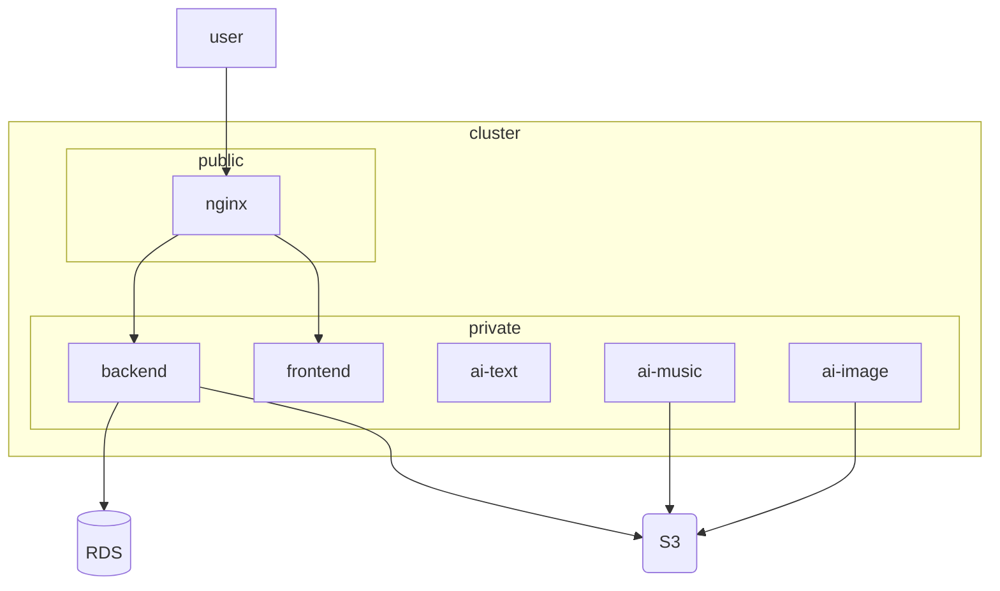

## 0. 프롬프팅 전략

- 분량이 많아 gpt의 최대 컨텍스트가 초과할 위험이 있기때문에 할루시네이션 최소화를 위해 메인 모델(o1 preview) 채팅은 1개의 채팅으로 유지함. 또한 전체적인 설계를 맡김
- 최초설계 단계별 세부 구현사항은 o1 mini모델을 사용해서 더 작은 단위로 쪼개고, 오래걸리는 작업과 우선순위가 높은 작업을 분류함
- 작업하면서 발생하는 에러와 트러블 슈팅은 생성속도가 빠른 gpt4o로 해결시킴

### 0-1. 프롬프팅 (o1 preview)

- 자세히보기

  ```docker
  쿠버네티스 클러스터 설계를 위해 조건을 두가지로 나누어 제공한다.
  gpt는 시스템 설계자로서 구성에 필요한 모든 코드와 단계를 빠짐없이 제공해야한다.

  목적 : 컨테이너화 된 애플리케이션을 구동하고 서빙한 뒤 아키텍처를 그리고 발표
  기간 : 2일 이내에 완전히 구축하여 서빙 필요

  애플리케이션 [세부 사양]과 [현재 상황]은 다음과 같다.

  [애플리케이션 세부 사양]

  - 백엔드 spring boot 단일 서버
  - 외부 ai요청을 호출하는 파이썬 fastapi 모듈 3개
  - 프론트 코드 용도로 정적 빌드된 nextjs (리액트) 애플리케이션

  [현재 상황]

  - 5개 각각의 애플리케이션의 도커 이미지가 CI로 구현되어 GHCR에 이미 업로드 되어있음
  - 각 팀원의 쿠버네티스 이해도가 낮아서 gpt의 도움을 받아 구축할 예정
  - 각 팀원이 로컬에서 사용하는 도커, 컨테이너 이미지와 런타임, 리눅스 자체에 대한 이해도는 높음

  gpt의 도움을 받아서 구축할 쿠버네티스의 [인프라 요구사항]은 다음과 같다.

  [인프라 요구사항]

  - EKS 활용
  - 비용은 신경쓰지 않아도 됨
  - Terraform 사용하고 소규모에 적합한 사양의 리소스를 추천
  - Argo CD로 CD구축
  - Helm 사용, chart도 가능하다면 구현
  - 애플리케이션 별 별도의 환경변수의 주입필요
  - 최소 고가용성을 보장해야함
  - 스케일링 적용, 소규모에 적합한 수준의 리소스를 추천

  [예상가능한 병목이나 에러지점]

  - 쿠버네티스의 노드연결이나 네트워크 연결에 대한 지식 부족
  - AWS같은 특정 벤더에서 EKS를 사용하기 위한 틀정 권한 설정, 부여에 대한 지식 부재 (Role)
  - 처음보는 명령어에 대한 생소함
  ```

### 0-2. GPT의 추천 쿠버네티스 구축 순서

- **EKS 클러스터 생성**: Terraform을 사용하여 AWS에 EKS 클러스터를 생성합니다.
- **Helm 차트 작성 및 배포**: 각 애플리케이션에 대한 Helm 차트를 작성하고 쿠버네티스에 배포합니다.
- **Argo CD 설정**: Argo CD를 설치하여 GitOps 방식으로 Continuous Deployment를 구현합니다.
- **환경변수 설정**: 애플리케이션별로 필요한 환경변수를 ConfigMap과 Secret으로 주입합니다.
- **고가용성 및 스케일링 설정**: 최소한의 고가용성을 보장하기 위해 Replica 설정 및 오토스케일링을 구성합니다.

## 1. 테라폼

### 1-1. 프롬프팅 (o1 mini)

- 자세히보기

  ```docker
  eks 클러스터 설계 후 구현하는 도중 다음 단계에 대한 세부 구현을 작성하려고 한다.

  [전체단계]
  1. EKS 클러스터 생성 : Terraform을 사용하여 AWS에 EKS 클러스터를 생성합니다.
  2. Helm 차트 작성 및 배포
  3. Argo CD 설정
  4. 환경변수 설정
  5. 고가용성 및 스케일링 설정

  위 단계중 [1. EKS 클러스터 생성]을 진행하려고 한다. 아래 템플릿을 더 구체적으로, 명령어와 함께 제공하라
  필요한 모든 도구에 대한 설치가이드와 구현도중 에러도 추후 제공하여야한다.

  [템플릿]
  ---
  providers.tf

  provider "aws" {
    region = "ap-northeast-2" # 원하는 AWS 리전으로 변경
  }

  provider "kubernetes" {
    host                   = aws_eks_cluster.eks.endpoint
    cluster_ca_certificate = base64decode(aws_eks_cluster.eks.certificate_authority.0.data)
    token                  = data.aws_eks_cluster_auth.eks.token
  }

  providers.tf

  variable "cluster_name" {
    default = "my-eks-cluster"
  }

  variable "node_instance_type" {
    default = "t3.medium"
  }

  variable "desired_capacity" {
    default = 3
  }

  variable "max_capacity" {
    default = 5
  }

  variable "min_capacity" {
    default = 2
  }

  ---
  main.tf

  resource "aws_eks_cluster" "eks" {
    name     = var.cluster_name
    role_arn = aws_iam_role.eks_cluster_role.arn

    vpc_config {
      subnet_ids = aws_subnet.eks_subnet[*].id
    }
  }

  resource "aws_eks_node_group" "eks_nodes" {
    cluster_name    = aws_eks_cluster.eks.name
    node_group_name = "${var.cluster_name}-node-group"
    node_role_arn   = aws_iam_role.eks_node_role.arn
    subnet_ids      = aws_subnet.eks_subnet[*].id

    scaling_config {
      desired_size = var.desired_capacity
      max_size     = var.max_capacity
      min_size     = var.min_capacity
    }

    instance_types = [var.node_instance_type]
  }

  # EKS 클러스터용 IAM 역할 생성
  resource "aws_iam_role" "eks_cluster_role" {
    name = "eksClusterRole"

    assume_role_policy = data.aws_iam_policy_document.eks_cluster_assume_role_policy.json
  }

  data "aws_iam_policy_document" "eks_cluster_assume_role_policy" {
    statement {
      actions = ["sts:AssumeRole"]

      principals {
        type        = "Service"
        identifiers = ["eks.amazonaws.com"]
      }
    }
  }

  ---
  iam.tf
  # EKS 노드용 IAM 역할 생성
  resource "aws_iam_role" "eks_node_role" {
    name = "eksNodeRole"

    assume_role_policy = data.aws_iam_policy_document.eks_node_assume_role_policy.json
  }

  data "aws_iam_policy_document" "eks_node_assume_role_policy" {
    statement {
      actions = ["sts:AssumeRole"]

      principals {
        type        = "Service"
        identifiers = ["ec2.amazonaws.com"]
      }
    }
  }

  # 필요한 정책 첨부
  resource "aws_iam_role_policy_attachment" "eks_cluster_policy" {
    role       = aws_iam_role.eks_cluster_role.name
    policy_arn = "arn:aws:iam::aws:policy/AmazonEKSClusterPolicy"
  }

  resource "aws_iam_role_policy_attachment" "eks_service_policy" {
    role       = aws_iam_role.eks_cluster_role.name
    policy_arn = "arn:aws:iam::aws:policy/AmazonEKSServicePolicy"
  }

  resource "aws_iam_role_policy_attachment" "eks_worker_node_policy" {
    role       = aws_iam_role.eks_node_role.name
    policy_arn = "arn:aws:iam::aws:policy/AmazonEKSWorkerNodePolicy"
  }

  resource "aws_iam_role_policy_attachment" "eks_cni_policy" {
    role       = aws_iam_role.eks_node_role.name
    policy_arn = "arn:aws:iam::aws:policy/AmazonEKSCNIPolicy"
  }

  resource "aws_iam_role_policy_attachment" "ec2_container_registry_read_only" {
    role       = aws_iam_role.eks_node_role.name
    policy_arn = "arn:aws:iam::aws:policy/AmazonEC2ContainerRegistryReadOnly"
  }

  ---
  vpc.tf

  resource "aws_vpc" "eks_vpc" {
    cidr_block = "10.0.0.0/16"
  }

  resource "aws_subnet" "eks_subnet" {
    count                   = 3
    vpc_id                  = aws_vpc.eks_vpc.id
    cidr_block              = cidrsubnet(aws_vpc.eks_vpc.cidr_block, 8, count.index)
    availability_zone       = data.aws_availability_zones.available.names[count.index]
  }

  data "aws_availability_zones" "available" {}
  ```

### 1-2. 세부 단계

- Terraform 설치
- AWS CLI 설치 및 설정
- kubectl 설치
- (불필요 생략) aws-iam-authenticator 설치
- Terraform 프로젝트 설정
  - 팀원이 gpt로 동일한 대역으로 공부할 가능성이 높아서 vpc cidr 두번째 옥텟을 다르게 주어 충돌방지 10.1.0.0/16으로 설정함

---

- Terraform 초기화 (init)
- Terraform 계획 검토 (plan) , out플래그 사용해서 계획 고정

[Terraform 세부 설계 내역](https://www.notion.so/Terraform-d78cb9b8a68946bea0a8f04c4de9b912?pvs=21)

---

- llm의 한계로 직접 설계 포기, aws 공식지원 모듈 사용
  [Terraform Registry](https://registry.terraform.io/namespaces/terraform-aws-modules)
- Terraform 적용, out 파일 사용
- kubectl 설정

## 2. 헬름 **차트 작성 및 배포**

### 2-1. 프롬프팅 (o1 mini)

- 자세히 보기

  ```docker
  eks 클러스터 설계 후 구현하는 도중 다음 단계에 대한 세부 구현을 작성하려고 한다.

  [전체단계]
  1. EKS 클러스터 생성
  2. Helm 차트 작성 및 배포 : 각 애플리케이션에 대한 Helm 차트를 작성하고 쿠버네티스에 배포합니다.
  3. Argo CD 설정
  4. 환경변수 설정
  5. 고가용성 및 스케일링 설정

  위 단계중 [2. Helm 차트 작성 및 배포]을 진행하려고 한다. 해당 구현사항을 구체적으로, 명령어와 함께 제공하라
  필요한 모든 도구에 대한 설치가이드와 구현도중 에러도 추후 제공하여야한다.

  아래는 애플리케이션 5개의 사양이다.
  [애플리케이션 세부 사양]
  - 백엔드 spring boot 단일 서버
  - 외부 ai요청을 호출하는 파이썬 fastapi 모듈 3개 (text, image, music)
  - 프론트 코드 용도로 정적 빌드된 nextjs (리액트) 애플리케이션

  [추가 정보] : 5개 각각의 애플리케이션의 도커 이미지가 CI로 구현되어 GHCR에 이미 업로드 되어있음
  - ghcr.io/kakaotech-19/kakaotech-19/frontend:latest
  - ghcr.io/kakaotech-19/kakaotech-19/todaktodak-api:latest
  - ghcr.io/kakaotech-19/kakaotech-19/ai-music:latest
  - ghcr.io/kakaotech-19/kakaotech-19/ai-text:latest
  - ghcr.io/kakaotech-19/kakaotech-19/ai-image:latest

  ```

### 2-2. 세부 단계

- helm 설치
- 각 애플리케이션을 위한 Helm 차트 생성
  - 백엔드, 프론트엔드, ai 모듈 3개 총 5개의 헬름 앱 생성
  - 추가 ingress nginx 앱 설치

필요한 모듈 설계

- 내부 애플리케이션은 프라이빗 서브넷에 배포, NAT로 통신
- 로드밸런서를 통해 외부에서 접근 가능하도록 설정

- cluster IP

  - AI
  - ai - text
  - ai - music
  - ai - image
  - backend
  - frontend

- 공식 레포의 인그레스 nginx 설치

```bash
$ helm repo add ingress-nginx https://kubernetes.github.io/ingress-nginx
$ helm repo update

$ helm install ingress-nginx ingress-nginx/ingress-nginx \
  --namespace ingress-nginx --create-namespace
```



- Helm 차트를 EKS에 배포
- 배포 상태 확인
  - 트러블 슈팅 : nginx ingress의 external ip가 설정되지않음 ⇒ 다시 머신레벨로 돌아가 테라폼 설정이 노드를 프라이빗 서브넷에 띄우는것을 발견 ⇒ ingress를 public node로 옮겨줌

## 3. 진행 과정의 변경

- CD(지속적 배포)는 앱 데모 시연에 불필요하다고 판단되어 제거
- 고가용성 및 스케일링 단계는 데모 시연에 불필요하다고 판단되어 제거
