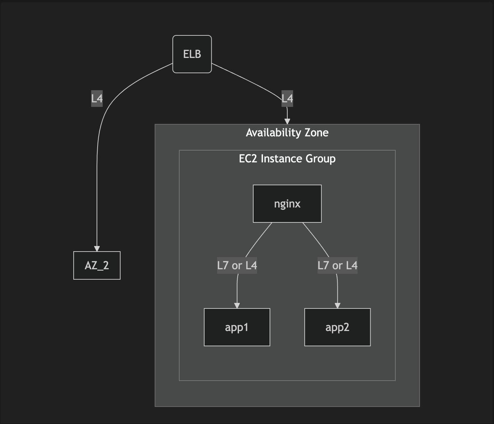
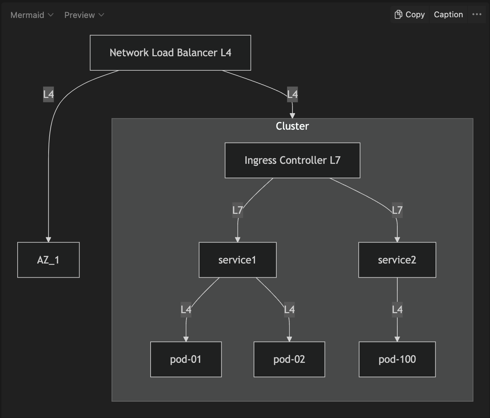

# 쿠버네티스의 로드밸런서 학습하기 (nginx)

## 학습하게 된 계기

쿠버네티스 학습을 위해 aws 인스턴스 환경에서 eks(아마존 쿠버네티스)이전하면서 로드밸런서의 설정을 적용해야 합니다.  
이 때 쿠버네티스의 리소스에 대한 개념이 혼동되어 글로 정리합니다.  
기존의 온프레미스, 혹은 클라우드 환경에서 로드밸런서를 어떻게 사용하고 있는지 체크해보고 최종적으로는 쿠버네티스에서 로드밸런서를 적용하는 방법을 이해하는것을 목적으로 학습합니다. 

### 알고싶은 내용

인그레스는 쿠버네티스 외부에서 내부 서비스로 HTTP 트래픽을 전달합니다. 
의문을 가졌던 지점은 바로 인그레스 컨트롤러의 구현체로 nginx를 사용하고 있던 점이었습니다. 
nginx의 역할 중 하나인 로드밸런싱을 마치 인그레스에서 맡고 있는것처럼 느껴졌습니다. 
쿠버네티스에 ‘로드밸런서’라는 이름의 리소스가 별도로 존재하는데 그렇다면 로드밸런싱은 대체 어디에서 수행하고 있다는 이야기일까요? 

## 알고 있는 내용 정리

### 클라우드 환경에서 로드밸런서란?

- 트래픽에 부하가 생겼을 때 원할하게 처리하기 위해서 여러 서버로 나누어주는 역할
- 특정 IDC, 서버, 네트워크에 장애 / 재해가 생겼을 때 서비스가 중단되지 않도록 가용성 영역으로 트래픽을 라우팅해주는 역할

### 기존의 배포에 적용해 본 로드밸런싱 시각화하기

## 모르는 내용 학습

### L4, L7 로드밸런서 찾아보기

혼동이 온 부분을 해결하고 싶어 로드밸런서에 대해서 찾아보기 시작했습니다. 
가장 많이 나왔던 키워드는 바로 L4와 L7, 즉 로드밸런서가 동작하는 네트워크 레이어에 따른 구분이었습니다. 
해당 내용을 살펴보면서 L4와 L7 로드밸런서의 타입에 따른 구체적인 역할과 차이점에 대해서 알게 되었습니다. 

- 구체적인 비교 살펴보기
    
    
    | **항목** | **L4 로드 밸런서** | **L7 로드 밸런서** |
    | --- | --- | --- |
    | **네트워크 계층** | OSI 모델 Layer 4 (Transport Layer) | OSI 모델 Layer 7 (Application Layer) |
    | **주요 프로토콜** | TCP, UDP | HTTP, HTTPS |
    | **라우팅 기준** | IP 주소 및 포트 기반 | 도메인 이름, URL 경로, HTTP 헤더 등 |
    | **트래픽 처리 방식** | 패킷 단위로 전달 (트래픽 내용을 알지 못함) | 애플리케이션 요청을 기반으로 트래픽 처리 |
    | **TLS/SSL 종료** | 지원하지 않음 | 지원 (HTTPS 처리 가능) |
    | **로드 밸런싱 알고리즘** | Round Robin, Least Connections, IP Hash 등 | 도메인/경로 기반 라우팅, 세분화된 정책 가능 |
    | **성능** | 더 빠르고 단순 | 트래픽 분석 때문에 약간 느림 |
    | **사용 사례** | gRPC, TCP 기반 데이터베이스, 실시간 게임 | 웹 애플리케이션, REST API, HTTPS 트래픽 |
    | **고급 기능** | 제한적 | 도메인/경로 기반 라우팅, WAF(웹 방화벽) 통합 등 |
    | **구현 복잡도** | 간단 | 비교적 복잡 |
    | **사용 사례 예** | AWS NLB, HAProxy (TCP), Envoy (L4 모드) | AWS ALB, Nginx, Traefik, HAProxy (L7 모드) |

### 기존의 개념에 대입하여 생각해보기

기존에 사용하던 ELB가 네트워크 로드밸런서로 동작하고, Nginx가 애플리케이션 로드밸런싱과 라우팅을 같이 수행하고 있다는 사실을 알게 됐습니다.  
사실 개념만 불명확했을 뿐 L4와 L7 모두 적용해서 사용하고 있었습니다.  
이제 쿠버네티스로 돌아가봅시다. 모은 정보를 바탕으로 리소스의 타입별로 나누어 역할을 생각해봅니다. 

### 쿠버네티스 리소스에 따른 역할 찾아보기

- 로드밸런서 리소스는 L4 로드밸런싱을 담당합니다.
- 인그레스 리소스에 라우팅 규칙을 정의합니다.
- 인그레스 컨트롤러가 규칙에 맞게 L7레벨에서 트래픽을 라우팅 & 로드밸런싱합니다.
- 서비스는 요청을 받은뒤 다시 L4레벨에서 파드로 트래픽을 분산합니다.

### 학습한 쿠버네티스 리소스 시각화 하기

L4인지 L7인지 헷갈린다면 사용하는 프로토콜 혹은 기반기술을 기준으로 생각해보면 좋습니다.  
해당 리소스가 http를 기준으로 동작하는지 tcp를 기준으로 동작하는지 생각해보는것이 가장 빠릅니다. 

### 특정 서비스 선택

인그레스 컨트롤러 혹은 로드밸런서의 구현체로 elb를 쓰느냐, HA proxy를 쓰느냐는 기술을 이해하는데 중요하지 않다고 생각합니다.  
요구사항에 맞는것을 찾아서 쓰도록 합시다.  

## 정리

- 로드밸런서 타입(L4, L7)에 따른 용도와 역할을 알게 되었습니다.
- 쿠버네티스 로드밸런서, 인그레스, 인그레스 컨트롤러, 서비스 각각의 역할과 책임을 알게 되었습니다.
- 기존의 배포방식과 쿠버네티스 환경의 차이점을 알게되었습니다.