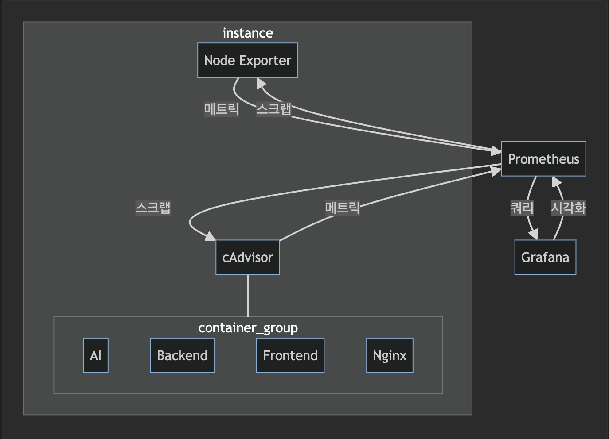
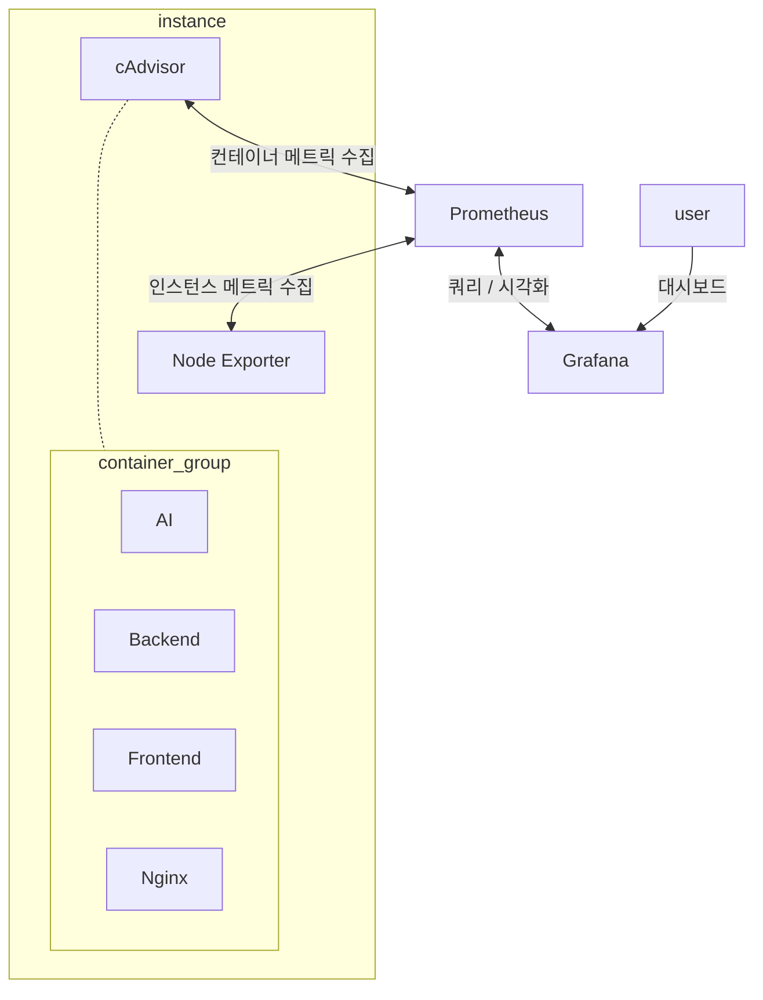
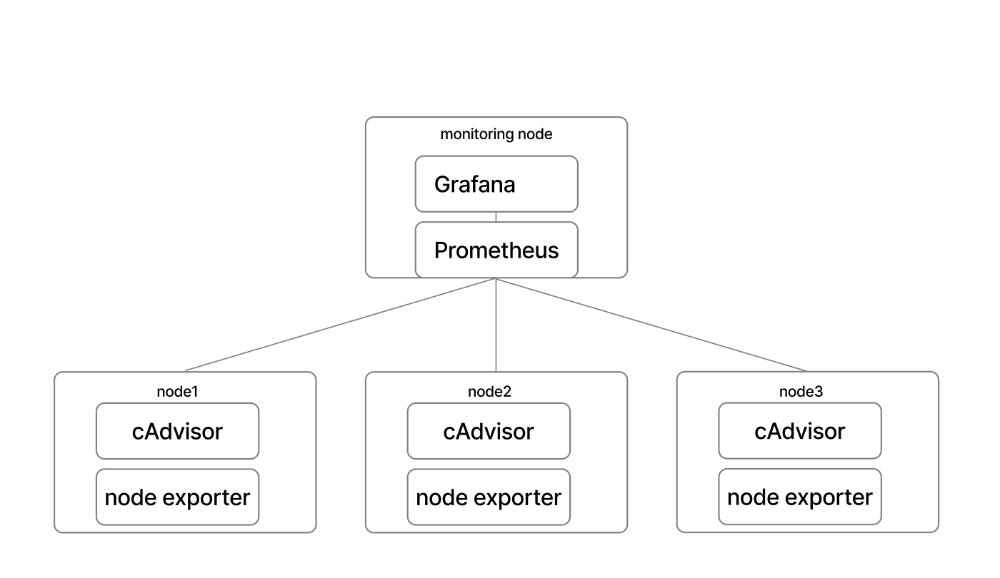
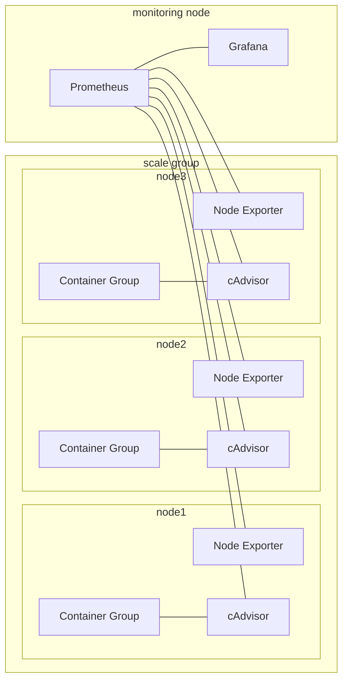

## 소개

본 문서는 우리가 구현한 모니터링 스택에 대해 설명하며, <br>
데이터가 시스템 전반에 걸쳐 어떻게 수집되고 전파되는지를 상세히 다룹니다. <br>
**Prometheus**, **Grafana**, **Node Exporter**, **cAdvisor**의 각 구성 요소의 개념부터 Docker 환경 내에서 이들이 어떻게 상호작용하는지에 대해 팀원들이 이해할 수 있도록 기술합니다.

## 1. 모니터링 스택 개요

우리의 모니터링 스택은 **시스템의 성능과 자원 사용량**에 대한 실시간 통찰을 제공하도록 설계되었습니다. <br>
구성 요소는 다음과 같습니다

- **Prometheus**: 시계열 데이터베이스 및 모니터링 시스템.
- **Grafana**: Prometheus에서 수집한 메트릭을 시각화하는 도구.
- **Node Exporter**: Prometheus에 하드웨어 및 OS 메트릭을 노출.
- **cAdvisor**: 컨테이너 메트릭을 수집.

모든 구성 요소는 Docker를 사용하여 컨테이너화되어 있으며, `moheng-network`라는 전용 Docker 네트워크를 통해 통신합니다.

---

## 2. 구성 요소 설명

<figure>
  
  <br>
  <br>
  <figcaption style="text-align: center; font-size: 0.8rem; color: #666;">동작 방식 이해를 위한 단일노드 이미지이며 컨테이너를 포함한 실제구성은 가용성을 고려하여 여러 노드에 분산되어 있습니다.</figcaption>
</figure>

<br>

<details>
<summary> uml</summary>



</details>

### Prometheus

**Prometheus**는 오픈 소스 시스템 모니터링 및 경보 툴킷입니다. <br>
설정된 대상에서 주기적으로 메트릭을 수집하고, 규칙 표현식을 평가하며, 특정 조건이 충족될 경우 alert manager를 통해 경보를 트리거할 수 있습니다.

- **역할**: 중앙 데이터 수집 허브.
- **기능**: Exporter(Node Exporter 및 cAdvisor)로부터 메트릭을 스크랩하고 저장.
- **설정**: `prometheus.yml`을 사용하여 스크랩 대상과 간격을 정의.

### Grafana

**Grafana**는 멀티 플랫폼 오픈 소스 분석 및 인터랙티브 시각화 웹 애플리케이션입니다. <br>
지원되는 데이터 소스와 연결하여 웹에서 차트, 그래프, 경보를 제공합니다.

- **역할**: 시각화 계층.
- **기능**: Prometheus에 연결하여 메트릭을 가져오고, 사용자 정의 가능한 대시보드에 표시.
- **접근**: 포트 `3231` (임의 설정)을 통해 웹 브라우저에서 접근 가능.

### Node Exporter

**Node Exporter**는 \*NIX 커널이 노출하는 하드웨어 및 OS 메트릭을 위한 Prometheus Exporter입니다. <br>
Prometheus가 시스템 수준의 메트릭을 수집할 수 있도록 합니다.

- **역할**: 호스트 머신의 메트릭 Exporter.
- **기능**: CPU, 메모리, 디스크 사용량 등의 시스템 메트릭을 노출.
- **설정**: 호스트 디렉토리를 마운트하여 시스템 메트릭에 접근.

### cAdvisor

**cAdvisor**(Container Advisor)는 컨테이너 사용자가 실행 중인 컨테이너의 자원 사용량 및 성능 특성을 이해할 수 있도록 합니다.

- **역할**: 컨테이너 메트릭 수집기.
- **기능**: Docker 컨테이너의 CPU, 메모리, 네트워크 사용량 등의 메트릭을 수집.
- **설정**: Docker 데몬에 접근하여 컨테이너 통계를 가져옴.

---

## 3. 데이터 흐름 및 통신

1. **메트릭 수집**:

   - **Node Exporter**는 호스트 머신의 하드웨어 및 OS 메트릭을 수집합니다.
   - **cAdvisor**는 Docker 컨테이너의 메트릭을 수집합니다.

2. **데이터 스크랩**:

   - **Prometheus**는 정의된 간격(15초)에 따라 Node Exporter와 cAdvisor로부터 메트릭을 스크랩합니다.

3. **데이터 저장**:

   - 메트릭은 Prometheus의 시계열 데이터베이스에 저장됩니다.

4. **데이터 시각화**:

   - **Grafana**는 Prometheus에서 메트릭 데이터를 쿼리합니다.
   - 사용자는 대시보드와 패널을 생성하여 데이터를 시각화할 수 있습니다.

5. **네트워킹**:
   - 모든 서비스는 `moheng-network` Docker 네트워크를 통해 통신합니다.

---

## 4. Docker Compose 설정 공유

모니터링 스택은 Docker Compose 파일을 사용하여 정의되며, 명확성과 분산노드 구성시 구현편의를 위해 두 섹션으로 나누어집니다.

### Prometheus 및 Grafana

- 머신에 쌓이는 프로메테우스 메트릭에 대한 백업전략을 다음과 같이 구성했습니다.
  - `monitoring/prometheus/config`: Prometheus 설정 파일이 저장되는 디렉토리.
  - `monitoring/prometheus/data`: Prometheus 데이터베이스가 저장되는
    디렉토리.
  - cron 스케줄러를 사용한 주기적 매트릭 백업

<details>
<summary> 자세히 보기</summary>

```yaml
services:
  prometheus:
    container_name: prometheus
    image: prom/prometheus:latest
    volumes:
      - ./monitoring/prometheus/config:/etc/prometheus
      - ./monitoring/prometheus/data:/prometheus
    command:
      - "--config.file=/etc/prometheus/prometheus.yml"
      - "--storage.tsdb.path=/prometheus"
    expose:
      - "9090"
    networks:
      - moheng-network
    restart: always

  grafana:
    container_name: grafana
    image: grafana/grafana:latest
    volumes:
      - ./monitoring/grafana:/var/lib/grafana
    env_file:
      - .env
    ports:
      - 3231:3000
    networks:
      - moheng-network
    restart: always

networks:
  moheng-network:
    name: moheng-network
    driver: bridge
```

</details>

### Node Exporter 및 cAdvisor

- Node Exporter 및 cAdvisor는 모든 분산된 노드마다 적절하게 구성되어야합니다.

<details>
<summary> 자세히 보기</summary>

```yaml
services:
  node-exporter:
    container_name: node-exporter
    image: prom/node-exporter:latest
    volumes:
      - /proc:/host/proc:ro
      - /sys:/host/sys:ro
      - /:/rootfs:ro
    command:
      - "--path.procfs=/host/proc"
      - "--path.sysfs=/host/sys"
      - "--collector.filesystem.mount-points-exclude=^/(sys|proc|dev|host|etc)($$|/)"
    expose:
      - "9100"
    networks:
      - moheng-network
    restart: unless-stopped

  cadvisor:
    container_name: cadvisor
    image: gcr.io/cadvisor/cadvisor:latest
    volumes:
      - /:/rootfs:ro
      - /var/run:/var/run:ro
      - /sys:/sys:ro
      - /var/lib/docker/:/var/lib/docker:ro
      - /dev/disk/:/dev/disk:ro
      - /var/run/docker.sock:/var/run/docker.sock:ro
    expose:
      - "8080"
    networks:
      - moheng-network
    restart: unless-stopped
    command:
      - --docker_only=true
      - --storage_duration=1m
      - --housekeeping_interval=10s

networks:
  moheng-network:
    name: moheng-network
    driver: bridge
```

</details>

## 5. 프로덕션 모니터링 흐름

<figure>
    
  <br>
  <br>
  <figcaption style="text-align: center; font-size: 0.8rem; color: #666;"> 이미지 정도의 규모를 생각하더라도 쿠버네티스를 추천합니다. 오케스트레이션하기 굉장히 힘들었습니다. <br> 쿠버네티스 환경에서는 데몬셋 / 사이드카 패턴 등의 모니터링 구성으로 더 쉽게 리소스 추적이 가능합니다.</figcaption>
</figure>

<br>

<details>
<summary>uml</summary>



</details>
