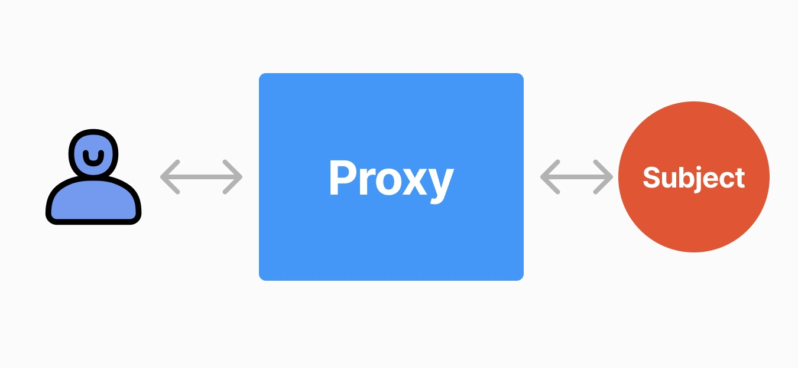
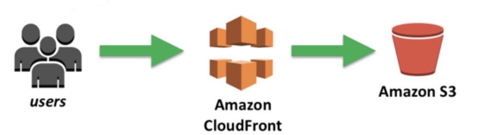

현재 모행 서비스는 웹 서버로 Nginx를 이용하여 프론트엔드를 배포하고 있습니다. 하지만 프론트엔드에서 정적 콘텐츠만 제공할 경우 AWS의 S3와 CloudFront를 이용하여 베포할 수도 있습니다. 따라서 모행에서 사용한 Nginx와 S3 + CloudFront를 사용할 경우 차이점이 무엇인지 정리하고 모행 프로젝트에 적합한 방법이 무엇인지 찾아보고자 합니다.

---

## Nginx

### 프록시 서버?

프록시 서버인 Nginx를 이야기하기 전에 디자인 패턴 중 프록시 패턴을 이해하면 좋습니다. 프록시 패턴은 객체에 대한 접근을 제어하기 위해 대리자 역할을 하는 객체를 사용하여 실제 객체 대신에 요청을 받아들여 필요에 따라 실제 객체와의 통신을 처리하거나 접근을 제어합니다. 이러한 패턴은 보완, 접근 제어, 로깅, 캐싱 등에 유용합니다.   
따라서 Nginx와 같은 프록시 클라이언트와 서버 사이에서 요청과 응답을 처리하여 클라이언트가 네트워크 서비스에 간접적으로 접속할 수 있는 시스템을 말합니다. 

### Nginx를 선택한 이유
그럼 우리 서비스에서는 Nginx와 같은 프록시 서버를 사용한걸까? Nginx를 리버스 프록시로 활용하여 클라이언트의 요청을 받아 내부 서버로 전달하고 응답을 클라이언트에게 전달합니다. 이를 통해 DDos와 같은 공격 막아 보안에 더 좋고 이미지와 같은 정적 콘텐츠를 캐싱하여 서버 부하를 줄이고 응답 속도를 향상시키는 용도로 주로 사용했습니다.    
여기서 중요한 점은 모행 서비스에서는 많은 이미지 즉, 정적 콘텐츠가 많다는 특징이 있습니다. 이러한 정적 콘텐츠가 많을 경우 Nginx와 같이 단일 서버에서만 정적 파일을 제공하는 것이 과연 성능적으로 좋은지 의문을 가지게 되었습니다.

## AWS S3 + CloudFront

### 클라우드 스토리지? CDN?
S3는 클라우드 스토리지 서비스로 데이터를 클라우드에 저장하고 정적 파일을 안전하고 효율적으로 관리할 수 있습니다.    
CloudFront는 CDN(콘텐츠 전송 네트워크) 서비스로 사용자가 인터넷에 접속한 곳과 물리적으로 가까운 곳에서 정적 콘텐츠와 같은 파일을 로드하여 빠르게 콘텐츠를 로드할 수 있도록 합니다. 따라서 페이지 로드 시간을 단축하고 대역폭 비용을 절감할 수 있으며 콘텐츠 가용성을 제고할 수 있습니다. 또한 DDoS와 같은 공격을 막아 웹 사이트 보안을 강화할 수 있습니다.

### S3 + CloudFront를 함께 사용하면 좋은점?
S3 + CloudFront를 함께 사용하면 다음과 같은 장점이 있다고 생각합니다.
1. 전 세계 빠른 응답 속도
2. 효율적인 정적 파일 제공
3. 고비용 트래픽 처리 비용 효율적
4. 자동화
5. 보안
S3 + CloudFront를 사용하면 트래픽을 분산하고 저렴한 비용으로 S3를 사용하여 정적 콘텐츠가 많을 경우 비용적으로 효율적일 수 있습니다. 가장 큰 장점은 자동화라고 생각합니다. 자동화된 확장성을 제공하여 대규모 트래픽 등 추가적인 관리가 필요하지 않습니다. 또한 전 세계로 서비스를 할 경우 전 세계 여러 엣지 서버에서 캐시된 콘텐츠를 제공하여 사용자에게 빠른 응답 속도를 제공할 수 있습니다.

## 모행 서비스에 적합한 방법은?
현재 모행 서비스는 여행지 사진 등 정적 콘텐츠가 많지만 국내 여행으로 한정되어 있어 내국인을 주요 타켓으로 생각하고 있습니다. 확실히 S3에 정적 콘텐츠를 저장하여 가지고 오는 것이 메리트가 있지만 국내 한정인 서비스에서 CloudFront와 같은 CDN이 필요한지는 의문입니다. 하지만 확장 가능성을 보았을때는 S3 + CloudFront를 사용하는 것을 고려해볼 수 있을 것 같습니다.

---
## 출처 및 참고자료
- 서적 "면접을 위한 CS 전공지식 노트"
- [실전 Amazon S3와 CloudFront로 정적 파일 배포하기](https://aws.amazon.com/ko/blogs/korea/amazon-s3-amazon-cloudfront-a-match-made-in-the-cloud/)
- [콘텐츠 전송 네트워크(CDN)란 무엇인가요?](https://aws.amazon.com/ko/what-is/cdn/)
- 사진 출처: https://aws.amazon.com/ko/blogs/korea/amazon-s3-amazon-cloudfront-a-match-made-in-the-cloud/
