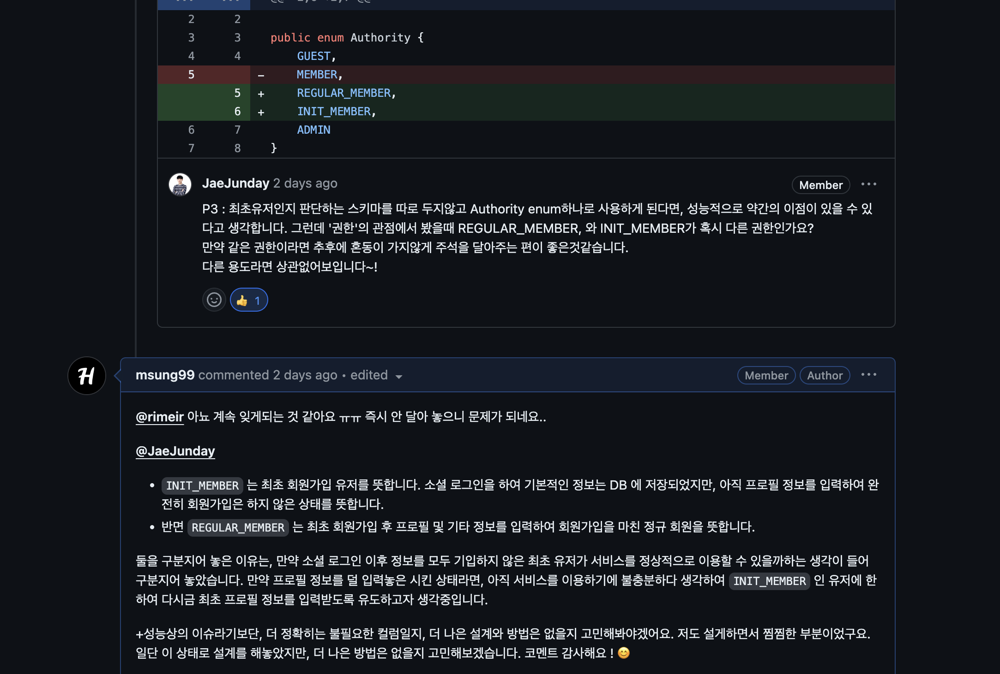

> 💡 현재 포스트는 harmony 팀 크루 [하온](https://github.com/msung99)이 작성했습니다.

우리 팀은 어떤 방식으로 협업 하는지를 소개하고자 한다. 큰 주제는 다음과 같다.

> - 하모니 팀의 Git Flow 전략
> - KPT 및 회고 문화
> - 코드리뷰, 테스크 수행 문화
> - 글쓰기, 문서화 주도 문화

## 브랜치는 왜 필요한가?

Github 를 활용하여 작업을 진행하다보면 항상 독립적인 브랜치를 생성하고, 작업을 수행한뒤 PR 을 날려 팀원들의 검토를 받고 머지를 한다. 이 일련의 과정은 관례적으로 사용되는 브랜치 관리 전략인 Git Flow 전략 내에서 발생하는 흐름이다. 왜 우리는 브랜치를 분기하고, 작업을 진행할까? 디폴트 핵심 브랜치인 main 브랜치에서 여러명이 동시에 작업을 진행하고 커밋을 푸시하면 안될까? 

main 브랜치는 이미 서비스가 출시되어 배포된 코드만을 모아두기 위한 브랜치이다. 만약 이 하나의 브랜치에 여러 사람들이 커밋을 푸시하면 어떻게될까? 이 하나의 브랜치에 여러 사람이 한꺼번에 작업을 진행하고 관리한다면, main 브랜치의 소스코드는 정말 불안정한 상태로 관리 될 것이다. 

다른 사람이 작업 또한 누군가 내 파일을 건들였을 경우 충돌이 발생할 가능성도 충분하다. 충돌을 만회하고자 뒤늦게 커밋을 롤백하자니, 내가 작업한 모든 내용을 삭제하고 처음부터 다시 작업을 진행해야 할 수도 있다. 브랜치에 작업한 내용을 PR 을 요청할 떄와 달리 내가 작업한 커밋이 충돌이 발생할지 체크할 방법도 존재하지 않기에, 커밋이 엉키고 꼬일 가능성이 충분하다.

더 큰 규모의 조직에서 협업을 진행한다면 큰 문제가 발생할 것이다. 당연하게도 브랜치를 분기하지 않는다면, 각 사람이 main 브랜치로부터 독립적인 브랜치를 파생하여 동시간대에 작업을 진행하지 못하기에 작업 효율이 떨어진다. 오직 main 브랜치 하나에서 수 많은 개발자들에 협업한다면, 내가 작업중인 파일을 누군가 건드릴 수 있게된다. 이는 앞서 서술한 충돌 문제를 야기할 수 있다. 충돌을 만회할 수 있는 가장 안전한 방법은 다른 사람이 main 브랜치에 작업 내용을 푸시할 때 까지 대기하는 것인데, 작업 효율성이 매우 떨어지기에 좋은 방법이 아니다. 

또한 여러 기능을 개발하면서 남겨진 커밋 히스토리가 main 브랜치에 뒤죽박죽 섞여서 알아보기 힘든 로그가 쌓이게 된다. 엉켜있고 알아보기 힘든 커밋 히스토리가 쌓여있기에, 기획 변경으로 인해 특정 기능이 필요 없어졌을 때 또는 문제가 발생했을 떄 원하는 시점으로 롤백하기도 어려워진다. 반면 브랜치를 통해 관리했다면 원하는 시점을 가진 브랜치를 활용하여 작업 내용을 적절히 롤백시킬 수 있다.

브랜치 기능을 사용하면 다른 브랜치에 영향을 받지 않는 독립적인 환경에서 기능을 개발할 수 있다. 또한 main 브랜치 하나에서 프로덕션 코드를 관리할 때와 달리, 프로덕션 코드의 안정성과 품질을 향상 시킬 수 있다. 독립적인 브랜치에 개발한 기능을 main 브랜치에 곧 바로 반영할 수 없기 떄문이다. main 브랜치에 내 코드를 기여하기 위해선, PR 을 먼저 요청해야한다. 팀 내 PR 가이드라인을 준수하여 팀원들의 리뷰와 검토를 받고, CI 를 통해 내 코드가 빌드에 성공했는지, 테스트 커버리지가 일정 수준 이상을 만족하여 프로덕션 코드에 반영해도 적절한지를 미리 검토할 수 있다. 또한 충돌이 발생하여 코드가 꼬일 가능성도 거의 0에 수렴한다. 

---

## 브랜치는 어떻게 관리하는가? 

이렇게나 좋은 이점을 제공하는 브랜치 또한 일정한 규칙 없이 마구잡아로 사용한다면 엉키고 알아보기 힘들 수 밖에 없다. 브랜치 생성 및 관리에 대한 명확한 규칙이 없을 경우 **"이 브랜치는 어떤 기능을 개발하기 위해 생성된거지?, "어떤 브랜치가 실제 프로덕션 및 배포 코드가 담긴 중요한 브랜치이지?", "PR 은 어디에 요청해서 검토와 승인을 받아야히지?", "이 커밋과 관련한 작업 내용이 담긴 브랜치가 어떤거였지?"** 등 수 많은 혼동을 야기할 수 있다.

이를 해결하고자 등장한 것이 Git 브랜치 전략이다. Git 브랜치 전략은 브랜치를 더 효과적으로 관리하기 위한 규칙이자 컨벤션이다. 우리 팀 또한 Git Flow 전략을 택했으며, 일부 
팀 내 브랜치 규칙을 직접 만들어도 괜찮지만, 전셰게의 수 많은 팀 내에서 관례적으로 사용하고 있는 워크플로우일만큼 매우 효과적인 작업 효율을 보인다. 우리 팀 또한 Git Flow 브랜치 전략을 사용했다. 단, 대신 git-flow를 정석적으로 사용하지 않고 필요한 부분을 수정하여 반영했다. 이와 관련한 내용과 이유는 후술하도록 한다. 

## Git Flow 전략

Git Flow 는 총 5가지 종류의 브랜치로 관리하는 전략이다. 가장 중요한 **디밸롭 서버, 프로덕션 서버 실제 코드가 담기고 병합되는 main 브랜치, develop 브랜치가 존재하며, 이 2개의 중요한 브랜치에 병합되기 이전에 각기 다른 목적으로 분기되어 작업을 진행하는 목적을 가진 보조 브랜치들인 feature 브랜치, release 브랜치, hotfix 브랜치** 가 존재한다.

main 브랜치와 develop 브랜치는 개발 프로세스 전반에 걸쳐 가장 중요하게 관리되는 브랜치이자, 항상 삭제되지 않고 유지되는 브랜치이다. 이 두 브랜치에 코드를 기여하기 위해선 보조 브랜치를 통해 작업을 진행하고, PR 을 요청해서 승인을 받아야한다. 반면 보조 브랜치(feature, relaese, hotfix) 는 필요할 때 마다 동적으로 생성되는 브랜치로, 제 역할을 다하고 develop (또는 main) 브랜치에 코드를 기여한 뒤에 제 역할을 다했다면 삭제된다. 보조 브랜치 덕분에 팀이 병렬적으로 동시간대에 작업을 진행할 수 있게된다.

### main 브랜치

실제 대중에 배포되어 운영되기 직전(또는 이미 운영되고 있는) 프로뎍션 코드들이 담겨있는 브랜치이다. main 브랜치는 develop 브랜치와 마찬가지로 프로젝트 시작부터 끝까지 사라지지 않고 관리되는 핵심 브랜치다. 실제 프로덕션 코드가 담긴 중요한 브랜치인만큼, 후술할 develop 브랜치의 디밸롭 환경에서 수 많은 테스트와 검증을 거친 뒤에서야 main 브랜치에 반영해야 한다.

### develop 브랜치

main 브랜치에 병합될 다음 버전 배포를 앞두고 있는 코드들을 담고 있는 핵심 브랜치다. 실제 프로덕션 서버에서 돌아가는 코드들이 main 브랜치에서 관리된다면, 프로덕션 환경과 유사하게 구축한 디밸롭(테스트) 서버내의 코드들은 develop 브랜치에서 관리된다. 즉, develop 브랜치에 기여된 코드들은 테스트(디밸롭) 환경에서 많은 테스트 및 검증을 거친 뒤에야 출시해도 문제가 없다고 판단되었을 때 main 브랜치로 병합된다.

### feature 브랜치

하나의 기능을 개발하기 위한 브랜치이다. develop 브랜치로 부터 분기하여 생성하며, 해당 feature 브랜치에서 기능 개발이 완료되면 PR 요청을 날리고, 다시 develop 브랜치로 병합된다. 

머지시 주의할 점은 fast-forward 로 머지하지 않고, merge commit 을 생성하여 머지 해줘야한다. 그래야만 히스토리가 특징 기능 단위로 묶이게 된다.

### hotfix 브랜치

이름 그대로 특정 문제가 발생했을 때, 해당 문제를 해결하기 위해 분기한 브랜치다. 정의상으로는 이미 배포된 프로덕션에 문제가 발생했을 때, 해당 문제를 해결하고자 분기하는 브랜치이다. 따라서 develop 브랜치가 아닌 main 브랜치에서 생성하고, 문제 해결이 완료되면 main 과 develop 브랜치 모두에 머지한다.

다만, 정의상은 main 브랜치로부터 파생되는 것이 맞지만, develop 브랜치로 부터 파생되어도 전혀 상관없다는 생각이다. hotfix 브랜치가 등장한 이유는 문제를 해결하기 위함에 있는데,  실제 출시 단계가 아닌, 개발 단계에서 이미 문제를 발견했다면 develop 브랜치로부터 파생하고 문제를 해결하면 될 것이다.

### release 브랜치

소프트웨어 배포를 준비하기 위한 브랜치이다. develop 브랜치로부터 분기하며, 버전 이름 등의 소소한 데이터를 수정하거나 배포전 사소한 버그를 수정하기 위해 사용된다. 배포 준비가 완료되었다면 main 과 develop 브랜치 모두에 머지한다. 이때, main 브랜치에는 태그를 이용하여 버전을 표시한다. Release 브랜치를 따로 운용함으로써, 배포 업무와 관련없는 팀원들은 병렬적으로 Feature 브랜치에서 이어서 기능을 개발할 수 있게된다. 추가적으로 네이밍은 `release/v1.1` 과 같은 형태로 생성한다.

다만, release 브랜치는 팀 내 규모에 따라 협의하여 꼭 도입할지 검토해봐도 좋다고한다. 우리 하모니 팀의 경우도 release 브랜치는 도입할 근거가 마땅치 않으며, 불필요한 비용과 복잡성이 높아질 것으로 판단되어 도입하지 않았다.

## Github Flow 전략

앞서 서술한 Git Flow 에 비해 Github Flow 는 더 단순해진 구조를 가진다. 다만, Github Flow 전략은 단순함으로 인해 개발이 편하다는 입장을 가진 사람들도 많지만, 내 생각은 다르다. 개인적인 생각으로는 Github Flow 는 매우 단순한 브랜치 구조로 관라하기 떄문에 브랜치 관리가 되려 힘들 것이라는 생각이다. 그러면 Github Flow 에 대해 알아보자.

Github Flow 는 위와 같이 `main` 브랜치와 `feature` 브랜치 두 종류가 끝이다. 단순히 기능 개발을 하고 master 브랜치에 병합하는 매우 단순한 구조다. 

### main 브랜치

**항상 Stable한 상태여야 한다.** 이때, Stable하다는 것은 Main의 모든 커밋은 언제 배포하든 문제 없어야하고, 언제든 브랜치를 새로 만들어도 문제가 없어야 한다. main 브랜치의 모든 커밋은 빌드가 되고, 테스트를 통과해야한다. 이것이 Github Flow가 강제하는 유일한 사항이다.

### feature 브랜치

앞서 살펴봤던 git flow 전략의 feature 브랜치와 동일한 역할을 수행하며, 여기서 hotfix 브랜치의 역할 또한 합쳐진 브랜치라고 생각하면 된다. 즉, 기능 개발과 버그 수정 모두 구분없이 동반되어야 하는 브랜치다. 또한 앞선 Git Flow 전략과 달리 Github Flow 에선 main, develop 가 구분되어 있지 않다. 따라서 main 브랜치에 병합되기 이전의 코드들은 언제든 실제 프로덕션 코드에 문제없이 기여될 수 있도록 상시로 완벽하게 준비되어야 한다.

## Github Flow 가 과연 적합할까?

어떠한가? 과연 Github Flow 가 단순하다고 해서 좋은 전략일까? 몰론 매우 단순한 구조로 인해 깃허브를 갓 시작한 입문자들에게는 도움이 될 수 있겠다. 하지만 적어도 Git flow 전략처럼 프로덕션과 디밸롭 브랜치가 구분되어 있지도 않다. 또한 feature 브랜치가 버그 수정까지 모두 전담해야 하기에, 역할이 더 커진 구조이다.

개발 팀이 매우 작은 소규모 애자일 팀이고, 제품을 정말 빠르게 출시해도 문제 없다면 Github Flow 를 채택해도 괜찮을 것이다. 하지만 많은 웹 애플리키이션은 테스트와 검토를 디밸롭 서버에서 충분히 검토해야 하기에 develop 브랜치는 꼭 필요하다. 또한 기능과 버그를 구분하지 않고 브랜치를 파생하고 관리하다보니, 관리가 다소 힘들어질 수 있다는 생각이다. 이 떄문에 우리 하모니 팀 또한 Github Flow 를 선택하지 않았다.

> 장기간 프로젝트가 존재하고, 유지보수를 위한 작업을 수행해야 하는 팀은 Git Flow 가 타당한다. 반면 상시로 정말 빠르게 배포해야 하는 팀은 Github Flow 가 적합하다. - Scott Chacon

## 하모니 팀에 알맞게 수정된 Git Flow 전략

Git FLow 의 부정적인 견해중 하나는, 이 전략은 빠르게 급변하는 웹 서비스에는 맞지 않은 브랜치 전략이라는 점이다. 관리해야 할 브랜치가 늘어나기 때문에 개발자들이 신경써야 할 포인트가 늘어난다.

빈번한 배포로 인해 급작스러운 이슈가 발생할 수 있다. 즉 예상치 못한 롤백이 자주일어날 수 있다. 또한 웹 서비스의 특성상 다양한 릴리즈 버전을 유지할 필요가 없다. 이러한 특성들로 인해 웹 서비스에는 다소 보수적인 Git flow 전략은 맞지 않을 수 있다.

그럼에도 우리 하모니 팀은 Git Flow 를 선택했다. 더 정확히는, 정석적인 Git Flow 전략을 일부 수정해서 사용중이다. 우리는 실제 운영할 수 있는 서비스를 개발하며 다양한 경험을 습득해야 한다. 또한 대부분의 팀원들이 git에 익숙하지 않았으며 다양한 시도를 통해 빠르게 학습해야 한다. 

결론적으로, 우리 팀은 **현재 수준에서 develop에서 대부분의 빌드를 진행하기 때문에 release 브랜치의 필요성이 옅어졌다. 결국 release를 제외한 main, develop, feature, hotfix만 사용하기로 결정하였다.**

## KPT 및 회고 문화

이 외에도 우리 팀은 단순 Git Flow 전략을 포함하여 효율적인 협업을 위해 신경쓰는 요소들이 있다. 그 중 하나는 `KPT` 및 `감정 회고` 이다. 평일(월~금) 매일 팀 회의가 진행되며, 간단한 스크럼을 공유하고, 각 파트의 이슈 및 특이사항을 공유한다. 이후 하루 일과가 끝나갈 때인 오후 5시 30분에 다시 모여 작업 및 간단한 사항을 공유하고, 금일 내용에 관련하여 KPT 및 감정 회고를 진행한다. 

우리 팀이 KPT 회고를 하는 목적은, 짧은 시간에 모든 구성원의 생각을 공유하고, 실행 가능하고 측정 가능한 Action 을 도출해냄에 있다 Action 이란 다음 회고까지 실행하는 의견이다. 

### 코드리뷰, 테스크 수행 문화

테스크는 Github 이슈와 Proejcts, 그리고 마일스톤을 활용하여 관리한다. Github 의 `PR(Pull Requests)` 를 활용하여 각자 작업한 내용에 대해 코드 리뷰를 주고받는다. 코드 리뷰가 끝나고, CI 가 정상적으로 통과되고, 리뷰어의 어프루브(Approve) 를 받으면 develop 브랜치에 병합할 수 있다.

#### 커뮤니케이션 비용을 줄이기 위한 Pn 룰

코드 리뷰는 [뱅크샐러드의 코드 리뷰 문화](https://blog.banksalad.com/tech/banksalad-code-review-culture/)로 부터 큰 영감을 받았다. 우리 팀은 커뮤니케이션 비용을 줄이기 위한 Pn 룰을 적용하고 있다. 우리 팀은 코드 리뷰의 코멘트에 Pn 룰을 사용하여 리뷰어가 코멘트를 강조하고 싶은 정도를 표현한다.

### 글쓰기, 문서화 주도 문화

서로가 테스트를 진행하며 학습하거나 경험한 내용을 팀원 모두에게 공유하기 위해 팀 기술 블로그를 운영하고 있다. 우리 팀이 강조하는 문화 중 소프트 스킬 역량 중 하나가 `글쓰기` 이다. 글쓰기를 통해 단순 개발 외적인 문서화 역량을 끌어올리고자 모두 노력한다. 또한 `Github Wiki` 내에 작업한 내용을 문서화시키고 있다.

추가적으로 기술 블로그에 작성된 글을 토대로 자체 세미나를 운영하여 학습한 내용, 트러블 슈팅에 대해 공유하고 이야기를 나누는 활동 진행 예정에 있다.

## 마치며

이렇게 우리 하모니 팀의 협업 프로세스에 대해 간단히 소개해봤다. 앞으로도 좋은 글쓰기 문화로, 선순환을 돕는 좋은 글들을 우리 팀 기술 블로그에 올려보고자 한다 😁